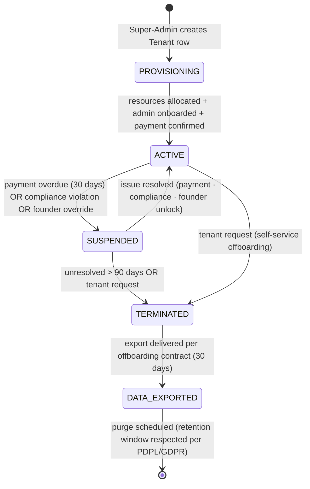
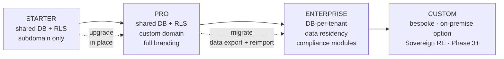
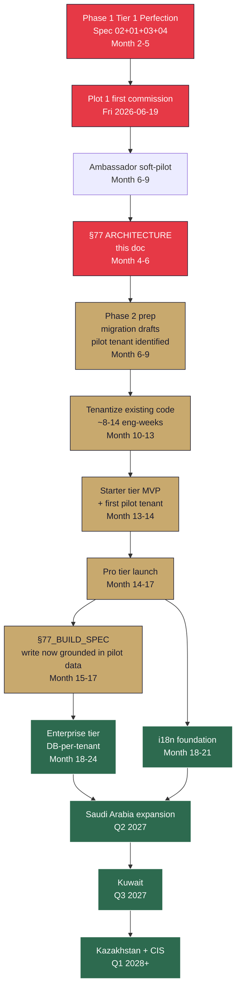

# §77 WEB PLATFORM ARCHITECTURE — White-label for UAE Mid-tier Brokerages + GCC/CIS

---

## How to read this document

This is **not a build spec**. It is the architectural framework that tenant-model choices, sequencing decisions, and future `§77_BUILD_SPEC.md` (Phase 2, Month 10+) anchor to. Three audiences:

1. **Zhan (engineering)** — reads §2-§10 for technical grounding, §12 for build order, §13 for decisions already made.
2. **Dymo (BD)** — reads §1 for strategic framing, §5 for tier preview, §10 for ops/onboarding, §11 for risks.
3. **Rudi + future VC / Board (investor)** — reads §0, §1.6, §5, §12, §14 Appendix E (extractable 1-pager).

Document is ~2 000 lines. Each section independently readable; cross-references explicit.

---

## §1 Strategic framing

### §1.1 Why White-label first (founder directive 2026-04-22)

Founder directive locked during `audit 2026-04-22` review: **write §77 ARCHITECTURE now, ship §77 BUILD in Phase 2 Month 10+.** Rationale:
1. **Parallel track discipline.** Phase 1 Tier 1 Perfection (Specs 02 · 01 · 03 v1+v2 · 04 v1.1) must ship by Month 5 to unblock Plot 1 first commission Fri 2026-06-19. White-label engineering starts AFTER Phase 1. Writing the ARCHITECTURE doc now does not draw engineering capacity away from Phase 1.
2. **Investor-grade artefact TODAY.** Series A data-room reviewer sees `77_WEB_PLATFORM_ARCHITECTURE.md` v1.0 alongside `MASTER_TREE_ENHANCEMENT_PROPOSAL.md` v1.2 and understands ZAAHI is a multi-year architecture play, not a single-deal brokerage. Defensible positioning without over-promising delivery timeline.
3. **De-risks Phase 2.** Foundation decisions (shared DB + RLS vs DB-per-tenant · branding flexibility tiers · pricing structure · i18n approach) made in this doc prevent rebuild later. A wrong multi-tenancy choice made in code = 3-6 eng-weeks of rework.

### §1.2 Phase 1 target — UAE mid-tier brokerages

**ICP (Ideal Customer Profile)** defined by founder:

| Dimension | Target |
|---|---|
| Listings under management | 30-100 active listings |
| Team size | 5-20 agents + 1-2 admins |
| Geographic focus | Dubai primary · Abu Dhabi / Sharjah secondary |
| Revenue | AED 5 M – 25 M / yr gross commission (~30-50 deals / yr) |
| Current platform | Ad-hoc: Bayut / Property Finder listings · Excel pipelines · WhatsApp · shared Google Drive |
| Pain points | Lack of plot-level data · no 3D tooling · no automated feasibility · no CRM · no brand differentiation from bigger competitors |
| Willingness to pay | AED 2 000 – 15 000 / month SaaS (per tier) — validated against comparable SaaS in region |
| Decision-maker | Managing director / owner (not procurement committee) |
| Implementation window | 2-4 week onboarding acceptable (not 6-month enterprise rollouts) |

**Not our ICP (explicitly excluded v1):**
- Top-10 Dubai brokerages (Allsopp · Engel & Völkers · Better Homes · DAMAC · Emaar in-house) — they have in-house tech or Argus-style licences already.
- Single-agent operators — ZAAHI core platform at zaahi.io serves them directly as regular users; no white-label.
- Property-management-first firms (Asteco · Better Homes PM arm · ServeU) — different primary workflow (leases, maintenance, not transactions).

**Go-to-market:** Dymo's personal network already contains 30+ broker relationships in this tier (per `docs/roadmap/AGENCY_PLAYBOOK.md` §1.1 Equilibrium network). First pilot tenant — pre-qualified through Dymo warm intro during Phase 1 soft-pilot (per Enhancement Proposal §1.F Ambassador soft-pilot Month 6-9) — becomes the validation beta for §77 Pro tier at Month 10+.

### §1.3 Phase 2 expansion — Cross-border GCC + CIS

**Geographic sequence (Year 2 / Month 14+):**

1. **Saudi Arabia (Q2 2027).** Largest GCC market · Vision 2030 driving RE boom · REGA (Real Estate General Authority) regulates · Arabic-primary. Similar jurisdictional pattern to Dubai RERA — translation effort manageable. Requires Saudi legal counsel + data-residency decision (ADGM vs Saudi-resident DB).
2. **Kuwait (Q3 2027).** Smaller market · high HNWI concentration · Arabic-primary · Dymo's existing relationships applicable.
3. **Kazakhstan (Q1 2028).** CIS anchor · Russian + Kazakh languages · Almaty + Astana · different regulatory frame (Ministry of Digital Development). Dymo CIS network applicable.
4. **Other CIS (Q3 2028+).** Uzbekistan · Azerbaijan · Armenia opportunistic. Specific geography selection deferred pending Phase 2 Saudi/Kazakhstan pilot traction data.

**Phase 2 expansion requirements surfaced from above:**
- Multi-currency support (AED · SAR · KWD · KZT · USD · RUB).
- Multi-language UI deeper than Phase 1 (all 6 languages per Master Tree §49).
- Data-residency choices per jurisdiction (some regulators require in-country DB; DB-per-tenant Enterprise tier designed for this).
- Jurisdiction-specific compliance modules (Saudi REGA · Kazakh civil code RE articles · etc.).

### §1.4 What White-label is NOT (Phase 1 explicit out-of-scope)

- **Sovereign RE arms (Emaar, Aldar, IMKAN, DAMAC internal tech).** Long sales cycles (12-24 months), bespoke contracts, custom compliance requirements, procurement committees. Not addressable with off-the-shelf tier pricing. Deferred to Phase 3 Custom tier (§5.4).
- **Open SaaS marketplace (anyone-signs-up).** Operational overhead of supporting unvetted tenants is high · compliance risk (FATF / AML per tenant KYC) explodes · brand dilution risk. Phase 1 = invite-only + Dymo-vetted pilots.
- **Consumer B2C (individual HNWI gets "my own ZAAHI").** Ambassadors are the B2C-adjacent tier; true B2C tenanting is a different product.
- **Non-real-estate verticals.** No "ZAAHI for insurance" or "ZAAHI for hospitality bookings" v1.
- **Metaverse-as-a-service** (tenant buys VR experience only, not platform). Deferred to Year 3-4 with §39 Metaverse maturity.

### §1.5 Relationship to Agency revenue engine (Phase 1 Y1 AED 7.8 M)

White-label is **funded by** Phase 1 Agency revenue. The MOU profit-distribution rule (70 % Platform Dev Fund / 10 % each to Rudi / Dymo / Zhan, perpetual, per `docs/investor-package/MOU_RUDI.md`) means:

- Y1 Agency base case AED 7.8 M → ~AED 4.0 M distributable (after CT reserve) → **AED 2.8 M** flows to Platform Dev Fund (70 %).
- Phase 1 Tier 1 Perfection build (per audit §8.2) = ~8-10 eng-weeks ≈ AED 0 cash (Zhan capacity) + ~AED 250 k one-time costs (per `MASTER_TREE_ENHANCEMENT_PROPOSAL.md` v1.2 §4.3).
- Remainder of Platform Dev Fund Y1 (~AED 2.5 M) funds Phase 2 White-label build starting Month 10.

**Phase 2 §77 build budget from Platform Dev Fund:** ~AED 2.5 M Y1 + accrued Y2 (~AED 4-5 M cumulative by Month 18) = **ample for 20-30 eng-weeks of development + 1-2 pilot tenant acquisition + marketing + specialist part-time hire** (per Enhancement Proposal R-5: quant / specialist AED 30-50 k 3-month engagement).

### §1.6 Revenue contribution target

From `docs/investor-package/P_AND_L_STATEMENT.md` base case (v7 investor package) + §77 overlay:

| Horizon | Platform revenue (base) | White-label contribution (~10-20% of Platform) | Notes |
|---|---:|---:|---|
| Y1 (Phase 1) | AED 400 k (tier subs, not white-label) | AED 0 | Phase 1 owner-first; no tenants yet |
| Y2 (Phase 2 open) | AED 1.0 – 1.5 M | AED 100 – 300 k | 1-3 pilot tenants Starter/Pro tier |
| Y3 | AED 5 M (base P&L) | **AED 800 k – 1.5 M** (16-30%) | 8-15 tenants · Pro-heavy |
| Y5 | AED 60 M | **AED 10 – 18 M** (17-30%) | 40-80 tenants · Enterprise tier active · GCC expansion |
| Y10 | AED 800 M | **AED 150 – 250 M** (19-31%) | 300-500 tenants across 6-8 jurisdictions |

**Revenue quality:** White-label SaaS is **high-gross-margin (70-85%)** vs Agency brokerage (~40-50%). Every 1 % incremental White-label share materially improves ZAAHI blended margin + IPO multiple. From a Series A perspective, "SaaS revenue % of total" is the most important ratio to signal scalability.

This doc does not commit to the numbers above — they are scenario projections. Actual pricing validated Phase 2 + §77_BUILD_SPEC; investor-package v7.1 refresh incorporates calibrated figures.

---

## §2 Existing platform inventory (per audit 2026-04-22)

Full reference: `docs/audits/WEB_PLATFORM_CURRENT_STATE_2026-04-22.md` (commit `51c926d` · 966 lines). Summary of what Phase 2 White-label will inherit.

### §2.1 Single-tenant surfaces — must be tenantized

These pages/components currently assume "there is one ZAAHI"; Phase 2 tenantizes them.

| Surface | Current state | Tenantization complexity |
|---|---|---|
| `/` auth landing (477 lines) | Hardcoded "ZAAHI — Real Estate OS" title, GOLD `#C8A96E` palette | HIGH — protected per CLAUDE.md SECURITY_RULES; needs tenant-aware header shell without breaking auth flow |
| `/parcels/map` (5 026 lines) | Hardcoded ZAAHI Plots layer · ZAAHI Signature 3D style · brand-colored UI | HIGH — 9 land-use colors (founder-approved 2026-04-11) stay tenant-neutral; branding overlay on top |
| `/dashboard` (1 822 lines) | Single-user dashboard · 8 ComingSoon banners · hardcoded ZAAHI copy throughout | MEDIUM — tenant-scoped layout shell + CMS-driven copy |
| `/join` (1 178 lines) | Ambassador tiers Silver/Gold/Platinum with ZAAHI-specific wallet | LOW — Ambassador program is ZAAHI-core, not tenant-scoped v1 (tenants run their own referral programs in Enterprise tier) |
| `/admin/*` (partial, 1 page) | ZAAHI founder-email-hardcoded override (Zhan + Dymo emails in `src/lib/auth.ts`) | HIGH — tenant-admin vs ZAAHI-super-admin separation (see §8) |
| `/ambassador` dashboard (431 lines) | ZAAHI referral + commission tree | LOW — stays ZAAHI-core |
| Legal pages `/terms · /privacy · /disclaimer · /ambassador-terms` | ZAAHI DIFC-LCIA arbitration · ZAAHI-specific clauses | MEDIUM — tenant-specific legal pages per jurisdiction |

### §2.2 Single-tenant database models (15 Prisma current · 0 tenantId · +4 planned extensions)

Per `prisma/schema.prisma` 480 lines · 15 models currently (plus 4 planned extensions per Spec 03 v1 — FeatureFlag · TierConfig · Invoice per Spec 02 v1.1 · FeasibilityScenario per Spec 04 v1.1), ALL will require `tenantId: String @@index` addition for multi-tenant isolation. Classification:

**Tenant-scoped (15 models — each row owned by exactly one tenant):**
- User · Parcel · Deal · DealMessage · DealAuditEvent · AffectionPlan · Document · AmbassadorApplication · Commission · ReferralClick · SavedParcel · ParcelView · Notification · ActivityLog · SavedSearch

**Shared / ZAAHI-core (4 models — stay global across tenants):**
- `User` — **tricky** — a user can be (a) registered on tenant-X only, (b) registered across multiple tenants, (c) a ZAAHI-core user (e.g., Zhan is SUPER_ADMIN on global scope). See §3.5.
- Feature flags (not yet implemented — per Spec 03 v1 `FeatureFlag` model) — split: ZAAHI-global flags + tenant-scoped flags.
- Tier configs (not yet implemented) — hybrid: ZAAHI base tiers visible, tenant-custom tiers per-tenant.
- Audit log (Enhancement Proposal §1.A S-1) — hybrid: tenant-scoped visible to tenant admin · ZAAHI-global audit visible only to Super-Admin §14.

### §2.3 Hardcoded branding locations

Grep-identified in audit:
- `src/app/layout.tsx` line 13 — `<body className="bg-black text-white antialiased">` (color hardcoded).
- `src/app/page.tsx` line 8 — `const GOLD = '#C8A96E'` (hardcoded constant).
- `src/app/globals.css` — design tokens locked (per FEASIBILITY_STYLE_GUIDE §1) — `--gold-primary: #C8A96E` is brand-locked.
- `src/lib/constants.ts` — ZAAHI-specific constants likely present (audit found lib/constants.ts but not fully inspected).
- `src/lib/ambassador-plans.ts` — hardcoded `PLAN_PRICES_AED` constants + ZAAHI wallet address.
- All inline `style={{ color: "#C8A96E" }}` usages (estimate ~50-100 occurrences across pages).
- Title metadata in `src/app/layout.tsx` — `title: "ZAAHI — Real Estate OS"` hardcoded.
- Email templates in `src/lib/email-templates/` — ZAAHI name baked in.

**Tenantization strategy** (per §6.4): CSS custom properties → runtime loading per tenant from `BrandingConfig` · Tailwind v4 token override at middleware tenant-resolution point · email template variable substitution.

### §2.4 Services reusable as-is (minimal multi-tenant refactor)

These are well-isolated and become shared services across all tenants:
- **Feasibility formulas** (`src/lib/feasibility.ts` 500 lines) — pure TypeScript, no DB writes, no branding. Reusable as-is.
- **Archibald AI** (`src/app/api/chat/route.ts` 101 lines) — SYSTEM_PROMPT is ZAAHI-branded today but can be parameterised per tenant (tenant's name, tier, zone focus).
- **Site Plan PDF generator** (`src/lib/generate-site-plan-pdf.ts` 423 lines) — jsPDF-based, header branding configurable via props.
- **Deal state machine** (`src/lib/deal-flow.ts` 140 lines) — state transitions tenant-agnostic; every tenant uses the same legal framework.
- **Layer APIs** (`/api/layers/*` · 207+ routes) — public DDA / Abu Dhabi / Saudi / communities / roads — shared across all tenants (it's public-domain geo data).
- **DDA parcel parsing** (`src/lib/dda.ts` 360 lines) — upstream data source, shared.

### §2.5 Services requiring multi-tenant rewrite

- **Auth layer** (`src/lib/auth.ts` 84 lines) — `getSessionUserId` / `getApprovedUserId` / `getAdminUserId` → add `getTenantUserId` (session + approved + tenantId match) and keep `getSuperAdminUserId` for ZAAHI-global admin.
- **Prisma queries in every route handler** — must scope by tenantId (Prisma middleware or manual where-clause additions).
- **Supabase RLS policies** — currently absent; add per-table RLS to enforce tenant isolation even if query forgets `tenantId` filter (defence in depth).
- **Middleware** (`src/middleware.ts` 65 lines) — add tenant resolution from host header before auth check.
- **Admin Panel** (Spec 03 v1 scope) — per-tenant admin UI slice + global Super-Admin slice (§8).
- **Ambassador program** (`src/lib/ambassador.ts` 451 lines) — decision: stays ZAAHI-core (all ambassador commissions flow through ZAAHI) OR becomes tenant-scoped (each tenant runs their own affiliate program). Decision D-5 in §13.

---

## §3 Tenant model design

### §3.1 `Tenant` Prisma model specification

```prisma
enum TenantTier {
  STARTER       // shared DB + RLS · subdomain only · basic branding
  PRO           // shared DB + RLS · custom domain · full branding · all Phase 1 features
  ENTERPRISE    // DB-per-tenant · custom domain · white-glove · API access · compliance modules
  CUSTOM        // bespoke · DEFERRED Phase 3 (Sovereign RE arms)
}

enum TenantStatus {
  PROVISIONING    // resources being allocated · not user-accessible yet
  ACTIVE          // normal operating state
  SUSPENDED       // payment overdue OR founder manual intervention · read-only access
  TERMINATED      // tenant offboarded · data retention window (per GDPR/PDPL, typically 30-90 days)
  DATA_EXPORTED   // terminal · data delivered per offboarding contract · scheduled for purge
}

enum DataRegion {
  UAE_FRANKFURT    // Supabase eu-central-1 (current ZAAHI default)
  UAE_DUBAI        // Khazna / Etisalat UAE cloud (Phase 3 sovereignty upgrade)
  SAUDI_RIYADH     // future Saudi jurisdiction
  KAZAKHSTAN       // future CIS expansion
  EU_CENTRAL       // alternative EU tenant if requested
}

model Tenant {
  id                String        @id @default(cuid())
  slug              String        @unique                       // "brokerx" → brokerx.zaahi.io
  displayName       String                                       // "Broker X Real Estate LLC"
  legalName         String                                       // full legal entity name (for invoices)

  // Tier + lifecycle
  tier              TenantTier    @default(STARTER)
  status            TenantStatus  @default(PROVISIONING)

  // Branding (v1 fields; extended in §6.3)
  brandingConfig    Json          @default("{}")                 // see §6.3 BrandingConfig schema
  logoUrl           String?                                      // Supabase-hosted, tenant-bucket scoped
  primaryColor      String?                                      // hex · fallback to ZAAHI gold
  secondaryColor    String?                                      // hex · fallback per palette

  // Domain routing
  subdomain         String        @unique                        // "brokerx" (brokerx.zaahi.io; auto-generated from slug)
  customDomain      String?       @unique                        // "brokerx.com" (Pro+ tier)
  customDomainVerified Boolean    @default(false)                // domain verified via DNS TXT record

  // Data placement
  dataRegion        DataRegion    @default(UAE_FRANKFURT)
  dedicatedDbUrl    String?                                      // Enterprise tier only; null for Starter/Pro (shared DB)

  // Feature flags (tenant-scoped overrides on top of global FeatureFlag)
  featureFlags      Json          @default("{}")                 // { FEASIBILITY_V2_ENABLED: true, TOKENIZATION_TRACK: false, ... }

  // Compliance + legal
  jurisdiction      String        @default("UAE")                // "UAE" · "SAU" · "KAZ" · ISO 3166-1 alpha-3
  dpoContact        String?                                      // Data Protection Officer email (PDPL · similar per jurisdiction)
  regulatoryLicence Json?                                        // { rera: "BRN-XXXX", dld: "...", saudi_rega: null }
  termsAcceptedAt   DateTime?
  dataProcessingAgreementUrl String?

  // Billing (placeholder v1; expanded §9)
  billingPlan       String?                                      // "monthly" | "annual" | "custom"
  monthlyFeeAed     Int?                                         // in AED, not fils (SaaS fee is round)
  currentCycleEnd   DateTime?
  paymentMethodRef  String?                                      // external reference (Stripe · paddle · manual)

  // Usage limits (enforce soft-caps per tier)
  maxListings       Int?                                         // null = unlimited (Enterprise default)
  maxUsers          Int?
  maxStorage GB     Int?                                         // placeholder for storage cap logic

  // Audit
  createdAt         DateTime      @default(now())
  updatedAt         DateTime      @updatedAt
  createdBy         String                                        // ZAAHI Super-Admin who provisioned · references User.id

  // Relations
  users             User[]                                        // all users belonging to this tenant (via User.tenantId)
  parcels           Parcel[]                                      // all parcels scoped to this tenant
  deals             Deal[]                                        // all deals
  // ... etc for every tenant-scoped model (15 total per §2.2)

  @@index([status])
  @@index([dataRegion])
  @@index([subdomain])
  @@index([customDomain])
}

// Tenant-user relationship (a user can belong to multiple tenants in future;
// v1 Phase 2 single-tenant simplification = User.tenantId foreign-key only)
model User {
  // ... existing fields from current schema ...
  tenantId          String?                                       // nullable for ZAAHI-core users (e.g. Zhan/Dymo SUPER_ADMIN global)
  tenant            Tenant?       @relation(fields: [tenantId], references: [id])

  @@index([tenantId])
}

// Same pattern on Parcel · Deal · AmbassadorApplication · etc.
model Parcel {
  // ... existing ...
  tenantId          String                                        // non-null: every parcel must belong to a tenant
  tenant            Tenant        @relation(fields: [tenantId], references: [id])

  @@index([tenantId])
  @@index([tenantId, status])                                     // composite for common filters
}
```

**Phase 2 migration volume:** 15 models get `tenantId` column + index + foreign-key. Backfill all existing ZAAHI rows to `tenantId = <zaahi-default-tenant-id>`. Estimated 3-4 eng-days for clean migration + backfill + RLS policies.

### §3.2 Tenant lifecycle



**State transition rules:**
- PROVISIONING → ACTIVE: automated once branding config + first admin user + first payment (or free-trial flag) received.
- ACTIVE → SUSPENDED: automated from billing webhook OR manual via `/super-admin/tenants/[id]/suspend` (Spec 03 v2 §14.3 state override).
- SUSPENDED → TERMINATED: after 90 days in SUSPENDED, automated email-warning → termination.
- TERMINATED → DATA_EXPORTED: tenant admin triggers export; ZAAHI produces ZIP of all tenant data (parcels · deals · users · documents · audit log tenant-scoped slice) + SQL dump for Enterprise.
- DATA_EXPORTED → purged: per PDPL retention window (typically 30-90 days); records anonymised (not deleted) where legally required (closed deals, AML records).

### §3.3 RBAC extension for multi-tenant

Extends Enhancement Proposal §1.E E-2 + Spec 03 v2.0 §14.1 four-tier hierarchy. Full multi-tenant RBAC:

```typescript
// Extended UserRole enum (builds on Spec 03 v2 + multi-tenant extension)
enum UserRole {
  // Regular tenant-scoped roles (existing, plus multi-tenant context)
  USER
  OWNER
  BUYER
  BROKER
  INVESTOR
  DEVELOPER
  ARCHITECT
  AMBASSADOR

  // Tenant-management roles
  TENANT_ADMIN      // tenant-scoped admin (manage own tenant users, billing, branding)
  TENANT_OWNER      // tenant-scoped owner (TENANT_ADMIN privileges + billing changes)

  // ZAAHI-global roles
  ADMIN             // ZAAHI Chief of Staff / platform ops (Month 8+ per Q-18)
  SUPER_ADMIN       // Zhan + Dymo only (per Spec 03 v2 §14.1)
}
```

**Role visibility matrix:**

| Role | Sees own tenant | Sees own rows only | Admin within tenant | Admin across tenants | Bypass controls |
|---|:-:|:-:|:-:|:-:|:-:|
| USER / OWNER / BUYER / BROKER / INVESTOR / DEVELOPER / ARCHITECT / AMBASSADOR | ✅ | ✅ (per tenant RLS) | ❌ | ❌ | ❌ |
| TENANT_ADMIN | ✅ | all within tenant | ✅ within tenant | ❌ | ❌ |
| TENANT_OWNER | ✅ | all within tenant | ✅ + billing | ❌ | ❌ |
| ADMIN (ZAAHI) | depends on assignment | varies | ✅ any assigned | ✅ read-only across tenants | ❌ |
| SUPER_ADMIN | all | all | ✅ any | ✅ any | ✅ (§14 bypass) |

### §3.4 Super-Admin §14 integration — cross-tenant visibility

Spec 03 v2.0 §14 already specifies Super-Admin for ZAAHI global. Multi-tenant extensions:

1. **Cross-tenant visibility.** Super-Admin can see all tenants, all their data. Every cross-tenant query writes AuditLog entry with `crossTenantRead: true` tag. Quarterly PDPL review examines these for proportionality.
2. **Tenant impersonation workflow** (extends §14.2). Super-Admin can impersonate any user in any tenant for support/troubleshooting. Same iron-clad guardrails as §14.2:
   - Red banner "⚠ IMPERSONATING <user> · TENANT: <tenant-name> · Actions logged".
   - Cannot impersonate other SUPER_ADMIN.
   - PII-read requires tenant-contracted consent (in tenant onboarding agreement; auto-applies to TENANT_ADMIN impersonation for support; user-level requires explicit consent).
   - 60-min session cap per §14.2.
3. **Audit trail separation.** Two audit logs:
   - **Tenant-scoped AuditLog** — visible to TENANT_ADMIN · TENANT_OWNER · ZAAHI ADMIN (read) · SUPER_ADMIN (full). Covers all actions within tenant.
   - **ZAAHI-global AuditLog** — visible to SUPER_ADMIN ONLY · tenant impersonation entries cross-link tenant-scoped and global.
4. **Emergency override scope (extends §14.7).** Super-Admin can force any tenant state (e.g., SUSPEND a payment-failing tenant without waiting for billing webhook). Emergency override = immediate cross-Super-Admin email per §14.9.2.

### §3.5 User model changes — multi-tenant membership

**Decision D-6 (ratified here):** v1 Phase 2 simplification — **one user = one tenant** via `User.tenantId` foreign key. Exception: ZAAHI-core users (SUPER_ADMIN, ADMIN) have nullable tenantId.

Future Phase 3 enhancement: `UserTenantMembership` junction table allows a user to belong to multiple tenants (e.g., a broker working for 2 white-labeled platforms). Deferred because v1 use cases don't require it.

**Email uniqueness concern:** Currently `User.email @unique` is globally unique. With multi-tenant, can `agent@brokerx.com` exist in tenant-X AND separately register in tenant-Y as a different user? v1 rule: **email remains globally unique** (simpler, matches Supabase Auth model). If broker needs presence on 2 platforms, same account + membership junction (Phase 3).

### §3.6 Data ownership model (churn / offboarding)

**Core principle:** Tenant is **data controller**; ZAAHI is **data processor** (per PDPL Federal Decree-Law 45/2021 definitions).

When tenant churns:
- **Tenant's listings (Parcel rows):** tenant owns; exported to tenant on offboarding; purged from ZAAHI per retention window.
- **Tenant's users (User rows):** tenant owns; exported; ZAAHI notifies users of tenant closure (if tenant hasn't); gives users 30-day window to export their own data (PDPL right to portability).
- **Tenant's deals (Deal rows):** closed deals retained per UAE AML 5-year record-keeping + PDPL pseudonymisation (not deleted).
- **Tenant's branding assets (logos · colors):** deleted on offboarding.
- **Global DDA data:** not tenant-owned; stays in ZAAHI.
- **Ambassador commission ledger (ZAAHI-core):** not tenant-owned; stays in ZAAHI (commissions are ZAAHI's liability to its ambassadors).

**Data processing agreement** signed by tenant at onboarding formalises above. Template drafted in Phase 2 · legal-reviewed by BSA.

---

## §4 Multi-tenancy architecture

### §4.1 Hybrid approach rationale

**Decision D-1 (ratified by founder 2026-04-22):** Hybrid model.

| Tier | DB approach | Rationale |
|---|---|---|
| Starter + Pro | Shared DB + Supabase PostgreSQL Row-Level Security (RLS) | Battle-tested (Supabase is PostgreSQL) · fast-ship (weeks not months) · low ops (no per-tenant DB provisioning) · cheap at scale (one Supabase project hosts hundreds of tenants) |
| Enterprise | DB-per-tenant (dedicated Supabase project OR Neon branched DB) | Compliance (data residency per jurisdiction · dedicated audit) · performance isolation (tenant X query spike doesn't affect tenant Y) · contractual (some Enterprise clients mandate dedicated infrastructure in procurement) |

**Why NOT shared DB + RLS for Enterprise:**
- Noisy-neighbour risk: one Enterprise tenant with 100k+ listings degrades queries for others.
- Compliance boundary uncertainty: RLS is a logical boundary; regulator may prefer physical isolation (Saudi REGA data-residency audits, EU GDPR data-processor reviews).
- Backup/restore granularity: backing up one Enterprise tenant is cleaner with own DB.

**Why NOT DB-per-tenant for Starter/Pro:**
- Operational cost: 100 Starter tenants × AED 200 / mo Supabase per tenant = AED 20 k / mo ops (plus provisioning automation build).
- Schema migration: applying a migration to 100 tenant DBs = 100x risk of partial-failure + manual reconciliation.
- Over-engineering for small tenants (5-20 users, 30-100 listings — RLS more than sufficient).

### §4.2 Shared DB + RLS implementation (Starter + Pro)

#### 4.2.1 RLS policy template (per tenant-scoped table)

```sql
-- Example: Parcel table RLS
-- Goal: every SELECT / INSERT / UPDATE / DELETE implicitly filters by tenant

-- 1. Enable RLS on table
ALTER TABLE "Parcel" ENABLE ROW LEVEL SECURITY;

-- 2. Block all by default (secure default — opt in to visibility)
CREATE POLICY "parcel_deny_all" ON "Parcel" FOR ALL USING (false);

-- 3. Allow tenant-scoped reads
CREATE POLICY "parcel_tenant_read" ON "Parcel"
  FOR SELECT
  USING (
    "tenantId" = current_setting('app.current_tenant_id')::text
  );

-- 4. Allow tenant-scoped writes (insert / update / delete)
CREATE POLICY "parcel_tenant_write" ON "Parcel"
  FOR INSERT
  WITH CHECK (
    "tenantId" = current_setting('app.current_tenant_id')::text
  );

CREATE POLICY "parcel_tenant_update" ON "Parcel"
  FOR UPDATE
  USING ("tenantId" = current_setting('app.current_tenant_id')::text)
  WITH CHECK ("tenantId" = current_setting('app.current_tenant_id')::text);

-- 5. Super-Admin bypass (Spec 03 v2.0 §14)
CREATE POLICY "parcel_super_admin_all" ON "Parcel"
  FOR ALL
  USING (
    current_setting('app.is_super_admin', true)::boolean = true
  );
```

Policy applied to all 15 tenant-scoped tables. Super-Admin bypass policy applied to all 15.

#### 4.2.2 tenant_id propagation from JWT claims

Every authenticated Supabase session carries a JWT with standard claims. We add a custom claim `tenantId` via Supabase Auth hook (server-side on sign-in). Middleware reads JWT, extracts tenantId, sets Postgres session variable before query execution.

```typescript
// src/lib/supabase-tenant.ts (ILLUSTRATIVE — not applied)
// Extract tenantId from current Supabase session and set Postgres context.

import { createServerClient } from '@supabase/ssr';
import { prisma } from './prisma';

export async function withTenantContext<T>(
  req: NextRequest,
  fn: () => Promise<T>
): Promise<T> {
  const supabase = createServerClient(/* ... */);
  const { data: { session } } = await supabase.auth.getSession();

  if (!session) throw new Error('no_session');
  const tenantId = session.user.app_metadata?.tenantId as string | undefined;
  const isSuperAdmin = session.user.user_metadata?.role === 'SUPER_ADMIN';

  // Set Postgres session variables — RLS policies consume these
  await prisma.$executeRawUnsafe(
    `SELECT set_config('app.current_tenant_id', $1, true)`,
    tenantId || ''
  );
  await prisma.$executeRawUnsafe(
    `SELECT set_config('app.is_super_admin', $1, true)`,
    isSuperAdmin ? 'true' : 'false'
  );

  return fn();
}
```

#### 4.2.3 Prisma middleware auto-scoping (defence in depth)

Even with RLS as the primary boundary, add Prisma middleware that auto-injects `tenantId` filter on every query. This catches developer mistakes (forgot to filter) BEFORE hitting the DB.

```typescript
// src/lib/prisma-tenant-middleware.ts (ILLUSTRATIVE)
prisma.$use(async (params, next) => {
  const tenantId = getCurrentTenantIdFromAsyncContext(); // AsyncLocalStorage pattern
  if (tenantId && isTenantScopedModel(params.model)) {
    if (params.action === 'findMany' || params.action === 'findFirst') {
      params.args.where = { ...params.args.where, tenantId };
    }
    if (params.action === 'create') {
      params.args.data.tenantId = tenantId;
    }
    if (params.action === 'updateMany' || params.action === 'deleteMany') {
      params.args.where = { ...params.args.where, tenantId };
    }
  }
  return next(params);
});
```

**Defence layers:** (1) middleware host-header resolution → tenantId · (2) JWT claim → tenantId · (3) Postgres session context set · (4) RLS policy filters · (5) Prisma middleware inject filter. Five layers. Any one broken = other four hold.

#### 4.2.4 Performance considerations at scale

Benchmarks from Supabase + similar RLS deployments (literature-grounded):

| Tenant count | Total rows (est.) | Single query latency | Acceptable? |
|---|---|---|:-:|
| 1 (today, ZAAHI only) | ~1 000 | 5-15 ms | ✅ baseline |
| 10 | ~10 000 | 10-25 ms | ✅ |
| 100 | ~100 000 | 20-50 ms | ✅ |
| 1 000 | ~1 000 000 | 40-120 ms | ⚠️ Index tuning required · connection pooling audit · consider `CONNECT_AS` per tenant |
| 10 000+ | 10 M+ | 100+ ms | ❌ Time to migrate heavy tenants to Enterprise (DB-per-tenant) |

**Performance investments at 100+ tenants:**
- Composite indexes: `@@index([tenantId, status])` · `@@index([tenantId, createdAt])` · etc. Per hot query path.
- Connection pooling: PgBouncer in front of Supabase pool. Consider `CONNECT_AS` role swapping for RLS context (Postgres 16 feature).
- Read replicas: Supabase supports read replicas from Team tier. Route analytics queries to replica.
- Soft-delete cleanup: mark old closed deals as `deletedAt` and exclude from main queries.

#### 4.2.5 Backup / restore per tenant

Supabase provides automated daily backups (30-day retention on Team tier). For per-tenant backup in shared-DB model:

**On-demand tenant export:** `/super-admin/tenants/[id]/export` invokes `pg_dump` with WHERE clauses filtering every table on tenantId. Delivers ZIP of SQL + JSON documents (Supabase Storage uploads) to tenant admin.

**On-demand tenant restore:** Rare (only DB-corruption / accidental deletion recovery). Process: spin up temporary Postgres, restore full DB snapshot from Supabase backup, SELECT rows matching tenant, INSERT into live DB. Manual ops procedure, documented in `docs/ops/tenant-restore.md` (Phase 2 spec deliverable).

### §4.3 DB-per-tenant implementation (Enterprise)

#### 4.3.1 Provisioning options (decision in Phase 2 build spec)

Three paths, each with trade-offs:

**Option X — New Supabase project per tenant.**
- **Pros:** fully isolated infrastructure · Supabase management UI per tenant · data residency selectable (EU · Asia · US).
- **Cons:** ~AED 200-800 / mo Supabase fee per Enterprise tenant · provisioning automation complex · cross-project admin tooling absent.
- **Decision risk:** Supabase multi-project billing at tens of tenants gets expensive.

**Option Y — Schema-per-tenant in shared Postgres (Neon / AWS RDS).**
- **Pros:** single database server · cheaper per tenant · migrations applied schema-by-schema.
- **Cons:** not Supabase-native · have to re-implement Supabase Auth OR keep centralized Auth (complex).
- **Decision risk:** breaks Supabase Auth assumption; may require self-hosted Auth.

**Option Z — Neon database branching.**
- **Pros:** fast branch creation · copy-on-write economics · PostgreSQL-compatible.
- **Cons:** Neon is a separate vendor · Supabase Auth interop requires careful work.
- **Decision risk:** vendor lock-in swap (Supabase → Neon) for Enterprise only is architecturally fragmenting.

**Recommendation (tentative):** Phase 2 pilot tenant stays on shared-DB RLS. First Enterprise contract triggers Option X (new Supabase project per tenant) — simpler reasoning, even if costlier. Revisit at 3+ Enterprise tenants.

#### 4.3.2 Migration pipeline per tenant

Every Prisma schema change must propagate to:
- Shared DB (all Starter + Pro tenants simultaneously, one migration).
- Each Enterprise tenant's dedicated DB (sequential or parallel).

Automation script (Phase 2 build spec):
```bash
# pseudo
for tenant in $(list-enterprise-tenants); do
  npx prisma migrate deploy --schema=./prisma/schema.prisma --url=$tenant.dedicatedDbUrl
done
```

CI/CD runs this on every deploy. Partial failure = rollback, alert Super-Admin.

#### 4.3.3 Connection pool strategy

- Starter / Pro: single PgBouncer pointing to shared Supabase pool.
- Enterprise: one pool per dedicated DB. Node.js Prisma clients cached by `tenantId` → connection URL map. Lazy-init on first request per tenant.

#### 4.3.4 Cost model per Enterprise tenant

Per-tenant monthly cost (our side):
- Supabase dedicated project: AED 200-800 (depending on usage) · AED ~6 000 / yr baseline.
- Enterprise-tier features (advanced analytics · compliance modules · dedicated SLA): ~AED 3 000 / tenant / mo in amortized dev cost at 10 tenants.
- Total tenant cost = AED ~10 000 / mo for ZAAHI at amortization.
- Enterprise tenant monthly fee target: **AED 30 000 – 80 000 / mo** (3-8x cost) — consistent with enterprise SaaS economics (70-85% gross margin).

### §4.4 Migration path: Starter → Pro → Enterprise

Tenant growth lifecycle:



**Starter → Pro:** In-place feature-flag flip. No data migration. ~5 min.

**Pro → Enterprise:** Data export from shared DB (all tenant-scoped tables filtered by tenantId), import into dedicated new Supabase project, redirect custom domain DNS to new project endpoint, validate RLS isolation in new project, flip status flag. ~1-3 calendar days depending on data size · white-glove process.

**Enterprise → Custom:** Bespoke per contract (Phase 3+).

### §4.5 Shared vs tenant-owned resources

Shared (every tenant reads, no writes):
- ZAAHI core catalog + public DDA data.
- PMTiles + vector tiles.
- Layer APIs (`/api/layers/*`).
- Archibald base LLM access (tenant can extend with own knowledge per Phase 3 fine-tune, but base prompt is ZAAHI).
- Deal Engine state machine logic (same state transitions for every tenant).
- Feasibility formulas (v5.0, pure TypeScript).
- Site Plan PDF template (base; tenant overlays own branding).

Tenant-owned (tenant reads + writes; other tenants invisible):
- Listings (Parcel rows with `tenantId`).
- Deals (Deal rows with `tenantId`).
- Users (User rows with `tenantId` — broker agents, admins, clients).
- Ambassador programs (if tenant runs own — Enterprise tier only; Starter/Pro share ZAAHI Ambassador program).
- Branding config (logo · colors · domain · email templates).
- Analytics aggregations (derived from tenant's deals/listings only).

### §4.6 Subdomain / custom domain routing

**Pattern:**
- Starter: `<slug>.zaahi.io` (wildcard subdomain routed by middleware).
- Pro + Enterprise: `<slug>.zaahi.io` + optional `<tenant-owned-domain>.com` (custom domain verified via DNS TXT record · Let's Encrypt auto-renewed cert on Vercel).

Vercel custom-domain setup per tenant:
1. Tenant admin enters custom domain in settings.
2. ZAAHI system adds DNS TXT record requirement to tenant (e.g., `_zaahi-verify.brokerx.com = <unique token>`).
3. Tenant adds TXT record to their DNS.
4. System polls DNS; on verification, calls Vercel API to add custom domain to ZAAHI deployment.
5. Vercel provisions Let's Encrypt cert.
6. Tenant CNAME `brokerx.com → zaahi.vercel-dns.com`.
7. `Tenant.customDomainVerified = true` + middleware resolves incoming requests.

### §4.7 Supabase / Vercel config recommendations

#### 4.7.1 Middleware tenant resolution

```typescript
// src/middleware.ts (ILLUSTRATIVE extension of current 65-line file)
import { NextRequest, NextResponse } from 'next/server';

const ZAAHI_CORE_HOSTS = new Set(['zaahi.io', 'www.zaahi.io', 'zaahi.vercel.app']);

async function resolveTenant(host: string): Promise<{ tenantId: string | null; isZaahiCore: boolean }> {
  // ZAAHI core platform (direct access to zaahi.io)
  if (ZAAHI_CORE_HOSTS.has(host)) {
    return { tenantId: null, isZaahiCore: true };   // null = no tenant context (ZAAHI global)
  }

  // Subdomain pattern: <slug>.zaahi.io
  if (host.endsWith('.zaahi.io')) {
    const slug = host.replace('.zaahi.io', '');
    // Note: middleware runs on Vercel Edge — Prisma not available
    // Use Supabase REST query OR cache tenant-resolution lookups
    const tenantId = await lookupTenantBySubdomain(slug);
    return { tenantId, isZaahiCore: false };
  }

  // Custom domain (Pro + Enterprise tiers)
  const tenantId = await lookupTenantByCustomDomain(host);
  if (tenantId) return { tenantId, isZaahiCore: false };

  // Unknown host → 404
  return { tenantId: null, isZaahiCore: false };
}

export async function middleware(req: NextRequest) {
  const host = req.headers.get('host') || '';
  const { tenantId, isZaahiCore } = await resolveTenant(host);

  if (!tenantId && !isZaahiCore) {
    return NextResponse.json({ error: 'unknown_host' }, { status: 404 });
  }

  // Inject tenant context into request headers — server components + API routes read this
  const res = NextResponse.next();
  if (tenantId) res.headers.set('x-tenant-id', tenantId);
  if (isZaahiCore) res.headers.set('x-zaahi-core', 'true');

  // ... existing auth checks (current 65 lines) continue ...
  return res;
}
```

Tenant-resolution lookup caching: Redis / Upstash / in-memory for < 1 ms tenant-resolution per request. Cache invalidation on `Tenant` mutation.

#### 4.7.2 Vercel deployment considerations

- **Single Vercel project** for all Starter + Pro tenants (shared deployment · wildcard subdomain + custom domains).
- **Enterprise tier**: decision between (a) same Vercel project, custom domain per Enterprise tenant (simpler ops), OR (b) dedicated Vercel project per Enterprise (higher isolation, higher cost). Recommendation: (a) same project — isolation is DB-level; frontend code is identical.

---

## §5 Tier structure preview

**Floor pricing ratified 2026-04-22 (R-5 founder directive · D-17 in §13). Launch pricing MAY exceed floor; pilot tenant negotiations may set actual rates above floor. Pricing is runtime-configurable per `PricingPlan` Prisma model — zero hardcoded prices in `src/**`. See `docs/specs/phase-1/77_PRICING_FRAMEWORK.md` v1.1 for full math + governance.**

**Ratified minimum floors (R-5 · D-17):**
- **Starter:** AED 1 000/mo launch · AED 700/mo scale (Y5+) · Pure SaaS.
- **Pro:** AED 3 000/mo launch · AED 2 500/mo scale · Pure SaaS (Phase 1-2).
- **Enterprise:** AED 22 000/mo launch · AED 20 000/mo scale + 0.25% deal-fee default (hard floor 0.15% per D-18) · Hybrid.
- **Custom:** AED 40 000+ bespoke (Phase 3+).
- **Annual-prepay discount:** 10% default across all tiers (D-19) · applies to monthly fee only, not deal fee.
- **Enterprise Ambassador opt-out compensation (D-20):** tenant choosing own Ambassador compensates ZAAHI via +AED 5 000/mo OR +0.05% deal-fee (0.25% → 0.30% floor) · tenant chooses at contract signing.

### §5.1 Starter tier

**Target:** single-agent broker OR very small team (1-5 brokers).

| Dimension | Detail |
|---|---|
| DB | Shared + RLS |
| Domain | Subdomain only (`brokerx.zaahi.io`) |
| Branding | Logo · primary color (1 color) · display name |
| Users | Up to 5 |
| Listings | Up to 50 active |
| Storage | 5 GB (documents + images) |
| Features | Core listing + Deal Engine + Feasibility v1 |
| Archibald | Included (standard rate-limit) |
| Ambassador program | Shared ZAAHI Ambassador (tenant's users can become ZAAHI ambassadors, commissions flow to ZAAHI) |
| Support | Email + docs · no SLA |
| Pricing | **See `docs/specs/phase-1/77_PRICING_FRAMEWORK.md`** for minimum floor pricing + runtime configuration. Prices not hardcoded in this architecture document — they live in the `PricingPlan` Prisma model and can be changed by Super-Admin without code deploy. |

### §5.2 Pro tier

**Target:** mid-tier brokerage (30-100 listings, 5-20 agents). THE core ICP.

| Dimension | Detail |
|---|---|
| DB | Shared + RLS |
| Domain | Custom (`brokerx.com`) + subdomain fallback |
| Branding | Logo + favicon · primary/secondary/accent colors · typography · tagline · email templates · welcome copy |
| Users | Up to 25 |
| Listings | Up to 300 active |
| Storage | 50 GB |
| Features | All Starter + Browser Metaverse (3D) + Advanced Analytics (Market Intel + Feasibility v2) + team-role RBAC + Deal Room chat |
| Archibald | Included (elevated rate-limit) |
| Ambassador program | Shared ZAAHI Ambassador OR opt-in to tenant's own (adds ~AED 500 / mo) |
| Support | Priority email + video onboarding · 48-hr response SLA |
| Pricing | **See `docs/specs/phase-1/77_PRICING_FRAMEWORK.md`** — Pro tier floor + runtime configurable per tenant. |

### §5.3 Enterprise tier

**Target:** 100+ listings · regulated sub-markets · cross-border operations · data-sovereignty requirements.

| Dimension | Detail |
|---|---|
| DB | Dedicated Supabase project (option X) |
| Domain | Custom domain + white-glove DNS setup |
| Branding | Full customization + custom CSS slots · per-page override capability |
| Users | 100+ (soft cap; negotiable) |
| Listings | Unlimited |
| Storage | 500 GB |
| Features | All Pro + API access (read + write public data) + Compliance module (per-jurisdiction · AML reporting · FATF-ready) + Tokenization sandbox access (when VARA-live Phase 3) + Fractional JV support + dedicated Super-Admin seat for tenant Super-Admin |
| Archibald | Included · dedicated rate-limit · optional fine-tune (Phase 3) |
| Ambassador program | Tenant's own (default opt-out requires compensation per D-20) OR ZAAHI-shared · mutually exclusive · contract-time decision · 12-month minimum commitment per D-15 |
| Data region | Selectable (UAE Frankfurt · UAE Dubai · Saudi · Kazakhstan · EU) |
| Support | Slack Connect + phone + named Customer Success · 12-hr response SLA |
| Pricing | **Floor AED 22 000/mo (Y1 launch) · AED 20 000/mo (Y5+ scale) + 0.25% deal-fee default · hard floor 0.15% (D-18 · below is unprofitable) · negotiable range 0.15-0.30% per volume commit · Ambassador opt-out compensation per D-20 (+AED 5 000/mo OR +0.05% deal-fee).** Full math: `docs/specs/phase-1/77_PRICING_FRAMEWORK.md` v1.1 §3.3 + §3.6. |

### §5.4 Custom tier (DEFERRED Phase 3)

**Target:** Sovereign RE arms (Emaar · Aldar · IMKAN · DAMAC tech) OR very large Enterprise with bespoke requirements.

- Bespoke contract · bespoke feature set · bespoke pricing.
- On-premise or dedicated Supabase project (tenant's own data center).
- Multi-year contract typical (3-5 year).
- Revenue-share models possible.
- OUT OF SCOPE Phase 1 per founder directive 2026-04-22. Re-evaluate at 3+ Enterprise tenants.

### §5.5 Cross-tier features matrix (summary)

| Feature | Starter | Pro | Enterprise |
|---|:-:|:-:|:-:|
| Core listings + Deal Engine | ✅ | ✅ | ✅ |
| Feasibility v1 (BtS/BtR/JV) | ✅ | ✅ | ✅ |
| Feasibility v2 (IRR · sensitivity · PDF AR/RU) | ❌ | ✅ | ✅ |
| Archibald AI | ✅ (limited) | ✅ (elevated) | ✅ (dedicated) |
| Browser Metaverse 3D | — | ✅ | ✅ |
| Advanced Analytics (Market Intel) | — | ✅ | ✅ |
| Custom domain | — | ✅ | ✅ |
| Full branding | — | ✅ | ✅ (+CSS slots) |
| API access | — | — | ✅ |
| Compliance module | — | — | ✅ |
| Tokenization sandbox (when live) | — | — | ✅ |
| Data region choice | — | — | ✅ |
| Dedicated Super-Admin | — | — | ✅ |
| Own Ambassador program | — | +add-on | ✅ |

### §5.6 Upgrade / downgrade mechanics

- **Upgrade:** in-place feature flag flip (Starter → Pro · Pro → Enterprise requires data migration — see §4.4). No data loss.
- **Downgrade:** blocked if tenant exceeds new tier's limits (e.g., 150 listings · attempting Pro → Starter). Tenant must delete / archive listings first. Downgrade process initiated via support ticket; 30-day grace period.
- **Cancellation:** 30-day notice standard; data export delivered; purge after retention window.

---

## §6 Branding & customization scope

### §6.1 What tenant CAN customize

Starter:
- Logo (PNG / SVG up to 512 × 512 · 2 MB).
- Favicon (auto-generated from logo if not provided).
- Primary brand color (hex · applied to primary actions · CTA).
- Display name (shown in header + emails + PDFs).
- Tagline (shown on landing subheading).

Pro adds:
- Secondary + accent color.
- Typography (3 font-family options initially: Georgia · Inter · Playfair — curated to maintain quality; Phase 3 custom font upload).
- Custom domain.
- Email template customization (header / footer / brand tone).
- Welcome copy (user-onboarding screens).
- Footer links (tenant's own legal pages · social media).

Enterprise adds:
- Custom CSS slots (per-page CSS injection for bespoke layouts).
- Font upload (custom .woff2).
- Per-page override capability.
- Custom PDF templates (vs default ZAAHI PDF with tenant logo swap).

### §6.2 What tenant CANNOT customize

Non-negotiable — these are ZAAHI-core or legally-required:

- **Deal Engine logic** (state machine per Spec 01 · state transitions legal under UAE RE law).
- **Blockchain audit trail** (§42 · immutable audit).
- **Compliance rules** (AML FDL 10/2025 · PDPL FDL 45/2021 · FTA CT FDL 47/2022 · VAT FDL 8/2017 · VARA tokenization · RERA licensing · DLD registration).
- **ZAAHI data schema** (Prisma models stay consistent across all tenants).
- **Calculation formulas** (Feasibility · Commission · VAT) — tenant-specific variances = regulatory risk.
- **ZAAHI brand footer** ("Powered by ZAAHI" mandatory on Starter + Pro — removable only in Enterprise + Custom · rationale §6.5).
- **9 Land Use categories + colors** (founder-approved 2026-04-11 per CLAUDE.md).
- **ZAAHI Signature 3D style** (podium/body/crown · founder-locked per CLAUDE.md).
- **Core compliance footer** (terms of use · privacy policy · data processing agreement links).

### §6.3 BrandingConfig schema

```prisma
// Illustrative — stored as Json on Tenant.brandingConfig for flexibility
model BrandingConfig {
  // Stored as Tenant.brandingConfig: Json — for illustrating only; not its own table v1
  // (single-tenant v1 Tenant row has Json field; extract to table at 100+ tenants if needed)
}

interface BrandingConfigShape {
  displayName: string;
  tagline: string | null;
  logoUrl: string;                                 // Supabase Storage URL
  faviconUrl: string | null;                       // auto-generated if null
  colors: {
    primary: string;                                // hex
    secondary: string | null;                       // Pro+
    accent: string | null;                          // Pro+
    text: string;                                   // default ZAAHI warm-off-white
    background: string;                             // default ZAAHI navy
  };
  typography: {
    primaryFont: 'Georgia' | 'Inter' | 'Playfair' | 'custom';
    customFontUrl: string | null;                   // Enterprise only · .woff2
  };
  emailTemplate: {
    headerHtml: string | null;
    footerHtml: string | null;
    senderName: string;
    senderEmail: string;                            // tenant's verified sender (via Resend)
  };
  welcomeCopy: {
    signInHeading: string | null;
    signInSubheading: string | null;
    signUpHeading: string | null;
  };
  footerLinks: Array<{ label: string; url: string }>;
  customCss: string | null;                         // Enterprise only
  customPdfHeader: string | null;                   // Enterprise only · HTML for PDF header override
}
```

### §6.4 Theme rendering pipeline

Two approaches; decision in `§77_BUILD_SPEC`:

**Approach I — runtime CSS custom properties.**
- Middleware injects tenant's branding as CSS variables on every request.
- Tailwind v4 tokens reference these vars.
- **Pro:** works for any dynamic change; no build step per tenant.
- **Con:** every page request reads tenant config (caching essential).

**Approach II — build-time theme pre-compilation.**
- Each tenant's branding compiled into a per-tenant CSS bundle at build-time.
- Cached bundle served per tenant.
- **Pro:** zero runtime overhead after first load.
- **Con:** schema changes trigger rebuild per tenant; complex CI/CD.

**Recommendation (tentative):** Approach I for Starter/Pro (small tenant count, runtime acceptable). Consider Approach II for Enterprise only (larger scale per tenant). Revisit at 50+ Pro tenants.

### §6.5 Asset storage

- **Logo + custom assets:** Supabase Storage bucket per tenant (`tenant-<slug>-assets`) · signed URLs · 7-day expiry for public access.
- **Custom font files:** Supabase Storage bucket (Enterprise only).
- **Email templates:** stored as HTML strings in `Tenant.brandingConfig.emailTemplate` Json.
- **PDF templates (Enterprise):** HTML string in `Tenant.brandingConfig.customPdfHeader`.

"Powered by ZAAHI" footer rationale (Starter + Pro mandatory):
- Marketing: every ZAAHI white-label tenant is a billboard for ZAAHI core.
- Legal: tenant user clicking "Powered by ZAAHI" can find ZAAHI's own terms + privacy, clarifying data processor role.
- Revenue: Enterprise tier removal is a pricing lever (Enterprise customers pay for invisibility).

---

## §7 i18n architecture (§49)

### §7.1 Language scope

6 languages per Master Tree §49:
- **EN** (English) — default, developer reference language.
- **AR** (Arabic) — RTL, UAE native, Saudi native.
- **RU** (Russian) — HNWI pipeline (Dymo's network), CIS expansion.
- **UK** (Ukrainian) — diaspora, post-stability expansion.
- **SQ** (Albanian) — future cross-border.
- **FR** (French) — optional, North Africa.

### §7.2 RTL support

Arabic + some other languages require right-to-left layout. Changes needed:
- `<html dir="rtl">` on AR language.
- Tailwind v4 RTL plugin / logical properties (`inline-start` vs `left`).
- Mirrored arrow glyphs (→ becomes ← in AR).
- Right-aligned text · right-anchored UI elements.
- Data tables with RTL-friendly column order.
- Component audit — ~100-150 components need RTL-aware styling review.

### §7.3 Translation infrastructure

**Recommendation: next-intl** (library of choice for Next.js 15 app router).

**Rationale:**
- First-class Next.js 15 app-router support.
- Per-route locale segments (`app/[locale]/page.tsx`).
- JSON-based message files.
- Server-side rendering friendly.
- Mature ecosystem.

**File layout (illustrative):**
```
/messages/
  en.json
  ar.json
  ru.json
  uk.json
  sq.json
  fr.json
```

**Component pattern:**
```typescript
import { useTranslations } from 'next-intl';
function Hello() {
  const t = useTranslations('dashboard');
  return <h1>{t('welcome')}</h1>;
}
```

### §7.4 Per-tenant language override

Tenant admin chooses which of 6 languages are enabled for their users. Example: Saudi tenant enables AR + EN only, hides RU/UK/SQ/FR from language-toggle UI.

Stored on `Tenant.enabledLanguages: string[]` (default: `["en"]` Starter, all 6 Enterprise).

### §7.5 Archibald AI language handling

Claude Sonnet 4.6 is multilingual (handles EN/AR/RU/UK/FR natively; SQ weaker but functional).

**System prompt variants per language:**
- Core prompt remains English (Claude trained primarily on English).
- Injected context: `The user prefers <language>. Respond in <language> unless they write in another language, in which case match them.`
- Jurisdiction-specific context added for Saudi tenant ("REGA · Vision 2030 · Saudi RE specifics").

### §7.6 Translation effort per language

| Language | String count (est.) | Rate (AED/string) | Total | Notes |
|---|---:|---:|---:|---|
| EN | 500 (reference) | — | AED 0 | Baseline |
| AR | 500 | AED 2-4 | AED 1 000 – 2 000 | Native speaker + legal review |
| RU | 500 | AED 1.5-3 | AED 750 – 1 500 | Dymo's network has native speakers |
| UK | 500 | AED 1.5-3 | AED 750 – 1 500 | Similar to RU |
| SQ | 500 | AED 2-5 | AED 1 000 – 2 500 | Rarer pool |
| FR | 500 | AED 1.5-3 | AED 750 – 1 500 | Common |
| **Total one-time** | | | **AED 4 250 – 9 000** | Plus QA per language AED 500-1 000 |
| Ongoing (new strings per quarter) | ~50 | Same rates | AED 425 – 900 / quarter |

Engineering effort for i18n foundation (next-intl install · route restructure · RTL plugin · component audit): **~6-10 eng-weeks Phase 2**.

---

## §8 Integration with Super-Admin §14 (Spec 03 v2.0)

### §8.1 Super-Admin vs Tenant-Admin role separation

| Aspect | TENANT_ADMIN | SUPER_ADMIN (ZAAHI) |
|---|---|---|
| Scope | One tenant | All tenants + ZAAHI core |
| Can create tenants | ❌ | ✅ |
| Can change another tenant's billing | ❌ | ✅ (with audit + cross-notify) |
| Can see other tenants' data | ❌ | ✅ (read with PII_READ audit flag) |
| Can impersonate another tenant's user | ❌ | ✅ per §14.2 (with consent doc) |
| Bypass KYC for own tenant | ❌ (requires ZAAHI-side approval) | ✅ per §14.6 (attestation, logged) |
| Backdate within own tenant | ❌ | ✅ per §14.3 (90-day cap + fiscal-cross attestation) |
| Emergency override any tenant's state | ❌ | ✅ with iron-clad audit (§14.9) |
| Visible to tenant admin | ❌ | ❌ (Super-Admin sessions invisible to tenant) |
| WireGuard VPN required | ❌ | ✅ per §14.9.6 |

### §8.2 Cross-tenant actions available to ZAAHI Super-Admin only

- Create / provision / suspend / terminate tenants.
- Change tenant tier (Starter ↔ Pro ↔ Enterprise).
- Access Enterprise tenant's dedicated DB (with dual-sign confirmation).
- View cross-tenant analytics (health metrics · DAU · revenue) — aggregate only, no PII.
- Impersonate tenant admin for support.
- Access ZAAHI-global audit log.

### §8.3 Tenant impersonation workflow

**For ZAAHI support ticket:**
1. Tenant admin reports issue: "User X can't access page Y."
2. ZAAHI Super-Admin opens `/super-admin/tenants/<id>/impersonate`.
3. Selects User X.
4. System checks: does tenant's onboarding contract include "ZAAHI may impersonate for support" clause? (Yes, default for all tenants.)
5. Red banner: `⚠ IMPERSONATING User X · TENANT: BrokerX · Actions logged`.
6. Super-Admin reproduces + resolves issue.
7. Exits impersonation.
8. Audit log: full trace of actions taken.
9. Cross-notify other Super-Admin if session > 10 min (per §14.9.2).
10. Optional: send tenant admin a summary "Super-Admin accessed for ticket X, resolved Y, duration Z min."

### §8.4 Audit log architecture

Two tables, one schema, segregated visibility:

- **`AuditLog` (tenant-scoped)**: `tenantId` NOT NULL. Visible to TENANT_ADMIN+ of that tenant. Covers actions within tenant (user created · deal status changed · listing added).
- **`GlobalAuditLog` (ZAAHI)**: `tenantId` nullable (nullable for cross-tenant or pure ZAAHI-core events). Visible to SUPER_ADMIN + ZAAHI ADMIN only. Covers: tenant provisioning · cross-tenant queries · Super-Admin actions · system events.

Impersonation entries exist in both tables (dual-write): tenant-scoped AuditLog sees "Super-Admin impersonated User X" entry (non-deletable), GlobalAuditLog sees same entry + Super-Admin's original identity.

### §8.5 Emergency override scope

Per Spec 03 v2.0 §14.7, Super-Admin can:
- Force any state change in any tenant's data (via §14.3 state override extended cross-tenant).
- Bypass rate-limits on any tenant's user.
- Temporarily elevate a user's role within a tenant (revoked on next login unless explicitly permanent).

**Immediate cross-founder email** on any cross-tenant override (extends §14.9.2).

### §8.6 Compliance boundary

Under PDPL Federal Decree-Law 45/2021:

| Role | Identity | Accountability |
|---|---|---|
| Data Controller | Tenant (e.g., BrokerX Real Estate LLC) | Decides what data is collected · why · how long · to whom shared |
| Data Processor | ZAAHI (operates platform on tenant's behalf) | Follows tenant's instructions · secure the data · report breaches |

Implications:
- Tenant appoints its own DPO (not ZAAHI's DPO).
- Tenant signs Data Processing Agreement (DPA) with ZAAHI before provisioning.
- ZAAHI reports breaches to tenant within 24h (tenant then reports to regulator within 72h per PDPL Article 18).
- Tenant is liable for lawful basis of data collection (consent · contract · legitimate interest); ZAAHI is liable for technical/organizational security.
- Cross-tenant query by Super-Admin = ZAAHI acting outside its processor role = extra scrutiny required.

Tenant onboarding generates:
- DPA (template, tenant-editable within boundaries).
- Data Map (what categories, what fields, what retention).
- Sub-processor list (Supabase · Vercel · Anthropic · Resend · etc.) — tenant must consent to sub-processors at onboarding.

---

## §9 Revenue Engine integration (§55 + §56)

### §9.1 Billing pipeline

Phase 1 (low-volume): manual invoicing per tenant.
- Super-Admin generates monthly invoice via existing Spec 02 Invoice system (PLATFORM_SERVICE_FEE or new `TENANT_SUBSCRIPTION` invoice type).
- Tenant admin receives PDF email via Resend.
- Payment via bank transfer (AED) or USDT (TRC-20) — confirmed by Super-Admin.
- Invoice marked PAID.

Phase 2 (10+ tenants): automated billing.
- Integration: Stripe Middle East OR Paddle (Merchant-of-Record — handles VAT globally).
- Recurring subscription auto-charge · auto-invoice generation · receipt email.
- Failed-payment webhook → SUSPENDED status.

Decision: Phase 1 start with manual invoicing; evaluate Stripe/Paddle at 10+ tenants (Month 18+).

### §9.2 Subscription mechanics

**Pricing source of truth:** `docs/specs/phase-1/77_PRICING_FRAMEWORK.md` v1.0. Prices live in Prisma `PricingPlan` model · runtime-configurable by Super-Admin without code deploy · grandfathering policy preserves existing tenants on their original plan when new plans issued. Architecture document references framework · does not duplicate prices (avoids drift).

Monthly billing cycle:
- Day 0: tenant provisioned · 14-day free trial (Starter + Pro) OR immediate paid (Enterprise).
- Day 14: trial ends · first invoice auto-generated via Spec 02 v1.1 Invoice pipeline · `type = TENANT_SUBSCRIPTION` (new invoice type added Phase 2 per Spec 02 v1.1 §3.1 extension).
- Day 44: second invoice for next cycle.
- Day 30 overdue: SUSPENDED status (per §3.2 lifecycle).
- Day 90 overdue: TERMINATED status.

Annual billing (discount incentive · **D-19 ratified 2026-04-22**):
- **10% default discount** across all tiers vs monthly (founder-ratified R-7).
- Applied to **monthly fee only** · NOT to deal fee (Enterprise Hybrid).
- Prepaid · single invoice for 12 months.
- Renewal auto-invoiced on anniversary.
- Reviewable based on Phase 2 pilot conversion data (may adjust post-pilot if 12-month prepay uptake insufficient).

Phase 1 billing delivery: **manual invoicing by Super-Admin** (per Enhancement Proposal D-10 · ratified 2026-04-22). Spec 02 v1.1 Invoice pipeline handles PDF generation + Resend delivery. Payment confirmed by Super-Admin (bank wire · USDT) · invoice marked PAID. No Stripe/Paddle in Phase 1 (deferred to D-16 Phase 2 evaluation at 5-10 tenants).

### §9.3 Revenue share from tenant transactions (D-17 + D-18 + D-20 ratified)

**Founder ratified 2026-04-22 (R-5 floors · R-6 Enterprise deal-fee hard floor · R-8 Ambassador opt-out compensation):**

| Tier | Revenue model | Rationale |
|---|---|---|
| **Starter** | **Pure SaaS** (monthly fee only, no deal fee) · floor AED 1 000/mo launch · AED 700/mo scale | Small tenants · low deal volume · complexity not worth it · simple billing for self-service signup |
| **Pro** | **Pure SaaS** (Phase 1-2 default) · floor AED 3 000/mo launch · AED 2 500/mo scale · hybrid option added §77_BUILD_SPEC after pilot data | Simpler invoicing · tenant predictability · aligns with "easy to change prices" directive · Pro volume interesting (AED 300 M – 1.5 B deal value per tenant/yr at 30-50 deals · 0.1% would yield AED 300 k – 1.5 M/yr but adds billing complexity) · revisit post-pilot |
| **Enterprise** | **Hybrid — SaaS + deal fee** · floor AED 22 000/mo launch · AED 20 000/mo scale + **0.25% default deal fee · 0.15% HARD FLOOR (D-18)** · negotiable range 0.15-0.30% per volume commit | Enterprise uses Deal Engine infrastructure heavily · compliance overhead real · audit trail real · deal fee aligns ZAAHI incentive with tenant success · 0.25% = 12.5% of tenant's 2% commission (reasonable revenue share) · volume commitments earn lower SaaS fee in exchange · **0.15% hard floor** tightened from prior 0.10% (below is unprofitable per Pricing Framework §2 math) · consistent with SaaS-hybrid industry norms (Shopify · Stripe Connect) |
| **Custom** | Bespoke (Phase 3+) | Sovereign RE arms / long contract · negotiated per deal |

**Enterprise Ambassador opt-out compensation (D-20 · R-8 founder-ratified 2026-04-22):**
- Default = ZAAHI-shared Ambassador program (per D-15 default).
- Enterprise tenant MAY elect to use own Ambassador at contract signing (mutually exclusive per D-15).
- Opt-out compensates ZAAHI for lost network contribution via ONE of:
  - **+AED 5 000/mo** on monthly fee (AED 22 000 → AED 27 000 minimum floor).
  - **+0.05% deal fee** (0.25% → 0.30% floor · stacks ON TOP of volume-commit-adjusted rate).
- Tenant chooses mechanism at contract signing · NOT toggleable mid-term.
- 12-month minimum commitment per D-15.
- Compensation reflects ZAAHI foregone network effect (each Enterprise tenant on ZAAHI-shared program grows affiliate network; opt-out tenant does not contribute).

**Key constraint:** deal fee, where charged, **does NOT touch Ambassador commission pool** (ZAAHI Ambassador commission = 2% ZAAHI Service Fee per CLAUDE.md). Enterprise tenant deal fee = separate line on tenant's invoice, ZAAHI-retained, not flowing to ambassadors. Ambassador program stays ZAAHI-scoped per D-5.

**Stream assignment** (Master Tree §56):
- Starter + Pro → Stream 15 "SaaS subscriptions" (primary).
- Enterprise → Stream 15 (primary monthly) + Stream 16 "Deal fees on Platform-enabled transactions" (secondary).

**Floor calculation** (full math + sensitivity): `docs/specs/phase-1/77_PRICING_FRAMEWORK.md` §2-§3.

### §9.4 Which of 21 Revenue Streams (§56) is White-label?

From `docs/architecture/MASTER_TREE_final.md` §56 21 streams (canonical):
- Stream 15 "SaaS subscriptions" = primary White-label stream.
- Stream 16 "Deal fees on Platform-enabled transactions" = secondary (Enterprise Model B).

Phase 2 White-label Y2 target: AED 300 k – 1 M from Stream 15 (1-3 tenants starting).

### §9.5 VAT 5% + CT 9% treatment

- SaaS subscription → 5% VAT applies (B2B service in UAE; zero-rated only if exported service to non-GCC / non-resident customer · requires invoice with TRN).
- Tenant VAT reverse-charge (for cross-border tenants) handled via Paddle-as-MoR.
- ZAAHI corporate tax 9% applies on net profit from SaaS revenue above AED 375 k threshold.
- Tenant DPA specifies VAT handling per tenant jurisdiction.

### §9.6 Free trial / demo tenant mechanics

- **Standard trial:** 14 days, full Pro tier features, limited to 10 listings / 3 users.
- **Demo tenant:** `demo.zaahi.io` · seeded with 5 sample parcels · public read-only access (marketing / sales demos).
- **Conversion tracking:** trial → paid conversion rate measured per cohort.

---

## §10 Ops & onboarding

### §10.1 Provisioning playbook

**Starter tier (5-10 min total):**
1. Tenant admin signs up at `/sign-up-tenant` (new flow, Phase 2).
2. Fills: company name · slug (auto-suggested) · primary color · logo · admin email + password.
3. System creates: Tenant row (PROVISIONING status) · first TENANT_ADMIN User · subdomain DNS (Vercel API) · welcome email.
4. Status flips to ACTIVE on first sign-in.
5. Tenant admin onboarded to admin dashboard at `<slug>.zaahi.io/admin`.

**Pro tier (30-60 min):** All Starter + custom domain verification (DNS TXT record) + branded email sender verification (Resend domain verification).

**Enterprise tier (1-3 days · white-glove):**
- Phone / video kickoff with Dymo / Customer Success.
- Dedicated DB provisioning (new Supabase project · connection string → Tenant.dedicatedDbUrl).
- Data residency confirmation.
- Custom DPA signed.
- First user training session.
- Compliance module configuration (jurisdiction-specific).

### §10.2 Self-service vs white-glove split

| Tier | Self-service | White-glove |
|---|:-:|:-:|
| Starter | ✅ 95% | Standard help desk |
| Pro | ✅ 80% | Dedicated onboarding call (Dymo · Customer Success) |
| Enterprise | ❌ 20% | Named Customer Success · Slack Connect · phone |

### §10.3 Offboarding & data export

Per PDPL right to portability + §3.6 data ownership:
1. Tenant requests offboarding.
2. System initiates export (`TERMINATED` status).
3. Export job: all tenant-scoped rows across 15 tables + document assets from Supabase Storage → ZIP file (max 30 GB per tenant at Phase 2 scale).
4. ZIP delivered via signed Supabase URL (7-day expiry).
5. Tenant confirms receipt.
6. Status flips to `DATA_EXPORTED`.
7. Purge scheduled per retention window.

### §10.4 Support model

- **Starter:** email-only support · `support@zaahi.io` · docs-first.
- **Pro:** email + help desk (Intercom or similar) · 48-hr response SLA.
- **Enterprise:** Slack Connect + phone · named Customer Success · 12-hr response SLA · named ZAAHI Super-Admin contact.

**Who supports tenant's users?** Starter/Pro: tenant's own admin handles user-level support; ZAAHI only handles tenant-admin-level issues. Enterprise: optional escalation to ZAAHI.

### §10.5 SLA framework

| Metric | Starter | Pro | Enterprise |
|---|---|---|---|
| Uptime | 99.5% (Supabase SLA + Vercel 99.99%) | 99.9% | 99.99% |
| Response to P0 | 48h | 12h | 2h |
| Response to P1 | 72h | 24h | 8h |
| Response to P2 | 1 week | 72h | 24h |
| Incident notification | email | email + Slack | email + Slack + phone |
| Credits for SLA miss | None | 5% monthly fee | 10-25% monthly fee |

### §10.6 Monitoring per-tenant health (§82)

Per-tenant dashboard (Super-Admin visible):
- Daily active users.
- Active listings count.
- Deals in progress.
- Storage usage.
- API call volume.
- Error rate (5xx responses).
- Archibald usage / cost.
- Revenue this month / cycle.

Alerts: automated anomaly detection (Datadog / Grafana Phase 3 consideration).

---

## §11 Risks & open questions

### §11.1 Technical risks

| Risk | P | I | Mitigation |
|---|:-:|:-:|---|
| RLS misconfiguration → cross-tenant data leak | Medium | Critical | Code review · integration test with 2 pilot tenants · policy audit per release |
| Tenant sprawl at 100+ tenants degrades queries | Medium | High | Composite indexes · connection pooling · read replicas · soft-delete cleanup |
| Cost at 1000+ tenants on shared Supabase | Low (early) | Medium | Monitor; migrate heaviest tenants to Enterprise DB-per-tenant early |
| Custom domain verification fails at scale | Medium | Low | Automated DNS polling · retry logic · clear error messages |
| Supabase vendor lock-in tight | Low | Medium | DB-per-tenant Enterprise tier chooses alternative vendors if needed |
| Mixed-tier migration breaks Enterprise isolation | Medium | High | Manual process in Phase 2; automate Phase 3 with rollback capability |

### §11.2 Compliance risks

| Risk | P | I | Mitigation |
|---|:-:|:-:|---|
| PDPL controller/processor boundary unclear | Medium | High | DPA template reviewed by BSA · clarified in onboarding |
| Per-tenant KYC responsibility ambiguity | Medium | High | Tenant's DPA + terms explicitly assign KYC to tenant |
| VARA compliance for tenants accepting crypto | Medium | Medium | Tokenization Phase 3; DPA requires tenant to not offer crypto without VARA licence |
| Cross-border regulator surprise | Medium | High | Phase 2 Saudi expansion triggers Saudi legal review · data residency decision per tenant |
| RLS bypass CVE in Supabase/Postgres | Low | Critical | Defense-in-depth (Prisma middleware + host resolution) · regular security audits |

### §11.3 Business risks

| Risk | P | I | Mitigation |
|---|:-:|:-:|---|
| ICP mismatch — mid-tier brokers don't adopt | Medium | High | Phase 2 Pilot with 3 Dymo-vetted tenants · validate product-market fit |
| Pricing wrong (too high · too low) | Medium | Medium | Pricing lock after Phase 2 pilots; 3 tenant negotiations calibrate |
| High churn (tenants leave quickly) | Medium | High | Annual-billing discount incentivises commitment · onboarding quality |
| Competitor response (Emaar · Aldar sees opportunity) | Medium | High | ZAAHI own Ambassador network + data moat (114 parcels + DLD) hard to replicate fast |

### §11.4 Strategic risks

| Risk | P | I | Mitigation |
|---|:-:|:-:|---|
| Brand dilution — multiple white-label brokerages = ZAAHI harder to identify | Low | Medium | "Powered by ZAAHI" footer mandatory Starter+Pro |
| Tenants become competitors (steal ZAAHI playbook) | Medium | Medium | Contract non-compete clause · proprietary tech (Signature 3D · Feasibility formulas) stays ZAAHI-IP |
| Support cost explosion at 50+ tenants | High | Medium | Self-service tooling · extensive docs · Customer Success hire Month 12+ (per Q-30) |
| Revenue concentration in 1-2 Enterprise tenants | Medium | High | Diversify across tier mix · expand Pro base before Enterprise focus |

### §11.5 Open questions for founder

**v1.1 note:** Questions 1, 2, 3, 5 from v1.0 were ratified by founder 2026-04-22 and migrated to §13 Decision Tracker as D-10, D-11, D-5, and D-17 respectively. Remaining questions renumbered.

**🔴 BLOCKING (must answer before `§77_BUILD_SPEC`):**

1. **First pilot tenant — Dymo warm introduction available Month 8-10?** Tenant identification converges with Enhancement Proposal v1.2 §1.F Ambassador soft-pilot Month 6-9: Dymo's warm-intro brokers approached during soft-pilot become Phase 2 Pro tier candidates at Month 10+. No new process required; same relationship funnel.

**🟡 IMPORTANT (Phase 2 design period):**

2. **Custom domain pricing — included in Pro vs add-on charge?** (Framework §5.2 currently "included" — reconfirm.)
3. **Language enablement per tenant: 6 available from Day 1 or phased?** Affects Phase 2 translation budget (AED 4 250 – 9 000 one-time if all 6).
4. **Enterprise DB-per-tenant vendor — stay Supabase or consider Neon/AWS?** D-14 currently recommends Supabase; founder ratification pending.
5. **Per-tenant Archibald fine-tune (Phase 3) — part of Enterprise tier or separate SKU?**
6. **SLA credits policy — self-triggered by tenant OR Super-Admin discretionary?**

**🟢 NICE-TO-KNOW:**

7. **Free trial length — 7 · 14 · 30 days?** Pricing Framework §6.1 default 14; reconfirm Phase 2.
8. **Demo tenant — marketing landing or full sample?**
9. **Reseller / agency partner program — Phase 3 opportunity?** (mid-tier brokers sometimes have operational-consultant partners who'd resell.)
10. **Brand guideline enforcement — tenant can upload logo, but moderate?** Brand-safety check.
11. **Listing data — who owns when tenant churns?** Already answered in §3.6 but reconfirm contract language.

---

## §12 Phased roadmap

### §12.1 Phase 1 (NOW — Month 9) — Tier 1 Perfection only

**Owner-first focus.** NO tenantization code.

- Ship Spec 02 v1.1 Invoice + Spec 01 Deal Engine + Spec 03 v1 + v2 Admin + Spec 04 v1.1 Feasibility (per audit §8.2).
- Write this `§77_WEB_PLATFORM_ARCHITECTURE.md` (commits in Phase 1 with build focus elsewhere).
- First Agency commission Fri 2026-06-19.
- Ambassador soft-pilot Month 6-9 (per Enhancement Proposal §1.F).

**Why no tenantization code yet?** Plot 1 first commission is critical path. Tenantization is 8-14 eng-weeks that would slip Plot 1.

### §12.2 Phase 2 preparation (Month 6-9)

Document-only work, parallel to Tier 1 Perfection:

- **Prepare Prisma tenant migration** (not applied). Draft migration file · review · test on staging branch. 1-2 eng-days distributed across Months 6-9.
- **Prepare RLS policy templates** (not applied). Per-table policy stubs. 1-2 eng-days.
- **Founder-signed pilot tenant identified.** Dymo introduces 1-2 warm broker relationships from his network as Phase 2 pilot candidates. Start relationship-building from Month 8 so conversion to paid Pro tier is smooth at Month 10-11.

### §12.3 Phase 2 build (Month 10-17)

**Build order:**

Month 10-11 (first 4 weeks of Phase 2):
- Apply tenant migration.
- Apply RLS policies.
- Backfill existing ZAAHI data to `tenantId = <zaahi-default>`.
- Middleware tenant resolution.
- Prisma auto-scoping middleware.
- Integration test: create second test tenant, verify isolation.
- Branding config Json + rendering (runtime CSS properties approach).

Month 11-13:
- Starter tier MVP (subdomain only · basic branding · limited users).
- Self-service signup flow (`/sign-up-tenant`).
- First pilot tenant onboarded (Dymo warm intro).
- Iterate based on real-world feedback.

Month 14-17:
- Pro tier launch.
- Custom domain support (Vercel API + DNS verification).
- Full branding customization (secondary color · typography · email templates).
- `§77_BUILD_SPEC.md` written (~2 000-4 000 lines), grounded in Phase 2 pilot feedback.

### §12.4 Phase 3 build (Month 18-24)

- **Enterprise tier** (dedicated Supabase project · data residency · compliance modules · API access).
- **i18n foundation** (next-intl · 6 languages · RTL support · component audit).
- **DB-per-tenant provisioning automation**.
- **Deprecation** of /api/cat/chat stub · placeholder cleanup.
- **Map page refactor** (split 5 026-line file into hooks).

### §12.5 Year 2-3 (cross-border expansion)

- **Saudi Arabia (Q2 2027)** — REGA compliance module · Arabic primary · local payment.
- **Kuwait (Q3 2027)** — similar pattern.
- **Kazakhstan (Q1 2028)** — Russian + Kazakh language · different regulatory · CIS payment rails.
- **Other CIS (Q3 2028+)**.

### §12.6 Build sequence dependency graph



### §12.7 Effort estimates per phase

| Phase | Period | Scope | Eng-weeks | Cumulative |
|---|---|---|:-:|:-:|
| Phase 1 build | Month 2-5 | Tier 1 Perfection (Specs 02·01·03·04) | 8-10 | 8-10 |
| Phase 1 arch doc | Month 4-6 | this document | 0 (parallel; not on critical path) | 8-10 |
| Phase 2 prep | Month 6-9 | migration drafts · RLS templates · pilot intro | 1 | 9-11 |
| Phase 2 tenantize | Month 10-13 | foundation (Tenant model · RLS · middleware · branding) | 8-14 | 17-25 |
| Phase 2 Starter + Pro | Month 13-17 | tier build + first pilot + onboarding UX | 6-10 | 23-35 |
| Phase 2 build spec | Month 15-17 | §77_BUILD_SPEC writing | 1-2 | 24-37 |
| Phase 3 Enterprise | Month 18-24 | DB-per-tenant · compliance · API access | 12-20 | 36-57 |
| Phase 3 i18n | Month 18-24 | 6 languages · RTL | 6-10 | 42-67 |
| Year 2 cross-border | 2027+ | jurisdiction-specific modules | 10-15 per new market | — |

**Cumulative Phase 2 + 3 total effort: 36-57 engineer-weeks over 15 months.** Average ~2-3 eng-weeks / month — within Zhan's capacity at 50-65% engineering allocation. Specialist hire (Enhancement Proposal R-5) accelerates.

---

## §13 Decision tracker

Architectural decisions captured in this document, with rationale, alternatives considered, rejection reason. Pattern inherits from Enhancement Proposal Appendix I.

| ID | Decision | Date | Ratified by | Rationale | Alternatives considered | Rejected because |
|:-:|---|:-:|:-:|---|---|---|
| **D-1** | Hybrid multi-tenancy: Starter/Pro = shared DB + RLS; Enterprise = DB-per-tenant | 2026-04-22 | Founder | Fast-ship shared; compliance/isolation for Enterprise | All-shared (cheaper but Enterprise compliance weak); all-dedicated (slower/expensive) | — |
| **D-2** | Phase 1 target: UAE mid-tier brokerages (30-100 listings) | 2026-04-22 | Founder | Dymo's network gives warm-intro pipeline; validates ICP fastest | Sovereign RE (long cycle · bespoke); Open SaaS (overhead) | — |
| **D-3** | Phase 2 expansion: Saudi → Kuwait → Kazakhstan → other CIS | 2026-04-22 | Founder | GCC + CIS via Dymo network; Arabic + Russian already core language set | Europe (FR/UK) first (smaller addressable mkt, Brexit complication) | — |
| **D-4** | Write ARCHITECTURE now; BUILD_SPEC wait for Phase 2 pilot feedback | 2026-04-22 | Founder + Agent | Speculative design risk on BUILD_SPEC without real tenant feedback; ARCHITECTURE is Series A data-room artefact | Write full BUILD_SPEC now (agent rejected: ahead of Phase 1 shipping = premature) | — |
| **D-5** | Ambassador program: Starter + Pro = ZAAHI-only (no tenant-own option). Enterprise = agent-recommended approach (see §13 D-15 below) | 2026-04-22 | **RATIFIED by founder 2026-04-22** | Simpler v1 · ZAAHI network effect preserved · Enterprise gets nuanced approach per D-15 | Fully tenant-scoped (complexity · scatter); fully ZAAHI-only across tiers (Enterprise complaint) | — |
| **D-6** | v1 User = one tenant (single tenantId FK); Phase 3 membership junction for multi-tenant users | 2026-04-22 | Agent | Simpler + matches Supabase Auth model; Phase 3 extension | Junction table from Day 1 (over-engineering v1) | — |
| **D-7** | RLS + Prisma middleware + host-resolution = 5-layer defence-in-depth | 2026-04-22 | Agent | RLS alone has bypass risk; 5 layers = any one broken 4 hold | Single RLS-only (too fragile); app-level only (no DB safety net) | — |
| **D-8** | Runtime CSS custom properties for branding (not build-time) | 2026-04-22 | Agent | Works at any scale; build-time over-engineering for small tenant count | Build-time per tenant (CI/CD complexity) | — |
| **D-9** | 6 languages phased (EN day 1; AR+RU Phase 2; UK+SQ+FR Phase 3) | 2026-04-22 | Founder-directive cross-border sequence | ROI per language vs effort | All-6 Phase 1 launch (~24 eng-weeks upfront, misaligns with resource) | — |
| **D-10** | Phase 1 billing: manual Super-Admin invoicing via Spec 02 v1.1 Invoice pipeline; Phase 2 evaluate Stripe/Paddle at 5-10 tenants | 2026-04-22 | **RATIFIED by founder 2026-04-22** | 1-3 pilot tenants don't justify Stripe/Paddle complexity + 3-5% transaction fees · Spec 02 v1.1 already produces FTA-compliant tax invoice PDFs via jsPDF · pricing lives in PricingPlan (D-16) so billing automation can slot in later without pricing migration | Stripe/Paddle Day 1 (overkill); single unified pricing constants (breaks at multi-currency Phase 2+) | — |
| **D-11** | "Powered by ZAAHI" footer: MANDATORY Starter + Pro (non-removable) · REMOVABLE Enterprise + Custom (customer pays for invisibility) | 2026-04-22 | **RATIFIED by founder 2026-04-22** | Marketing + SEO every Starter/Pro tenant = billboard for ZAAHI · Enterprise + Custom contract-negotiated premium (removability is pricing lever) | Invisible all tiers (lost marketing network effect); visible all tiers (Enterprise would pay premium without benefit) | — |
| **D-15** | Enterprise Ambassador: **default = ZAAHI-only**; opt-out to own Ambassador at Enterprise CONTRACT-TIME decision ONLY (not mid-term toggle) · mutually exclusive (not parallel) · opt-out = 12-month minimum commitment · 60-day advance notice to switch direction at next renewal | 2026-04-22 | Agent recommendation · grounded in founder D-5 ratification | **Rationale:** (1) Network-effect protection — default = ZAAHI-only grows ZAAHI affiliate network by default. Opt-out is rare exception. (2) Complexity cost — dual Ambassador systems per tenant = engineering overhead (dual payout · dual commission ledger · dual UI). Mutually exclusive = single clean code path per tenant. (3) Enterprise customer expectations — large regulated brokerages with existing affiliate contracts can bring their own · clean separation prevents cross-contamination. (4) 12-month commitment prevents monthly toggling which destroys commission ledger audit integrity. **Alternatives considered:** (a) parallel Ambassador programs (rejected: Ambassador poaching wars within tenant · commission double-pay risk); (b) ZAAHI-only no opt-out (rejected: real Enterprise contracts will require own program · we'd lose contract); (c) Starter/Pro opt-in (rejected: founder D-5 already ratifies Starter/Pro = ZAAHI-only). | Parallel programs · no-opt-out · tenant-side-toggle · shorter commitment | Each rejected per rationale above |
| **D-16** | **Pricing philosophy:** minimum floor values (not optimal / aspirational) + runtime configurability via `PricingPlan` Prisma model (Super-Admin changes prices without code deploy) · full spec in `docs/specs/phase-1/77_PRICING_FRAMEWORK.md` | 2026-04-22 | **Founder directive 2026-04-22 + agent framework** | Ship-first discipline (minimum floor reduces market-entry friction) · raise later (legacy grandfathering) · regional pricing (SAR · KZT · USD) · per-tenant Enterprise custom pricing · promotional campaigns — all require runtime flexibility | Hardcoded prices in code (breaks on every price change); single-currency only (breaks cross-border Phase 2); aspirational pricing (breaks market-entry) | Each rejected per rationale above |
| **D-17** | **Revenue model per tier + RATIFIED PRICING FLOORS (R-5 founder directive 2026-04-22):** Starter + Pro = Pure SaaS · Enterprise = Hybrid (SaaS + deal fee) · Custom = bespoke. **Floors (AED):** Starter 1 000/mo launch · 700/mo scale (Y5+). Pro 3 000/mo launch · 2 500/mo scale. Enterprise 22 000/mo launch · 20 000/mo scale + 0.25% deal-fee default. Custom 40 000+ bespoke (Phase 3+). | 2026-04-22 | **FOUNDER RATIFIED 2026-04-22 (R-5)** — supersedes v1.1 agent-recommendation D-17 | **Starter Pure SaaS:** complexity not worth it at small deal volume · simple self-service billing · AED 1 000/mo psychologically accessible · scale floor AED 700 absorbs amortization during Y2-Y3 ramp per Platform Dev Fund budget. **Pro Pure SaaS Phase 1-2:** simpler invoicing · tenant predictability · aligns with "easy to change prices" directive · optional hybrid added §77_BUILD_SPEC after Phase 2 pilot data · AED 3 000/mo accessible for mid-tier broker. **Enterprise Hybrid:** Enterprise uses Deal Engine infrastructure heavily · aligns ZAAHI incentive with tenant success · 0.25% default = 12.5% of tenant's own 2% commission (reasonable revenue share) · volume commitments lower SaaS fee in exchange · dedicated infrastructure AED ~3 170-3 300/mo dominates · scale floor AED 20 000 achievable at 3+ Enterprise tenants amortization. **Deal fee does NOT touch Ambassador commission pool** (stays ZAAHI-scoped per D-5). **Floor = minimum · launch pricing CAN be above floor.** Full math: `docs/specs/phase-1/77_PRICING_FRAMEWORK.md` v1.1 §2-§3. | All-Pure-SaaS across tiers (Enterprise upside left on table); Hybrid across tiers (Starter billing complexity); deal fee from Ambassador pool (breaks D-5); higher launch floors (market-entry friction); lower launch floors (sub-60% gross margin breaks investable SaaS threshold) | Each rejected per rationale above |
| **D-12** | Tenant = Data Controller; ZAAHI = Data Processor (PDPL 45/2021 model for UAE Mainland tenants · ADGM tenants follow ADGM DPR 2021 · DIFC tenants follow DIFC DP Law 2020 — 3-regime DPA template library deferred to §77_BUILD_SPEC Phase 2 when first free-zone Enterprise tenant onboards) | 2026-04-22 | Agent · amended 2026-04-22 per Phase A audit AUDIT-C05 | Standard SaaS model · PDPL default · free-zone regimes honored per tenant jurisdiction · ZAAHI remains Processor across all 3 regimes with regime-appropriate DPA per tenant contract | Reverse (ZAAHI as controller): legally impossible (ZAAHI doesn't decide tenant's data purposes); PDPL universal-application (breaks for ADGM/DIFC free-zone tenants — their own financial-free-zone regulators have precedence) | — |
| **D-13** | Super-Admin §14 extends cross-tenant via same guardrails + dual audit log (tenant-scoped + ZAAHI-global) | 2026-04-22 | Agent | Spec 03 v2.0 §14 framework applies; dual audit preserves tenant visibility + Super-Admin accountability | Single audit log (tenant admins see ZAAHI admin actions — privacy concern); Super-Admin no-access (operationally impossible) | — |
| **D-14** | Enterprise tier uses dedicated Supabase project (not Neon / AWS RDS) — initially | 2026-04-22 | Agent | Supabase-native reduces architectural fragmentation · reconsider at 3+ Enterprise tenants | Neon branching (tempting but non-Supabase); AWS RDS (too different from current) | — |
| **D-18** | **Enterprise deal fee structure (R-6 founder directive 2026-04-22):** 0.25% DEFAULT on tenant transaction value · negotiable range 0.15-0.30% per volume commit · **0.15% HARD FLOOR** (tightened from prior 0.10% · below is unprofitable per Pricing Framework §2 math) · does NOT touch Ambassador commission pool (D-5 preserved) | 2026-04-22 | **FOUNDER RATIFIED 2026-04-22 (R-6)** | **0.25% default:** 12.5% of tenant's 2% commission · reasonable platform-vs-broker split comparable to Airbnb host fee ~15% · tenant retains 87.5% of commission (strong tenant economics). **Negotiable range 0.15-0.30%:** volume commits (AED 500 M+ annual) earn lower rate; multi-year contracts (3+ yr) earn further reduction. **0.15% hard floor (tightened from 0.10%):** pricing-framework §2 math shows 0.10% barely covers Deal Engine infrastructure + audit-trail overhead · 0.15% provides minimal margin after COGS · anything below triggers Custom-tier bespoke contract instead. **Ambassador preservation:** deal fee flows to ZAAHI-retained revenue, separate ledger from Ambassador 2% ZAAHI Service Fee commission pool. | Prior 0.10% hard floor (insufficient margin · unprofitable on modelled case); no hard floor (dilution to zero-margin contracts); higher default 0.30%+ (politically untenable — reaches 15%+ of tenant commission); deal fee touching Ambassador pool (breaks D-5) | Each rejected per rationale above |
| **D-19** | **Annual-prepay discount 10% (R-7 founder directive 2026-04-22):** 10% default across all tiers · applied to monthly fee ONLY, not deal fee · reviewable based on Phase 2 pilot conversion data | 2026-04-22 | **FOUNDER RATIFIED 2026-04-22 (R-7)** | **10% default:** industry-standard SaaS annual-prepay discount (Salesforce · HubSpot · Shopify sit 10-20% · low end chosen for Phase 1-2 conservatism · better to raise later than cut). **Applied to monthly fee ONLY:** Enterprise deal fee variable by transaction volume · prepaying deal fee is operationally impossible · only monthly SaaS fee is prepayable. **Reviewable post-pilot:** if 12-month prepay uptake low at 10%, may raise to 12-15% in Phase 3; if uptake high, hold at 10%. | Higher 15% default (over-discount during ramp · erodes cash flow); lower 5% default (insufficient incentive for prepay); per-tier variable discount (administrative complexity) | Each rejected per rationale above |
| **D-20** | **Enterprise Ambassador opt-out compensation (R-8 founder directive 2026-04-22 · NEW):** Enterprise tenant choosing own Ambassador (instead of ZAAHI-shared per D-15 default) compensates ZAAHI for lost network contribution via: +AED 5 000/mo (AED 22 000 → AED 27 000 minimum floor) OR +0.05% deal fee (0.25% → 0.30% floor). Tenant chooses mechanism at contract signing (NOT mid-term toggleable). 12-month minimum commitment per D-15. | 2026-04-22 | **FOUNDER RATIFIED 2026-04-22 (R-8)** | **Network-effect compensation:** each Enterprise tenant on ZAAHI-shared Ambassador program grows ZAAHI affiliate network by default (referral-link flows · tier upgrades · brand extension). Opt-out tenant does NOT contribute this network effect · compensation reflects foregone value. **Two mechanisms:** (1) flat AED 5 000/mo predictable · cleaner invoicing · tenant-preferred when deal volume uncertain. (2) +0.05% deal fee scales with tenant success · ZAAHI-preferred at high volume · tenant-preferred at low volume. **Contract-time lock:** prevents tenant gaming by toggling between compensation mechanisms · audit integrity preserved · D-15 12-month minimum ensures compensation sticks through contract cycle. **Default remains ZAAHI-shared** (per D-15) — opt-out is explicit exception with explicit cost. | No opt-out compensation (ZAAHI absorbs network loss · Enterprise free-rides); single-mechanism-only (reduces contract flexibility); mid-term toggleable (audit integrity risk); no 12-month commitment (monthly toggling destroys commission ledger predictability) | Each rejected per rationale above |

Future decisions (captured on ratification):
- **D-21 (pending):** Phase 2 first pilot tenant identity + contract structure (converges with Ambassador soft-pilot per §11.5 Q-1).
- **D-22 (pending):** Stripe vs Paddle billing vendor at Phase 2 5-10 tenant threshold (re-evaluation trigger per D-10).
- **D-23 (pending):** Free-trial length (default 14 · alternatives 7 / 30) + conversion trigger mechanics.
- **D-24 (pending):** Post-pilot review of D-19 annual-prepay discount (raise to 12-15% if 10% insufficient to drive prepay behaviour).

---

## §14 Appendices

### Appendix A — Glossary

- **Tenant** — a white-label customer operating on ZAAHI infrastructure; their brokerage platform.
- **tenantId** — foreign key on every tenant-scoped Prisma model; isolates data.
- **RLS (Row-Level Security)** — PostgreSQL feature enforcing per-row access rules at DB level; set per table via SQL policies.
- **Tenant-scoped** — data belonging to one tenant, invisible to others.
- **Shared DB + RLS** — single Supabase database serving all Starter + Pro tenants, isolation via RLS policies.
- **DB-per-tenant** — each Enterprise tenant has own Supabase project for physical isolation.
- **Starter / Pro / Enterprise / Custom** — four tiers of white-label subscription.
- **Tenant lifecycle states** — PROVISIONING → ACTIVE → SUSPENDED → TERMINATED → DATA_EXPORTED.
- **Subdomain** — `<slug>.zaahi.io` auto-assigned per tenant.
- **Custom domain** — tenant's own domain (brokerx.com) pointing to ZAAHI.
- **Data Controller / Processor** — jurisdiction-specific roles: UAE Mainland tenants under PDPL FDL 45/2021 · ADGM tenants under ADGM DPR 2021 · DIFC tenants under DIFC Data Protection Law 2020. Tenant is Controller · ZAAHI is Processor · Core42 (post-SV-14 cutover) is Sub-Processor. Per-regime DPA template library deferred to §77_BUILD_SPEC Phase 2.
- **TENANT_ADMIN / TENANT_OWNER** — tenant-scoped admin roles.
- **SUPER_ADMIN** — ZAAHI global admin (Zhan + Dymo only); Spec 03 v2.0 §14.
- **Defence-in-depth (5-layer)** — middleware resolution + JWT claim + Postgres session context + RLS policy + Prisma middleware.

### Appendix B — Reference links

- **Supabase RLS documentation:** https://supabase.com/docs/guides/auth/row-level-security
- **PostgreSQL RLS (official):** https://www.postgresql.org/docs/current/ddl-rowsecurity.html
- **Tailwind v4 CSS-first config:** https://tailwindcss.com/docs/v4-beta
- **next-intl docs:** https://next-intl-docs.vercel.app/
- **Vercel custom domains API:** https://vercel.com/docs/custom-domains
- **UAE PDPL FDL 45/2021 primary source:** https://dataoffice.gov.ae/ (UAE Data Office)
- **Saudi REGA (Real Estate General Authority):** https://rega.gov.sa/
- **Master Tree canonical:** `docs/architecture/MASTER_TREE_final.md` (unmodified by this doc)
- **Master Tree §77:** canonical definition of Web Platform scaling module
- **Master Tree §49:** Translation / i18n
- **Master Tree §55:** Revenue Engine
- **Master Tree §56:** 21 Revenue Streams
- **Master Tree §82:** Monitoring
- **MASTER_TREE_ENHANCEMENT_PROPOSAL v1.2:** commit `45f23f5` · Phase 1 decisions · budget authorization
- **Spec 02 v1.1 Invoice:** commit `0caf9de` · includes Phase 2 tenant-subscription extension placeholder
- **Spec 03 v2.0 Admin:** commit `0cd6542` · §14 Super-Admin framework integrated here (§8)
- **Spec 04 v1.1 Feasibility:** commit `03b272b` · per-tenant Feasibility v2 delivery assumption
- **FEASIBILITY_STYLE_GUIDE:** commit `2f34899` · visual contract for tenant-theme system
- **PARKED_FEASIBILITY_FRAMEWORK_DECISION:** commit `4f1dd23` · framework doc for Feasibility super-spec (Year 3-4 reintroduction)
- **Audit 2026-04-22:** commit `51c926d` · source baseline for this architecture

### Appendix C — Sample Prisma schema diff (illustrative · not applied)

```prisma
// ILLUSTRATIVE ONLY. Actual migration will be crafted in Phase 2 preparation
// (per §12.2) and applied in Phase 2 build (§12.3).

// ─── NEW: Tenant model ───
model Tenant {
  // ... (per §3.1 full specification) ...
}

enum TenantTier { /* ... */ }
enum TenantStatus { /* ... */ }
enum DataRegion { /* ... */ }

// ─── EXISTING: User — add tenantId ───
model User {
  // ... existing fields ...
  tenantId  String?
  tenant    Tenant?  @relation(fields: [tenantId], references: [id])
  @@index([tenantId])
}

// ─── EXISTING: Parcel — add tenantId (NOT NULL) ───
model Parcel {
  // ... existing fields ...
  tenantId  String
  tenant    Tenant   @relation(fields: [tenantId], references: [id])
  @@index([tenantId])
  @@index([tenantId, status])
}

// ─── SAME PATTERN for the other 13 tenant-scoped models ───
// Deal · DealMessage · DealAuditEvent · AffectionPlan · Document ·
// AmbassadorApplication · Commission · ReferralClick · SavedParcel ·
// ParcelView · Notification · ActivityLog · SavedSearch
```

Migration file: `prisma/migrations/<ts>_tenant_model/migration.sql`:
```sql
CREATE TYPE "TenantTier" AS ENUM ('STARTER', 'PRO', 'ENTERPRISE', 'CUSTOM');
CREATE TYPE "TenantStatus" AS ENUM ('PROVISIONING', 'ACTIVE', 'SUSPENDED', 'TERMINATED', 'DATA_EXPORTED');
CREATE TYPE "DataRegion" AS ENUM ('UAE_FRANKFURT', 'UAE_DUBAI', 'SAUDI_RIYADH', 'KAZAKHSTAN', 'EU_CENTRAL');

CREATE TABLE "Tenant" ( /* ... */ );

-- Create default ZAAHI tenant for existing data
INSERT INTO "Tenant" (id, slug, displayName, legalName, tier, status, subdomain, dataRegion, createdBy)
VALUES ('zaahi-default', 'zaahi', 'ZAAHI Core', 'ZAAHI Real Estate LLC', 'ENTERPRISE', 'ACTIVE', 'www', 'UAE_FRANKFURT', 'founder-zhan-user-id');

-- Add tenantId columns
ALTER TABLE "User"    ADD COLUMN "tenantId" TEXT;
ALTER TABLE "Parcel"  ADD COLUMN "tenantId" TEXT NOT NULL DEFAULT 'zaahi-default';
-- ... repeat for 13 other tables ...

-- Backfill existing data
UPDATE "Parcel" SET "tenantId" = 'zaahi-default';
-- ... repeat ...

-- Add foreign keys + indexes
-- ... per schema above ...

-- Enable RLS
ALTER TABLE "Parcel" ENABLE ROW LEVEL SECURITY;
-- ... per §4.2.1 policy templates ...
```

### Appendix D — Sample middleware.ts tenant resolution (illustrative)

```typescript
// src/middleware.ts — ILLUSTRATIVE extension of current 65-line file
// NOT APPLIED. Reference for Phase 2 §12.3 implementation.

import { NextRequest, NextResponse } from 'next/server';

const ZAAHI_CORE_HOSTS = new Set([
  'zaahi.io',
  'www.zaahi.io',
  'zaahi.vercel.app',
]);

const PUBLIC_API = [
  '/api/auth',
  '/api/notify-admin',
  '/api/ambassador/register',
];

const PUBLIC_READS = new Set(['GET', 'HEAD']);

async function resolveTenant(host: string): Promise<{
  tenantId: string | null;
  slug: string | null;
  isZaahiCore: boolean;
}> {
  if (ZAAHI_CORE_HOSTS.has(host)) {
    return { tenantId: null, slug: null, isZaahiCore: true };
  }

  if (host.endsWith('.zaahi.io')) {
    const slug = host.replace('.zaahi.io', '');
    const tenantId = await lookupTenantBySubdomain(slug);
    return { tenantId, slug, isZaahiCore: false };
  }

  const tenantId = await lookupTenantByCustomDomain(host);
  if (tenantId) {
    return { tenantId, slug: null, isZaahiCore: false };
  }

  return { tenantId: null, slug: null, isZaahiCore: false };
}

// Cache tenant resolutions in Edge runtime (short TTL)
async function lookupTenantBySubdomain(slug: string): Promise<string | null> {
  // Supabase REST query or Redis cache lookup
  // TTL: 60 seconds · invalidation on tenant mutation
  return null; // placeholder
}

async function lookupTenantByCustomDomain(domain: string): Promise<string | null> {
  // Similar pattern
  return null; // placeholder
}

export async function middleware(req: NextRequest) {
  const host = req.headers.get('host') || '';
  const { tenantId, slug, isZaahiCore } = await resolveTenant(host);

  if (!tenantId && !isZaahiCore) {
    return new NextResponse(`<!DOCTYPE html><html><body>
      <h1>Unknown tenant</h1><p>Host: ${host}</p>
      </body></html>`, { status: 404, headers: { 'Content-Type': 'text/html' } });
  }

  // Existing auth logic from current middleware
  const { pathname } = req.nextUrl;

  if (!pathname.startsWith('/api/')) {
    // Not an API route — forward with tenant headers
    const res = NextResponse.next();
    if (tenantId) res.headers.set('x-tenant-id', tenantId);
    if (slug) res.headers.set('x-tenant-slug', slug);
    if (isZaahiCore) res.headers.set('x-zaahi-core', 'true');
    return res;
  }

  if (PUBLIC_API.some((p) => pathname.startsWith(p))) return NextResponse.next();
  if (PUBLIC_READS.has(req.method) && pathname.startsWith('/api/layers/')) return NextResponse.next();
  if (PUBLIC_READS.has(req.method) && pathname.startsWith('/api/ambassador/qr/')) return NextResponse.next();

  const auth = req.headers.get('authorization');
  if (!auth || !auth.toLowerCase().startsWith('bearer ')) {
    return NextResponse.json({ error: 'unauthorized' }, { status: 401 });
  }

  const res = NextResponse.next();
  if (tenantId) res.headers.set('x-tenant-id', tenantId);
  if (slug) res.headers.set('x-tenant-slug', slug);
  if (isZaahiCore) res.headers.set('x-zaahi-core', 'true');
  return res;
}

export const config = {
  matcher: ['/((?!_next/static|_next/image|favicon.ico).*)'],
};
```

### Appendix E — Investor summary (1 page, extractable for Series A data room)

---
**ZAAHI §77 Web Platform — White-label Scaling**

**Strategic context.** ZAAHI builds an Agency-first platform (Y1 AED 7.8 M · 12 premium plot deals + 2 off-plan floors per investor package v7). The Platform (ADGM HoldCo) scales on a 5-10 year horizon toward Series A/B/C and IPO. **White-label is the scaling module that transforms ZAAHI from a Dubai-only agency into a region-serving SaaS platform.**

**ICP (Phase 1 target).** UAE mid-tier brokerages (30-100 listings, 5-20 agents). ~200 such brokerages in Dubai alone. Pain points: plot-level data absence · no 3D tooling · no automated feasibility · no CRM · weak brand differentiation.

**Expansion (Phase 2 · Year 2+).** Cross-border GCC + CIS: Saudi Arabia · Kuwait · Kazakhstan · other CIS opportunistic. ~500+ addressable brokerages across region.

**Technical architecture.** Hybrid multi-tenancy: **Starter + Pro = shared Supabase DB + Row-Level Security (RLS)**; **Enterprise = dedicated Supabase project per tenant** (data residency · compliance isolation · performance). 5-layer defence-in-depth ensures tenant isolation. `next-intl` for 6-language support with RTL for Arabic.

**Product tiers.** Starter — single-agent / small team (5 users · 50 listings · subdomain · basic branding · shared ZAAHI Ambassador). Pro — mid-tier brokerage (25 users · 300 listings · custom domain · full branding · 3D Metaverse · Advanced Analytics · Feasibility v2 · shared ZAAHI Ambassador). Enterprise — 100+ users · dedicated DB · API access · compliance modules · data residency choice · optional tenant-owned Ambassador program (D-15 opt-out). Custom — bespoke Sovereign RE arms (Phase 3+).

**Pricing.** Minimum floor values + runtime configurability via `PricingPlan` Prisma model (Super-Admin changes prices without code deploy). Floor methodology + per-tier calculation in `docs/specs/phase-1/77_PRICING_FRAMEWORK.md`. Revenue model: Starter + Pro = Pure SaaS (monthly fee); Enterprise = Hybrid (SaaS + 0.25% deal fee floor, negotiable).

**Revenue projections.** Phased across Y1-Y10 per P&L Statement scenarios. Contribution 16-30% of Platform revenue at Y3+. SaaS gross margin target ≥ 60% (floor) · aspirational 70-85% at scale. Full numbers: Pricing Framework §2-§3.

**Build plan.** Phase 1 (Month 2-5): Tier 1 Perfection ships (Specs 02·01·03·04). No tenantization. Phase 2 prep (Month 6-9): draft tenant migration · identify pilot tenant · write this ARCHITECTURE. Phase 2 build (Month 10-17): apply tenant migration · launch Starter tier · onboard first pilot · launch Pro tier · write §77_BUILD_SPEC grounded in pilot data. Phase 3 (Month 18-24): Enterprise tier · i18n 6 languages · DB-per-tenant. Year 2+: cross-border expansion.

**Effort.** Phase 2 + 3 total = 36-57 engineer-weeks over 15 months. Zhan primary engineer + Month 8-10 Chief of Staff + Phase 2 specialist part-time hire (quant analyst AED 30-50 k 3-month engagement).

**Risks managed.** RLS defence-in-depth (5 layers) · DPA template per tenant · "Powered by ZAAHI" footer mandatory on Starter + Pro (removable Enterprise+Custom — D-11 ratified) · Super-Admin §14 with iron-clad guardrails for cross-tenant access. 17 architectural decisions captured in §13 (D-1 through D-17).

**Investor-relevant ratios.** SaaS revenue % of total Y3 = ~20% (Platform) → Y5 = ~30% (Platform/Agency blended). Gross margin lifts ZAAHI blended from 40-50% (Agency) to 55-70% (Agency + SaaS blended) — improves Platform IPO multiple.

**Why this works.** ZAAHI has (a) proprietary plot-level data (114 verified parcels · DLD integration · 3D Signature), (b) Dymo's broker network for ICP vetting and warm introductions, (c) Agency revenue funding Platform build (70% Dev Fund flow), (d) 3-year phased roadmap aligned to Platform Series A Y3-4.

---

**End of §77 WEB PLATFORM ARCHITECTURE v1.1 DRAFT.**

**v1.1 changes vs v1.0** (commit `0e87128`): header version bump · §1.3 Ukraine removed · §5 hardcoded prices replaced with cross-reference to `docs/specs/phase-1/77_PRICING_FRAMEWORK.md` · §9.2 subscription mechanics reference Spec 02 v1.1 · §9.3 revenue model recommendation ratified as D-17 · §11.5 resolved questions migrated to §13 + renumbered · §13 D-5 / D-10 / D-11 status → RATIFIED · §13 added D-15 (Enterprise Ambassador) · D-16 (Pricing philosophy) · D-17 (Revenue model) · Appendix E investor 1-pager updated to reference pricing framework + remove hardcoded prices.

Next: Phase 1 execution continues per audit §8.2. D-18 (pilot tenant identity) · D-19 (Phase 2 billing vendor) · D-20 (free-trial length) pending resolution during Ambassador soft-pilot Month 6-9. `§77_BUILD_SPEC.md` written Month 15-17 grounded in first pilot tenant feedback.
