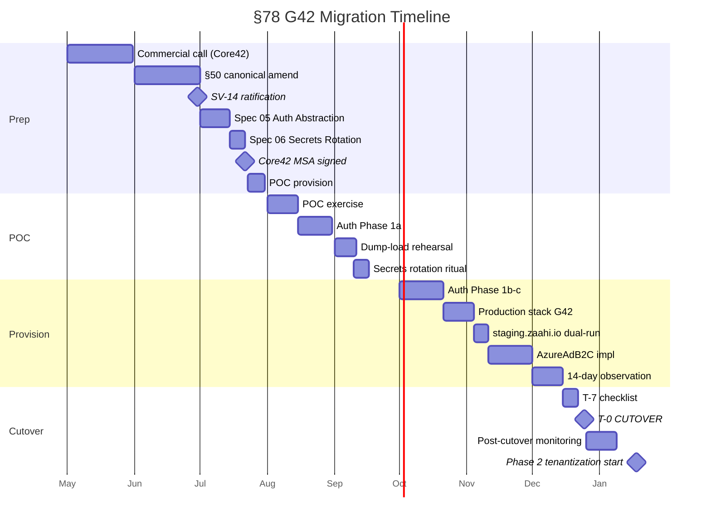

# §78 G42 MIGRATION ARCHITECTURE — Core42 Abu Dhabi target · Month 9-10 cutover

---

## How to read this document

This is **not a build spec**. It is the architectural blueprint that the Month 9-10 production cutover executes against, and the reference that §78 BUILD_SPEC (Phase 2, post-cutover operational playbook) will anchor to. Four audiences:

1. **Zhan (engineering)** — reads §2-§6 for source-stack inventory + target-stack mapping + cutover procedure + rollback.
2. **Dymo (commercial + ops)** — reads §1 for strategic framing, §7 for risks, §8 for timeline, §11 for open questions requiring founder decision.
3. **Rudi + Board (investor)** — reads §0, §1, §9 budget, §12 Appendix D (extractable 1-pager sovereignty narrative).
4. **Future Series A reviewer** — reads the whole document as data-room evidence of execution discipline + sovereignty posture.

Document is ~1700 lines. Each section independently readable. Cross-references explicit. Mermaid diagrams in §8.6 + §12.

---

## §0 Purpose + scope

This document specifies:
1. The **source stack inventory** of zaahi.io production (per audit 2026-04-22) · 13 dependency rows + lock-in assessment + data volumes.
2. The **target stack mapping** to G42 Core42 Sovereign Public Cloud · 14 component rows · Azure-inherited service selection · all flagged "pending Core42 commercial confirmation."
3. The **migration approach** · Option A big-bang (recommended Phase 1 pre-external-launch) + Option C tenant-by-tenant (Phase 2+ Enterprise tier).
4. The **cutover procedure** · 60-minute maintenance window · step-by-step runbook · smoke-test acceptance criteria.
5. The **rollback procedure** · ≤30-minute budget · trigger conditions · authority matrix.
6. The **risk register** · technical + operational + strategic + compliance.
7. The **phased timeline** · Month 2-10 execution calendar.
8. The **budget** · Y1 AED 160-200 k add-on · Y2/Y5 forecast · Platform Dev Fund funding.

**Not in scope of this document:**
- §78 BUILD_SPEC (post-cutover operational playbook) — deferred to Phase 2 Month 11+ after real production feedback from Core42 sovereign tenant.
- §77 BUILD_SPEC (tenantization mechanics) — per §77 ARCHITECTURE v1.2 D-4, deferred to Phase 2 Month 10+ pilot-tenant feedback.
- Anthropic API migration to Core42 Compass — deferred decision · SV-4 Mistral fallback provides near-term concentration-risk mitigation · Compass evaluation Phase 2.
- Polygon blockchain node migration (§42 Infura → own nodes Q4 2026) — separate track · not bundled with this migration.
- Stripe integration (§52 Stripe → own bank Q2 2028) — not yet integrated · not migrated here.

**Target ship:** this architecture doc in v1.0 final form today (2026-04-22). §78 BUILD_SPEC deferred to Phase 2 Month 11+. Actual cutover Month 9-10 per §8 timeline.

---

## §1 Strategic framing

### §1.1 Why G42 Core42 (sovereignty rationale)

**Founder directive (Dymo, 2026-04-22):** full deployment of the Master Tree on G42 Cloud (Abu Dhabi) as sovereignty-grade infrastructure. Vercel + Supabase Frankfurt reclassified to "live demo" during Phase 1 · no active feature development on that stack · Master Tree completion-to-perfection happens monolithic and unbreakable on G42.

**Six grounding facts justifying Core42 selection over alternatives:**

1. **UAE Central Bank partnership (2026-02).** Core42 contracted to deliver Sovereign Financial Cloud Services Infrastructure — this is the strongest public endorsement of Core42's regulated-sector readiness available. Real-estate data in UAE sits adjacent to financial data (title transfer = banking-adjacent). Core42 approved for banks = Core42 acceptable for ZAAHI by proxy.
2. **Abu Dhabi government partnership.** 11 million daily digital interactions between Abu Dhabi government entities, citizens, and businesses processed on Core42 sovereign infrastructure. ZAAHI's Phase 2 government MOU pipeline (DLD · RERA · TAMM · ADGM) negotiates from stronger position when counterparty recognises the hosting vendor as their peer.
3. **Microsoft $1.5B direct investment + $15.2B UAE plan (2024-2026).** Azure sovereign-controls inheritance means Core42 services run the full Azure feature matrix — we get ISO 27001/27017/27018/27701 + SOC 1/2/3 transitively without needing separate Core42 certification audit. Microsoft's balance-sheet commitment underwrites Core42's continuity risk.
4. **Stargate UAE 1 GW cluster (2026 live).** First 200 MW operational · OpenAI + Oracle as co-operators · provides Core42 AI Cloud + Compass platform with inference + training capacity. Positions ZAAHI for §41 Own AI 2027 roadmap without separate GPU-capacity negotiation.
5. **Khazna Tier III/IV datacentres.** Physical presence Abu Dhabi + Dubai + Ajman · TIER III/IV certification · dark-fibre connectivity to Etisalat + du backbone. Dubai → Abu Dhabi <10 ms round-trip (vs Dubai → Frankfurt 120 ms on current Supabase).
6. **PDPL 45/2021 alignment.** Core42 Sovereign Public Cloud explicitly markets PDPL compliance · data-residency guarantee (bytes stay in UAE borders) · DPA template supports Data Controller (tenant) + Data Processor (ZAAHI) + Sub-Processor (Core42) three-party model per §77 ARCHITECTURE D-12.

**Alternatives considered + rejected (full table §3.4):**
- **du Datamena / Injazat (Etisalat / e&)** — legacy UAE telco · strong for non-AI workloads · but weaker sovereign-AI positioning than G42 · weaker government-counterparty signalling.
- **Etisalat Cloud / Moro Hub (Dubai)** — Dubai-operated · Dubai Electronic Security Center Tier 4 · strong for DLD integration · but narrower geographic reach than G42 multi-emirate presence.
- **AWS Riyadh / Saudi Arabia** — available since 2024 · sovereign-data-centre · but Saudi jurisdiction ≠ UAE jurisdiction · wrong compliance frame for PDPL.
- **Oracle Cloud UAE (Abu Dhabi)** — available · good for Oracle-native workloads · but ZAAHI is PostgreSQL-Prisma · Oracle stack mismatch.
- **Neon (AWS-backed managed Postgres)** — affordable · modern branching features · but US-resident · re-introduces exactly the vendor concentration SV-14 mitigates.
- **Self-hosted on Khazna colocation** — maximum sovereignty · maximum cost · maximum operational burden · deferred to D-11 Y2 CapEx placeholder as contingency fallback if Core42 Y5 economics fail.
- **Hetzner Helsinki or OVH Gravelines (EU sovereign)** — EU data-residency · cheaper than Core42 · but EU jurisdiction ≠ UAE jurisdiction · fails the "UAE sovereign" positioning core to ZAAHI strategy.

### §1.2 Why migrate from Vercel + Supabase Frankfurt (risk rationale)

**Four concrete risks justifying migration now (not later):**

1. **Data residency for government counterparties.** DLD / RERA / TAMM / ADGM MOU conversations will ask "where does UAE citizen PII reside?" "Frankfurt via US-HQ vendor" is an acceptable but weak answer. "Abu Dhabi, G42 datacentre, sovereign cloud" is the strong answer. Property Finder's AED 170 M Mubadala round (2025) signalled UAE state capital favours UAE-resident stacks. Every month on Vercel + Supabase Frankfurt = every month signalling sub-optimal positioning.

2. **Latency to UAE users.** Dubai → Frankfurt ~120 ms round-trip · Dubai → Abu Dhabi <10 ms. Metaverse (§39) WebGL interactivity requires <30 ms budget. Current latency degrades 3D rendering experience for the exact demographic ZAAHI serves (UAE-resident HNWI + institutional brokers). Migration is a UX feature, not just a sovereignty posture.

3. **Vendor concentration risk (CLOUD Act exposure).** US CLOUD Act can compel Supabase Inc. (US Delaware C-corp) to disclose data even when physically resident in Frankfurt. Not a theoretical attack surface · CLOUD Act subpoenas have issued against Microsoft, Google for EU-resident data. ZAAHI handling UAE citizen PII + RERA broker licences + sovereign-wealth partner data = exactly the data that government counterparties would reasonably consider unacceptable under US-compellable vendors.

4. **Bus factor + vendor lock-in acceleration.** Current stack = Vercel Edge Middleware + Image Optimization + Cron + Edge Config · each is Vercel-proprietary · re-implementation on any other platform = engineering friction cost that grows with every new feature Vercel adds. Migration timing is "sooner is cheaper" — postponing past Phase 2 external-user onboarding means migrating a much larger surface.

### §1.3 In scope (what this migration covers)

**Production zaahi.io runtime:**
- Next.js 15 application + all current routes (`/`, `/parcels/*`, `/ambassador`, `/join`, `/admin`, `/api/*`).
- Prisma 7.7 + Supabase PostgreSQL (Frankfurt) · 19 models · 13 migrations · 114 parcels · ~50-500 users · ~5-20 deals · ~1 k activity-log rows.
- Supabase Auth (email + password + Google OAuth latent + admin-approval gate).
- Supabase Storage (PDFs · plot-guidelines · affection plans · site plans).
- Local `data/**` geodata (KML + PMTiles + Excel + master-plans · per CLAUDE.md immutable).
- Secrets inventory per audit 2026-04-22 §1.5 (9 env vars).
- DNS (`zaahi.io` + `zaahi.vercel.app`) · Vercel CDN.
- External integrations currently live: Resend email · Telegram bot notifications · Anthropic Claude API (Archibald).

**Phase 2 tenantization preparation:**
- Per §77 ARCHITECTURE v1.2 §12.3, tenantization cycle executes Month 10+. SV-14 ensures this happens natively on G42 Core42 (no Vercel-era retrofit).
- `DataRegion` enum per §77 §3.1 maps to Core42 Abu Dhabi primary region · Azure Front Door multi-region secondary if Phase 2 cross-border launches demand it.

### §1.4 Out of scope (explicit exclusions)

- **Anthropic API direct calls.** Keep Phase 1 · Core42 Compass (claims 50+ models including Claude variants) evaluated Phase 2 as potential replacement. SV-4 Mistral fallback provides concentration-risk mitigation without full provider swap.
- **Polygon blockchain + §42 Infura migration.** §52 canonical roadmap targets "Infura → own nodes Q4 2026" — separate workstream · not bundled here · own-validator-node setup requires different expertise (blockchain ops vs cloud migration).
- **Stripe integration.** Not yet integrated · §52 canonical targets "Stripe → own bank Q2 2028" · Phase 2 decision per §77 PRICING_FRAMEWORK v1.1 D-15 (manual invoicing Phase 1 · evaluate Stripe/Paddle at 5-10 tenants).
- **Anthropic zero-retention DPA (SV-1).** Separate sovereignty item · already ratified · runs on current Anthropic endpoint regardless of ZAAHI hosting location.
- **UAE Pass integration (SV-6).** Separate Month 7-8 deliverable · federates with whatever auth backend ZAAHI runs · independent of SV-14 cutover timing.
- **Own AI 2027 roadmap (§41).** Depends on Core42 AI Cloud availability + ZAAHI RE-v1 fine-tune · Phase 2-3 workstream · not bundled here.

### §1.5 Dependency on §77 ARCHITECTURE v1.2

**§77 ARCHITECTURE is the tenant-model foundation.** SV-14 migration moves the whole runtime to G42 · §77 tenantization Month 10+ layers multi-tenancy on top of the migrated runtime. Order of operations matters:

1. **Month 2-8:** SV-14 preparation (commercial + spec + POC + auth abstraction + secrets rotation).
2. **Month 9-10:** SV-14 cutover (Option A big-bang). Runtime moves Vercel+Supabase → Core42. Still single-tenant at this point (default `zaahi-default` tenant per §77 ARCHITECTURE §3.2).
3. **Month 10+:** §77 tenantization cycle executes on Core42. Add `Tenant` Prisma model + `tenantId` columns + RLS policies + middleware tenant-resolution · all natively on G42 (no retrofit from Vercel).
4. **Month 10-14:** first Enterprise tenant onboards to dedicated Core42 sovereign subscription per §77 D-14.

**Consequence for this doc:** §78 G42 Migration = pre-tenantization lift-and-shift · §77 tenantization = post-migration multi-tenancy layering · two sequential workstreams · not bundled · not in conflict.

### §1.6 Budget framing

Per MOU (`docs/investor-package/MOU_RUDI.md`) + Enhancement Proposal §4:
- Agency Y1 revenue target: AED 7.8 M (Dymo pipeline · unchanged).
- Platform Dev Fund = 70% of Agency revenue net of operating costs = ~AED 5.46 M Y1.
- SV-14 Y1 add-on: AED 160-200 k = **~3-4% of Platform Dev Fund Y1** · fiscally minor · strategically high-leverage.
- Y2 recurring AED ~200 k = ~3% of Phase 2 Dev Fund budget.
- Y5 at scale AED ~600 k = scales with tenant count + AI workload + compliance surface.

**Funding vehicle per MOU:** Platform Dev Fund · Rudi AED 1 M wire 2026-05-08 unaffected (pre-Rudi-wire governance handled by `docs/ops/BUS_FACTOR_RECOVERY.md` separate deliverable this session).

---

## §2 Source stack inventory

This section enumerates every component of the current zaahi.io runtime that must be either (a) migrated to G42, (b) retained as-is post-migration, or (c) retired. Data as of audit 2026-04-22 (commit `51c926d`).

### §2.1 Full dependency map

| # | Component | Current vendor | Region | Source of truth | Lock-in | Migration action |
|:-:|---|---|---|---|:-:|---|
| 1 | Application hosting + edge compute | Vercel | US Delaware / distributed edge | `.vercel/` + `next.config.ts` | **High** | Migrate to Core42 Container Apps (primary) OR App Service (alternative) |
| 2 | Primary OLTP database | Supabase PostgreSQL | Frankfurt `eu-central-1` | `DATABASE_URL` · 480-line `prisma/schema.prisma` | **Medium** | Migrate to Azure Database for PostgreSQL Flex Server @ Core42 Abu Dhabi |
| 3 | Auth provider | Supabase Auth | Frankfurt | `src/lib/supabase-browser.ts` + `src/lib/supabase.ts` + `src/lib/auth.ts` | **Medium-High** | Migrate to Azure AD B2C @ Core42 · ship-stopper · resolved by Spec 05 Auth Abstraction |
| 4 | Object / file storage | Supabase Storage | Frankfurt | `src/lib/storage.ts` abstraction (per CLAUDE.md sovereignty rules) | **Low** | Migrate to Azure Blob Storage @ Core42 Abu Dhabi · low-friction via existing abstraction |
| 5 | Local immutable geodata | Filesystem `data/**` | packaged in build | `data/**` (KML · PMTiles · `plot-prices.xlsx` · master-plans) | **Low** | Keep pattern · optionally mirror to Core42 Blob as build asset · per CLAUDE.md immutable |
| 6 | DNS registrar | Namecheap | US | `zaahi.io` A `76.76.21.21` · CNAME `www` `cname.vercel-dns.com` | **Low** | Keep registrar · re-point A/CNAME to Azure Front Door Abu Dhabi endpoint at cutover |
| 7 | CI/CD | GitHub Actions via Vercel integration | US | `.github/workflows/` (implicit) + Vercel auto-deploy from `main` | **Medium** | Re-point to Azure DevOps Pipelines OR keep GitHub Actions with Azure deploy step · SV-3 Gitea UAE mirror as insurance |
| 8 | CDN (static assets) | Cloudflare + Vercel Edge | distributed | implicit via Vercel | **Low** | Replace with Azure Front Door sovereign + optional Core42-owned CDN · swap headers, done |
| 9 | AI inference | Anthropic API (Claude Sonnet 4.6 · Opus 4.6 via `ANTHROPIC_API_KEY`) | US | `src/app/api/chat/route.ts` (101 lines · real endpoint) | **High** | OUT OF SCOPE this migration · keep direct Anthropic + SV-4 Mistral fallback · Compass Phase 2 evaluation |
| 10 | Transactional email | Resend | US | `src/lib/email.ts` (86 lines · silent-skip pattern) | **Low** | Migrate to Azure Communication Services Email @ Core42 OR SendGrid via Azure Marketplace · `email.ts` abstraction makes swap low-friction |
| 11 | Admin notifications | Telegram Bot API | distributed | `src/lib/telegram.ts` (109 lines · silent-skip pattern) | **Low** | Keep Telegram (external to cloud) · unchanged |
| 12 | Crypto wallet (Ambassador USDT) | TRON TRC-20 · single-sig EOA `TELiibGkn3sg4EVzGYczzj2kkiAVfVN4j7` | decentralised | CLAUDE.md Ambassador rules | **Low** | Keep TRON on-chain · SV-7 multisig migration Month 5-6 · independent of cloud cutover |
| 13 | Secret storage | Vercel Environment Variables UI | US · single-admin (Zhan) | `.env.local` gitignored per CLAUDE.md | **Medium** | Migrate to Azure Key Vault @ Core42 · Spec 06 Secrets Rotation executes pre-cutover ritual |

**13 components · 3 High lock-in · 4 Medium · 6 Low.** Priority order for migration spec depth: Auth (#3 ship-stopper) → DB (#2 state migration) → Hosting (#1 Vercel-specific APIs) → Storage (#4) → everything else.

### §2.2 Lock-in assessment detail

**High lock-in components (3) — require spec depth + rehearsal:**

1. **Vercel hosting.** Vercel-proprietary APIs used (pending code audit to confirm extent):
   - Next.js 15 Edge Middleware `src/middleware.ts` (65 lines per audit). Uses Edge Runtime · may rely on Vercel-specific Edge runtime primitives.
   - Next.js Image Optimization · `next/image` component · default optimizer is Vercel-hosted at `/_next/image` route.
   - Vercel Cron Jobs (if any configured · to be audited · potentially none currently).
   - Vercel Edge Config (if used · audit needed · probably not based on file tree).
   - Deploy preview URLs per PR.
   
   **Migration path:** Container Apps runs Node.js runtime · Edge Middleware → Azure Front Door Rules Engine + custom Next.js middleware on node runtime (drops Edge runtime but retains logic). Image Optimization → Azure CDN image transforms OR self-hosted Sharp-based optimizer. Cron → Azure Functions Timer trigger (straightforward port). Edge Config → Azure App Configuration.

2. **Supabase Auth.** Supabase-specific JWT claims format (`sub` = Supabase user UUID · `user_metadata` = custom fields including critical `approved` boolean · `app_metadata` = server-side claims). Session cookie named `sb-<project-ref>-auth-token`. Google OAuth configured in Supabase console (not in code). Admin-approval gate pattern (`getApprovedUserId` in `src/lib/auth.ts`) reads `user_metadata.approved === true`.
   
   **Migration path:** Azure AD B2C (or Azure External ID) issues OIDC tokens with different claims shape · `oid` (object ID) replaces `sub` · custom attributes via directory schema · Google OAuth via Azure AD B2C federation config. Approval gate re-implements in application DB (`User.approved` boolean · already exists in Prisma) · auth provider just asserts identity · approval gate runs in app layer. Spec 05 Auth Abstraction resolves this cleanly.

3. **Anthropic API direct calls.** Out of scope this migration per §1.4 · resolved separately via SV-4 Mistral provider abstraction.

**Medium lock-in components (4) — straightforward but require validation:**

4. **Supabase PostgreSQL.** Supabase-specific extensions used (to confirm via `\dx` on production): `auth` schema (managed by Supabase Auth · migrated away when Auth migrates), `storage` schema (managed by Supabase Storage · migrated away when Storage migrates), potentially `pgaudit` · `pgcrypto` · `pg_stat_statements`. RLS policies reference `auth.uid()` Supabase-specific function. Migrations managed via Supabase CLI + Prisma `migrate deploy`.
   
   **Migration path:** standard `pg_dump` · `pg_restore` to Azure Database for PostgreSQL Flex Server. RLS policies wrap `auth.uid()` calls in stable function `current_user_id()` defined in database (backed by session-variable set by middleware per 5-layer defence-in-depth in §77 ARCHITECTURE §4.3) · same SQL works either side of migration.

5. **CI/CD pipeline.** GitHub Actions → Vercel auto-deploy from `main` is tightly integrated. Replace with `az webapp deploy` or `az containerapp update` step in existing GitHub Actions workflow. Low-friction if we keep GitHub and just change the deploy target.

6. **Secret storage.** Vercel Environment Variables UI = single-admin access (Zhan only). No rotation automation. Migration to Azure Key Vault per Spec 06 provides rotation automation + dual-admin access + audit logging.

**Low lock-in components (6) — portable as-is or trivial swap:**

7-12. Storage (#4 · abstracted), geodata (#5 · packaged), DNS (#6 · portable registrar), CDN (#8 · config-only), email (#10 · abstracted), notifications (#11 · external).

13. Crypto wallet (#12 · external + SV-7 multisig workstream).

### §2.3 Data volumes + backup state

**Current data volumes (estimated from audit 2026-04-22 + Prisma schema):**

| Table | Rows (est) | Columns | PII | Est size |
|---|---:|---:|:-:|---:|
| Parcel | 114 | ~40 (incl. JSON affection plans) | No | ~5 MB |
| User | 50-200 | ~20 (incl. ambassador fields) | Yes (email · name · phone · referralCode) | ~1 MB |
| Deal | 5-20 | ~25 | Yes (parties, amounts) | ~0.5 MB |
| DealMessage | 10-100 | ~10 | Yes (content) | ~1 MB |
| AffectionPlan | 114-300 | ~15 (plus `plotGuidelinesUrl`) | No | ~2 MB |
| Commission | 0-50 | ~15 | Yes (amounts · ambassador) | ~0.5 MB |
| ReferralClick | 10-200 | ~8 (ipHash only · no raw PII) | Hashed | ~0.2 MB |
| AmbassadorApplication | 0-20 | ~12 | Yes (USDT tx-hash) | ~0.2 MB |
| SavedParcel | 10-100 | ~5 | Link only | ~0.1 MB |
| ParcelView | 100-2000 | ~6 | Link only | ~0.5 MB |
| Notification | 10-500 | ~10 | Per-user | ~0.5 MB |
| ActivityLog | 100-5000 | ~10 | Per-user | ~1 MB |
| SavedSearch | 5-50 | ~8 | Per-user | ~0.2 MB |
| DealAuditEvent | 20-200 | ~10 | Per-event | ~0.5 MB |
| Document | 100-500 | ~8 (metadata only · files in Storage) | No | ~0.5 MB |
| Modules | fixed seed | ~5 | No | negligible |
| Others (4) | varies | varies | varies | ~1 MB |
| **Total OLTP** | **~700 – 9 000 rows** | 19 models | Mixed | **~15 MB pg_dump est** |

**Object storage (Supabase Storage):**
- PDFs: plot-guidelines · affection plans · site plans.
- Per-parcel ~2-5 PDFs × 114 parcels × ~500 KB avg = ~150 MB est.
- Growth factor: +50 MB/yr at current rate.

**Local `data/**`:**
- KML · PMTiles · Excel · master-plans = ~5-50 GB (wide range depending on PMTiles archive size).
- Per CLAUDE.md: IMMUTABLE · NEVER regenerated from code · migrates as-is in git.

**Total migration footprint:** ~15 MB SQL dump + ~150 MB object storage + packaged geodata in git.

**This is a TINY migration by industry standards.** Industry reference: typical SaaS migration = 100 GB – 10 TB OLTP + 1-100 TB objects. ZAAHI = 5 orders of magnitude below typical. `pg_dump`/`pg_restore` completes in <1 minute · object storage sync completes in <10 minutes. Cutover window fits within 60-minute budget with 3-5× safety margin.

### §2.4 Secrets inventory (names only · no values · per audit 2026-04-22 §1.5)

**Environment variables (9 total):**

| Name | Classification | Rotation cadence (post-Spec 06) | Migration action |
|---|:-:|:-:|---|
| `DATABASE_URL` | **CRITICAL** | Quarterly | Rotate @ cutover · new Azure PostgreSQL connection string |
| `NEXT_PUBLIC_SUPABASE_URL` | HIGH | Semi-annual | Retire post-cutover · replaced by Azure AD B2C config |
| `NEXT_PUBLIC_SUPABASE_ANON_KEY` | HIGH | Semi-annual | Retire post-cutover |
| `SUPABASE_SERVICE_ROLE_KEY` | **CRITICAL** | Quarterly | Retire post-cutover · replaced by Azure AD B2C admin credentials |
| `ANTHROPIC_API_KEY` | **CRITICAL** | Quarterly | Unchanged (out-of-scope per §1.4) · rotate via Key Vault post-cutover |
| `RESEND_API_KEY` | HIGH | Semi-annual | Unchanged vendor · rotate via Key Vault post-cutover |
| `TELEGRAM_BOT_TOKEN` | MEDIUM | Annual | Unchanged vendor · rotate via Key Vault post-cutover |
| `TELEGRAM_ADMIN_CHAT_ID` | MEDIUM | Annual | Unchanged · move to Key Vault |
| `TELEGRAM_FOUNDER_CHAT_ID` | MEDIUM | Annual | Unchanged · move to Key Vault |

**Full rotation policy:** `docs/specs/phase-1/06-SECRETS_ROTATION_POLICY.md` v1.0 (this session).

### §2.5 Bus factor state

Per audit 2026-04-22 §6 finding (commit `51c926d`): **Bus factor = 1**. Zhan sole admin on:
- Vercel (production deploy pipeline).
- Supabase (DB + Auth).
- GitHub `ZaahiPlots/Zaahi` repo.
- Namecheap (DNS).
- Anthropic console (API key management).
- Resend (email).

**Dymo sole admin on:**
- USDT wallet (Ambassador treasury, pre-multisig per SV-7).

**Rudi:**
- No admin access · no credential access · no wallet access.

**Pre-cutover fix mandatory.** Pre-Rudi AED 1 M wire 2026-05-08 mandatory. Details: `docs/ops/BUS_FACTOR_RECOVERY.md` v1.0 (this session · separate deliverable).

---

## §3 Target stack mapping

All entries flagged **"pending Core42 commercial confirmation"** — this is the agent's best mapping from published Core42 materials + Azure sovereign-cloud feature parity assumptions. Real service availability at Abu Dhabi sovereign region confirmed only after commercial conversation (Action 1 per G42 readiness report).

### §3.1 Azure Sovereign Public Cloud service catalogue (inferred)

**Core premise:** Core42 Sovereign Public Cloud = Azure public cloud + Core42 Insight sovereign-controls platform layer. Service availability tracks Azure public cloud with sovereign controls enforced per Core42 governance.

**Services expected available at Abu Dhabi sovereign region (pending confirmation):**

| Category | Azure service | ZAAHI use |
|---|---|---|
| Compute (container) | Azure Container Apps | Primary runtime for Next.js 15 |
| Compute (PaaS) | Azure App Service (Linux · Node.js 20) | Fallback runtime · Vercel-like deploy experience |
| Compute (raw) | Azure Kubernetes Service (AKS) | Deferred · over-engineering at current scale |
| Database | Azure Database for PostgreSQL Flex Server | Primary OLTP (replaces Supabase Postgres) |
| Auth | Azure AD B2C · Azure External ID | Replaces Supabase Auth |
| Object storage | Azure Blob Storage | Replaces Supabase Storage |
| Secrets | Azure Key Vault | Replaces Vercel env vars |
| Configuration | Azure App Configuration | Replaces Vercel Edge Config (if used) |
| CDN + edge | Azure Front Door | Replaces Vercel Edge · Cloudflare CDN |
| Email | Azure Communication Services Email | Replaces Resend (optional · Resend portable) |
| Monitoring | Azure Monitor + Application Insights | Adds observability (current state: thin) |
| AI inference | Core42 Compass | Phase 2 evaluation (Anthropic direct Phase 1) |
| GPU | Core42 AI Cloud | Phase 3 ZAAHI-RE-v1 fine-tune target |
| Messaging | Azure Service Bus | Future · deal notifications pipeline |
| Cron | Azure Functions Timer trigger | Replaces Vercel Cron (if used) |
| Registry | Azure Container Registry | Docker image hosting |

### §3.2 Component-by-component mapping

**14 mapping rows (expanded from §2.1 with target-stack detail):**

| # | ZAAHI component | Current (Vercel+Supabase) | Target (G42 Core42) | Migration difficulty | Estimated effort |
|:-:|---|---|---|:-:|---:|
| 1 | Next.js 15 app hosting | Vercel (auto-deploy `main`) | **Azure Container Apps** (Linux · Node.js 20 · Dockerfile-based) | Medium | 1-2 eng-wks |
| 2 | OLTP database | Supabase PostgreSQL (Frankfurt) | **Azure Database for PostgreSQL Flex Server** (Abu Dhabi · Burstable B2s tier initially) | Medium | 1 eng-wk (dump + restore + validate) |
| 3 | Auth provider | Supabase Auth | **Azure AD B2C** (B2C tenant) with email+password + Google federation | **High (ship-stopper)** | 3-4 eng-wks (per Spec 05 Auth Abstraction) |
| 4 | Object / file storage | Supabase Storage | **Azure Blob Storage** (hot tier · Abu Dhabi) | Low | 2-3 days (via existing `src/lib/storage.ts` abstraction) |
| 5 | Local `data/**` geodata | Filesystem packaged | **Unchanged** (still packaged in build) OR Azure Blob build-asset mirror | Low | 0 (pattern preserved) |
| 6 | DNS | Namecheap `zaahi.io` A → Vercel | **Namecheap kept** · A flipped to Azure Front Door endpoint at cutover | Low | 1 hour (DNS flip + TTL wait) |
| 7 | CI/CD | GitHub Actions + Vercel auto-deploy | **GitHub Actions + `az containerapp update` deploy step** | Low | 2-3 days |
| 8 | CDN / edge | Vercel Edge + Cloudflare | **Azure Front Door** (sovereign region · WAF rules) | Low | 1 eng-wk |
| 9 | Anthropic API | Direct `ANTHROPIC_API_KEY` | **Unchanged Phase 1** · Compass Phase 2 evaluation | Out of scope | — |
| 10 | Resend email | `RESEND_API_KEY` via `src/lib/email.ts` | **Unchanged** (Resend portable) OR migrate to Azure Communication Services Email | Low | 0 (keep) or 1 eng-wk (switch) |
| 11 | Telegram | Bot API external | **Unchanged** | Low | 0 |
| 12 | Crypto wallet | TRON USDT single-sig | **Unchanged** · SV-7 multisig workstream separate | Low | 0 |
| 13 | Secrets | Vercel env vars | **Azure Key Vault** · app reads via Managed Identity | Medium | 1 eng-wk (per Spec 06) |
| 14 | Image Optimization (`next/image`) | Vercel `/_next/image` | **Self-hosted Sharp in Container App** OR Azure CDN image transforms | Low-Medium | 1-2 eng-wks |

**Total effort estimate: 10-14 engineer-weeks** aligned with Y1 budget line AED 80 k migration engineering labour.

### §3.3 Identified ship-stoppers (with mitigation references)

**5 concrete ship-stoppers enumerated · each with mitigation path:**

1. **Supabase Auth → Azure AD B2C.** HIGH severity. JWT shape differs · session cookie format differs · `user_metadata.approved` pattern needs app-layer re-implementation. **Mitigation:** `docs/specs/phase-1/05-AUTH_ABSTRACTION_SPEC.md` v1.0 (this session) defines `IAuthProvider` adapter interface · `SupabaseAuthAdapter` ships first (no behaviour change) · `AzureAdB2CAdapter` ships at cutover · feature-flag flip.

2. **Vercel Edge Middleware.** MEDIUM severity. `src/middleware.ts` (65 lines) uses Next.js Edge Runtime · may rely on Vercel-specific Edge primitives. **Mitigation:** port to Node.js runtime middleware · Azure Front Door Rules Engine handles CDN-layer logic (if any currently in Edge Middleware). Code audit required during Spec 05 Phase 1b refactor. Deferred to §78 BUILD_SPEC Phase 2 for detailed per-line rewrite spec.

3. **Vercel Image Optimization (`next/image` component).** LOW-MEDIUM severity. Default optimizer is Vercel-hosted. **Mitigation:** self-host Sharp-based optimizer in Container App (Next.js supports custom loader via `images.loader` config) · straightforward port.

4. **Vercel Cron Jobs.** LOW severity if none currently configured · MEDIUM if any exist. **Mitigation:** audit current Vercel project config · for any cron jobs · port to Azure Functions Timer trigger (standard cron expression syntax compatible).

5. **Vercel Edge Config.** LOW severity if not used · HIGH if heavily used. **Mitigation:** audit code for `@vercel/edge-config` imports (agent's expectation: not used based on repo search) · for any usage · migrate to Azure App Configuration (similar API shape).

**None of the 5 is unresolvable.** All have documented migration paths. Spec 05 tackles the largest (#1). Others addressed during actual engineering work Month 7-8.

### §3.4 Alternatives considered (with rejection rationale)

| Option | Sovereignty | Pricing | Performance | Ecosystem | Reject because |
|---|:-:|:-:|:-:|:-:|---|
| **Core42 Abu Dhabi (SELECTED)** | ★★★ | ★★☆ | ★★★ | ★★★ | — |
| du Datamena / Injazat | ★★★ | ★★★ | ★★☆ | ★★☆ | Weaker sovereign-AI positioning · no Compass/Stargate equivalent · non-Azure stack = migration friction |
| Etisalat Cloud / Moro Hub (Dubai) | ★★★ | ★★★ | ★★☆ | ★★☆ | Dubai-only physical presence · narrower geographic reach · non-Azure stack |
| AWS Riyadh (Saudi) | ★★☆ | ★★★ | ★★☆ | ★★★ | Wrong jurisdiction (Saudi ≠ UAE PDPL) · re-introduces US parent risk |
| Oracle Cloud UAE (Abu Dhabi) | ★★★ | ★★☆ | ★★★ | ★☆☆ | Oracle-native optimised · ZAAHI is Postgres-Prisma-Next.js · stack mismatch |
| Neon (AWS-backed managed Postgres) | ★☆☆ | ★★★ | ★★☆ | ★★★ | US data residency · defeats sovereignty purpose |
| Hetzner Helsinki (EU) | ★★☆ | ★★★ | ★☆☆ | ★★☆ | EU jurisdiction ≠ UAE · weakens positioning · bare-metal ops burden |
| OVH Gravelines (EU) | ★★☆ | ★★★ | ★☆☆ | ★★☆ | Same as Hetzner |
| Equinix DX1 Dubai colocation | ★★★ | ★☆☆ (CapEx) | ★★★ | ★☆☆ | Maximum operational burden · deferred to D-11 Y2 CapEx contingency per SV-14 |
| Self-hosted on Khazna colo | ★★★ | ★☆☆ | ★★★ | ★☆☆ | Same as Equinix · raw-metal · high ops cost at Phase 1 scale |

### §3.5 Open questions pending Core42 commercial conversation

**10 concrete questions to put to Core42 enterprise sales (per G42 readiness report Section 2.3):**

1. **Azure Database for PostgreSQL Flex Server availability at Abu Dhabi sovereign region.** All tiers · Burstable B1ms / B2s / B4ms for dev, staging · General Purpose for production. Confirm version support PostgreSQL 15/16.
2. **Container Apps vs App Service vs AKS preference for Next.js 15.** Request Core42 recommendation + reference architecture · any Core42-specific opinions.
3. **Indicative monthly pricing for ZAAHI scale:**
   - 100 DAU · 5 GB storage · 1 TB CDN egress/mo · 50 M Anthropic tokens/mo (via Core42 Compass if migrated Phase 2).
   - Burstable B2s PostgreSQL + B1ms replica.
   - Container App 2 vCPU · 4 GB RAM · min 1 max 3 replicas.
   - Blob Storage hot tier · 150 MB.
   - Azure AD B2C · 500 MAU.
   - Front Door Premium tier.
4. **Azure AD B2C availability in sovereign tier.** Confirm B2C is available at Abu Dhabi sovereign region (some Azure B2C tenants are global · sovereign tier has specific constraints).
5. **Blob Storage Abu Dhabi region pricing + API parity.** Confirm S3-compatible endpoints · confirm managed identity authentication works.
6. **ISO / SOC specific certificate IDs.** Request formal cert listing for audit trail · required for UAE institutional-investor data-room (Series A).
7. **Cross-border routing for Phase 2 Saudi expansion (Q2 2027).** Does Core42 offer Riyadh / stc Cloud peering · do we need a separate Saudi sovereign tenant · ExpressRoute cost.
8. **Supabase → Azure PostgreSQL migration tooling.** Does Azure Database Migration Service support Supabase source · or is it manual `pg_dump`/`pg_restore` · Core42 migration-assistance offering.
9. **Data-in-transit cutover path.** During cutover · Frankfurt Supabase → Abu Dhabi Azure PostgreSQL data flows over public internet or via ExpressRoute · PII in transit considerations · one-time cost.
10. **Training GPU access.** §41 Own AI 2027 roadmap depends on affordable training GPU · does Core42 AI Cloud offer ZAAHI-tier access · pricing for 7B/13B fine-tune job (~24-72 GPU-hours on A100 80GB).

**Additional questions surfaced during spec writing:**

11. **PDPL Sub-Processor DPA template.** Does Core42 publish a standard DPA for ZAAHI (Data Processor) + Core42 (Sub-Processor) three-party relationship per PDPL 45/2021.
12. **SLA terms at sovereign tier.** Uptime guarantee · credit structure · incident notification timeline · aligned with §77 ARCHITECTURE §10.5 ZAAHI-published SLA.
13. **Data residency enforcement audit evidence.** How does Core42 prove "bytes never leave UAE borders" · SOC 2 control references · customer-accessible audit reports.
14. **Backup + DR topology at sovereign tier.** Default backup retention · GRS (geo-redundant storage) to Dubai or Bahrain · recovery-time objective · recovery-point objective.
15. **Pricing commitment tiers.** 1-year commit vs 3-year commit discounts · spot/reserved instance availability.

---

## §4 Migration approach

### §4.1 Option A — Big-bang cutover (RECOMMENDED for Phase 1 pre-external-launch)

**Procedure summary:**
1. Freeze writes on Supabase (maintenance mode enabled via middleware flag).
2. `pg_dump` production Supabase → local SQL file (<5 minutes at current data size).
3. `pg_restore` → Azure Database for PostgreSQL Flex Server at Abu Dhabi (<5 minutes).
4. Sync Supabase Storage → Azure Blob Storage via parallel `rclone` copy (<10 minutes for ~150 MB).
5. Verify Prisma migrations applied · seed data present · RLS policies intact.
6. Flip DNS: `zaahi.io` A-record from Vercel IP to Azure Front Door Abu Dhabi endpoint.
7. Wait for DNS TTL propagation (~30 minutes with 300s TTL pre-set).
8. Unfreeze writes · run smoke tests.
9. Monitor for 48 hours · on clean dashboard, mark cutover complete.

**Duration budget:** 60-minute maintenance window. Internal timeline ~25-30 minutes active work + 30 minutes DNS propagation buffer.

**Why it fits ZAAHI today:**
- Pre-external-launch (Phase 1 Owner-First discipline · no external paying customers until Month 10).
- Data volume is TINY (~15 MB OLTP + ~150 MB objects).
- Downtime tolerance acceptable (existing `zaahi.io` = live demo · founders control traffic).
- Rollback is equally simple (DNS flip back · reverse `pg_dump` Azure→Supabase if needed).

### §4.2 Option B — Parallel run with CDC (REJECTED)

**Procedure summary:** deploy G42 stack in parallel · Debezium CDC streams Supabase → Azure PostgreSQL in real-time · dual-write validation · cut DNS when parity confirmed.

**Why rejected:**
- 4-8 engineer-weeks additional effort vs Option A's 1-2 eng-weeks for cutover execution.
- CDC tuning complexity (PK ordering · unique constraints · FK cascades · deleted-row handling).
- Overkill for pre-launch system with zero paying customers.
- Only justified for AED 100 M+/yr production systems · ZAAHI Y1 revenue target AED 7.8 M Agency + near-zero Platform.

**Retain for reference:** if Phase 3 re-platforms off Core42 (e.g., Y5 cost threshold triggers Equinix DX1 D-11 fallback), reconsider Option B — by then system is bigger and downtime tolerance lower.

### §4.3 Option C — Tenant-by-tenant (Phase 2+ for Enterprise tier)

**Procedure summary:** each Enterprise tenant migrates independently · Starter/Pro stay on shared G42 Core42 tenant · Enterprise gets own Core42 sovereign subscription per §77 ARCHITECTURE v1.2 D-14.

**Why viable Phase 2+:**
- Aligns with §77 ARCHITECTURE D-14 (Enterprise = dedicated Supabase project · reinterpret as dedicated Core42 subscription).
- Provides compliance isolation + data-region flexibility per §77 ARCHITECTURE §3.1 `DataRegion` enum.
- Migration friction amortised across Enterprise onboarding cadence (one tenant per quarter · not all-at-once).

**Why NOT applicable Phase 1:**
- Phase 1 has no external tenants (per Phase 1 Owner-First discipline).
- Default `zaahi-default` tenant holds all current data · single migration event is Option A.

### §4.4 Recommended hybrid

**Phase 1 Month 9-10:** Option A big-bang cutover · moves current zaahi.io to Core42 · single `zaahi-default` tenant.

**Phase 2 Month 10+ (as Enterprise tenants onboard):** Option C tenant-by-tenant for Enterprise tier · new Core42 subscriptions per Enterprise tenant · data residency selectable per §77 §3.1.

**Phase 2 Month 10+ (for Starter/Pro tenants onboarding):** they join the shared `zaahi-default`-equivalent tenant on Core42 · RLS isolation per §77 §4.

This hybrid achieves:
- Fast Phase 1 cutover (Option A).
- Compliance isolation per Enterprise (Option C at scale).
- Operational simplicity at mid-tier (shared on Core42 with RLS).

### §4.5 Cutover window specification

**Window requirements:**
- **Off-hours UAE time:** Friday 02:00 – 04:00 AST (02:00-04:00 UAE Standard Time = 22:00-00:00 Thursday GMT · lowest UAE-user traffic).
- **Avoid Eid al-Adha 2026:** May 25-31 2026 (founder directive — no platform events during Eid).
- **Avoid Ramadan 2026:** Feb 28 – Mar 30 2026 (already past at Month 9-10 target · not a conflict).
- **Maintenance budget:** 60 minutes hard limit · abort to rollback if exceeded.

**Target cutover date (subject to Month 9-10 execution):**
- Phase 1 cutover: tentative Friday 2026-12-25 OR Friday 2027-01-08 (depending on Phase 2 opening scheduled for Mon 2027-01-18).
- Preferred: cutover aligns with Phase 2 opening week · 2-3 days buffer for post-cutover monitoring before external-user onboarding begins.

**Founder notification:** 48 hours before cutover · Zhan + Dymo online · Rudi notified via D-38 weekly-call channel.

**User notification (Phase 1 = founders only internally · external zaahi.io visitors = low-volume demo traffic):** banner on production page 72 hours before · `www.zaahi.io` HTTP 503 during window · courtesy message "ZAAHI is migrating to UAE sovereign infrastructure · back online in 60 minutes."

---

## §5 Cutover procedure

### §5.1 Pre-cutover checklist (T-7 days to T-1 day · 24 items)

**T-7 days (one week before cutover):**
- [ ] Core42 MSA + DPA signed and filed `docs/legal/core42-msa.pdf`.
- [ ] §50 canonical amendment ratified and applied to `MASTER_TREE_final.md` (per SV-14 D-50 unanimous vote).
- [ ] POC tenant fully exercised · smoke tests green.
- [ ] Staging `staging.zaahi.io` on Core42 running for ≥14 days with synthetic traffic.
- [ ] Auth migration validated on staging (Spec 05 Azure AD B2C adapter · dual-run with Supabase Auth).
- [ ] All secrets rotated per Spec 06 pre-cutover ritual · new values in Azure Key Vault.
- [ ] Bus factor fix complete per BUS_FACTOR_RECOVERY.md (Dymo co-admin on Vercel · Supabase · GitHub · Namecheap · Core42 subscription).

**T-3 days:**
- [ ] `pg_dump` rehearsal on Supabase production dataset · verify dump integrity · measure duration.
- [ ] `pg_restore` rehearsal on Azure PostgreSQL sandbox · verify schema + data + RLS policies replay cleanly.
- [ ] Azure Front Door configured · WAF rules applied · SSL cert provisioned.
- [ ] DNS TTL pre-lowered to 300s (from default 3600s) on `zaahi.io` A-record at Namecheap.
- [ ] Founder calendar blocks for cutover window · Zhan + Dymo online confirmation.

**T-1 day:**
- [ ] Final smoke-test round on staging.
- [ ] Cutover runbook printed / shared with Dymo.
- [ ] Rollback runbook printed / shared with Dymo.
- [ ] Abort authority confirmed (Zhan primary · Dymo secondary · per BUS_FACTOR_RECOVERY §5).
- [ ] Rudi notified "cutover tomorrow at window T · nominal 60-minute downtime expected."
- [ ] Monitoring dashboards open in separate browser window (Azure Monitor · Application Insights · Supabase console · Vercel dashboard).
- [ ] Backup `pg_dump` taken T-1 as insurance (in case T-0 dump fails for any reason).

**T-0 (cutover window open):**
- [ ] Sanity check: all above items done.
- [ ] Maintenance mode toggled ON via Vercel env var flag (reads as 503 + banner for all routes except `/health`).
- [ ] Runtime verification: 503 returning correctly.

### §5.2 Cutover sequence T-60min → T+0 DNS flip → T+60min validation

**T-60min (maintenance mode on · 60 minutes buffer):**
- Maintenance mode enabled on Vercel.
- Confirm DNS TTL already propagated at 300s.

**T-50min:**
- Execute production `pg_dump` on Supabase (estimated <1 min at 15 MB data).
- Verify dump file size + row counts match expectation.

**T-45min:**
- Execute `pg_restore` on Azure Database for PostgreSQL Flex Server at Abu Dhabi.
- Verify schema applied · all 19 tables present · row counts match Supabase.

**T-40min:**
- Run `prisma migrate status` on Azure PostgreSQL · confirm all 13 migrations applied · no pending migrations.
- Verify RLS policies present via `\d+ Parcel` etc.

**T-35min:**
- Execute Supabase Storage → Azure Blob Storage sync via `rclone copy` (parallel · ~150 MB).
- Verify Blob Storage contains all expected objects (spot-check 10 PDFs).

**T-25min:**
- Update Azure Container App environment to point at Azure PostgreSQL + Azure Blob + Azure AD B2C + Azure Key Vault.
- Trigger Azure Container App deploy with latest `main` commit.
- Verify Container App starts cleanly · health endpoint returns 200.

**T-15min:**
- Internal smoke test on Azure Container App via IP-level access (before DNS flip):
  - Homepage loads.
  - Sign-in via Azure AD B2C test account succeeds.
  - Map `/parcels/map` renders.
  - Test parcel detail page loads.
  - Feasibility calc returns numbers.
  - Deal engine test deal creates.
- All green → proceed. Any red → ABORT to rollback.

**T-10min:**
- Update `zaahi.io` DNS A-record at Namecheap: Vercel IP `76.76.21.21` → Azure Front Door Abu Dhabi endpoint.
- Update `www.zaahi.io` CNAME: `cname.vercel-dns.com` → Azure Front Door hostname.

**T-0 (DNS flip executed):**
- DNS change committed at Namecheap.
- Announce on founder channel "DNS flipped."
- Start T+0 timer.

**T+5 to T+35min:**
- DNS propagation monitoring via `dig +short zaahi.io @8.8.8.8` · `@1.1.1.1` · `@208.67.222.222` (multiple resolvers).
- Expect ≥90% resolver convergence by T+30min with 300s TTL.

**T+35min:**
- Maintenance mode disabled on Azure Container App (env flag flipped).
- Public `zaahi.io` serves from Core42.

**T+35 to T+60min:**
- Run full smoke-test suite (§5.3) against public `zaahi.io` URL.
- All green → declare cutover SUCCESS.
- Any red blocking → invoke rollback per §6.

**T+60min:**
- If success: announce "Cutover complete" on founder channel · Rudi notification.
- If in progress: extend monitoring to T+120min · reassess rollback decision at T+90min.

### §5.3 Smoke test procedure (10 critical-path flows)

**Acceptance criteria per flow:**

1. **Anonymous homepage.** `GET /` returns 200 · renders marketing content · auth form visible.
2. **Sign-in as founder.** Authenticates via Azure AD B2C · session cookie set · redirected to `/parcels/map`.
3. **Map loads with 114 parcels.** PMTiles served · ZAAHI Signature 3D buildings render · land-use colors correct.
4. **Parcel detail page.** Click parcel → side panel opens with full data · plot guidelines PDF URL resolves to Azure Blob.
5. **Feasibility calculator.** Open on a parcel · enter inputs · calculator returns IRR + gross margin + sensitivity band.
6. **Feasibility PDF export.** jsPDF client-side PDF generates · downloads · opens correctly.
7. **Admin panel access.** As founder · `/admin` route loads · 5 core CRUD forms accessible.
8. **Create test parcel.** Admin creates parcel · record persists · appears on map (after refresh).
9. **Commission ledger read.** `/admin/commissions` lists existing commissions · no 500 errors.
10. **Archibald chat.** `/chat` route loads · sends test message · Anthropic API returns response · ≤3s latency.

**All 10 must pass for cutover to be declared SUCCESS.** Any single failure blocking enough that founder cannot do daily work = ABORT criteria.

### §5.4 Success criteria (quantitative)

- **All smoke tests pass** (10/10).
- **Zero data rows lost** (verify row counts match pre-cutover dump).
- **p95 latency Abu Dhabi→user <200ms** (measured via synthetic test from Dubai over 5 min window).
- **No 5xx responses** in first 10 minutes of public traffic post-unfreeze.
- **Auth session persistence** (sign in → navigate 5 pages → session still valid).

If all 5 criteria met → cutover SUCCESS · 48-hour observation window begins.

---

## §6 Rollback procedure

### §6.1 Rollback triggers

**Automatic ABORT criteria (execute rollback without founder debate):**
- Smoke test failure on ≥3 of 10 flows at T+45min.
- Data loss detected (row count mismatch >1%).
- Auth sign-in broken (users cannot authenticate).
- Database connection failures (Azure PostgreSQL unreachable from Container App).

**Manual ABORT (founder decision · Zhan primary · Dymo secondary per BUS_FACTOR_RECOVERY §5):**
- Performance degradation >5× baseline (p95 latency >1000ms).
- Partial smoke test failures (2 of 10) but founder judges impact to Plot 1 closing or Agency deal-flow as unacceptable.
- Unknown state (health endpoints return 200 but internal error rate high).

**NO-ROLLBACK criteria (soldier through minor issues):**
- Cosmetic issues (missing fonts · CSS quirks · typography).
- Non-critical 4xx errors (legacy URLs · bot traffic).
- Email delivery delays <30 min.
- Telegram notification delays (Telegram is external · unchanged).

### §6.2 Rollback sequence (≤30-minute budget)

**R+0 (rollback decision made):**
- Announce "ROLLBACK" on founder channel.
- Freeze writes on Azure Container App (env flag maintenance mode ON).

**R+5min:**
- Flip DNS A-record back at Namecheap: Azure Front Door → Vercel IP `76.76.21.21`.
- Flip CNAME back: Azure Front Door → `cname.vercel-dns.com`.

**R+10min:**
- If data was written to Azure PostgreSQL between T+35 and R+0:
  - Export deltas from Azure PostgreSQL via row-by-row SQL export (small volume expected).
  - Apply deltas back to Supabase Postgres via transactional insert.
  - If data conflict · log + flag for manual reconciliation.
- If no writes occurred · proceed.

**R+15min:**
- Unfreeze Vercel app (maintenance mode off).
- Verify `zaahi.io` serving from Vercel + Supabase again.

**R+20min:**
- Run smoke tests on Vercel side (confirm no regression · unchanged from pre-cutover baseline).

**R+25min:**
- Announce rollback complete.
- Rudi notification: "cutover rolled back · root cause under investigation · new cutover date TBD."

**R+30min hard cap:** if rollback not complete · escalate + accept extended downtime · debug with Vercel support + Supabase support.

### §6.3 Post-rollback actions

- Root cause analysis within 48 hours.
- New cutover date scheduled with additional mitigation for root cause.
- If root cause is Core42-side (service outage · config error): Core42 incident report requested.
- If root cause is ZAAHI-side (code bug · migration script error): fix + additional rehearsal on staging before re-attempt.

---

## §7 Risks & mitigations

### §7.1 Technical risks

| Risk | Probability | Impact | Mitigation |
|---|:-:|:-:|---|
| Azure AD B2C auth sign-in fails for existing users post-cutover | Medium | Critical | Spec 05 dual-run Phase 1a-c · staging rehearsal · user communication "sign in again post-cutover" pre-scripted |
| Azure PostgreSQL performance worse than Supabase (connection pooling · query plan differences) | Medium | High | Pre-cutover load test on staging · pgBouncer / Azure-native pooling configured · slow query alerts active |
| Vercel Edge Middleware feature not portable to Node.js runtime | Low | Medium | Code audit during Spec 05 Phase 1b · port complex logic to Azure Front Door Rules Engine or app-layer |
| Blob Storage URL signing differs from Supabase Storage | Low | Medium | `src/lib/storage.ts` abstraction isolates vendor · test signed URLs pre-cutover |
| DNS propagation slower than 300s TTL suggests | Low | Medium | Monitor via multiple public DNS resolvers · extend T+60min window if needed · courtesy-banner longer |

### §7.2 Operational risks

| Risk | Probability | Impact | Mitigation |
|---|:-:|:-:|---|
| Core42 onboarding friction (MSA delays · DPA terms negotiation) | Medium | High | Founder-led commercial conversation Month 2-3 · legal counsel review of DPA · Rudi warm-intro optional |
| Pricing surprise at scale (Y2 forecast AED 200k turns out AED 500k) | Medium | Medium | Get written indicative pricing in Core42 MSA · SLA + pricing commit · D-11 Equinix DX1 contingency triggers at AED 1M/yr Y5 |
| Single-admin bus factor during cutover (Zhan unavailable) | Low | Critical | BUS_FACTOR_RECOVERY.md executed pre-cutover · Dymo secondary abort authority · Rudi notified of cutover window |
| Spec 05 implementation drags beyond Month 5-6 | Low | High | Spec 05 author-time aligned with Phase 1 capacity · feature-flagged rollout allows incremental validation |
| `data/**` geodata growth exceeds packaged-build threshold | Low | Low | Monitor build size · migrate to Azure Blob build-asset if >500MB |

### §7.3 Strategic risks

| Risk | Probability | Impact | Mitigation |
|---|:-:|:-:|---|
| Microsoft-G42 partnership deteriorates post-2026 (corporate tension) | Low | High | SV-14 retains D-11 Equinix DX1 contingency fallback · single-vendor lock-in not absolute |
| Azure sovereign feature parity lag (new Azure features available public but not sovereign) | Medium | Low | Phase 1 feature set already mapped to known-sovereign-available services · future features evaluated case-by-case |
| Cross-border routing problems at Phase 2 Saudi expansion | Medium | Medium | Raised as Q-7 in §3.5 for Core42 call · if blocked · evaluate stc Cloud Saudi tenant as DC4 |
| Core42 pricing escalation at Phase 3 scale | Medium | Medium | D-11 Equinix DX1 CapEx triggers at AED 1M/yr Y5 · pricing benchmark monitored annually |
| UAE regulatory change post-cutover (e.g., PDPL amendments) | Low | Medium | DPO retainer (S-10 · AED 70k Y1) monitors regulatory surface · Core42 DPA template updated by Core42 legal |

### §7.4 Compliance risks

| Risk | Probability | Impact | Mitigation |
|---|:-:|:-:|---|
| Data-in-transit during cutover (Frankfurt→Abu Dhabi) exposes PII | Low | Medium | ExpressRoute (if available from Core42) · or TLS-encrypted public internet (standard) · data encrypted at rest both ends · one-time risk window |
| PDPL controller-processor reclassification triggers notification obligations | Low | Medium | DPO retainer reviews · 30-day advance notice to data subjects if material change · per §77 D-12 tenant = Data Controller · ZAAHI = Processor · Core42 = Sub-Processor |
| Existing user consent scope narrower than post-cutover processing | Low | Low | Phase 1 pre-external-launch = founders only · founders consent to migration · non-issue until external users Phase 2 |
| Audit log continuity break at cutover | Low | Medium | `AuditLog` table migrated like all other tables · continuity preserved · mark migration event in log with special audit entry |

---

## §8 Phased timeline

### §8.1 Month 2-4 — PREP phase

**Month 2 (May 2026):**
- Week 1: Dymo initiates Core42 commercial conversation (email enterprise sales OR Rudi warm intro).
- Week 2-3: Core42 discovery call · RFQ submission · indicative pricing received.
- Week 4: Budget impact confirmed · Y1 AED 160-200k aligned with Platform Dev Fund.

**Month 3 (June 2026):**
- Week 1: SV-14 §50 canonical amendment proposal filed (this session = v1.3 commit).
- Week 2-3: Founder + Rudi review cycle (30-day §9.4 window).
- Week 4: Unanimous ratification · canonical amended · BUS_FACTOR_RECOVERY executed.

**Month 4 (July 2026):**
- Week 1: Spec 05 Auth Abstraction drafted (this session = v1.0).
- Week 2: Spec 06 Secrets Rotation in force · pre-cutover ritual procedure defined.
- Week 3: Core42 MSA signed · DPA negotiated and signed.
- Week 4: POC tenant provisioned · initial connectivity test.

### §8.2 Month 5-6 — POC phase

**Month 5 (August 2026):**
- Week 1-2: POC tenant exercised · minimal Next.js deploy · smoke tests on dummy data.
- Week 3-4: Auth Abstraction Phase 1a implementation (adapter interface · SupabaseAuthAdapter · no behaviour change).

**Month 6 (September 2026):**
- Week 1-2: Supabase→Azure PostgreSQL dump-and-load rehearsal · timing + fidelity validated.
- Week 3-4: Secrets Rotation policy executed · all secrets rotated pre-cutover · new values in Azure Key Vault.

### §8.3 Month 7-8 — PROVISION phase

**Month 7 (October 2026):**
- Week 1-2: Auth Abstraction Phase 1b-c (refactor `src/lib/auth.ts` + middleware + AuthGuard to use `IAuthProvider`).
- Week 3-4: Production stack provisioned on Core42 · Container App · Front Door · Blob · Key Vault · PostgreSQL.

**Month 8 (November 2026):**
- Week 1: `staging.zaahi.io` DNS pointed to Core42 · dual-run sync (Supabase primary · Azure replica).
- Week 2-3: AzureAdB2CAdapter implementation · staging auth validation.
- Week 4: Full smoke tests on staging · 14-day observation window begins.

### §8.4 Month 9-10 — CUTOVER phase

**Month 9 (December 2026):**
- Week 1-2: Final pre-cutover checklist (per §5.1) · all T-7 items complete.
- Week 3: T-3 and T-1 items complete · final rehearsal on staging.
- Week 4: Production cutover window · tentative Friday 2026-12-25 02:00 AST (off-hours · Christmas weekend low traffic).

**Month 10 (January 2027):**
- Week 1-2: Post-cutover monitoring · bug triage · performance tuning.
- Week 3-4: Phase 2 opening prep · external-user onboarding can begin per §77 ARCHITECTURE.

### §8.5 Month 10+ — Phase 2 tenantization on G42

Per §77 ARCHITECTURE v1.2 §12.3 (deferred to Phase 2 Month 10+ for pilot-tenant feedback):
- Add `Tenant` Prisma model + `tenantId` columns to 15 tables.
- Implement RLS policies.
- Middleware tenant-resolution.
- First Enterprise tenant onboards to dedicated Core42 sovereign subscription per §77 D-14.

**This workstream executes natively on G42 · no Vercel retrofit needed.**

### §8.6 Mermaid Gantt diagram



---

## §9 Budget

### §9.1 One-time costs (Y1 · AED 110 k total)

| Line item | AED | Rationale |
|---|---:|---|
| POC tenant (1 month on minimal tier) | 15 000 | 1-month Core42 subscription · Burstable B1ms Postgres · Container App minimum · Blob free tier · test Azure AD B2C tenant |
| Migration engineering labour (~6-8 eng-weeks) | 80 000 | Spec 05 implementation · Spec 06 execution · staging provisioning · cutover + rollback rehearsal |
| DPA legal review | 5 000 | DPO retainer partial billing · review Core42 DPA terms |
| Training (internal + external docs) | 10 000 | Azure fundamentals · Core42-specific docs · team upskilling |
| **One-time total** | **110 000** | |

### §9.2 Y1 recurring costs (AED 85 k)

| Line item | AED/mo | Y1 (4 months post-cutover · Month 9-12) | Rationale |
|---|---:|---:|---|
| Azure PostgreSQL Flex Server (Burstable B2s + replica) | 1 500 | 6 000 | Pre-Phase-2 scale |
| Azure Container Apps (2 vCPU · 4 GB · min 1 max 3) | 2 000 | 8 000 | Next.js primary runtime |
| Azure Blob Storage (hot tier · 200 GB · egress) | 500 | 2 000 | PDFs + build assets |
| Azure AD B2C (500 MAU free + premium features) | 200 | 800 | Authentication |
| Azure Front Door (Premium) | 1 500 | 6 000 | CDN + WAF |
| Azure Key Vault | 100 | 400 | Secrets |
| Azure Monitor + App Insights | 500 | 2 000 | Observability |
| Support (Core42 standard) | 3 000 | 12 000 | Named CSM · response SLA |
| Monitoring stack (Grafana Cloud tier OR equivalent) | 1 500 | 6 000 | Cross-region visibility |
| **Y1 recurring subtotal** | **~11 000** | **~43 000 (4 months)** | |
| Contingency buffer 20% | | 8 600 | Pricing surprise absorption |
| **Y1 recurring total** | | **~50 000** | |

**Combined Y1: AED 110k one-time + AED 50k recurring (partial year) = AED 160k** · at upper bound of budget range AED 160-200k.

**If Y1 recurring runs 6 months instead of 4 (cutover earlier in Month 9 vs late Month 10):** AED 110k + 75k = AED 185k · still within budget.

### §9.3 Y2+ recurring forecast (AED 200k)

| Line item | AED/mo at Phase 2 scale | Y2 | Notes |
|---|---:|---:|---|
| PostgreSQL (scale to GP_S_Gen5_2 · 2 vCPU · 100 GB) | 2 500 | 30 000 | 3-5x current data size |
| Container Apps (scale to min 2 max 6) | 5 000 | 60 000 | Absorb Phase 2 external traffic |
| Blob Storage (scale to 1 TB) | 1 000 | 12 000 | Per-tenant file growth |
| Front Door | 2 500 | 30 000 | Higher traffic · WAF premium |
| Azure AD B2C (scale to 5 000 MAU) | 1 000 | 12 000 | External users onboarded |
| Key Vault + Monitor + App Insights | 1 500 | 18 000 | Standard tier |
| Core42 support (standard) | 3 500 | 42 000 | Same tier |
| Compass (AI inference · if migrated) | — | — | Phase 2 decision |
| **Y2 total** | **~17 000/mo** | **~204 000** | |

**Y2 comparison vs current:** Vercel + Supabase baseline ~AED 5 000/mo = AED 60 000/yr. Y2 Core42 = **3.4x current cost** but for fully sovereign UAE-resident stack + better latency + Phase 2 external-user scale support.

### §9.4 Y3-Y5 scaling forecast

| Year | Est AED/yr | Driver |
|:-:|---:|---|
| Y3 | 300 000 | Phase 2 Starter + Pro tenants onboarded |
| Y4 | 450 000 | First Enterprise tenant dedicated subscription |
| Y5 | 600 000 | 3+ Enterprise tenants · AI workload scaled |

**Y5 AED 600k is the Equinix DX1 contingency trigger threshold** — at AED 1M/yr crossover, D-11 CapEx (AED 600-800k one-time + AED 150k/yr OpEx) becomes cheaper than continuing Core42 managed. This threshold is ~AED 1M/yr · we hit it ~Y6-7 at conservative growth · trigger date reviewed annually.

### §9.5 Funding source

Per MOU + Enhancement Proposal §4:
- Platform Dev Fund = 70% of Agency revenue net OpEx.
- Agency Y1 revenue target AED 7.8M (Dymo pipeline).
- Dev Fund Y1 ~AED 5.46M.
- **SV-14 Y1 = AED 160-200k = 3-4% of Dev Fund** · fiscally minor.

**Rudi investor wire AED 1M (2026-05-08) unaffected by SV-14** — that AED 1M funds platform seed (`zaahi.io` infrastructure baseline + P&L Y1 Platform opex). SV-14 is incremental to that baseline, funded from Agency-revenue share.

---

## §10 Decision tracker

Architectural decisions captured in this document, with rationale, alternatives considered, rejection reason.

| ID | Decision | Date | Ratified by | Rationale | Alternatives rejected |
|:-:|---|:-:|:-:|---|---|
| **D-1** | Primary vendor = G42 Core42 / Khazna Abu Dhabi | 2026-04-22 | Agent recommendation pending SV-14 ratification | 6 grounding facts §1.1 · UAE Central Bank partnership + Abu Dhabi govt 11M daily + Microsoft $1.5B + Stargate UAE 1GW + Khazna Tier III/IV + PDPL alignment | 9 alternatives §3.4 · each rejected per rationale |
| **D-2** | Cutover approach = Option A big-bang | 2026-04-22 | Agent recommendation | Phase 1 pre-external-launch + tiny data volume + downtime tolerance high | Option B parallel (overkill) · Option C tenant-by-tenant (Phase 2+ viable) |
| **D-3** | Compute = Azure Container Apps (primary) | 2026-04-22 | Agent pending Core42 confirmation | Container-based deploy · Docker-portable · Azure-sovereign · Next.js 15 supported on Linux Node.js 20 | App Service (acceptable fallback) · AKS (over-engineering) |
| **D-4** | Database = Azure Database for PostgreSQL Flex Server | 2026-04-22 | Agent pending Core42 confirmation | Managed Postgres · supports Postgres 15/16 · RLS compatible · Burstable tier affordable · HA available at GP tier | Cosmos DB PostgreSQL API (different semantics) · self-managed on VM (ops burden) |
| **D-5** | Auth = Azure AD B2C (OIDC) | 2026-04-22 | Agent pending Core42 confirmation | Azure-native sovereign · OIDC standard · Google federation · email-password support · 500 MAU free tier | Keycloak self-hosted (ops burden) · Azure External ID (newer · less mature) · Core42-native auth if exists (not advertised) |
| **D-6** | Object storage = Azure Blob Storage (hot tier) | 2026-04-22 | Agent pending Core42 confirmation | S3-compatible API · sovereign region · hot tier for active PDFs | Azure Files (file-system semantics · wrong fit) · Core42-proprietary if exists |
| **D-7** | CDN = Azure Front Door (Premium tier) | 2026-04-22 | Agent pending Core42 confirmation | Azure-sovereign · WAF included · multi-region ready · Rules Engine replaces Vercel Edge Middleware | Cloudflare (US parent · defeats sovereignty) · Core42-owned CDN (if exists · evaluate at commercial call) |
| **D-8** | Secrets = Azure Key Vault + Managed Identity | 2026-04-22 | Agent recommendation · Spec 06 binding | Standard Azure pattern · rotation automation · audit logging · Spec 06 procedures | HashiCorp Vault self-hosted (ops burden) · Vercel env vars post-cutover (defeats migration purpose) |
| **D-9** | DNS = Namecheap retained · A-record to Azure Front Door | 2026-04-22 | Agent recommendation | Registrar portability · no migration friction · standard pattern | Azure DNS (unnecessary migration · adds lock-in) |
| **D-10** | Cutover window = Friday 02:00-04:00 AST off-hours | 2026-04-22 | Agent recommendation | Low UAE traffic · 60-min budget fits · avoids Eid/Ramadan per founder directive | Weekday windows (higher UAE traffic) · pre-announced maintenance Tuesday (more user disruption) |
| **D-11** | Maintenance budget = 60 minutes hard cap | 2026-04-22 | Agent recommendation · Option A procedure | Data volume · migration script benchmarks support <30min active · 30min DNS propagation · 30min buffer | Longer window (extended user disruption) · shorter window (insufficient rollback time) |
| **D-12** | Rollback budget = 30 minutes · DNS flip back | 2026-04-22 | Agent recommendation | DNS TTL 300s already pre-lowered · rollback is inverse of cutover · same procedure reversed | No-rollback policy (accepts unrecoverable failure) |
| **D-13** | Anthropic API = out of scope this migration · keep direct | 2026-04-22 | Agent recommendation | Separate workstream (SV-4 Mistral fallback) · Compass Phase 2 evaluation · avoid bundling risk | Bundle AI migration (timeline bloat · dual risk) |
| **D-14** | Enterprise tier dedicated subscription per §77 D-14 | 2026-04-22 | Per §77 ARCHITECTURE v1.2 | Compliance isolation · data-region flexibility · aligns with hybrid multi-tenancy | Shared DB for Enterprise (weakens compliance · breaks §77 D-14) |
| **D-15** | Budget = AED 160-200k Y1 · Platform Dev Fund source | 2026-04-22 | SV-14 PENDING RATIFICATION | 3-4% of Dev Fund · strategically high-leverage · non-disruptive to Rudi wire | Higher budget (unnecessary · premature optimization) · lower budget (insufficient for quality execution) |

Future decisions (captured on ratification):
- **D-16 (pending):** Compass vs direct Anthropic for Phase 2 AI workload evaluation (Month 10+).
- **D-17 (pending):** stc Cloud Saudi tenant OR Core42 Riyadh (if available) for Phase 2 Saudi expansion (Q2 2027 decision point).
- **D-18 (pending):** Move to Equinix DX1 fallback (D-11 placeholder trigger at AED 1M/yr Y5+).

---

## §11 Open questions for founder

### §11.1 Critical (blocking migration execution)

1. **SV-14 canonical amendment signoff** — when to schedule Rudi review (weekly Sunday call per D-38)? Target: before MOU signing (TBD date).
2. **Core42 commercial conversation channel** — Dymo direct, Rudi warm intro, or agent cold-email? Recommended: Dymo direct given BD ownership.
3. **Cutover date preference** — Friday 2026-12-25 OR Friday 2027-01-08? Second option gives 3-week safety buffer before Phase 2 opening Mon 2027-01-18.

### §11.2 High (inform execution)

4. **DPA terms negotiation** — any non-standard clauses founder wants inserted (e.g., data-return-on-termination clause · insurance)?
5. **Resend retained or switch to Azure Communication Services** — tradeoff: keep Resend (US · but portable + good DX) vs switch to ACS (sovereign · but workflow different).
6. **Next.js Image Optimization strategy** — self-host Sharp in Container App (standard) vs Azure CDN transforms (more work)?

### §11.3 Medium (inform Phase 2+)

7. **Compass adoption timeline** — when to evaluate Anthropic direct → Core42 Compass migration? Default: Month 12 post-cutover stability.
8. **Monitoring stack choice** — Azure Monitor (native · simpler) vs Grafana Cloud (multi-vendor · portable · adds cost)?
9. **Cross-border routing Saudi Q2 2027** — anticipated but not urgent · flag for Core42 call Q-7.
10. **Training GPU access for ZAAHI-RE-v1 fine-tune** — Core42 AI Cloud availability and pricing? (G42 Q-10)

---

## §12 Appendices

### Appendix A — Glossary

- **Core42** — G42 subsidiary · sovereign cloud + AI services · merger of G42 Cloud + Inception + Injazat.
- **Khazna** — G42 subsidiary · datacentre operator · Tier III/IV sites Abu Dhabi + Dubai + Ajman.
- **Compass (Core42)** — AI inference platform · unified API access to 50+ models · NVIDIA + AMD + Cerebras + Qualcomm accelerators.
- **Sovereign Public Cloud** — Core42 Azure-inherited offering with Insight sovereign-controls platform layered on top.
- **Insight (Core42)** — sovereign-controls platform ensuring data sovereignty + compliance with UAE regulations.
- **Azure AD B2C** — Microsoft identity-as-a-service for external users · OIDC provider · Google federation support.
- **Azure External ID** — next-generation Azure AD B2C · newer · less mature · v1 defaults to B2C.
- **Container Apps (Azure)** — managed serverless container runtime · scale-to-zero · Docker-based.
- **App Service (Azure)** — managed PaaS for web apps · Node.js / .NET / Java runtimes.
- **Key Vault (Azure)** — secrets management · hardware-backed HSM option · managed identity integration.
- **Front Door (Azure)** — global edge CDN + WAF + Rules Engine · sovereign-tier available.
- **ExpressRoute (Azure)** — dedicated private network connection to Azure region · bypasses public internet.
- **RLS (Row-Level Security)** — PostgreSQL feature enforcing per-row access rules at DB level · per-tenant isolation in §77 ARCHITECTURE.
- **CDC (Change Data Capture)** — database replication via streaming row changes · used in Option B parallel-run rejected.
- **pg_dump / pg_restore** — PostgreSQL native backup/restore utilities · used in Option A cutover.
- **DPA (Data Processing Agreement)** — contract between Data Controller (tenant) + Data Processor (ZAAHI) + Sub-Processor (Core42).
- **PDPL 45/2021** — UAE Federal Decree-Law on the Protection of Personal Data.
- **Stargate UAE** — G42 + OpenAI + Oracle 1 GW compute cluster in development · first 200 MW live 2026.

### Appendix B — Reference links

- **Core42 homepage:** `https://www.core42.ai/`
- **Compass by Core42 (Azure Marketplace):** `https://azuremarketplace.microsoft.com/en-us/marketplace/apps/core42.core42-compass`
- **Microsoft-Core42 sovereign cloud whitepaper (2025):** `https://news.microsoft.com/en-xm/2025/05/27/microsoft-and-core42-present-comprehensive-whitepaper-on-the-critical-role-of-sovereign-public-clouds-in-the-ai-era/`
- **G42 press — Stargate UAE launch:** `https://www.g42.ai/resources/news/global-tech-alliance-launches-stargate-uae`
- **Azure Database for PostgreSQL docs:** Azure documentation · Postgres Flex Server · Burstable tier pricing.
- **Azure AD B2C docs:** Microsoft identity platform B2C tenant setup.
- **UAE PDPL 45/2021 text:** UAE Data Office `https://dataoffice.gov.ae/`
- **MASTER_TREE_final.md §50/§51/§52:** canonical architecture (unmodified by this doc).
- **MASTER_TREE_ENHANCEMENT_PROPOSAL.md v1.3:** SV-14 ratification vehicle (commit this session).
- **77_WEB_PLATFORM_ARCHITECTURE.md v1.2:** tenant model + DataRegion enum + D-14.
- **77_PRICING_FRAMEWORK.md v1.1:** Enterprise dedicated subscription pricing.
- **WEB_PLATFORM_CURRENT_STATE_2026-04-22.md:** source-stack baseline audit.
- **MASTER_TREE_SOVEREIGNTY_PROPOSALS.md:** 7-domain sovereignty advisory document · SV-14 grounding.
- **AUTONOMY_PROTOCOL_2026-04-22.md v1.0:** agent authority framework · GREEN/YELLOW/RED tiers.

### Appendix C — Sample Azure Bicep template (illustrative · not applied)

```bicep
// ILLUSTRATIVE ONLY. Actual deployment per Month 7-8 provisioning phase.
// Deploy via: az deployment sub create --location uaenorth --template-file main.bicep

targetScope = 'subscription'

param location string = 'uaenorth' // Abu Dhabi sovereign region
param environment string = 'production'
param tenantName string = 'zaahi'

resource rg 'Microsoft.Resources/resourceGroups@2023-07-01' = {
  name: 'rg-${tenantName}-${environment}'
  location: location
}

module postgres 'modules/postgres.bicep' = {
  scope: rg
  name: 'postgres'
  params: {
    serverName: '${tenantName}-pg-${environment}'
    skuName: 'Standard_B2s' // Burstable initial · scale later
    storageSizeGB: 32
    postgresVersion: '16'
    backupRetentionDays: 7
    geoRedundantBackup: 'Enabled' // failover to secondary sovereign region
  }
}

module containerApp 'modules/containerapp.bicep' = {
  scope: rg
  name: 'containerApp'
  params: {
    appName: '${tenantName}-app-${environment}'
    image: 'acr${tenantName}.azurecr.io/zaahi-nextjs:latest'
    minReplicas: 1
    maxReplicas: 3
    cpu: '2.0'
    memory: '4Gi'
    envVars: [
      {
        name: 'DATABASE_URL'
        secretRef: 'database-url'
      }
      // ... all 9 env vars from §2.4 · sourced from Key Vault
    ]
  }
}

module blobStorage 'modules/storage.bicep' = {
  scope: rg
  name: 'blobStorage'
  params: {
    accountName: '${tenantName}${environment}blob'
    accessTier: 'Hot'
    replication: 'ZRS' // zone-redundant within sovereign region
  }
}

module keyVault 'modules/keyvault.bicep' = {
  scope: rg
  name: 'keyVault'
  params: {
    vaultName: '${tenantName}-kv-${environment}'
    skuName: 'premium' // HSM-backed for regulated data
    softDeleteRetentionDays: 90
  }
}

module frontDoor 'modules/frontdoor.bicep' = {
  scope: rg
  name: 'frontDoor'
  params: {
    profileName: '${tenantName}-fd-${environment}'
    skuName: 'Premium_AzureFrontDoor'
    wafPolicyName: '${tenantName}-waf-${environment}'
  }
}

module b2c 'modules/b2c.bicep' = {
  scope: rg
  name: 'b2c'
  params: {
    tenantName: '${tenantName}b2c'
    countryCode: 'AE'
  }
}
```

**Note:** this is a skeleton · actual deployment requires module files · variables · parameter files per environment (staging · production). Full Bicep set authored during Month 7-8 provisioning phase per §8.3.

### Appendix D — Investor 1-pager (extractable for Series A data room)

**ZAAHI Sovereign Infrastructure Migration — Executive Summary**

**Strategic position.** ZAAHI is a UAE-first real-estate operating system. Sovereign infrastructure is not optional — it is a precondition for DLD / RERA / TAMM / ADGM government MOU conversations and for sovereign-wealth LP partnerships in Phase 3.

**Current stack.** zaahi.io runs on Vercel (US) + Supabase Frankfurt (EU, US parent). Acceptable for technical MVP · insufficient for sovereign positioning at scale.

**Target stack.** G42 Core42 / Khazna Abu Dhabi — Sovereign Public Cloud powered by Azure, enhanced by Core42 Insight governance platform. UAE Central Bank approved (2026-02 partnership). Processes 11M daily Abu Dhabi government interactions. Microsoft $1.5B direct investment underwrites continuity.

**Execution timeline.** 9-month preparation + cutover cycle.
- Month 2-4: commercial conversation + canonical amendment + spec authoring.
- Month 5-6: POC tenant + auth abstraction + dump-load rehearsal.
- Month 7-8: production stack provision + staging validation.
- **Month 9-10: cutover** (60-minute maintenance window · aligned with Phase 2 opening).

**Budget.** AED 160-200k Y1 one-time + AED 50k Y1 partial-year recurring · funded from Platform Dev Fund (70% of AED 7.8M Agency Y1 revenue = AED 5.46M Dev Fund · SV-14 draws 3-4%). Y2 recurring AED ~200k. Y5 at scale AED ~600k. Contingency fallback = Equinix DX1 own hardware (D-11 Y2 CapEx AED 600-800k) triggered at AED 1M/yr cost threshold.

**Sovereignty outcomes.**
- Data residency: UAE borders (PDPL 45/2021 aligned · DLD/RERA negotiable from strong position).
- Latency: Dubai → Abu Dhabi <10ms (vs Dubai → Frankfurt ~120ms).
- Vendor risk: Vercel + Supabase → Core42 · reduces US-process CLOUD Act surface by 2 of 7 most critical vendors.
- Regulatory alignment: PDPL controller-processor-sub-processor three-party DPA model per §77 ARCHITECTURE.
- Phase 2 readiness: Enterprise tier gets dedicated Core42 subscription (per §77 D-14 hybrid multi-tenancy).

**Risk posture.** Technical risks mitigated via Spec 05 Auth Abstraction + Spec 06 Secrets Rotation + pre-cutover rehearsal. Operational risks mitigated via bus-factor fix (BUS_FACTOR_RECOVERY.md) pre-Rudi wire. Strategic risks mitigated via D-11 Equinix contingency + multi-region capability.

**Execution confidence: HIGH.** Data volume is small (~15 MB OLTP + ~150 MB objects) · cutover budget fits with 3-5× safety margin · rollback mechanism documented · Option A big-bang procedure rehearsed on staging before production.

**Single asks of Board:**
1. Ratify SV-14 §50 canonical amendment per §9.4 unanimous procedure BEFORE MOU signing.
2. Approve AED 160-200k Y1 add-on from Platform Dev Fund.
3. Review Month 10 cutover window with Rudi 48-hours ahead.

---

**End of §78 G42 Migration Architecture v1.0 DRAFT.**

Next: Core42 commercial conversation (Action 1 per G42 readiness report) · SV-14 ratification (D-50 per Enhancement Proposal v1.3) · Spec 05 + Spec 06 ship in parallel.
