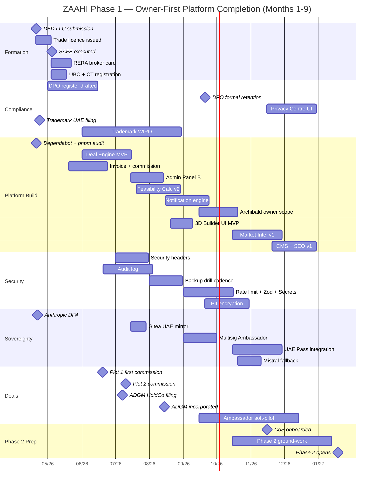

# MASTER TREE ENHANCEMENT PROPOSAL — Phase 1 Owner-First / Phase 2 External

## PREAMBLE — Recitals

**WHEREAS** ZAAHI is a real-estate operating system for the UAE market, operating the production platform `zaahi.io` (Dubai Mainland LLC — in formation) and an ADGM Platform HoldCo (to incorporate upon first closed Agency deal);

**WHEREAS** the canonical architecture is recorded in `docs/architecture/MASTER_TREE_final.md` — 85 sections, 12 blocks (A–L), unchanged by this document;

**WHEREAS** the founders and investor executed a Memorandum of Understanding in Al Jurf on Sunday 2026-04-19 establishing the commercial framework (80 / 10 / 10 pre-Sunset equity; 70 / 10 / 10 / 10 profit distribution; Sunset trigger AED 2 M cumulative Rudi distributions OR 5 years; full terms in `docs/investor-package/MOU_RUDI.md` + `TERM_SHEET.md`);

**WHEREAS** a research phase between 2026-04-19 and 2026-04-20 produced four advisory proposal documents — Safety (622 lines) · Sovereignty (574 lines) · Autonomy (593 lines) · Missing Branches (413 lines) — summarised in `MASTER_TREE_IMPROVEMENTS_SUMMARY.md`;

**WHEREAS** an audit cycle on 2026-04-20 → 2026-04-21 produced the deliverable set `docs/audit/*` (AUDIT_FINDINGS, VERIFICATION_LOG, QUALITY_CHECKLIST, CORRECTIONS_SUMMARY, INVESTOR_PACKAGE_ISSUES) correcting 28 findings + re-fixing 10 residuals + 3 Round-2 findings;

**WHEREAS** the owners on 2026-04-21 issued strategic guidance reshaping execution priority into **Phase 1 Owner-First (Months 1–9, dog-food first)** + **Phase 2 External (Month 10+, sequential participant onboarding)** — captured in `docs/audit/OPEN_QUESTIONS_FOR_OWNERS.md` with Part I + Part II answers received and Parts III / IV / V to be answered;

**NOW THEREFORE** the undersigned hereby ratify the approved, deferred, and rejected items set out below, authorise the budget and resource commitments specified, adopt the milestone, risk, and communication frameworks described, and execute this proposal as binding guidance for Y1–Y3 execution subject to the amendment procedure in §9.

---

## §1 RATIFICATION — What is approved and binding

Each approved item below includes the 8 attributes required by the top-0.1 % standard: **WHO** (responsible party) · **WHAT** (precise scope) · **WHEN** (target month, buffer noted) · **WHERE** (Master Tree section reference) · **WHY** (rationale + expected outcome) · **HOW** (execution path summary) · **HOW MUCH** (budget authorised in AED) · **HOW TO VERIFY** (success criterion). Source tag follows each item: `[RATIFIED — Q-X answer]` · `[DEFAULT APPLIED — Q-X pending]` · `[MOU BINDING]` · `[AUDIT-CORRECTED]`.

### §1.0 Master strategic frame

**Phase 1 (Months 1–9 · Apr 20 2026 → Jan 15 2027) = Platform completion to owner-first perfection + Agency commercial work in parallel.** Zero external platform users except the Q-13 soft-pilot (≤ 10 warm brokers Month 6-9). Agency Y1 AED 7.8 M revenue target unchanged (Dymo pipeline).
[RATIFIED — Preliminary decisions 1, 2, 3]

**Phase 2 (Month 10+ · Jan 18 2027 onward) = Sequential external-participant onboarding in this order: Brokers (Month 10) → Developers (Month 12) → Owners + Buyers (Month 14) → Ambassadors (Month 15) → Investors + Architects (Month 16) → Bank mortgage widget (Month 18).**
[RATIFIED — Q-3 C]

**Phase 2 opening trigger: hybrid.** Phase 2 opens Mon 2027-01-18 by default. A 2-of-3 founder motion filed before Month 9 end can extend the opening up to 2027-04-19 (Month 12 maximum).
[RATIFIED — Q-1 C]

**Phase 1 completion test: mixed.** "Complete" means **both** founder-attestation ("Zhan and Dymo both prefer zaahi.io over any alternative for every daily operational task") **and** the must-pass metric floor in Appendix H (Q-10 · all 13 non-negotiable §77 capabilities shipped as MVP v1, a subset polished to v2).
[RATIFIED — Q-2 D + Q-10 all 13]

### §1.A Safety improvements approved

Sourced from `docs/vision/MASTER_TREE_SAFETY_PROPOSALS.md`. Re-ranked per Q-14 D for owner-only threat model (2 founders, no external users Phase 1).

**S-1 · Audit log (append-only, tamper-evident).** [RATIFIED — Q-14 D, audit finding Safety-3]
- WHO: Zhan · WHAT: append-only `AuditLog` table + `logAudit()` helper + admin dashboard on every mutation (User / Parcel / Deal / Commission / Ambassador) · WHEN: Month 3-4 ship, complete Month 5 · WHERE: extends §82 Monitoring · WHY: ADGM DP 72-hour breach-notification table-stakes + forensic trail when first deal runs Month 3 · HOW: 2 engineer-weeks · HOW MUCH: AED 0 (internal) · HOW TO VERIFY: `pnpm test` `src/lib/audit.test.ts` passes + admin dashboard visible at `/admin/audit`.

**S-2 · Incident response runbook + on-call rotation + status page.** [RATIFIED — Q-14 D]
- WHO: Zhan + Dymo · WHAT: written SEV-1 / SEV-2 / SEV-3 playbook + rotation schedule + `status.zaahi.io` public status page · WHEN: Month 4 · WHERE: §82 Monitoring + §84 Data Privacy · WHY: first real SEV-1 costs 2× without runbook; ADGM + PDPL expect documented process · HOW: 1 engineer-week + 2 founder-days writing runbook · HOW MUCH: AED 12 000 / yr (status page SaaS) · HOW TO VERIFY: `docs/runbook/incident-response.md` committed + Statuspage.io subscription active.

**S-3 · Dependency scanning (Dependabot + pnpm audit in CI).** [RATIFIED — Q-14 D]
- WHO: Zhan · WHAT: Dependabot enabled on `ZaahiPlots/Zaahi` + `pnpm audit` required-check in CI · WHEN: Month 1 (Week 1 Day 1 eligible — zero-cost quick win) · WHERE: §83 CI/CD · WHY: supply-chain attacks top-3 proptech incident cause 2021–2025 · HOW: 2 engineer-days · HOW MUCH: AED 0 · HOW TO VERIFY: GitHub Dependabot PRs visible; CI workflow runs `pnpm audit --prod` on every PR.

**S-4 · Security headers + HSTS + CSP (report-only → enforce).** [RATIFIED — Q-14 D]
- WHO: Zhan · WHAT: `next.config.ts` security-header block + CSP report-only Month 3, enforce Month 5 after violations triaged · WHEN: Month 3 report-only, Month 5 enforce · WHERE: §84 Data Privacy · WHY: XSS / MITM / frame-injection vectors open without; every bank security questionnaire asks · HOW: 6 engineer-hours initial + 1 week monitoring · HOW MUCH: AED 0 · HOW TO VERIFY: securityheaders.com A+ rating on zaahi.io.

**S-5 · Backup strategy + monthly restore drill.** [RATIFIED — Q-14 D]
- WHO: Zhan · WHAT: daily `pg_dump` to UAE-resident object storage (Khazna / Etisalat) in addition to Supabase native backup · monthly drill: spin container, restore dump, run smoke tests · log in `DECISIONS.md` · WHEN: Month 4 initial + monthly thereafter · WHERE: §84 Data Privacy + Sovereignty §1.3 · WHY: single Supabase region outage = platform outage without off-site backup; `CLAUDE.md` explicitly forbids `prisma db push` but script could still misfire · HOW: 1 engineer-week initial + 4 founder-hours / month · HOW MUCH: AED 6 000 / yr storage + 0 labour · HOW TO VERIFY: monthly entry in `DECISIONS.md` with drill result; RTO ≤ 4 hours demonstrated.

**S-6 · PII application-level encryption.** [RATIFIED — Q-14 D]
- WHO: Zhan · WHAT: AES-256-GCM envelope-encryption helper (`src/lib/pii-encrypt.ts`); applied to 6 highest-sensitivity columns (Emirates ID, passport, source-of-funds, escrow routing, ambassador txHash, owner-contact-phone) · WHEN: Month 6-7 · WHERE: §84 Data Privacy · WHY: PDPL sensitive-data categories effectively require application-level encryption · HOW: 2 engineer-weeks + column migration + backfill · HOW MUCH: AED 0 · HOW TO VERIFY: Prisma schema shows `@@map` to encrypted columns; `pnpm test` asserts round-trip.

**S-7 · Rate limiting per route per tier.** [RATIFIED — Q-14 D]
- WHO: Zhan · WHAT: Upstash Redis rate limiter per route × tier (anon 60/min layers · authenticated 600/min layers · authenticated 50 chat/hr · authenticated 200 chat/hr ambassador · admin unlimited) · WHEN: Month 5-6 · WHERE: §84 Data Privacy · WHY: unauth scraper could exhaust layers bandwidth; authenticated malicious user could flood Archibald with AED 50–100 / day of Claude cost · HOW: 1 engineer-week · HOW MUCH: AED 6 000 / yr Upstash · HOW TO VERIFY: 429 responses logged on synthetic burst test.

**S-8 · Zod validation on every API route.** [RATIFIED — Q-14 D]
- WHO: Zhan · WHAT: every API route validates body / query / params via Zod schema; schema co-located with route; CI fails if any route missing schema · WHEN: Month 5-6 · WHERE: §63 Compliance + §84 Data Privacy · WHY: closes ORM-level SQL-injection defence; catches regressions · HOW: 2 engineer-weeks · HOW MUCH: AED 0 · HOW TO VERIFY: every file in `src/app/api/**/route.ts` contains `z.object()` or CI fails.

**S-9 · Secret management + Shamir wallet seed.** [RATIFIED — Q-14 D]
- WHO: Zhan · WHAT: Doppler or Infisical free tier for env-var secrets; Shamir secret-sharing for wallet seeds (3-of-5 shares held by Zhan + Dymo + Rudi counsel + founder attorney + safe-deposit) · WHEN: Month 5-6 · WHERE: §84 Data Privacy + Sovereignty §3.3 · WHY: single lost laptop = full compromise; wallet SPOF highest-dollar risk in org · HOW: 2 engineer-weeks + founder ceremony for seed split · HOW MUCH: AED 0 (free tier) · HOW TO VERIFY: Doppler / Infisical dashboard shows all secrets; Shamir ceremony memo in `docs/decisions/`.

**S-10 · PDPL compliance (split).** [RATIFIED — Q-15 B + Q-17 B]
- **S-10a Month 4–6 (Phase 1 legally-required floor):** DPO designation (Zhan drafts register Month 4-5, external DPO retained Month 6 at AED 10 k / mo) + Article 30-style Data Processing Register in `docs/compliance/data-processing-register.md` + privacy-by-design PR-review checklist.
- **S-10b Month 9 (pre-Phase-2 UX layer):** Privacy Centre at `/privacy-centre` (access / rectification / erasure / portability) + consent-management UI + right-to-deletion 30-day-grace flow.
- WHO: Zhan + retained DPO · WHERE: §84 Data Privacy · WHY: PDPL Article 18 breach-notification clock runs from Day 1 regardless of user count; Privacy Centre UI serves external users not yet present · HOW: 2-3 engineer-weeks compliance internals + 3 engineer-weeks UX · HOW MUCH: AED 70 000 Y1 DPO retainer (Month 6 start × 7 months) + Y2+ AED 120 000 / yr · HOW TO VERIFY: Data Processing Register committed Month 5; `/privacy-centre` live Month 9; DPO contact on `/privacy` page Month 6.

**§1.A Phase 1 Safety not ratified (deferred, see §2):** MFA + UAE Pass integration (S-11) · Passkeys / WebAuthn (S-12) · Privacy Centre external UX (subsumed into Phase 2 rollout).

### §1.B Sovereignty moves approved

Sourced from `docs/vision/MASTER_TREE_SOVEREIGNTY_PROPOSALS.md`. Re-sequenced per Q-16 (UAE Pass deferred to Month 7-8) + audit finding H-7 (multisig pulled forward to Month 5-6).

**SV-1 · Anthropic zero-retention DPA.** [RATIFIED — MOU BINDING + AUDIT-CORRECTED]
- WHO: Zhan · WHAT: email Anthropic enterprise sales requesting zero-retention DPA; update Archibald API config to emit zero-retention header · WHEN: Day 2 (Tue Apr 21 2026) initiate; signed within 7 business days · WHERE: §41 AI / §84 Data Privacy · WHY: free; closes #1 P0 sovereignty item; blocks PDPL-sensitive Archibald use without · HOW: 4 founder-hours + ≤ 1 engineer-day for header verification · HOW MUCH: AED 0 · HOW TO VERIFY: signed DPA filed in `docs/legal/anthropic-dpa.pdf`; API call emitting `anthropic-zero-retention: true` header visible in logs.

**SV-2 · Trademark registration UAE + WIPO.** [RATIFIED — AUDIT-CORRECTED M-4]
- WHO: Zhan + chosen IP counsel (Rouse / AJA / Dennemeyer — 3 quotes Week 1 Day 4 per IMPLEMENTATION_CHECKLIST) · WHAT: ZAAHI / Zaahi in UAE Class 9 / 36 / 41 / 42 + WIPO Madrid Protocol extension · WHEN: UAE MoE filing Thu Apr 23 (Day 4); WIPO filing after UAE receipt ~Month 2; examination 2–4 months UAE + 12–18 months WIPO · WHERE: Sovereignty §7.1 · WHY: every month of delay = squatter risk; priority date from filing · HOW: counsel-led; founder review drafts · HOW MUCH: **AED 130 – 160 k** (UAE 80 – 100 k + WIPO Madrid 50 – 60 k) — mid-tier IP counsel 2026 quotes · HOW TO VERIFY: UAE MoE submission acknowledgement; WIPO Madrid tracking number.

**SV-3 · Gitea UAE mirror of GitHub repo.** [RATIFIED — Q-14 D]
- WHO: Zhan · WHAT: Gitea instance on UAE-resident VM mirrors `ZaahiPlots/Zaahi`; hourly push · WHEN: Month 4 · WHERE: Sovereignty §6.1 · WHY: cheapest-per-risk sovereignty move; insulates against GitHub outage / sanction / policy shift · HOW: 1 engineer-week + VM provisioning · HOW MUCH: AED 1 200 / yr VM (Etisalat / Khazna) · HOW TO VERIFY: commit on GitHub appears on Gitea UAE mirror within 1 hour.

**SV-4 · Mistral fallback AI provider + provider abstraction.** [RATIFIED — Q-20 B dependency]
- WHO: Zhan · WHAT: `src/lib/ai-provider.ts` abstraction layer; Mistral Large 2 as fallback when Anthropic rate-limits / errors / sanctions · WHEN: Month 7-8 · WHERE: Sovereignty §5.1 · WHY: single-provider concentration risk · HOW: 2 engineer-weeks · HOW MUCH: AED 40 – 80 k / yr inference · HOW TO VERIFY: forced-failure test against Anthropic endpoint → requests served by Mistral fallback.

**SV-5 · Defensive publication of ZAAHI Signature algorithm.** [RATIFIED — Q-9 A]
- WHO: Zhan + IP counsel · WHAT: 10-page technical description of ZAAHI Signature 3-tier building algorithm (`scaleRingFromCentroid`, `computeSetbackM`, `insetRingByMeters`, podium / body / crown construction) published via IP.com Prior Art Database · WHEN: Month 5-6 · WHERE: Sovereignty §7.3 · WHY: blocks competitors from patenting our own tech · HOW: 2 engineer-weeks writing + AED 10 k IP.com filing fee · HOW MUCH: AED 10 000 · HOW TO VERIFY: IP.com PAD identifier filed; citation-ready URL.

**SV-6 · UAE Pass integration (deferred Month 7-8).** [RATIFIED — Q-16 B]
- WHO: Zhan · WHAT: OIDC flow; government-verified identity for Platform (not founder-only use since founders don't need it) · WHEN: Month 7 onboarding application, integration Month 7-8, live Month 8-9 ready for Phase 2 open · WHERE: Sovereignty §4.1 + Safety §2.1 · WHY: every DLD / RERA / TAMM / ADGM MOU requires it; gates Phase 2 external-user KYC (Q-33) · HOW: 4 engineer-weeks + Tamm / ICP partnership application · HOW MUCH: AED 5 – 15 k setup + integration fee · HOW TO VERIFY: test user completes sign-in via UAE Pass at staging `/auth/uae-pass-test`.

**SV-7 · Multisig Ambassador treasury migration.** [RATIFIED — AUDIT-CORRECTED H-7]
- WHO: Zhan · WHAT: Gnosis Safe 2-of-3 multisig (signers: Zhan + Dymo + Rudi counsel); USDT TRC-20 wallet address changes from single-sig `TELiibGkn3sg4EVzGYczzj2kkiAVfVN4j7` to multisig wallet · WHEN: Month 5-6 (BEFORE Ambassador treasury crosses AED 500 k watermark; soft-pilot Q-13 means this is operationally ready before pilot brokers onboard) · WHERE: Sovereignty §3.3 Phase 3 · HOW: 3 engineer-weeks + founder ceremony + smart-contract audit · HOW MUCH: AED 10 000 (legal + audit + gas) · HOW TO VERIFY: multisig wallet address published on `/join` page; signature ceremony memo filed.

**SV-8 · UAE colocation for backups (Phase 2 prep).** [DEFAULT APPLIED — Q-27 pending]
- Timing deferred to Month 9-10 to unblock Phase 2 bank / government partnership conversations. Cost AED 15 k one-time + AED 60 – 100 k / yr (Khazna / Etisalat object storage). Referenced in §1.A S-5.

**§1.B Sovereignty not ratified Phase 1 (deferred, see §2):** Passkeys (SV-9) · Local LLM production routing (SV-10) · Network International payment gateway (SV-11) · Patent PCT filing (SV-12) · Equinix DX1 hardware migration (SV-13, Year 2).

### §1.C Autonomy wins approved

Sourced from `docs/vision/MASTER_TREE_AUTONOMY_PROPOSALS.md`. Scoped to owner-tool usage per Q-20 (no BANT buyer-qualification flow Phase 1 since no external leads).

**AU-1 · Archibald owner-tool scope (Phase 1).** [RATIFIED — Q-20 B]
- WHO: Zhan · WHAT: Archibald capabilities for founder use only: content generation (blog / case study / market report drafts) + research assistant (summarise document, extract data) + Feasibility Calculator explanations (walk client through calc output in 6 languages) · WHEN: Month 6-7 (priority 8 per Q-11) · WHERE: §41 AI · WHY: owner leverage multiplier; skip BANT since no external leads Phase 1 · HOW: 2 engineer-weeks (multilingual prompts + internal tooling UI) · HOW MUCH: AED 0 additional (existing Claude API usage) · HOW TO VERIFY: Zhan + Dymo each use Archibald ≥ 3× / week on non-chat tasks.

**AU-2 · Feasibility Calculator v2.** [RATIFIED — Q-21 A]
- WHO: Zhan · WHAT: v2 inputs (plot area · GFA ratio · setbacks from affection plan · floor count · saleable ratio · build cost / sqft · sell price / sqft · finance cost · timeline months) + v2 outputs (total cost · total revenue · gross margin · IRR · break-even floor count · ±20 % sensitivity band · PDF export) · WHEN: Month 4-5 (priority 4 per Q-11) · WHERE: §58 Feasibility Calculator · WHY: Dymo's AED 1.2 M commission-per-floor-deal depends on credible real-time feasibility in client meeting · HOW: 2-3 engineer-weeks · HOW MUCH: AED 0 (pure computation + UI) · HOW TO VERIFY: Dymo can demo full flow on iPad in < 2 minutes at client meeting.

**AU-3 · Invoice + commission tracker.** [RATIFIED — Q-11 priority 2]
- WHO: Zhan · WHAT: Tax-Invoice (TRN-ready, PCD-compliant, VAT 5 %) generation + commission ledger per deal + Ambassador downline-walker payouts · WHEN: **MUST SHIP BEFORE MONTH 3 (first commission)** — Month 2-3 ship · WHERE: §03 Transactions + §32 Escrow + §18 Ambassador · WHY: first AED 790 k commission lands Fri Jun 19 2026; no ad-hoc Excel workaround · HOW: 2 engineer-weeks · HOW MUCH: AED 0 · HOW TO VERIFY: Invoice # 0001 issued from live system on first commission; matches Agency bank settlement amount.

**AU-4 · Notification engine (owner-configurable rules).** [RATIFIED — Q-11 priority 6]
- WHO: Zhan · WHAT: Resend (email) + Twilio (SMS) + WhatsApp Business + Telegram-bot channels; owner configures rules per entity (Deal state change · new lead · ambassador signup · commission paid · audit anomaly) · WHEN: Month 5-6 · WHERE: §47 Notification Engine · WHY: reduces daily WhatsApp / email churn; lets founder define "what wakes me up" · HOW: 2 engineer-weeks · HOW MUCH: Resend AED 1 k / yr + Twilio variable (~AED 3-5 k / yr owner-use pace) · HOW TO VERIFY: Zhan toggles "deal status → email" rule on; creating test deal fires email within 60 s.

**AU-5 · Market Intelligence v1 (owner view).** [RATIFIED — Q-11 priority 9]
- WHO: Zhan · WHAT: DLD public transaction API nightly pull → local Postgres mirror → plot-level comps overlay on `/parcels/[id]` · WHEN: Month 7-8 · WHERE: §66 Market Intelligence · WHY: every Dymo negotiation ends with "what did neighbours actually pay?" — closing objection in seconds vs. 2 hours of Excel · HOW: 3 engineer-weeks · HOW MUCH: AED 0 (public DLD API) · HOW TO VERIFY: Plot 1 Jumeirah Bay detail page shows last-12-months comps within 1 km.

**AU-6 · Content descriptions 6-lang.** [DEFAULT APPLIED — Q-9 A, aligned with Q-20]
- WHO: Zhan + Dymo · WHAT: parcel / deal / market-report content auto-translated EN / AR / RU / UK / SQ / FR via Claude Sonnet through `src/lib/translate.ts` · WHEN: Month 8 (after Archibald owner-tool scope AU-1) · WHERE: §49 Translation · WHY: multilingual content moat Phase 2 ready; Dymo's Russian-speaking HNWI pipeline · HOW: 2 engineer-weeks · HOW MUCH: AED 0 additional Claude cost at owner pace · HOW TO VERIFY: any parcel detail page displays EN + RU + AR at language-switch.

**AU-7 · Dependabot auto-deps (dual with S-3).** [RATIFIED — cross-ref S-3]
- Same as S-3. AED 0 · Month 1.

**§1.C Autonomy deferred Phase 2 (external-facing):** Support chatbot (needs external users) · Buyer qualification BANT (needs inbound leads) · Lead routing (needs multi-agent team) · Broker vetting auto-verify (needs external broker signup) · Auto-detect new developments (needs Planet Labs contract, Q3 2027) · Pricing suggestion (owner-advisory version may ship Phase 1 as part of AU-5).

### §1.D Missing Branches approved

Sourced from `docs/vision/MASTER_TREE_MISSING_BRANCHES.md`. **All 5 Top-ranked Missing Branches are DEFERRED to Phase 2 / Phase 3 execution** (see §2). The following architectural commitment is ratified Phase 1:

**MB-1 · v3.1 Master Tree extension workstream — architectural research only.** [RATIFIED — IMPROVEMENTS_SUMMARY §7]
- WHO: Zhan + (Chief of Staff from Month 8 per Q-18) · WHAT: research + architecture docs for the 5 Top Missing Branches (After-sale / PM · Cross-border · ZAAHI Academy · Secondary / Distressed · ESG) — each a 5–10 page architecture brief scoped, not built · WHEN: Q3 2026 onward (Month 6+, CoS arrives Month 8) · WHERE: future `docs/architecture/MASTER_TREE_v3.1_*` files · WHY: research-and-architecture commitment, not engineering build; positions for Phase 3 execution · HOW: 2–3 founder-weeks / branch; 60-day commitment per branch · HOW MUCH: AED 0 (founder time) · HOW TO VERIFY: `docs/architecture/MASTER_TREE_v3.1_after_sale.md` drafted by Month 12; remaining 4 by Month 18.

**MB-2 · Journey maps (§10, cheap lift).** [RATIFIED — Q-9 A scope + Q-20 B dependency]
- WHO: Dymo + (CoS from Month 8) · WHAT: explicit user-journey maps for Developer · Investor · Owner · Tenant · Broker; markdown tables in `docs/journeys/` · WHEN: Month 6-9 · WHERE: extends §10 Users · WHY: needed for Phase 2 onboarding wizard design (Q-32); documents Phase 1 owner-side flows too · HOW: 1 week per journey; 5 journeys over 5 months · HOW MUCH: AED 0 · HOW TO VERIFY: 5 markdown files in `docs/journeys/` committed by Month 9.

### §1.E Master Tree v3.1 extensions approved

The following Master Tree sections ship as owner-first Phase 1 builds (expanding existing canonical sections; not amending §1-§85):

**E-1 · §77 Web Platform (owner-first completeness).** [RATIFIED — Q-9 A + Q-10 all 13 + Q-11 ranking]
- Owner-side must-pass capabilities per Q-10: full parcel CRUD · Deal Engine state machine · Feasibility Calc v2 · Archibald AI · 3D rendering pipeline · DLD comps overlay · broker pipeline tracking · notification engine · content management · admin CRUD · invoice / commission tracker · audit log dashboard · configuration panel. All ship as MVP v1 Phase 1; subset polished to v2 by Phase 2 open.
- Priority ranking per Q-11: see Appendix H (13-item ordered list).
- WHEN: Months 3 – 9 (priority 1 = Month 3 ship · priority 13 = Month 9 tail).
- HOW MUCH: AED 0 marginal (Zhan's existing capacity; no new hires Phase 1 except CoS at Month 8).
- HOW TO VERIFY: Q-2 D completion test (founder attestation + 13 capability floor).

**E-2 · §75 Admin Panel (pragmatic B).** [RATIFIED — Q-12 B]
- WHO: Zhan · WHAT: CRUD forms for 5 core entities (User, Parcel, Deal, Ambassador, Commission) + feature-flag toggle UI (Archibald on / off · Ambassador signup open / closed · tier gating on / off) + tier-price editor · WHEN: Month 4 (priority 3 per Q-11) · WHERE: §75 Admin · WHY: self-service moat; no env-var edits for price / toggle changes · HOW: 3-4 engineer-weeks · HOW MUCH: AED 0 · HOW TO VERIFY: Zhan changes Gold tier from AED 5 k → AED 7 k via UI; database reflects change; live signup form shows new price within 30 s.

**E-3 · §17 Broker (owner-side dashboard Phase 1).** [RATIFIED — Q-9 A]
- Owner-side = Dymo managing his own deals (pipeline, viewings, offers, closings). External broker signup is Phase 2 (§17/§18 combined). Priority 11 per Q-11 ranking — time permits.

**E-4 · §31 Deal Engine (MVP Phase 1).** [RATIFIED — Q-22 B]
- WHO: Zhan · WHAT: 5 core states (Initiated · Form F Signed · NOC Received · DLD Submitted · Commission Received) · manual transitions · no auto-notifications v1; polish to 10 states + auto-notifications v2 Months 5-6 · WHEN: MVP Month 3-4 (priority 1 per Q-11); v2 polish Month 5-6 · WHERE: §31 Deal Engine · WHY: Plot 1 closes Month 3 — system must support it from day 1 · HOW: MVP 1-2 engineer-weeks; v2 2-3 engineer-weeks · HOW MUCH: AED 0 · HOW TO VERIFY: Plot 1 deal transitioned through 5 states in production; `Deal.status` accurate.

**E-5 · §48 Long-tail SEO.** [DEFAULT APPLIED — Q-9 A priority 10 per Q-11]
- Shipping deprioritised to Month 8 (priority 10). Scope: per-plot dynamic route + schema.org JSON-LD + sitemap.xml + hreflang EN / AR / RU / UK / SQ / FR. Phase 1 rationale: indexable for external search engines ahead of Phase 2 open. Cost AED 0. 2 engineer-weeks.

**E-6 · §35 3D Builder UI (MVP Phase 1).** [RATIFIED — Q-23 B]
- WHO: Zhan · WHAT: upload PDF affection-plan + text fields for price / land-use / GFA / setbacks; Zhan scripts 3D externally. Full 3D Builder UI is Phase 2 for external owners. · WHEN: Month 5-6 · WHERE: §35 parcels / 3D · WHY: unblocks Dymo from emailing scripts to Zhan · HOW: 1 engineer-week · HOW MUCH: AED 0 · HOW TO VERIFY: Dymo adds new parcel via UI; record appears in database within 5 minutes; Zhan can run post-hoc script to generate 3D.

**E-7 · Content Management System (CMS).** [RATIFIED — Q-11 priority 10]
- WHO: Zhan + Dymo + videographer · WHAT: founder publishes blog / case study / market report without deploy · stored as markdown in Supabase storage or Prisma · server-rendered pages at `/blog/[slug]` · WHEN: Month 8 · WHERE: §48 Content / SEO · WHY: videographer content pipeline requires this; CMS completeness is Q-10 capability (i) · HOW: 2 engineer-weeks · HOW MUCH: AED 0 · HOW TO VERIFY: Dymo publishes 1 post without Zhan's involvement.

### §1.F Ambassador program Phase 1 posture

**AMB-1 · Soft pilot 5–10 warm brokers Month 6–9.** [RATIFIED — Q-13 B + Q-4 B]
- WHO: Dymo (hand-pick from network) + Zhan (infra) · WHAT: ≤ 10 warm brokers at Gold tier (AED 5 k USDT lifetime) invited by Dymo only; no marketing; tests downline walker + payout flow · WHEN: Month 6-9 · WHERE: §18 Ambassador · WHY: validates onboarding + payout with low support load before Phase 2 open; Y1 revenue ≈ AED 50 k · HOW: no additional build; uses existing §18 Ambassador implementation · HOW MUCH: AED 0 cost · AED 50 k revenue · HOW TO VERIFY: pilot cohort of 5–10 registered; downline walker fires correctly on at least 1 test deal; payout mechanism proven.

**Excluded from AMB-1 Phase 1:** external signup via `/join` public page · paid marketing · referral link amplification · public ambassador leaderboard publication. All deferred to Phase 2 Month 15 per Q-3 C staged sequence.

---

## §2 DEFERRED — What is postponed and when re-considered

| ID | Item | Deferred to | Trigger for re-consideration | Budget placeholder | Review date |
|:-:|---|:-:|---|---:|:-:|
| D-1 | MFA + UAE Pass external users | Month 7-8 | UAE Pass gov partnership application ready + first external role nearing onboarding | AED 5 – 15 k setup (in SV-6 budget) | Month 7 monthly review |
| D-2 | Passkeys / WebAuthn | Phase 2 Month 10-12 | UAE Pass live + first 100 external users | AED 0 · 3 engineer-weeks | Month 10 |
| D-3 | Privacy Centre UI | Month 9 | Phase 2 open imminent | AED 0 · 3 engineer-weeks (in S-10b) | Month 9 |
| D-4 | Support chatbot v1 | Phase 2 Month 10-11 | First 50+ external users onboarded | AED 0 · 3 engineer-weeks | Month 10 |
| D-5 | Buyer qualification BANT flow | Phase 2 Month 14 (when Buyers open) | Buyers external role active | AED 0 · 4 engineer-weeks | Month 14 |
| D-6 | Lead routing agent | Phase 2 | 3+ agents active | AED 0 · 1 engineer-week | Phase 2 |
| D-7 | Broker vetting auto-verify | Phase 2 Month 10 (when Brokers open) | First broker external signup | AED 0 · 2 engineer-weeks + Tronscan / RERA scrape | Month 10 |
| D-8 | Auto-detect new developments (satellite) | Phase 3 Q3 2027 | Planet Labs contract signed | AED 60 k / yr satellite · 4 engineer-weeks | Q3 2027 |
| D-9 | Local LLM production routing (Qwen / Llama) | Phase 3 Q4 2026 – Q1 2027 | AI inference cost > AED 200 k / yr | AED 35 k setup + AED 20 k / yr | Q4 2026 |
| D-10 | Network International payment gateway | Phase 2 | Tier subscription scales require GMV capture | AED 5 k onboarding · ~1.5 % GMV | Phase 2 |
| D-11 | Equinix DX1 hardware migration | Phase 3 Q3 2027 | Y2 end + AED 600–800 k CapEx approved | AED 600 – 800 k CapEx · AED 150 k / yr OpEx | Q2 2027 |
| D-12 | Patent PCT filing | Year 2 Q4 2026 – Q2 2027 | Platform Series A preparation active | AED 120 – 200 k · 1 filing | Q4 2026 |
| D-13 | Fine-tune ZAAHI-RE-v1 model | Q1 2027 | 5 000+ Archibald interactions accumulated | AED 80 – 120 k · 6 engineer-weeks | Q1 2027 |
| D-14 | Mortgage pre-approval widget (§22) | Phase 2 Month 18 | ENBD / ADCB MOU signed | AED 0 · 10 – 16 weeks post-MOU | Month 14 |
| D-15 | Plot-level tokenisation pilot (§35 / VARA) | Phase 3 Q1 2027 | DLD sandbox acceptance + smart-contract audit | AED 50 – 150 k legal · AED 0 build | Q4 2026 |
| D-16 | After-sale / Property Management build (Missing §5) | Phase 3 Q1 2027 onward | v3.1 architecture memo complete (MB-1) | 30+ engineer-weeks · AED 15–40 M Y5 revenue potential | Q1 2027 |
| D-17 | Cross-border branch build (Missing §7) | Phase 3 Q2 2027 | v3.1 architecture memo complete (MB-1) | 15 engineer-weeks · AED 10–25 M Y5 revenue | Q2 2027 |
| D-18 | ZAAHI Academy launch (Missing §3) | Phase 3 Q3-Q4 2027 | DREI partnership preliminary + first 30 waitlist | AED 120 k content production | Q3 2027 |
| D-19 | Secondary / Distressed consolidation (Missing §6) | Phase 3 2028 | Agency Y2 revenue > AED 15 M | Medium editorial + partnership · AED 5–20 M Y5 revenue | 2028 |
| D-20 | ESG / Sustainability expansion (Missing §2) | Phase 3 2028 | First foreign-capital LP requires ESG mandate | 10 engineer-weeks + data science | 2028 |

---

## §3 REJECTED — What is not in scope, with rationale

| ID | Item | Rejected reason | What would change decision |
|:-:|---|---|---|
| R-1 | Full CoS-centric admin panel (Q-12 C) | 3 extra engineer-weeks for audit-browser + impersonation used <5 % of the time; diminishing return at Phase 1 2-founder scale | Team > 5 people, audit browser becomes material |
| R-2 | A-ranked Phase 2 Ambassador posture (Q-13 D) | Breaks Phase 1 Owner-First discipline (external participants open Month 10); revenue uplift AED 200 k not worth support-load risk pre-§77 complete | — |
| R-3 | Full §77 parity checklist against Bayut / PF / Huspy (Q-2 A) | Feature-parity with scale portals is premature; ZAAHI's moat is plot-centric graph not listing breadth | External users > 10 k MAU, need feature parity to compete |
| R-4 | A-ranked full safety sprint including Privacy Centre UI Month 4 (Q-14 A) | No external data subjects Phase 1; UX layer wasted effort before users | If Phase 2 pulled forward |
| R-5 | C-ranked Phase 2 Platform launch marketing AED 500 k – 1 M (Q-28 C) | Unnecessary spend for Month 10 open; Dymo organic network carries first 100 users | Agency Y1 revenue > AED 15 M (AED 1 M ad budget becomes 6 % of rev) |
| R-6 | Skip Chief of Staff entirely (Q-18 D) | Burnout risk at exactly the wrong moment (Phase 1 → Phase 2 transition) | — |
| R-7 | Per-role onboarding wizards 6× polished (Q-32 A) | 12 engineer-weeks; generic branching wizard delivers 80 % UX at 30 % cost | — |
| R-8 | Independent Community Manager hire Month 10 (Q-30 direct hire Day 1) | Volume not measurable yet; Archibald + CoS absorb first 3 months | External users > 500 MAU |

---

## §4 BUDGET AUTHORIZATION

### §4.1 Tranche-based 24-month authorization [DEFAULT APPLIED — Q-34 C pending]

Total 24-month enhancement budget **AED 2.6 – 3.8 M** (per `MASTER_TREE_IMPROVEMENTS_SUMMARY.md` §6.3, aligned with audit-corrected numbers). Authorised in two tranches re-approved annually:

| Tranche | Period | Amount | Re-approval event |
|:-:|---|---:|---|
| **Y1** | Apr 20 2026 → Apr 19 2027 | **AED 1.5 M** | First anniversary Board meeting Mon 2027-04-19 |
| **Y2** | Apr 20 2027 → Apr 19 2028 | **AED 1.3 – 2.3 M** | Second anniversary Board meeting Mon 2028-04-17 (nearest business day) |

### §4.2 Founder spending authority [DEFAULT APPLIED — Q-35 B pending]

- **Below AED 100 000 single spend AND below AED 500 000 running monthly:** Zhan / Dymo jointly decide (no Rudi pre-approval needed).
- **Above AED 100 000 single spend OR above AED 500 000 running monthly:** require Rudi written pre-approval (48-hour notice; email sufficient).
- **Emergency bridge (< AED 250 000) if operational continuity at risk:** founder may deploy; notify Rudi within 24 hours.

### §4.3 Y1 authorized line-items (AED 1 500 000)

| Category | Line item | AED | Source |
|---|---|---:|---|
| Compliance | DPO retainer Month 6–12 (7 mo × AED 10 k) | 70 000 | S-10 · Q-17 B |
| IP | Trademark UAE + WIPO (one-time) | 130 000 – 160 000 | SV-2 · AUDIT M-4 |
| IP | Defensive publication | 10 000 | SV-5 |
| IP | Trade-secret + NDA framework + Copyright bundle | 8 000 | Sovereignty §7.4, §7.5 |
| Security | Bug bounty setup + Y1 bounties | 35 000 | Safety §3.5 |
| Security | First-year pen test | 80 000 | Safety §3.5 |
| Legal | BSA Tier A + B one-time + retainer Y1 | 150 000 | POST_MEETING + MOU |
| Financial | Transfer pricing study (Big 4) | 120 000 | Safety §5.4 |
| Financial | Accounting / bookkeeping / CT compliance | 60 000 | Phase 1 budget |
| Ops | Videographer retainer (Y1, AED 10 k × 12) | 120 000 | LAUNCH_PLAN + Q-19 A |
| Ops | Al Jurf operational HQ (Y1 per LAUNCH_PLAN) | 250 000 | AUDIT C-4 |
| Infra | Gitea UAE VM + misc sovereignty setup | 6 000 | SV-3 |
| Infra | Status page + rate-limiter + backup storage | 24 000 | S-2, S-5, S-7 |
| Ops | Virtual office + software + comms | 70 000 | AUDIT C-4 |
| Contingency | Reserve (flex) | 167 000 | Standard 11 % reserve |
| **TOTAL Y1** | | **~AED 1 300 000 – 1 500 000** | — |

Ties to `docs/roadmap/MASTER_IMPLEMENTATION_PLAN.md` Appendix B Y1 opex AED 1.29 M (audit-corrected).

### §4.4 Y2 authorized line-items (range AED 1 300 000 – 2 300 000)

| Category | Line item | AED | Source |
|---|---|---:|---|
| Compliance | DPO retainer Y2 (12 mo × AED 10 k) | 120 000 | S-10 |
| Security | Pen test Y2 + remediation | 120 000 | Safety §3.5 |
| Sovereignty | Mistral inference + Local LLM GPU | 65 000 | SV-4, D-9 |
| Sovereignty | Khazna backup storage + UAE colocation | 80 000 | S-5, SV-8 |
| Sovereignty | Equinix DX1 hardware CapEx (if triggered) | 600 000 – 800 000 | D-11 |
| Compliance | Privacy counsel quarterly + legal retainer | 100 000 | Standard |
| Ops | Al Jurf HQ + videographer + ops continuing | 370 000 | LAUNCH_PLAN Y2 |
| Ops | Chief of Staff (Month 8+ continued) | 360 000 – 540 000 | Q-18 + AUDIT M-9 |
| IP | PCT filing (if triggered) | 120 000 – 200 000 | D-12 |
| Fine-tune | ZAAHI-RE-v1 | 80 000 – 120 000 | D-13 |
| Partnership | LeadingRE + DLD sandbox fees | 50 000 – 100 000 | Phase 2 prep |
| Marketing | Phase 2 launch marketing (Q-28 B default) | 100 000 – 200 000 | Q-28 B |
| Contingency | Reserve | 200 000 | Standard |
| **TOTAL Y2 (with Equinix)** | | **~AED 2 300 000** | — |
| **TOTAL Y2 (without Equinix)** | | **~AED 1 300 000** | — |

### §4.5 Emergency bridge provisions

If Agency Y1 commissions underperform (< AED 3 M by Month 6, approximately 40 % of base case), founders may convene a Board meeting within 14 days to request emergency bridge capital. Rudi is not obligated to provide additional capital; SAFE + MOU terms remain as signed. Bridge options discussed in §7 Risk 5.

---

## §5 RESOURCE COMMITMENTS

### §5.1 Founder time allocation (binding)

Per `MASTER_IMPLEMENTATION_PLAN.md` §6.1:

**Zhan (Founder / CEO / CTO, full-time).**

| Phase | Strategic | Engineering | Admin / Finance | Deal support |
|:-:|:-:|:-:|:-:|:-:|
| Phase 1 (Months 1–9) | 30 % | 15 % (owner-first tooling) | 35 % (formation + legal + bank) | 20 % |
| Phase 2 (Months 10–18) | 15 % | 65 % (external onboarding) | 10 % | 10 % |
| Phase 3 (Months 19–24) | 25 % | 50 % (scale infra) | 10 % | 15 % |

**Dymo (Co-founder / Ops Principal / Ambassador, full-time).**

| Phase | BD / Sales | Content / Brand | Operations | Partnerships |
|:-:|:-:|:-:|:-:|:-:|
| Phase 1 (Months 1–9) | 60 % | 10 % | 20 % | 10 % (bank warm-up late-Phase-1) |
| Phase 2 (Months 10–18) | 40 % | 15 % | 20 % | 25 % |
| Phase 3 (Months 19–24) | 35 % | 20 % | 15 % | 30 % |

### §5.2 Hire triggers (binding)

| Role | Trigger | Expected month | Budget authorised |
|---|---|:-:|---|
| Videographer | Day 1 (already active) | Month 1 | AED 10 k / mo (ratified) |
| Chief of Staff / Head of Product | **Month 8-9 calendar OR 2nd Agency deal closes, whichever first** | Month 8 | AED 30 – 45 k / mo (Dubai market rate; AUDIT M-9 corrected) [RATIFIED — Q-18 modified] |
| External DPO retainer | Month 6 formalisation trigger | Month 6 | AED 10 k / mo (AED 120 k / yr) [RATIFIED — Q-17 B] |
| 2nd engineer | Platform Dev Fund ≥ AED 1 M AND Zhan at 80 % capacity | Month 10–12 expected | AED 300 – 480 k / yr |
| 3rd Dubai agent | Agency pipeline > 10 active AND Dymo at 90 % capacity | Month 9-12 expected | AED 180 k base + commission split |
| Community Manager | 50+ external Gold ambassadors active OR support volume > 100 tickets / month | Month 12+ expected | AED 180 k / yr [DEFAULT — Q-30 B pending] |
| Abu Dhabi agent | Abu Dhabi licence active | Month 18-24 expected | AED 180 k base + commission |

### §5.3 Compensation framework (binding)

Founder equity + vesting per MOU (unchanged):
- Rudi 80 % (pre-Sunset) · Dymo 10 % · Zhan 10 %.
- Sunset auto-rebalance to 33.34 / 33.33 / 33.33 on earlier of (a) AED 2 M cumulative Rudi distributions OR (b) 5 years.
- Founder vesting: 2-year with 6-month cliff (Dymo + Zhan); Rudi fully vested.
- Profit distribution 70 % Platform Dev Fund / 10 % Rudi / 10 % Dymo / 10 % Zhan — perpetual, pre- and post-Sunset. [RATIFIED — MOU BINDING + DEFAULT APPLIED Q-37 A pending]

---

## §6 MILESTONE TRACKING

### §6.1 Phase 1 milestones (Months 1–9, Apr 20 2026 → Jan 15 2027)

| # | Milestone | Target date | Owner | Success criterion |
|:-:|---|:-:|:-:|---|
| M1 | Dubai Mainland LLC registered | Mon May 11 2026 (Week 4) | Zhan + BSA | Trade licence issued |
| M2 | SAFE executed + AED 1 M wired | Mon May 4 – Thu May 7 | Rudi + BSA | Funds in digital-first bank |
| M3 | RERA broker card for Dymo | Thu May 7 – Fri May 22 | Dymo | BRN linked, Trakheesi active |
| M4 | Invoice + commission tracker live | Month 2-3 | Zhan | First commission flows through system |
| M5 | Deal Engine MVP live | Month 3-4 | Zhan | Plot 1 transitions through 5 states |
| M6 | First commission received (Plot 1) | Fri Jun 19 2026 (Week 9) | Dymo + Zhan | AED 790 k in Agency bank |
| M7 | Feasibility Calculator v2 live | Month 4-5 | Zhan | Dymo demos on iPad < 2 min |
| M8 | Admin Panel Pragmatic B live | Month 4 | Zhan | Feature toggle + tier editor |
| M9 | ADGM HoldCo incorporation filing initiated | Tue Jul 7 2026 | BSA | RA submission acknowledgement |
| M10 | ADGM HoldCo incorporated | Fri Aug 14 2026 (2–6 wk range) | BSA | RA issuance letter |
| M11 | Data Processing Register + DPO retained | Month 5-6 | Zhan + DPO | `docs/compliance/data-processing-register.md` committed; DPO contact on `/privacy` |
| M12 | Multisig Ambassador treasury live | Month 5-6 | Zhan | Gnosis Safe 2-of-3 wallet on Tron; public address updated |
| M13 | Ambassador soft-pilot launched (5-10 warm brokers) | Month 6-9 | Dymo | 5+ Gold ambassadors with verified USDT tx |
| M14 | Market Intel v1 (DLD comps overlay) live | Month 7-8 | Zhan | Plot pages show neighbour comps |
| M15 | UAE Pass integration live | Month 8-9 | Zhan | Test user signs in via UAE Pass |
| M16 | Chief of Staff onboarded | Month 8-9 (Q-18 trigger) | Rudi + founders | CoS signed offer + Day 30 performance check |
| M17 | Privacy Centre UI live (S-10b) | Month 9 | Zhan | `/privacy-centre` self-service access / rectification / erasure / portability |
| M18 | CMS + SEO v1 + Gitea mirror | Month 8-9 | Zhan | Dymo publishes blog post without Zhan; sitemap visible |
| M19 | Q-2 D completion test: founder attestation | End Month 9 | Zhan + Dymo | Signed attestation in `DECISIONS.md` |
| M20 | Phase 2 opening decision filed | End Month 9 | All 3 | Either Phase 2 opens Mon Jan 18 2027 OR 2-of-3 delay motion with target date (Month 10-12) |

### §6.2 Phase 2 milestones (Months 10–18, Jan 18 2027 → Oct 15 2027)

| # | Milestone | Target date | Owner |
|:-:|---|:-:|:-:|
| M21 | Brokers external onboarding opens | Mon Jan 18 2027 (or delay) | Zhan + Dymo |
| M22 | Developers tier opens | Mar 2027 | Dymo |
| M23 | Owners + Buyers self-listing opens | May 2027 | Zhan |
| M24 | Ambassadors (full launch) | Jun 2027 | Dymo |
| M25 | Investors + Architects tiers open | Jul 2027 | Dymo |
| M26 | Bank mortgage widget live | Oct 2027 | Zhan + Dymo |

### §6.3 Phase 3 milestones (Months 19–24, Nov 2027 → Apr 2028)

Per `MASTER_IMPLEMENTATION_PLAN.md` §4 — unchanged by this document: Platform public GA launch · first tokenised plot · Equinix DX1 migration · Series A preparation.

### §6.4 KPI framework

| KPI | Frequency | Target Y1 | Target Y2 | Red flag |
|---|:-:|---|---|---|
| Agency deals closed | Monthly | 12 plots + 2 floors | 25 | < 60 % of plan for 2 consecutive months |
| Revenue cumulative | Monthly | AED 7.8 M (base) | AED 15 M | < 75 % of plan mid-year |
| Phase 1 burn rate | Monthly | ≤ AED 65 k / mo (Al Jurf incl.) | ≤ AED 135 k / mo (CoS incl.) | Exceeded 2 months without explanation |
| Cash runway | Monthly | ≥ 12 months at any time | ≥ 18 months | < 6 months triggers §7 Risk 5 protocol |
| Ambassador treasury | Monthly | N / A Phase 1 | Multisig status | Balance > AED 250 k AND multisig not live = 48 h escalation |
| LinkedIn followers (combined) | Monthly | 5 000+ | 20 000+ | — |

### §6.5 Red-flag triggers for Board review

Any of the following triggers a 48-hour Board review:
1. 2+ consecutive months of Agency deals < 60 % of plan.
2. Burn rate exceeded monthly target 2+ consecutive months.
3. Cash runway < 6 months.
4. Any Q-40 material event (see §8.3).
5. §9 Amendment at Medium or Major tier proposed.

---

## §7 RISK ACCEPTANCE

Owners accept the following risks; mitigations approved.

**Risk 1 — Huspy mortgage dominance expands to listings.** P: Medium · I: High. Mitigation: defensive partnership Month 14+ (bank widget embed) per Q-24. Trigger: Huspy announces listings / 3D. Response: accelerate ENBD / ADCB own partnership + plot-level moat deepening.

**Risk 2 — RERA rule changes mid-cycle.** P: Medium · I: Medium. Mitigation: compliance monitoring (AU-deferred) + Dymo's Equilibrium relationships catch pre-publication. Trigger: new DLD / RERA circular. Response: 48-hour BSA review, update policy.

**Risk 3 — UAE real estate market downturn.** P: Low Y1 / Medium Y2-3 · I: High. Mitigation: 21-stream revenue diversification + tier subs non-cyclical + Ambassador amplification. Trigger: Quarterly Dubai transaction volume drops > 10 % QoQ. Response: pivot to rental / PM / distressed.

**Risk 4 — Key hire departure (Zhan / Dymo / CoS).** P: Low · I: Critical. Mitigation: 2-year vesting with 6-month cliff; single-point-of-failure audit; key-person insurance Month 6+ (budget placeholder); emergency succession plan Month 2 (BSA).

**Risk 5 — Cash runway exhaustion.** P: Low · I: Critical. Mitigation: Rudi AED 1 M + Month 3 AED 1.35 M commissions = AED 2 M+ end-Month-3. Runway positive through Month 18 on base case. Trigger: 2 consecutive months zero commission + burn > AED 65 k. Response: Board-approved bridge capital (§4.5) OR emergency Series Seed at ADGM valuation mark.

**Risk 6 — Platform scaling issues under load.** P: Low Y1 / Medium Y2 · I: Medium. Mitigation: Vercel edge + Supabase Frankfurt handles 50 k+ DAU untuned; Equinix DX1 Q3 2027 pre-empts. Response: engineering rotation to stability, defer features.

**Risk 7 — PDPL enforcement action.** P: Medium · I: High. Mitigation: P0 safety items ship Month 4-9 per §1.A + DPO engaged Month 6 + Privacy Centre Month 9. Trigger: UAE Data Office inquiry. Response: 24-hour BSA / DPO response, transparent remediation.

**Risk 8 — Bank partnership fall-through.** P: Medium · I: Medium. Mitigation: 3 banks in parallel (ENBD + ADCB + Mashreq); Huspy widget embed backup. Trigger: No MOU by Month 18. Response: escalate ADCB Commercial or deprioritise mortgage routing, double down tier subscriptions.

**Risk 9 — Geopolitical events.** P: Low-Medium · I: Varies. Mitigation: sovereignty roadmap reduces US-exposure (Gitea UAE, Khazna backup, Mistral fallback); multi-bank insulation; multisig treasury. Response: accelerate sovereignty migration.

**Risk 10 — Videographer burnout / exit.** P: Medium · I: Medium-High. Mitigation: 12-month content plan front-loaded; Dymo takes content ownership from Month 3; backup videographer identified. Response: freelance gap-fill Week 1, full-time search Month 2.

---

## §8 COMMUNICATION PROTOCOL

### §8.1 Rudi communication cadence [DEFAULT APPLIED — Q-38 A pending]

- **Weekly update** — Sunday 20:00 UAE time email (template in `MASTER_IMPLEMENTATION_PLAN.md` §9.1).
- **Monthly Board call** — first Monday of each month, 1 hour.
- **Quarterly deep dive** — 2-hour video call + 10-page deep-dive doc 48 hours prior.
- **Ad-hoc material events** — 48-hour notice (see §8.3).

### §8.2 Board meeting frequency [DEFAULT APPLIED — Q-39 A+C pending]

- Monthly 1-hour Board call + quarterly 2-hour deep-dive (as §8.1).
- **Annual Board retreat** — 1-day in-person, October each year (pre-year-end planning). First retreat Oct 2026.

### §8.3 Material event thresholds (48-hour notice) [DEFAULT APPLIED — Q-40 all-10 pending]

Rudi receives 48-hour notice for any of:
1. Any deal > AED 50 M signed.
2. Any key-person resignation (founder, CoS, DPO, counsel).
3. Any regulator inquiry / warning / fine.
4. Any press event reaching national audience (positive or negative).
5. Any funding offer received.
6. Any cyber incident affecting > 10 % users OR any PII exfiltration.
7. Any litigation filed (by or against ZAAHI).
8. Any single operational expense > AED 500 k.
9. Any change in Ambassador treasury balance > AED 1 M in a single day.
10. Any competitor acquisition / merger / major round affecting competitive dynamics.

### §8.4 Decision delegation matrix [DEFAULT APPLIED — Q-41 A pending]

| Decision type | Authority |
|---|---|
| Day-to-day code / content | Single founder (Zhan engineering / Dymo BD / Dymo content) |
| Hiring below Chief of Staff level | Zhan + Dymo jointly |
| Hiring Chief of Staff or above | All three + Rudi |
| Product / eng architecture | Zhan (sole; escalate on architectural dilemma per §9) |
| BD partnerships (below Q-35 material threshold) | Dymo (sole) |
| Legal filings | BSA drafts; 2-of-3 founders sign |
| Spending under Q-35 B threshold | Zhan + Dymo jointly |
| Spending above Q-35 B threshold | Rudi pre-approval |
| Equity changes / SAFE / share transfer | All three + Rudi + BSA |
| Master Tree v3 amendment | Unanimous + Rudi (see §9 Major) |

### §8.5 Support / community channels (Phase 2) [DEFAULT APPLIED — Q-30 D+B + Q-31 C→A pending]

Phase 2 Month 10-12: Archibald chatbot Tier 1 (≥ 70 % resolution) + CoS Tier 2 + Slack Connect / WhatsApp Business for founder-involved issues. Month 12+ if volume > 100 tickets / month, migrate to Zendesk + Community Manager hire.

### §8.6 Phase 2 PR / launch narrative [DEFAULT APPLIED — Q-29 D pending]

Month 10 open is 4-week tiered PR push: Week 1 "Open platform" · Week 2 "Brokers invited" · Week 3 "Tokenisation-ready" · Week 4 brand moment. Budget AED 100 – 200 k (Q-28 B default).

---

## §9 AMENDMENT PROCEDURE [DEFAULT APPLIED — Q-42 A pending]

Three-tier amendment framework:

### §9.1 Minor amendment (single founder may sign)
Scope: date adjustments within 30 days · budget reallocations within authorised tranche (e.g., shift AED 50 k from legal to marketing) · KPI target tweaks · new risk entries added to §7. Filed in `DECISIONS.md` within 48 hours.

### §9.2 Medium amendment (2-of-3 founders sign)
Scope: new hires below CoS · partnership MOU signatures under material threshold · new approved items added to §1 within authorised budget · deferred items (§2) reactivated with date. Filed in `DECISIONS.md` + Rudi informational email within 48 hours.

### §9.3 Major amendment (all three founders + Rudi)
Scope: budget expansion beyond authorised tranche · Chief of Staff hire · §1 items rejected (§3) reactivated · Sunset mechanics changes · profit distribution changes · Master Tree canonical amendment · equity changes.

### §9.4 Master Tree canonical amendment
Unanimous founder sign-off + Rudi concurrence. Filed as new version of `docs/architecture/MASTER_TREE_final.md` (v3 → v3.1). Accompanied by a Schedule amendment to this proposal.

---

## §10 SIGNATURES

### Sign-off procedure [DEFAULT APPLIED — Q-43 A→C pending]

This document is **internally binding upon all three signatures below**. Amendable per §9. Upon signing of Shareholders Agreement (Week 3 post-LLC incorporation), this proposal shall be attached as a Schedule to the Shareholders Agreement, acquiring the legal enforceability of that contract under UAE law.

### §10.1 Founder signature block — Zhan Ryspayev

```
Signed:    ______________________
Name:      Zharkyn (Zhan) Ryspayev
Title:     Founder, CEO, CTO
Email:     zhanrysbayev@gmail.com
Date:      ____ / ____ / 2026
Location:  __________________ (Dubai / Al Jurf / remote)
```

Zhan warrants: I have read and understood this document · I have reviewed Appendix I defaults · I commit to the engineering allocation in §5.1 · I accept the risks in §7 · I will abide by the amendment procedure in §9.

### §10.2 Founder signature block — Dymo Tsvyk

```
Signed:    ______________________
Name:      Dmytro (Dymo) Tsvyk
Title:     Co-founder, Ops Principal, Ambassador, Guardian Partner
Email:     d.tsvyk@gmail.com
Date:      ____ / ____ / 2026
Location:  __________________
```

Dymo warrants: I have read and understood this document · I have reviewed Appendix I defaults · I commit to the BD / Sales / Partnership allocation in §5.1 · I accept the risks in §7 · I will abide by the amendment procedure in §9.

### §10.3 Investor signature block — Rudi Belin

```
Signed:    ______________________
Name:      Rudi Belin
Title:     Principal Investor, Board Member
Email:     [to be filled]
Date:      ____ / ____ / 2026
Location:  Al Jurf / Abu Dhabi / remote
```

Rudi warrants: I have read and understood this document · I have reviewed Appendix I defaults · I authorise the budget in §4 subject to §4.2 thresholds · I accept the communication protocol in §8 · I will abide by the amendment procedure in §9.

### §10.4 Witness (optional — BSA drafting attorney)

```
Signed:    ______________________
Name:      BSA Ahmad Bin Hezeem & Associates (attorney TBD)
Date:      ____ / ____ / 2026
```

---

## §11 APPENDICES

### APPENDIX A — Safety items approved (detailed list)

See §1.A. 10 items ratified (S-1 through S-10), 2 deferred to Phase 2 (D-1 MFA + UAE Pass external users, D-2 Passkeys), 1 deferred mid-Phase-1 (D-3 Privacy Centre UI). Total Y1 engineering: ~18 engineer-weeks. Total Y1 Safety spend: ~AED 250 k (DPO 70 k + TP study 120 k + pen test 80 k − shared with other tracks).

### APPENDIX B — Sovereignty items approved (detailed list)

See §1.B. 7 items ratified (SV-1 through SV-7), 1 deferred mid-Phase-1 (SV-8 UAE colocation Month 9-10), 5 deferred to Phase 2-3 (D-9, D-10, D-11, D-12, D-14). Total Y1 engineering: ~12 engineer-weeks. Total Y1 Sovereignty spend: ~AED 170 k (trademark 140 k + Gitea 1 k + defensive pub 10 k + Mistral Y1 pro-rata 20 k).

### APPENDIX C — Autonomy items approved (detailed list)

See §1.C. 7 items ratified (AU-1 through AU-7). Phase-1 owner-tool focus only; 6 external-facing autonomy items (D-4 through D-8) deferred to Phase 2. Total Y1 engineering: ~10 engineer-weeks. Total Y1 Autonomy spend: ~AED 5 k (Resend + Twilio small pace).

### APPENDIX D — Missing Branches approved (detailed list)

See §1.D. MB-1 architecture research (not engineering) + MB-2 journey maps. Total Y1 engineering: 0 (research / writing). Total Y1 MB spend: 0. 5 Top-ranked Missing Branches (D-16 After-sale · D-17 Cross-border · D-18 Academy · D-19 Secondary · D-20 ESG) all deferred to Phase 3.

### APPENDIX E — Budget detail by line

See §4.3 Y1 line items + §4.4 Y2 line items. Summary:
- **Y1 authorised: AED 1 300 000 – 1 500 000.**
- **Y2 authorised: AED 1 300 000 (without Equinix) – 2 300 000 (with Equinix).**
- **24-month total: AED 2 600 000 – 3 800 000 — within `MASTER_TREE_IMPROVEMENTS_SUMMARY.md` §6.3 range.**

### APPENDIX F — Timeline Gantt (Phase 1)



### APPENDIX G — Dependency map reference

Full dependency map with Mermaid diagrams in `docs/roadmap/DEPENDENCIES_MAP.md`. Key Phase 1 dependencies:
- DED submission → Trade licence → MoA + SAFE → Rudi wire → RERA card → First viewing → First deal → ADGM incorporation → Service Fee → Platform Dev Fund.
- Invoice + commission tracker must ship BEFORE first commission (M6) — critical-path item promoted to priority 2.

### APPENDIX H — Phase 1 §77 priority ranking (Q-11 owner-modified)

| Rank | Capability | Q-10 ID | Target month | Priority 1-3 comment |
|:-:|---|:-:|:-:|---|
| 1 | Deal Engine state machine (MVP) | b | M3-4 | Foundational; Plot 1 runs on it |
| 2 | Invoice + commission tracker | k | M2-3 | **Must-ship before first commission (M6 Jun 19)** |
| 3 | Admin panel CRUD (Pragmatic B) | j | M4 | Enables every other tool |
| 4 | Feasibility Calculator v2 | c | M4-5 | Dymo's commission multiplier |
| 5 | Full parcel CRUD | a | M5 | Owner self-service for every add |
| 6 | Notification engine | h | M5-6 | Reduces daily WhatsApp / email churn |
| 7 | Config panel (tiers / prices / toggles) | m | M6 | Self-service moat |
| 8 | Archibald 6-lang UAE-specific | d | M6-7 | Owner leverage multiplier |
| 9 | DLD transaction overlay | f | M7-8 | Every negotiation needs this |
| 10 | CMS (publish without deploy) | i | M8 | Videographer pipeline |
| 11 | Broker pipeline tracking (owner-side) | g | M8-9 if time | Tail |
| 12 | Audit dashboard (owner UX) | l | M8-9 if time | Tail |
| 13 | 3D pipeline polish | e | M8-9 if time | Tail |

### APPENDIX I — Part III / IV / V defaults applied (owner review pending)

This appendix lists every [DEFAULT APPLIED] tag in this proposal. Owners review these in a single pass and amend via §9 procedure if needed.

| Ref | Q-N | Default | Where applied | Owner to confirm |
|:-:|:-:|---|---|:-:|
| D-14 | Q-24 A | Staged external order per LAUNCH_PLAN (Brokers → Developers → Owners + Buyers → Ambassadors → Investors + Architects → Bank widget) | §1.0, §6.2 | Zhan + Dymo |
| D-25 | Q-25 (all 10) | Phase 2 prep deliverables Month 8-9 | §8.5, §5.2 (CoS ownership) | Zhan + Dymo + BSA |
| D-26 | Q-26 A + D | Tier pricing unchanged (Silver AED 1 k / Gold AED 5 k / Platinum AED 15 k); Developer tier AED 50 k / yr | §1.F, §4.4 | Zhan + Dymo + Rudi |
| D-27 | Q-27 A | Bank BD conversations open Month 7-8 | §1.0 Phase 2 sequence, §5.1 Dymo 10 % partnerships Phase 1 | Dymo |
| D-28 | Q-28 B | Phase 2 launch marketing AED 100 – 200 k Y1 | §4.4 Y2 line items | Dymo + Rudi |
| D-29 | Q-29 D | Tiered 4-week PR push Month 10 open | §8.6 | Dymo + Zhan |
| D-30 | Q-30 D + B | Archibald Tier 1 + CoS Tier 2 + Community Manager hire Month 12+ | §5.2, §8.5 | Dymo |
| D-31 | Q-31 C→A | Support stack: Slack/WhatsApp first 3 months then migrate Zendesk | §8.5 | Zhan + Dymo |
| D-32 | Q-32 B | Generic onboarding wizard with role-conditional fields | §8.5 (implicit) | Zhan |
| D-33 | Q-33 C + B | UAE Pass gate (residents) + Refinitiv screen (non-residents) for KYC at scale | §1.B SV-6 dependency | Zhan + BSA |
| D-34 | Q-34 C | Tranched budget Y1 AED 1.5 M / Y2 AED 1.3 – 2.3 M, re-approved annually | §4.1 | Rudi + Zhan |
| D-35 | Q-35 B | Founder spending authority AED 100 k single / AED 500 k monthly | §4.2 | Rudi + founders |
| D-36 | Q-36 A | Sunset trigger reconfirm (MOU BINDING) | §5.3 | All three |
| D-37 | Q-37 A | Dividend 70 / 10 / 10 / 10 reconfirm (MOU BINDING) | §5.3 | All three |
| D-38 | Q-38 A | Rudi weekly Sunday 20:00 + monthly call + quarterly deep-dive | §8.1 | Rudi |
| D-39 | Q-39 A + C | Board monthly + quarterly deep-dive + annual retreat (first Oct 2026) | §8.2 | Rudi + founders |
| D-40 | Q-40 (all 10) | Material event thresholds (10 specific events → 48-h notice) | §8.3 | Rudi + founders |
| D-41 | Q-41 A | Standard decision-delegation matrix | §8.4 | All three |
| D-42 | Q-42 A | 3-tier amendment procedure | §9 | All three |
| D-43 | Q-43 A → C | Internal binding now, SA Schedule at Week 3 | §10 | All three + BSA |
| D-44 | Q-44 B | v7 holds with addendum memo to Rudi acknowledging revenue-timing shift | §8 Rudi comms | Rudi + Zhan |
| D-45 | Q-45 B | If v7.1 issued: calendar + revenue-timing refresh (scope) | Appendix I note | Zhan + Rudi |
| D-46 | Q-46 A | v7.1 issued before first Board meeting Month 1 (if confirmed via Q-44) | §8.1 timing | Rudi + Zhan + Dymo |

**22 defaults applied.** Expected owner review time: ~30-45 minutes to read this Appendix + amend via §9.1 (minor) or §9.2 (medium) as needed.

---

## CROSS-REFERENCE TABLE — Source lineage

| Source document | Section(s) used |
|---|---|
| `docs/investor-package/MOU_RUDI.md` | §1.0, §5.3, Risk 4, §9.4 |
| `docs/investor-package/TERM_SHEET.md` | §5.3, §9.3 |
| `docs/investor-package/P_AND_L_STATEMENT.md` | §4.3, §4.4, §6.4 |
| `docs/investor-package/LAUNCH_PLAN.md` | §1.0 Phase 2 sequence, §5.1, §5.2, Al Jurf AED 250 k |
| `docs/vision/MASTER_TREE_SAFETY_PROPOSALS.md` | §1.A (10 items) |
| `docs/vision/MASTER_TREE_SOVEREIGNTY_PROPOSALS.md` | §1.B (7 items) |
| `docs/vision/MASTER_TREE_AUTONOMY_PROPOSALS.md` | §1.C (7 items) |
| `docs/vision/MASTER_TREE_MISSING_BRANCHES.md` | §1.D, §2 D-16..D-20 |
| `docs/vision/MASTER_TREE_IMPROVEMENTS_SUMMARY.md` | §4, §6 budget |
| `docs/architecture/MASTER_TREE_final.md` | Every § reference (canonical, unchanged) |
| `docs/roadmap/MASTER_IMPLEMENTATION_PLAN.md` | §5.1, §5.2, §6.1 milestones, KPI |
| `docs/roadmap/WEEKLY_CADENCE.md` | §6.1 Phase 1 milestones |
| `docs/roadmap/IMPLEMENTATION_CHECKLIST.md` | §1.A/B trademark IP firms |
| `docs/roadmap/DEPENDENCIES_MAP.md` | Appendix G |
| `docs/audit/AUDIT_FINDINGS.md` | Every [AUDIT-CORRECTED] tag |
| `docs/audit/VERIFICATION_LOG.md` | Financial numbers alignment |
| `docs/audit/OPEN_QUESTIONS_FOR_OWNERS.md` | Every [RATIFIED — Q-N] and [DEFAULT APPLIED — Q-N] tag |

---

**End of MASTER_TREE_ENHANCEMENT_PROPOSAL.md v1.0 DRAFT.** Awaiting owner review of Appendix I defaults + Part III/IV/V confirmation before 3-way signature.
