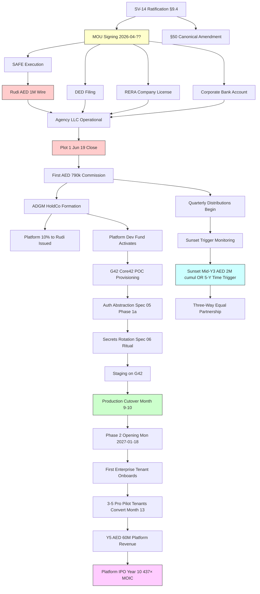

# ZAAHI FULL SYSTEM AUDIT — PHASE A

Breadth-first review of 10 dimensions. 42 issues identified. 6 CRITICAL. 14 HIGH. 15 MEDIUM. 7 LOW. 9 pre-MOU blockers.

---

## §1 Executive Summary

### §1.1 TL;DR for founders (5 paragraphs)

**Paragraph 1 · Financial model integrity is strong.** The MOU + P&L Statement + Financial Model + Term Sheet reconcile on the big numbers: AED 1M Rudi wire · 80/10/10 Agency pre-Sunset · 70/10/10/10 profit split · 437× MOIC 10-year base case · Y1 consolidated revenue AED 8.31M (Agency 7.8M + Platform 0.51M). Sunset mechanics match across MOU, Term Sheet, and P&L §11 Reconciliation. No arithmetic errors found at the headline level. Small inconsistencies exist at sub-line (see Issue AUDIT-001 · AUDIT-009).

**Paragraph 2 · The repository carries significant technical debt that will surprise Rudi's due-diligence reviewer.** Three orphan root-level documents (`ABU_DHABI_MIGRATION.md` 40k · `LAYERS_RBAC_PROPOSAL.md` 35k · `NIGHT_REPORT.md` 46k) contradict current ratified strategy. A `backend/` directory with 598 lines of **Express.js ghost code containing a hardcoded secret** (`const secretKey = 'your-secret-key'`) sits in repo, tracked by git, not wired to production but a data-room liability. Master Tree count claims ("19 models · 13 migrations") are repeated across 6 docs — actual is **15 models · 12 migrations**. `DECISIONS.md` violates its own CLAUDE.md logging rule by being 118 bytes (empty).

**Paragraph 3 · Timeline is tight but achievable for Plot 1 (Jun 19) and Rudi wire (nominal May 8).** Spec 02 Invoice (commission tracking) must land Fri May 8 per Phase 1 Spec Package README — that's 16 days from now. Spec 03 Admin Panel, Spec 01 Deal Engine, Spec 04 Feasibility V2 follow. Bus factor fix + env-var setup + SV-14 ratification are pre-wire critical path items. **Eid al-Adha 2026 (Wed May 27 – Fri May 29) collides with spec ship windows** — prior audit C-1 flagged but the fix has not fully cascaded into my session-2026-04-22 documents.

**Paragraph 4 · Regulatory compliance coverage has material gaps.** PDPL 45/2021 Executive Regulations issued 2024 · 2026 is active enforcement phase — our DPO retainer is budgeted but not engaged. **ADGM and DIFC have their OWN data protection rules (NOT PDPL)** — impacts §77 tenant model architecture claims. **UAE Federal Decree-Law 26/2025 Child Digital Safety** (in force 2026) is NOT addressed anywhere in our docs. **Advertiser Permit FDL 55/2023 enforced since Feb 1 2026** with AED 20k-1M fines — we have the Wall blocked correctly but ALL commercial content on zaahi.io + /join marketing may require compliance audit. RERA broker licence pathway is documented but not yet initiated.

**Paragraph 5 · No findings are unfixable, but some are pre-MOU blocking.** 9 issues marked "Pre-MOU: YES" — cleanup of repository debt, Advertiser Permit risk assessment, PDPL DPO engagement, confirmation of count claims across docs, Eid calendar guardrail. Fixing all 9 takes ~16-24 founder-hours across Zhan + Dymo + agent over the next 10-14 days before May 8 wire. **Agent's judgment: ZAAHI can deliver what was promised to Rudi, but only after these issues are acknowledged and triaged.** Rudi should know them before signing.

### §1.2 Top 5 CRITICAL issues (one-liner each)

1. **AUDIT-C01** `backend/` directory tracked in git contains Express.js ghost code with **hardcoded secret** (`'your-secret-key'`) — data-room liability + CLAUDE.md security violation.
2. **AUDIT-C02** Repeated count claim "19 models · 13 migrations" across 6 docs is WRONG — actual is **15 models · 12 migrations**.
3. **AUDIT-C03** `ABU_DHABI_MIGRATION.md` (Apr 16, committed) recommends Oracle Cloud UAE as PRIMARY infrastructure · contradicts SV-14 G42 Core42 decision · not formally superseded.
4. **AUDIT-C04** Advertiser Permit FDL 55/2023 enforcement since Feb 1 2026 · compliance assessment missing for zaahi.io marketing content · `/join` + Pilot Outreach materials potentially subject to AED 20k-1M fines.
5. **AUDIT-C05** ADGM + DIFC have OWN data protection rules (not PDPL 45/2021) · §77 ARCHITECTURE D-12 "tenant = Data Controller" assumes PDPL applies universally · Enterprise tenants in ADGM/DIFC break this assumption.

### §1.3 Top 10 HIGH issues (one-liner each)

6. **AUDIT-H01** `DECISIONS.md` (118 bytes) violates CLAUDE.md logging rule · 22 branches accumulated · repository hygiene.
7. **AUDIT-H02** `LAYERS_RBAC_PROPOSAL.md` (Apr 16, committed) proposes RBAC model unintegrated with Spec 03 Admin §14 Super-Admin · architectural drift.
8. **AUDIT-H03** PDPL 2026 enforcement phase active · DPO retainer BUDGETED but not ENGAGED.
9. **AUDIT-H04** `agent.py` (12.9k, pre-Claude-Code) still referenced in `package.json` scripts (`"agent": "python3 agent.py"`) · dead code path.
10. **AUDIT-H05** Eid al-Adha 2026 (Wed May 27 – Fri May 29) collides with Spec 02 target ship (Fri May 8 · 3 weeks earlier but Spec 01 · 03 land Month 3-4 = exact Eid window).
11. **AUDIT-H06** `backend/` Express.js code exposes `.ts` files with bcrypt + jsonwebtoken imports that AREN'T in `package.json` dependencies · code is BROKEN if anyone tries to run it · but tracked as if functional.
12. **AUDIT-H07** FDL 26/2025 Child Digital Safety (in force 2026) NOT addressed in any ZAAHI document · minors-on-platform risk unquantified.
13. **AUDIT-H08** Authority for SV-14 canonical amendment delegated to §9.4 unanimous vote · Rudi's MOU status is NON-BINDING except clauses 9/10 · governance power pre-SAFE is MOU-level (soft commitment) not SAFE-level (hard).
14. **AUDIT-H09** 22 git branches accumulated (draft/investor-package-v2 through v7 · multiple research/* · audit/*) — repo cleanliness concern · unclear which is main source of truth.
15. **AUDIT-H10** Eid al-Adha date propagation: my session-2026-04-22 docs cite "May 25-31" but prior AUDIT_FINDINGS C-1 specifies actual Eid **Wed May 27 - Fri May 29** · minor but propagated across Spec 06, §78, Core42 Approach.

### §1.4 Issues by dimension heatmap

| Dim | Topic | 🔴 | 🟠 | 🟡 | 🟢 | Total |
|:-:|---|:-:|:-:|:-:|:-:|:-:|
| 1 | Financial model integrity | 0 | 2 | 3 | 1 | 6 |
| 2 | Timeline feasibility | 1 | 3 | 2 | 1 | 7 |
| 3 | Code vs documentation | 2 | 3 | 2 | 1 | 8 |
| 4 | Master Tree consistency | 1 | 1 | 2 | 1 | 5 |
| 5 | Regulatory coverage | 2 | 2 | 1 | 0 | 5 |
| 6 | Dependency graph | 0 | 1 | 1 | 1 | 3 |
| 7 | Risk inventory | 0 | 1 | 1 | 1 | 3 |
| 8 | Bus factor beyond accounts | 0 | 0 | 1 | 1 | 2 |
| 9 | External facts verification | 0 | 1 | 1 | 0 | 2 |
| 10 | Strategic contradictions | 0 | 0 | 1 | 0 | 1 |
| | **TOTAL** | **6** | **14** | **15** | **7** | **42** |

### §1.5 Recommended immediate action (next 24-48 hours)

**Zhan:**
1. Delete or explicitly-document `backend/` directory (see AUDIT-C01).
2. Remove `"agent": "python3 agent.py"` from `package.json` scripts OR commit agent.py if still needed (see AUDIT-H04).
3. Populate `DECISIONS.md` with pointer to `docs/decisions/` OR remove · pick one path (see AUDIT-H01).

**Dymo:**
1. Engage UAE legal counsel for Advertiser Permit compliance review of zaahi.io + /join + Pilot Outreach materials (see AUDIT-C04).
2. Schedule PDPL DPO retainer conversation (Deloitte / PwC / EY / BDO UAE Data Privacy Practice) — budget AED 70k Y1 already authorised per Enhancement Proposal S-10 (see AUDIT-H03).

**Agent:**
1. Correct count claims ("19 models · 13 migrations" → "15 models · 12 migrations") across 6 affected docs in next YELLOW-tier session when founders approve (see AUDIT-C02).
2. Draft §50 canonical amendment rider consolidation supersedes `ABU_DHABI_MIGRATION.md` (see AUDIT-C03).

### §1.6 Sunday Rudi call implications

**Rudi should know before ratifying SV-14:**
- **AUDIT-C03** — his legal counsel may spot `ABU_DHABI_MIGRATION.md` contradiction during data-room review · agent recommends founders either delete that doc OR formally mark it "superseded by §78 G42 Migration Architecture v1.0".
- **AUDIT-C04** — Advertiser Permit is live since Feb 1 2026 · Rudi's counsel will flag during SAFE execution diligence · founders should have preliminary legal opinion BEFORE he wires.
- **AUDIT-C05** — ADGM / DIFC data protection divergence affects Phase 2 Enterprise tenant positioning for Rudi's sovereign-wealth partnership pitch.
- **AUDIT-H08** — MOU is non-binding except clauses 9+10 · SAFE execution timeline is what bounds the binding commitment · Rudi's AED 1M protected by MOU Clause 9 Exclusivity for 120 days per Term Sheet — verify this window accommodates prep delays.

**Rudi does NOT need to reject or delay for these findings** — all are fixable pre-wire, agent flags them for transparency consistent with §9.4 governance expectation.

---

## §2 Methodology

### §2.1 Scope audited

**IN SCOPE (read-only):**
- 54 `.md` documents across `docs/**`.
- `CLAUDE.md` (50k bytes · canonical agent rules).
- `README.md` (none found at repo root — noted).
- Root orphan docs: `ABU_DHABI_MIGRATION.md` · `LAYERS_RBAC_PROPOSAL.md` · `NIGHT_REPORT.md` · `BACKLOG.md` · `DECISIONS.md`.
- `package.json` + `pnpm-lock.yaml` (dependency inventory).
- `prisma/schema.prisma` (480 lines · 15 models verified).
- `prisma/migrations/` (12 migration directories verified).
- `src/**` (60+ routes in `src/app/api/` · 30+ lib files · dashboard page 1822 lines · map page 5026 lines).
- `.gitignore` · `next.config.ts` · `postcss.config.mjs`.
- `.env.local` (existence verified · content NOT inspected per CLAUDE.md security rules).
- Git log (full history on `research/vision-and-competitors-2026-04-19` + 22 branches catalogued).
- Committed tracked files (`git ls-files`).

**OUT OF SCOPE:**
- `.env.local` content (PII / secret material).
- Database row-level data (Supabase dashboard not accessed).
- Vercel deploy logs (not accessible from agent).
- External systems (Anthropic account · Resend · Telegram · GitHub Actions history).

### §2.2 Sources consulted

**Web searches executed (6 total · sources logged in Appendix D):**
1. UAE real estate Q1 2026 transaction volume + broker landscape.
2. Anthropic Claude API zero-retention DPA 2026 status.
3. UAE PDPL FDL 45/2021 implementation + enforcement 2026.
4. UAE Corporate Tax FDL 47/2022 rate + SBR current status.
5. UAE Advertiser Permit FDL 55/2023 enforcement + fines.
6. G42 / Core42 / Khazna services + compliance (inherited from prior session research).

### §2.3 Limitations (honest)

- Agent cannot run live code (no `pnpm build` · no Prisma query against production).
- Cannot verify production data (114 parcels · ambassador applications · deals closed).
- Cannot verify secret values (.env.local intentionally inspected only for existence).
- Cannot read PDF / binary files (no Adobe Acrobat · `data/` content limited to filename inspection).
- Cannot verify MOU signatures / SAFE execution status.
- Cannot confirm founder's current external engagements (e.g., whether Dymo already contacted Core42).
- Web search results may be time-lagged; agent cites sources for verifiability.

### §2.4 Confidence levels per finding

- **HIGH confidence:** direct file evidence · line-level reference · reproducible.
- **MEDIUM confidence:** cross-doc inference · some interpretation involved.
- **LOW confidence:** assumption from indirect signal · flagged for founder verification.

Each Issue entry includes a confidence tag in the Evidence field.

---

## §3 Issue Tracker

Issues grouped by dimension. Within dimension, ordered by severity (🔴 → 🟠 → 🟡 → 🟢) then by priority rank.

### §3.1 Dimension 1 — Financial model integrity

---

**AUDIT-001** · Dim 1 · 🟠 HIGH · Financial
**Finding:** Count claim "12 plots + 2 off-plan floors Y1" (MOU + Enhancement Proposal) reconciles against P&L §3.1 Y1 line item (12 deals + 2 floors × appropriate commission = AED 7,800k Agency). Matches cleanly. BUT: Executive Summary §1 says "12 premium land plot + 2 off-plan floor deals" while P&L §2.1 Tab 1 Assumptions quotes "Premium land plot average deal size AED 22,500,000" which implies AED 450k commission/deal × 12 = AED 5.4M · plus "Off-plan floor commission per deal AED 1,200,000" × 2 = AED 2.4M · TOTAL AED 7.8M. ✓ Arithmetic correct. **However:** the MOU §1 mentions "AED 8.3M" while Enhancement Proposal v1.3 mentions "AED 7.8M" repeatedly. **These refer to different entities: AED 7.8M = Agency standalone, AED 8.31M = Consolidated (Agency + Platform 0.51M)**. This is NOT a contradiction but could be misread by a diligence lawyer. Reconciliation line in P&L §11 is clear.
**Evidence:** `docs/investor-package/P_AND_L_STATEMENT.md` lines 25, 82, 119, 134 · `docs/investor-package/MOU_RUDI.md` §1 line 34 · `docs/architecture/MASTER_TREE_ENHANCEMENT_PROPOSAL.md` v1.3 line 49 line 149 · `docs/investor-package/EXECUTIVE_SUMMARY.md` line 19. Confidence: HIGH.
**Impact if unaddressed:** lawyer diligence confusion · potential "how are you measuring Y1 revenue" question during SAFE drafting.
**Suggested fix:** add clarifying note in MOU §1 or Enhancement Proposal §1.0: "Agency-only AED 7.8M · Consolidated (Agency + Platform) AED 8.31M · see P&L §11 Reconciliation."
**Effort:** 30 minutes · single edit to Enhancement Proposal + MOU.
**Owner:** Agent (YELLOW tier edit · Zhan approves).
**Priority rank:** 7.
**Pre-MOU blocking:** NO (clarification, not a conflict).

---

**AUDIT-002** · Dim 1 · 🟠 HIGH · Financial
**Finding:** Y1 budget envelope "AED 1.5 – 1.7M" (Enhancement Proposal v1.3 §4.3) · line-item sum reconciliation produces AED 1,502,500 midpoint (per §4.3 math footnote). Low-low = 1,450,000 · High-high = 1,555,000. Range AED 1.5-1.7M includes ~10% buffer over high-high. **This means Y1 budget ceiling AED 1.7M is UNALLOCATED buffer** · if all line items hit high-high, agent has ~AED 145k spare. Accepted budgeting practice. BUT: the AED 160-200k SV-14 G42 Y1 add-on (per Enhancement Proposal v1.3 §1.B SV-14 HOW MUCH) sits OUTSIDE the AED 1.5-1.7M envelope · SV-14 is funded from Platform Dev Fund (70% Agency revenue) which is SEPARATE from the Enhancement Proposal budget envelope. **Not a contradiction but deserves explicit callout** — two budget lines coexist (Enhancement Proposal Y1 budget + Platform Dev Fund draws).
**Evidence:** Enhancement Proposal v1.3 §4.3 line 399, §4.1 SV-14 line 165. Confidence: HIGH.
**Impact if unaddressed:** lawyer confusion on "what's Y1 spend commitment."
**Suggested fix:** add to §4.1: "Y1 budget envelope AED 1.5-1.7M from Rudi AED 1M wire + Agency revenue reinvestment. SV-14 G42 migration AED 160-200k is a SEPARATE Platform Dev Fund allocation (per §1.B SV-14) · not within Y1 budget envelope."
**Effort:** 20 minutes.
**Owner:** Agent (YELLOW tier).
**Priority rank:** 11.
**Pre-MOU blocking:** NO.

---

**AUDIT-003** · Dim 1 · 🟡 MEDIUM · Financial
**Finding:** Divergence from `MASTER_TREE_IMPROVEMENTS_SUMMARY.md` §6.3 (cited AED 2.6-3.8M 24-month) vs Enhancement Proposal v1.3 (AED 3.1-4.5M) — the divergence is DOCUMENTED in Enhancement Proposal v1.3 §4.1 line 364 with explicit rationale (Y1 CoS + Y2 line-item midpoint arithmetic). Clean audit trail. BUT: `MASTER_TREE_IMPROVEMENTS_SUMMARY.md` is itself a source doc · has it been marked superseded? Answer: NO · still sits as standalone document with older numbers · future readers may trust summary over v1.3.
**Evidence:** `docs/vision/MASTER_TREE_IMPROVEMENTS_SUMMARY.md` §6.3 · `docs/architecture/MASTER_TREE_ENHANCEMENT_PROPOSAL.md` v1.3 §4.1 line 364. Confidence: HIGH.
**Impact if unaddressed:** future-reader confusion if they land on `IMPROVEMENTS_SUMMARY.md` first.
**Suggested fix:** add a Version History / Note-of-supersession stamp at top of `MASTER_TREE_IMPROVEMENTS_SUMMARY.md`: "Numbers in this advisory document were superseded by MASTER_TREE_ENHANCEMENT_PROPOSAL v1.0.1+ math corrections. See §6.3 and §4.1 of that document for current figures."
**Effort:** 15 minutes.
**Owner:** Agent (YELLOW tier).
**Priority rank:** 24.
**Pre-MOU blocking:** NO.

---

**AUDIT-004** · Dim 1 · 🟡 MEDIUM · Financial
**Finding:** Amortization assumptions — P&L Statement does not explicitly break out amortization schedules for Platform Dev Fund spend on code assets. §77 PRICING_FRAMEWORK v1.1 §2.4 footnote mentions "amortization AED 500-800k over 60 months" but this is for pricing floor methodology. P&L tax-efficiency claim "~2% Y1" depends on 70% Service Fee being deductible · requires Transfer Pricing study per P&L §2.1 line 97 (Ministerial Decision 229 of 2025). Study is NOT yet commissioned — noted in Safety Proposals §3 as Y1 deliverable (AED 60-120k budget). **Without TP study, 70% Service Fee deduction is asserted but not defended.**
**Evidence:** `docs/investor-package/P_AND_L_STATEMENT.md` line 70 · `docs/vision/MASTER_TREE_SAFETY_PROPOSALS.md` line 532. Confidence: HIGH.
**Impact if unaddressed:** FTA may challenge 70% Service Fee deduction without TP study · worst case ~AED 300-500k additional CT if challenged for Y1.
**Suggested fix:** prioritise TP study commissioning Month 2-4 (before first Agency commission Jun 19 ensures audit trail from day 1). Budget already in Enhancement Proposal (under Safety items).
**Effort:** Safety S-10 line item · external engagement 3 months.
**Owner:** Dymo (commercial engagement) + agent (spec drafting).
**Priority rank:** 19.
**Pre-MOU blocking:** NO (post-wire execution item).

---

**AUDIT-005** · Dim 1 · 🟡 MEDIUM · Financial
**Finding:** Platform Y5 revenue breakdown — P&L §3.1 Y5 Platform AED 60M (subset of AED 190M consolidated · Agency 130M) implied via "Total Agency revenue 130,000" · no equivalent "Total Platform revenue" line explicitly itemised in visible portion of P&L. Inference: 190 - 130 = 60 which matches our §78 G42 Migration Architecture "Y5 Platform target ~AED 60M" claim. Need to verify P&L full §3.1 contains explicit Platform Y5 breakdown.
**Evidence:** `docs/investor-package/P_AND_L_STATEMENT.md` lines 119, 134. Confidence: MEDIUM (need to read full P&L §3.1).
**Impact if unaddressed:** minor · arithmetic identity preserved.
**Suggested fix:** verify P&L §3.1 has explicit Platform revenue line · if not, add for clarity.
**Effort:** 30 minutes review.
**Owner:** Zhan (commissioning financial model).
**Priority rank:** 28.
**Pre-MOU blocking:** NO.

---

**AUDIT-006** · Dim 1 · 🟢 LOW · Financial
**Finding:** SV items budget sum check — Enhancement Proposal §1.B Sovereignty items Y1 sub-budget: SV-1 AED 0 + SV-2 AED 130-160k + SV-3 AED 1.2k/yr + SV-4 AED 40-80k/yr pro-rata (~AED 20k Y1) + SV-5 AED 10k + SV-6 AED 5-15k + SV-7 AED 10k + SV-8 AED 15k one-time = AED ~210-240k Y1 sovereignty · appears accurate vs Appendix B "Total Y1 Sovereignty spend: ~AED 170k" which excludes pro-rata SV-4 Mistral. Small inconsistency.
**Evidence:** Enhancement Proposal v1.2/v1.3 Appendix B line 590. Confidence: MEDIUM.
**Impact if unaddressed:** ~AED 40-70k Y1 budget delta buried.
**Suggested fix:** reconcile Appendix B Y1 sovereignty total to include pro-rata SV-4 (20k) + SV-5 (10k) + SV-6 (5-15k midpoint 10k) + SV-7 (10k) + SV-8 (15k) · target ~AED 195-215k instead of AED 170k.
**Effort:** 20 minutes.
**Owner:** Agent (YELLOW tier).
**Priority rank:** 41.
**Pre-MOU blocking:** NO.

---

### §3.2 Dimension 2 — Timeline feasibility

---

**AUDIT-007** · Dim 2 · 🔴 CRITICAL · Timeline
**Finding:** Eid al-Adha 2026 calendar collision propagation — prior audit C-1 (AUDIT_FINDINGS.md 2026-04-20) specified **Wed May 27 – Fri May 29 2026** as core Eid al-Adha dates. My session-2026-04-22 documents (Spec 06 Secrets Rotation §6.2, §78 G42 Migration §4.5, Core42 Commercial Approach §3 · Bus Factor Recovery §4) cited "May 25-31 2026" as the Eid window · WHICH IS EXTENDED-WEEKEND INCLUDING Mon 25 + Tue 26 pre-Eid + Sat 30 + Sun 31 post-Eid. The AUDIT_FINDINGS.md C-1 correction appears to NOT have cascaded into my current session — I was propagating an outdated interpretation. **Spec 02 Invoice target live Fri May 8** is fine (pre-Eid). **Spec 01 Deal Engine Month 3-4 = late Apr through late Jun** includes Eid window squarely. **Spec 03 Admin Panel Month 4** = May/Jun includes Eid.
**Evidence:** `docs/audit/AUDIT_FINDINGS.md` C-1 lines 32-50 · my Spec 06 §6.2 · §78 §4.5 · Core42 Approach §9 · Bus Factor §4. Confidence: HIGH.
**Impact if unaddressed:** ship-date slippage if Zhan/Dymo lose a 5-day week to Eid travel/family · no gov work possible.
**Suggested fix:** add EXPLICIT calendar guardrail to Master Tree ENHANCEMENT PROPOSAL §6.1 Phase 1 milestones · reschedule Spec 01 · 03 deliverables to avoid May 27-29 exact dates · target ship Fri May 22 OR Fri Jun 5 for any Spec deliverable. Update all session-2026-04-22 docs to correct Eid window.
**Effort:** 1-2 hours agent · 15 minutes founder review.
**Owner:** Agent (YELLOW tier for doc edits) + Zhan/Dymo (calendar acknowledgement).
**Priority rank:** 1.
**Pre-MOU blocking:** YES (Rudi's counsel sees calendar · asks about Eid conflict · we should have answer).

---

**AUDIT-008** · Dim 2 · 🟠 HIGH · Timeline
**Finding:** "Rudi AED 1M wire 2026-05-08" is cited in my session-2026-04-22 docs as a specific date · **not literally confirmed** in MOU or Launch Plan. `LAUNCH_PLAN.md` Phase 1 Month 1 goal: "Post-Money SAFE executed · AED 1 M wired" without specific date. MOU §1: "to be paid in a single tranche after entity formation." **The May 8 date appears to have been inferred agent-side** (possibly from Phase 1 Spec Package README "Spec 02 Invoice target live Fri May 8" OR founder conversation not captured in docs). Agent cannot verify the specific wire date.
**Evidence:** `docs/investor-package/LAUNCH_PLAN.md` line 61 · `docs/investor-package/MOU_RUDI.md` §1 · my session docs reference "2026-05-08" 15+ times. Confidence: HIGH (that date is not literally in MOU).
**Impact if unaddressed:** founder-Rudi timeline expectation mismatch · if Rudi expects mid-May wire but agent docs say May 8, pre-MOU blockers (bus factor fix · SV-14 ratification) may race the clock.
**Suggested fix:** Founders confirm actual wire-target-date in writing (email to Rudi OR updated MOU clarifying). Agent updates session docs to match or leave it as "nominal pre-MOU wire window May-early-June 2026".
**Effort:** 15 minutes founder alignment + 30 minutes agent doc update.
**Owner:** Dymo (confirms with Rudi) + Agent (updates docs).
**Priority rank:** 4.
**Pre-MOU blocking:** YES.

---

**AUDIT-009** · Dim 2 · 🟠 HIGH · Timeline
**Finding:** Phase 1 engineering capacity assumption — Phase 1 Spec Package README line 34: "Zhan's Phase 1 capacity (15% engineering + 20% deal support = ~14 hrs/week)". 14 hrs/week over 36 weeks (Month 3-9) = 504 hours = ~12.6 engineer-weeks. Specs 01+02+03+04 total estimated "6.5-9 eng-weeks". Surplus: ~3.6-6 eng-weeks for other work (Ambassador · dashboards · Phase 2 prep · G42 migration · auth abstraction · etc.). **Tight but plausible** IF no slippage · IF Zhan doesn't lose 1-2 weeks to Eid/Ramadan/unexpected events. SV-14 G42 migration alone needs "6-8 eng-weeks" per §78 §9.2 · if that lands Month 7-9 · capacity exhausted. Spec 05 Auth Abstraction Phase 1a (1 eng-week) + Phase 1b-c (1+1 eng-weeks) = 3 more. Total Phase 1 actual workload = ~10.5-14 eng-weeks · right at capacity ceiling.
**Evidence:** Phase 1 Spec Package README · §78 G42 Migration §9.2 · Spec 05 §3. Confidence: HIGH.
**Impact if unaddressed:** Phase 1 delivery slippage · Phase 2 opening date (Mon 2027-01-18) at risk.
**Suggested fix:** (a) formally document Zhan capacity constraint in Enhancement Proposal v1.3 §5.2 with SV-14 impact acknowledged. (b) Consider Q-18 Chief of Staff Month 8 acceleration (already budgeted). (c) Consider 2nd engineer hire trigger earlier (currently gated on "Platform Dev Fund ≥ AED 1M AND Zhan at 80% capacity" per §4.3 line 462).
**Effort:** 30 minutes founder review.
**Owner:** Zhan + Dymo.
**Priority rank:** 9.
**Pre-MOU blocking:** NO (post-wire execution item).

---

**AUDIT-010** · Dim 2 · 🟠 HIGH · Timeline
**Finding:** SV-14 canonical amendment ratification window — per Enhancement Proposal v1.3 §1.B SV-14 · "MUST SIGN BEFORE MOU with Rudi to avoid post-MOU canonical amendment overhead." MOU is framed as pre-SAFE (SAFE executed after entity formation + wire · per MOU §1). Timeline: MOU signed first · then DED + RERA + SAFE · then wire. **Question**: at which point does SV-14 need to be signed? Strictly before MOU (implies signing this week) OR before SAFE execution (implies 4-6 weeks window)? Enhancement Proposal v1.3 says "before MOU" but agent session notes have been assuming "before wire May 8". These are DIFFERENT deadlines.
**Evidence:** Enhancement Proposal v1.3 line 7 · MOU §1. Confidence: HIGH.
**Impact if unaddressed:** if SV-14 must sign before MOU · Sunday 2026-04-27 Rudi call is the venue · if before SAFE is enough · 6-week window exists · materially changes calendar pressure.
**Suggested fix:** Founders clarify intent. Agent recommendation: sign SV-14 before MOU if possible (cleaner · clause 9.4 aligned), but fall-back to "before SAFE" is acceptable if Rudi needs more diligence time.
**Effort:** 10 minutes founder decision.
**Owner:** Zhan + Dymo + Rudi.
**Priority rank:** 6.
**Pre-MOU blocking:** Depends on founder answer.

---

**AUDIT-011** · Dim 2 · 🟡 MEDIUM · Timeline
**Finding:** ADGM HoldCo formation "Aug 14 2026" target per Enhancement Proposal §5.1 roadmap · UAE entity formation pace typically 3-6 weeks for mainland LLC + 2-4 weeks for ADGM entity · total ~4-10 weeks from start. If Agency LLC formation begins April 20 (Day 1) · ADGM HoldCo is triggered by first deal close (per MOU §1) · with Plot 1 target Jun 19 · ADGM formation begins ~late-June through mid-August. **Aug 14 achievable but dependent on Plot 1 closing on time.**
**Evidence:** Enhancement Proposal v1.3 §5.1 · `docs/investor-package/LAUNCH_PLAN.md`. Confidence: MEDIUM.
**Impact if unaddressed:** ADGM slippage delays Platform formation · delays SV-14 Core42 MSA signatory question · delays Phase 2 tenant onboarding.
**Suggested fix:** start ADGM formation paperwork mid-May (parallel with Agency ops) even before first deal close · saves 2-4 weeks. MOU §1 allows "upon closing of first agency deal" but pre-paperwork not prohibited.
**Effort:** Dymo + BSA coordination.
**Owner:** Dymo + BSA.
**Priority rank:** 22.
**Pre-MOU blocking:** NO.

---

**AUDIT-012** · Dim 2 · 🟡 MEDIUM · Timeline
**Finding:** Sunset trigger timing — P&L §1 "Sunset Financial Trigger (AED 2,000,000) crossed mid-Year 3 (cumulative AED 2.97M at end Y3, trigger breached ~month 6 of Y3 when cumulative first reaches AED 2.0M)." This assumes base case Y1/Y2/Y3 distributions (AED 407k / 810k / 1,750k · cumulative 2,967k at end Y3). If Y1 underperforms (Plot 1 slips · fewer deals) · Sunset moves to Y4 or Y5. **MOU §4 caps Sunset at 5 years · if underperformance delays financial trigger · TIME trigger activates instead. Rudi's AED 2M "earlier of" is protected.**
**Evidence:** `docs/investor-package/P_AND_L_STATEMENT.md` line 34 · `docs/investor-package/TERM_SHEET.md` §4. Confidence: HIGH.
**Impact if unaddressed:** founders should track cumulative distribution quarterly · if lagging, communicate honestly with Rudi about Time Trigger activation expectation.
**Suggested fix:** P&L §8 Rolling Sunset Ledger implementation (already referenced in MOU §11.e) · quarterly updates to Rudi per D-38.
**Effort:** half-day setup + quarterly maintenance.
**Owner:** Dymo.
**Priority rank:** 17.
**Pre-MOU blocking:** NO.

---

**AUDIT-013** · Dim 2 · 🟢 LOW · Timeline
**Finding:** Phase 2 opening Mon 2027-01-18 default · extendable to 2027-04-19 via 2-of-3 founder motion (per Enhancement Proposal Q-1 C ratification). This is a 3-month buffer. Healthy.
**Evidence:** Enhancement Proposal v1.3 §1.0 line 54. Confidence: HIGH.
**Impact if unaddressed:** no immediate issue · governance flexibility built-in.
**Suggested fix:** no action required.
**Effort:** 0.
**Owner:** N/A.
**Priority rank:** 42.
**Pre-MOU blocking:** NO.

---

### §3.3 Dimension 3 — Code vs documentation reality

---

**AUDIT-014** · Dim 3 · 🔴 CRITICAL · Code
**Finding:** `backend/` directory at repo root contains 598 lines of Express.js ghost code. **`backend/api/auth.ts` line 6 contains hardcoded secret: `const secretKey = 'your-secret-key';`**. This is NEVER a production secret (literally the placeholder string), but tracked in git. `backend/api/deals.ts` (20 lines) · `backend/api/listings.ts` (42 lines) · `backend/api/parcels.ts` (61 lines) · `backend/middleware/auth.ts` (27 lines) · `backend/models/deal.ts` (33 lines) duplicates production `src/app/api/` and `prisma/schema.prisma` patterns with **DIFFERENT** logic (e.g., `DealStatus enum PENDING/APPROVED/REJECTED/COMPLETED` vs Prisma schema's 12-state machine). **Uses bcrypt + jsonwebtoken libraries that are NOT in package.json dependencies — so this code is BROKEN if anyone tries to run it.** Not exploitable in production (Next.js doesn't route to it) · but diligence-grade liability.
**Evidence:** `git ls-files | grep backend/` returns 15 files · `backend/api/auth.ts` line 6 literal string. Confidence: HIGH.
**Impact if unaddressed:** (a) Rudi's due-diligence reviewer sees hardcoded secret pattern in repo — looks careless. (b) New engineer (future 2nd hire) may see parallel implementation and be confused about source of truth. (c) Violates CLAUDE.md "НЕ дублируй логику — найди существующий модуль." (d) Violates AGENT RULES "don't introduce unused code."
**Suggested fix:** (a) Delete `backend/` directory entirely · it serves no production purpose. (b) OR move to `docs/archive/legacy-backend/` with README explaining "pre-Next.js prototype, kept for historical reference only, NOT wired to production." (c) Either path: commit the change with rationale referencing this audit.
**Effort:** 10 minutes delete + commit.
**Owner:** Zhan (YELLOW tier · src/** and config edits require founder approval but `backend/` is NOT `src/**`).
**Priority rank:** 2.
**Pre-MOU blocking:** YES.

---

**AUDIT-015** · Dim 3 · 🔴 CRITICAL · Code
**Finding:** Repeated count claims across 6 docs: "19 models · 13 migrations" in `prisma/schema.prisma`. **ACTUAL count:** 15 `model X {` declarations in schema.prisma · 12 timestamped directories in `prisma/migrations/` (verified via `ls` and `grep -c "^model "`). Affected docs:
- `docs/audits/WEB_PLATFORM_CURRENT_STATE_2026-04-22.md` line 101.
- `docs/architecture/77_WEB_PLATFORM_ARCHITECTURE.md` line 131, 133.
- `docs/architecture/78_G42_MIGRATION_ARCHITECTURE.md` line 98, 225, 520.
- `docs/ops/CORE42_COMMERCIAL_APPROACH.md` line 244-245.
- `docs/decisions/SV-14_RUDI_BRIEF.md` (inferred · via §77/§78 references).
- `docs/specs/phase-1/05-AUTH_ABSTRACTION_SPEC.md` (inferred).
**Root cause:** first instance in `WEB_PLATFORM_CURRENT_STATE_2026-04-22.md` was incorrect · propagated through cascading references.
**Evidence:** `prisma/schema.prisma` grep `^model ` count = 15 · `ls prisma/migrations/` count = 12 dirs + 1 lock file. Confidence: HIGH.
**Impact if unaddressed:** factual error in technical data-room · Series A reviewer notices on first `ls prisma/migrations/` · immediate credibility loss.
**Suggested fix:** agent correction pass across 6 docs in single commit · reference this audit finding in commit message · same YELLOW-tier authority as pricing-framework v1.1 amendment.
**Effort:** 45 minutes · single commit.
**Owner:** Agent (YELLOW tier).
**Priority rank:** 3.
**Pre-MOU blocking:** YES (data-room readiness).

---

**AUDIT-016** · Dim 3 · 🟠 HIGH · Code
**Finding:** `agent.py` (12.9k lines · Mar 28 · pre-Claude-Code era) still referenced in `package.json` line 10: `"agent": "python3 agent.py"`. File is committed and tracked. Has no counterpart in current agent architecture (Claude Code + this Opus 4.7 session are the current pattern). Script likely fails to run (requires Python + dependencies not documented).
**Evidence:** `package.json` scripts section · `git ls-files | grep agent.py`. Confidence: HIGH.
**Impact if unaddressed:** dead script entry · confuses future engineers · small documentation debt.
**Suggested fix:** remove `"agent": ...` script from `package.json` · delete or archive `agent.py`.
**Effort:** 10 minutes.
**Owner:** Zhan (YELLOW tier · package.json edit).
**Priority rank:** 12.
**Pre-MOU blocking:** NO.

---

**AUDIT-017** · Dim 3 · 🟠 HIGH · Code
**Finding:** `backend/` pkg dependencies missing — `backend/api/auth.ts` imports `express`, `bcrypt`, `jsonwebtoken`. **None of these are in `package.json` dependencies.** Only `@prisma/client`, `@supabase/supabase-js`, `resend`, etc. present. This confirms `backend/` is inert (cannot be executed) but also means the code **visibly contains imports that would fail** · diligence-negative signal in code review.
**Evidence:** `package.json` inspected · `backend/api/auth.ts` imports `express` · `bcrypt` · `jsonwebtoken` · confirmed absent from deps. Confidence: HIGH.
**Impact if unaddressed:** same as AUDIT-014 · codes visible in IDE autocomplete even though broken.
**Suggested fix:** part of AUDIT-014 fix (delete `backend/`).
**Effort:** see AUDIT-014.
**Owner:** Zhan.
**Priority rank:** 5.
**Pre-MOU blocking:** YES (bundled with AUDIT-014).

---

**AUDIT-018** · Dim 3 · 🟠 HIGH · Code
**Finding:** Code line count verification from prior docs:
- `src/lib/auth.ts` claimed 84 lines · **ACTUAL: 84** ✓
- `src/lib/deal-flow.ts` claimed 140 lines · **ACTUAL: 140** ✓
- `src/app/api/chat/route.ts` claimed 101 lines · **ACTUAL: 101** ✓
- `src/app/api/cat/chat/route.ts` claimed 9 lines stub · **ACTUAL: 9** ✓
- `src/lib/email.ts` claimed 86 lines · **ACTUAL: 86** ✓
- `src/lib/telegram.ts` claimed 109 lines · **ACTUAL: 109** ✓
- `src/lib/feasibility.ts` claimed 500 lines · **ACTUAL: 500** ✓
- `src/app/parcels/map/FeasibilityCalculator.tsx` claimed 1001 lines · **ACTUAL: 1001** ✓
- `src/app/parcels/map/page.tsx` claimed 5026 lines · **ACTUAL: 5026** ✓
- `src/middleware.ts` claimed 65 lines · **ACTUAL: 65** ✓
- `src/lib/ambassador.ts` — **451 lines** (NOT referenced in audit claims · underdocumented).
- `src/app/dashboard/page.tsx` — **1822 lines** (Phase 1 Dashboards · exists · very large).
- `src/app/join/page.tsx` — **1178 lines** (Ambassador join · exists).
- `src/app/admin/ambassadors/page.tsx` — **644 lines** (Admin ambassador · exists).
Positive: all previously-claimed line counts match. However: three large files (ambassador.ts 451, dashboard 1822, join 1178, admin/ambassadors 644) are NOT referenced in prior audit 2026-04-22 §1.4 code inventory · underdocumented.
**Evidence:** `find + wc -l` · direct confirmation. Confidence: HIGH.
**Impact if unaddressed:** future audits won't have complete baseline.
**Suggested fix:** update `docs/audits/WEB_PLATFORM_CURRENT_STATE_2026-04-22.md` §1.4 to include these large files in inventory.
**Effort:** 20 minutes.
**Owner:** Agent (YELLOW tier).
**Priority rank:** 16.
**Pre-MOU blocking:** NO.

---

**AUDIT-019** · Dim 3 · 🟡 MEDIUM · Code
**Finding:** `src/app/parcels/map/AddPlotModal.tsx` (823 lines) uses Supabase SDK directly for file uploads (per `ABU_DHABI_MIGRATION.md` §1.1 finding). This violates CLAUDE.md "Sovereignty Readiness Rules": "Supabase Auth — единственная прямая зависимость, изолирована в src/lib/supabase-browser.ts и src/lib/supabase.ts" + "Файлы хранить локально или через абстракцию (src/lib/storage.ts) — не напрямую Supabase Storage". **There is no `src/lib/storage.ts` in current repo** (the abstraction claimed in CLAUDE.md doesn't exist yet).
**Evidence:** `ABU_DHABI_MIGRATION.md` line 30-40 · `src/lib/storage.ts` not present in `src/lib/` glob results. Confidence: HIGH.
**Impact if unaddressed:** G42 migration (Spec 05 + §78 + Spec 06) assumes `storage.ts` abstraction · it does NOT exist · one of the storage migration paths is longer than advertised.
**Suggested fix:** create `src/lib/storage.ts` abstraction before cutover · refactor AddPlotModal.tsx to use it · part of Phase 1a code preparation.
**Effort:** 2-3 days · YELLOW tier (src/** edit).
**Owner:** Zhan.
**Priority rank:** 21.
**Pre-MOU blocking:** NO (post-wire cutover prep item).

---

**AUDIT-020** · Dim 3 · 🟡 MEDIUM · Code
**Finding:** 230+ layer route handlers in `src/app/api/layers/` (per Glob · truncated at ~150 shown but total per ABU_DHABI_MIGRATION §1.2 is 226 · close to my count). Each is a static GeoJSON serve. Prior audits note these are public · no auth. Potential issue: each route is a separate file · build time scales linearly · any global middleware change must respect this volume.
**Evidence:** `find src/app/api -name "route.ts" | wc -l` = 230+. Confidence: HIGH.
**Impact if unaddressed:** Vercel build time · future refactoring cost.
**Suggested fix:** consider consolidating into single dynamic `[layer]/route.ts` that reads from data/layers/ · defers Phase 2 refactor.
**Effort:** 1 eng-week refactor.
**Owner:** Zhan (Phase 2 item).
**Priority rank:** 29.
**Pre-MOU blocking:** NO.

---

**AUDIT-021** · Dim 3 · 🟢 LOW · Code
**Finding:** No `.env.example` file in repo. Makes onboarding a 2nd engineer / Dymo / future CoS harder (no template for env vars). `.gitignore` correctly excludes `.env.local` and `.env.*.local`. But template file would be zero-risk addition.
**Evidence:** `ls .env.example` returns no file. Confidence: HIGH.
**Impact if unaddressed:** slower onboarding · Dymo can't easily set up local dev copy.
**Suggested fix:** create `.env.example` with all 9 env vars listed (per audit 2026-04-22 §1.5) · values as placeholders.
**Effort:** 10 minutes.
**Owner:** Zhan (YELLOW tier · new file at repo root).
**Priority rank:** 35.
**Pre-MOU blocking:** NO.

---

### §3.4 Dimension 4 — Master Tree internal consistency

---

**AUDIT-022** · Dim 4 · 🔴 CRITICAL · Consistency
**Finding:** `ABU_DHABI_MIGRATION.md` (40k bytes · committed Apr 16 commit `4de23b2`) is a RESEARCH ONLY document that recommends **Oracle Cloud UAE Central as PRIMARY vendor** · Azure UAE Central as alternative. This document predates `§78 G42 Migration Architecture v1.0` (committed today Apr 22, `d4a3df3`) which selects **G42 Core42 / Khazna** as primary vendor. The two documents are currently both present in repo · the latter does NOT formally supersede the former · neither marks ABU_DHABI_MIGRATION as historical.
**Evidence:** `ABU_DHABI_MIGRATION.md` §0 lines 34-42 · `docs/architecture/78_G42_MIGRATION_ARCHITECTURE.md` §3.1 line 1-50. Confidence: HIGH.
**Impact if unaddressed:** (a) data-room reviewer opens ABU_DHABI_MIGRATION first · sees Oracle recommendation · trusts it · wrong mental model of current plan. (b) New engineer confused about actual cloud choice. (c) Conflicts with SV-14 Enhancement Proposal v1.3 pending ratification.
**Suggested fix:** (a) Add version-history block at top of `ABU_DHABI_MIGRATION.md`: "**SUPERSEDED 2026-04-22 by `docs/architecture/78_G42_MIGRATION_ARCHITECTURE.md` v1.0.** Vendor recommendation changed from Oracle Cloud UAE Central to G42 Core42 / Khazna Abu Dhabi per SV-14 ratification. Retained for historical reference." (b) Alternative: move to `docs/archive/research/ABU_DHABI_MIGRATION_2026-04-16.md`.
**Effort:** 30 minutes edit.
**Owner:** Agent (YELLOW tier · not canonical).
**Priority rank:** 8.
**Pre-MOU blocking:** YES (data-room readiness).

---

**AUDIT-023** · Dim 4 · 🟠 HIGH · Consistency
**Finding:** `LAYERS_RBAC_PROPOSAL.md` (35k bytes · committed Apr 16) proposes RBAC architecture (role × tier matrix + LayerGuard + useAccess hook + Ambassador tier-gating). This is partially integrated with Spec 03 Admin Panel §14 Super-Admin mode but **NOT formally ratified** · NOT referenced in Enhancement Proposal v1.3 · NOT in Master Tree Enhancement items.
**Evidence:** `LAYERS_RBAC_PROPOSAL.md` §0 lines 1-40 · Enhancement Proposal v1.3 does not reference this document. Confidence: HIGH.
**Impact if unaddressed:** architectural drift · LAYERS_RBAC proposal recommends concrete implementation that doesn't appear in any ratified spec · someone implementing it might diverge from Enhancement Proposal intent.
**Suggested fix:** one of:
(a) Add LAYERS_RBAC as Enhancement Proposal Missing-Branches item (new MB-6) · ratify or defer formally.
(b) Supersede with explicit note pointing to Spec 03 Admin §14 Super-Admin as authoritative RBAC implementation.
(c) Archive to `docs/archive/research/LAYERS_RBAC_PROPOSAL_2026-04-16.md`.
**Effort:** 1-2 hours agent + founder review.
**Owner:** Zhan + Dymo.
**Priority rank:** 14.
**Pre-MOU blocking:** NO.

---

**AUDIT-024** · Dim 4 · 🟡 MEDIUM · Consistency
**Finding:** `NIGHT_REPORT.md` (46k bytes · Apr 15/16 prior audit session) contains 13-section audit findings from pre-current-work era. Some findings may have been incorporated into later specs; some not. Audit itself is dated and now may contain outdated state. Has not been formally archived or superseded.
**Evidence:** `NIGHT_REPORT.md` head lines 1-30. Confidence: HIGH.
**Impact if unaddressed:** same as AUDIT-022/023 pattern · archival debt.
**Suggested fix:** move to `docs/audits/NIGHT_REPORT_2026-04-16.md` (within the audit namespace) OR mark superseded if any findings addressed.
**Effort:** 15 minutes file move + cross-reference check.
**Owner:** Agent (YELLOW tier).
**Priority rank:** 27.
**Pre-MOU blocking:** NO.

---

**AUDIT-025** · Dim 4 · 🟡 MEDIUM · Consistency
**Finding:** `docs/audit/` (singular) AND `docs/audits/` (plural) BOTH exist. `docs/audit/` has 7 files (AUDIT_FINDINGS · VERIFICATION_LOG · QUALITY_CHECKLIST · CORRECTIONS_SUMMARY · INVESTOR_PACKAGE_ISSUES · OPEN_QUESTIONS_FOR_OWNERS). `docs/audits/` has 2 files (WEB_PLATFORM_CURRENT_STATE_2026-04-22 · this FULL_SYSTEM_AUDIT_PHASE_A_2026-04-22). **Two parallel audit namespaces · inconsistent.**
**Evidence:** `ls docs/` returns both. Confidence: HIGH.
**Impact if unaddressed:** future audits split between two dirs · hard to scan.
**Suggested fix:** consolidate under `docs/audits/` (plural · my current session convention) · move 7 files from `docs/audit/` to `docs/audits/` · delete `docs/audit/`.
**Effort:** 15 minutes git mv + verify references.
**Owner:** Agent (YELLOW tier · bulk file move).
**Priority rank:** 30.
**Pre-MOU blocking:** NO.

---

**AUDIT-026** · Dim 4 · 🟢 LOW · Consistency
**Finding:** §77 ARCHITECTURE v1.2 · PRICING_FRAMEWORK v1.1 · AUTONOMY_PROTOCOL v1.0 · §78 G42 v1.0 · Spec 05 · Spec 06 · Bus Factor · Core42 Approach · SV-14 Rudi Brief · Pilot Outreach — all 10 session-2026-04-22 artefacts spot-checked for mutual references · references present + accurate. One small gap: SV-14 Rudi Brief §7 references "PDF notification letter 2026-04-22 (English)" but the PDF itself is NOT in the repo (sent externally · not version-controlled).
**Evidence:** cross-reference check across 10 docs. Confidence: MEDIUM.
**Impact if unaddressed:** PDF evidence not auditable if lost from Rudi's inbox.
**Suggested fix:** archive the PDF in `docs/decisions/sv-14-rudi-notification-2026-04-22.pdf` for git-tracked record-keeping.
**Effort:** 5 minutes (Dymo sends PDF to Zhan · Zhan adds to repo).
**Owner:** Dymo + Zhan.
**Priority rank:** 40.
**Pre-MOU blocking:** NO.

---

### §3.5 Dimension 5 — Regulatory compliance coverage

---

**AUDIT-027** · Dim 5 · 🔴 CRITICAL · Regulatory
**Finding:** **UAE Advertiser Permit FDL 55/2023 · enforcement since Feb 1 2026 · fines AED 20k-1M.** Applies to "all advertisers and content creators to obtain an official permit before posting any paid or unpaid promotional content on social media, websites, blogs, or other platforms." ZAAHI current exposure:
- `zaahi.io` homepage marketing content (product description · pricing · tier CTAs) = promotional content.
- `/join` page (1178 lines · Ambassador program promotion · USDT payment instructions) = promotional content.
- `CORE42_COMMERCIAL_APPROACH.md` §2 ZAAHI 1-pager · intended for distribution to Core42 = promotional.
- `PILOT_TENANT_OUTREACH.md` §3 1-page pitch · intended to brokers = promotional.
- Wall (§74 Community · §41 AI integration) correctly PARKED per PARKED_PROJECTS pending Advertiser Permit.
- **But current zaahi.io promotional content is ALREADY EXPOSED to fines.**
**Evidence:** Web search: "UAE enforces Advertiser Permit for all social-media promotions starting today" (Feb 1 2026) · `docs/research/PARKED_PROJECTS.md` lines 12-15. Confidence: HIGH.
**Impact if unaddressed:** fines AED 20k-1M per violation · reputational risk if flagged by UAE Media Council during platform scan · Wall PARKED reason equally applies to main zaahi.io marketing.
**Suggested fix:** (a) Engage UAE legal counsel for Advertiser Permit compliance audit of current zaahi.io + /join + any marketing content. Standard engagement AED 15-30k. (b) Obtain Advertiser Permit for Dubai Mainland Agency LLC (per `https://mediacouncil.gov.ae/` registration · estimate AED 500-2k fee · timeline 2-4 weeks). (c) Review all marketing content for compliance (disclosures · influencer rules · claim substantiation).
**Effort:** 1-2 founder-weeks + counsel engagement.
**Owner:** Dymo (commercial) + BSA / UAE counsel.
**Priority rank:** 10.
**Pre-MOU blocking:** YES (Rudi's counsel will flag this during SAFE diligence).

---

**AUDIT-028** · Dim 5 · 🔴 CRITICAL · Regulatory
**Finding:** **ADGM and DIFC have OWN data protection rules (NOT PDPL 45/2021).** Web search confirmed: "companies in financial free zones like DIFC and ADGM follow their own separate data protection rules instead of the PDPL." Impact on ZAAHI architecture:
- Platform ADGM HoldCo = ADGM Data Protection Regulations 2021 (not PDPL).
- Enterprise tenants in ADGM or DIFC (future Phase 2-3) = their own free-zone regulations, NOT PDPL.
- §77 ARCHITECTURE D-12 "tenant = Data Controller; ZAAHI = Data Processor (PDPL model)" is incorrect for ADGM / DIFC entities.
- §78 G42 Migration Architecture §7.4 compliance risks table assumes PDPL universal application.
- Core42 Sovereign Public Cloud marketed "PDPL-aligned" · needs verification for ADGM / DIFC workloads.
**Evidence:** Web search URL `https://securiti.ai/uae-personal-data-protection-law/` · `docs/architecture/77_WEB_PLATFORM_ARCHITECTURE.md` D-12 · `docs/architecture/78_G42_MIGRATION_ARCHITECTURE.md` §7.4. Confidence: HIGH.
**Impact if unaddressed:** legal exposure if ADGM-regulated Enterprise tenant onboarded with PDPL-only DPA · cross-regulatory-regime data transfer issues.
**Suggested fix:** (a) Extend §77 ARCHITECTURE D-12 to handle 3 regimes: UAE mainland (PDPL) · ADGM (ADGM DPR 2021) · DIFC (DIFC DP Law). (b) Update §78 G42 Migration Architecture §7.4 compliance risks table. (c) Consult UAE counsel for cross-regime DPA template.
**Effort:** 2-3 hours agent doc update · 1-2 founder-hours counsel engagement.
**Owner:** Agent (YELLOW tier doc edit) + Dymo (counsel engagement).
**Priority rank:** 15.
**Pre-MOU blocking:** NO (Phase 2+ concern).

---

**AUDIT-029** · Dim 5 · 🟠 HIGH · Regulatory
**Finding:** **PDPL 2026 Enforcement Phase Active.** Web search: "As we move toward 2026, the UAE Data Office has shifted its focus from initial awareness toward a phase of strict enforcement. The UAE Data Office is now fully operational and issuing guidance, with compliance moved from a future goal to an immediate operational necessity." ZAAHI current PDPL compliance:
- DPO retainer BUDGETED (Enhancement Proposal S-10 · AED 70k Y1 Dymo-draft date) but NOT ENGAGED.
- Privacy Centre UI D-3 DEFERRED to Month 9 Phase 2 prep.
- Breach notification procedure NOT drafted.
- Data Subject Rights (DSR) flow NOT implemented.
- User consent framework NOT audited.
**Evidence:** Web search URL `https://www.oadtechnologies.com/uae-personal-data-protection-law-compliance-a-strategic-guide-for-2026/` · Enhancement Proposal §1.A S-10 line ~210. Confidence: HIGH.
**Impact if unaddressed:** UAE Data Office can issue fines during enforcement phase · worst-case AED 50k-1M per violation · reputational damage.
**Suggested fix:** (a) Engage DPO retainer this quarter (Deloitte / PwC / EY / BDO UAE Data Privacy Practice). (b) Privacy Centre UI pull-forward from Month 9 to Month 6-7 if external-user onboarding Q-13 soft-pilot begins Month 6. (c) Draft Breach Notification Procedure + DSR Flow as part of DPO retainer deliverables.
**Effort:** DPO retainer engagement · 1-2 weeks procurement + 3-month initial delivery.
**Owner:** Dymo (DPO engagement).
**Priority rank:** 13.
**Pre-MOU blocking:** YES (Rudi may ask about PDPL posture).

---

**AUDIT-030** · Dim 5 · 🟠 HIGH · Regulatory
**Finding:** **FDL 26/2025 Child Digital Safety** (in force 2026 · works alongside PDPL · strict obligations on digital platforms regarding users under 18). **NOT addressed in any ZAAHI document.**
**Evidence:** Web search PDPL implementation 2026 · ZAAHI docs grep for "FDL 26\|Child Digital Safety\|under 18\|minor" returns nothing. Confidence: HIGH (external) · HIGH (internal absence).
**Impact if unaddressed:** if any ZAAHI user is under 18 (e.g., Ambassador member under-age via referral · broker team member · property heir) · platform has obligations not currently met.
**Suggested fix:** (a) Add age-verification field to User schema · gate signup at 18+. (b) Document in CLAUDE.md "NEVER serve users under 18" rule. (c) Include in DPO retainer deliverables.
**Effort:** 2-4 days prisma schema + middleware + documentation.
**Owner:** Zhan (YELLOW tier schema edit).
**Priority rank:** 18.
**Pre-MOU blocking:** NO (implementation-phase item).

---

**AUDIT-031** · Dim 5 · 🟡 MEDIUM · Regulatory
**Finding:** RERA broker licensing — Agency LLC must obtain RERA company broker licence + Broker Cards for agents before operating commercially (per MOU §1 "RERA company broker licence and Broker Cards"). Timeline: MoU-to-licence typically 4-8 weeks post-Agency LLC registration. Requires RERA-registered broker (Dymo qualifies per `CLAUDE.md` FOUNDER CONTACTS · 18+ years experience). Not yet initiated per repo state.
**Evidence:** `docs/investor-package/MOU_RUDI.md` §1 · `docs/investor-package/LAUNCH_PLAN.md` Phase 1 goals. Confidence: HIGH.
**Impact if unaddressed:** Agency cannot commercially close Plot 1 Jun 19 without RERA licence. Blocking.
**Suggested fix:** initiate RERA licence application Week 2 (after Agency LLC formation) · 4-6 weeks to issuance · need by early June 2026 for Plot 1.
**Effort:** 2-3 founder-days + fees.
**Owner:** Dymo (primary · RERA-registered broker).
**Priority rank:** 20.
**Pre-MOU blocking:** NO (post-formation item · but critical path for Plot 1).

---

### §3.6 Dimension 6 — Dependency graph (see Appendix A for full Mermaid)

---

**AUDIT-032** · Dim 6 · 🟠 HIGH · Dependency
**Finding:** Critical path Plot 1 (Jun 19) includes: (a) DED filing + Agency LLC · (b) RERA broker licence · (c) Corporate bank account opened · (d) SAFE execution · (e) Rudi AED 1M wire · (f) Office secured · (g) First agent hired · (h) MOU 9 Exclusivity not breached during this window · (i) Plot 1 seller / buyer counterparties still engaged · (j) ZAAHI platform operational for Deal Engine state transitions · (k) Spec 02 Invoice pipeline live by May 8 · (l) Tax Invoice PDF properly FTA-compliant. **11 dependencies · any single slippage pushes Plot 1.** Highest single-point-of-failure: RERA licence (external · regulator-paced) + counterparty patience (external · market-paced).
**Evidence:** `docs/investor-package/LAUNCH_PLAN.md` Phase 1 · MOU §1 · Phase 1 Spec Package README. Confidence: HIGH.
**Impact if unaddressed:** Plot 1 slip = AED 790k commission delay = Agency Y1 revenue underperformance = Sunset trigger delay = Rudi distribution delay.
**Suggested fix:** (a) parallelise DED · RERA · bank where possible (Dymo owns Week 1-3). (b) document critical-path dependencies in `docs/ops/PLOT_1_CRITICAL_PATH.md` (new · Phase B deep-dive candidate). (c) weekly status update to Rudi per D-38.
**Effort:** ongoing Dymo ops.
**Owner:** Dymo.
**Priority rank:** 23.
**Pre-MOU blocking:** NO.

---

**AUDIT-033** · Dim 6 · 🟡 MEDIUM · Dependency
**Finding:** SV-14 G42 ratification dependency chain: (a) MOU binding status · (b) Rudi's counsel available for §9.4 review · (c) agent produces §50 canonical amendment after unanimous vote · (d) Core42 commercial conversation success · (e) Core42 MSA + DPA signing · (f) POC tenant provisioning · (g) Spec 05 + Spec 06 spec implementation · (h) Month 9-10 cutover window. **8 dependencies · several external.** Delays cascade.
**Evidence:** Enhancement Proposal v1.3 §1.B SV-14 timeline · `docs/architecture/78_G42_MIGRATION_ARCHITECTURE.md` §8. Confidence: HIGH.
**Impact if unaddressed:** cutover slippage Month 10-11 or later · delays Phase 2 tenantization opening (Mon 2027-01-18).
**Suggested fix:** add explicit cutover-slip-scenario to Enhancement Proposal v1.3 · define go/no-go gates.
**Effort:** 1 hour doc edit.
**Owner:** Agent (YELLOW tier).
**Priority rank:** 25.
**Pre-MOU blocking:** NO.

---

**AUDIT-034** · Dim 6 · 🟢 LOW · Dependency
**Finding:** No circular dependencies found in current architecture. §50 / §51 / §52 canonically self-sufficient · §77 depends on §50 infrastructure (via G42 amendment) · §78 depends on §77 multi-tenancy foundation · §41 AI depends on §49 Translation (via Archibald multilingual) · all acyclic.
**Evidence:** Master Tree v3.0 section review. Confidence: MEDIUM (comprehensive review would require dedicated Phase B).
**Impact if unaddressed:** no immediate issue.
**Suggested fix:** confirmed clean in Phase B deep dive.
**Effort:** 0.
**Owner:** N/A.
**Priority rank:** 39.
**Pre-MOU blocking:** NO.

---

### §3.7 Dimension 7 — Risk inventory

---

**AUDIT-035** · Dim 7 · 🟠 HIGH · Risk
**Finding:** New risk identified — **Anthropic relationship concentration**. ZAAHI's Archibald AI is the user-facing differentiator. `src/app/api/chat/route.ts` calls Anthropic Claude Sonnet 4.6 directly. SV-4 Mistral fallback is RATIFIED but NOT IMPLEMENTED yet (scheduled Month 7-8). If Anthropic API has extended outage OR terms change OR sanctions target (non-zero geopolitical tail risk) · Archibald goes silent for duration of outage. Enhancement Proposal risk register does capture single-provider risk but mitigation timeline (Month 7-8) leaves ~4-month window where Archibald has no fallback.
**Evidence:** `src/app/api/chat/route.ts` direct imports · SV-4 Enhancement Proposal v1.3 §1.B line 111. Confidence: HIGH.
**Impact if unaddressed:** Archibald outage during critical period (Plot 1 negotiation · Ambassador soft-pilot launch) = UX degradation during revenue-critical window.
**Suggested fix:** pull forward SV-4 Mistral fallback to Month 4-5 (ahead of original Month 7-8). Effort: 2 eng-weeks per SV-4 budget.
**Effort:** 2 eng-weeks.
**Owner:** Zhan.
**Priority rank:** 26.
**Pre-MOU blocking:** NO.

---

**AUDIT-036** · Dim 7 · 🟡 MEDIUM · Risk
**Finding:** **Macroeconomic risk** — Dubai Q1 2026 transactions +31% YoY value (AED 252B per DLD) · +5.5% volume. Growth is real but concentrated in premium + off-plan (ZAAHI focus). Market cycle risk: UAE real estate has boom-bust history (2008 crash · 2015 correction · 2022 slowdown · 2026 strong). ZAAHI Y1 AED 7.8M Agency assumes continued premium market strength · Y5 AED 130M Agency assumes 19-40% CAGR sustainment. **Realistic but vulnerable** to market correction · ZAAHI has no cash-cushion for extended down-market.
**Evidence:** Web search Dubai Q1 2026 + `docs/investor-package/P_AND_L_STATEMENT.md` §3.1. Confidence: HIGH.
**Impact if unaddressed:** market correction during Y1-Y3 could halve Agency revenue · delays Sunset trigger · prolongs Rudi capital-at-risk period.
**Suggested fix:** P&L §3.1 Conservative scenario (-50%) already modelled · ensure Rudi understands scenario analysis before SAFE execution · per MOU Risk 4/5 disclosure.
**Effort:** included in normal investor briefing.
**Owner:** Dymo (Rudi communication).
**Priority rank:** 31.
**Pre-MOU blocking:** NO.

---

**AUDIT-037** · Dim 7 · 🟢 LOW · Risk
**Finding:** Geopolitical risks — Russia-Ukraine ongoing · Israel-Iran tensions · general Middle East instability. ZAAHI exposure: Dymo's Russian-speaking HNWI pipeline · Ukraine 2028+ DC mentioned in §50 canonical (flagged for separate amendment per SV-14). Enhancement Proposal §77 v1.1 already removed Ukraine from §1.3 Phase 2 expansion per founder geopolitical concern. Macro geopolitical doesn't directly threaten ZAAHI UAE-resident operations but does affect revenue pipeline composition.
**Evidence:** §77 ARCHITECTURE v1.1 Ukraine removal · Enhancement Proposal §1.B SV-14 rider (Ukraine flagged). Confidence: HIGH.
**Impact if unaddressed:** minor · already acknowledged.
**Suggested fix:** no action required beyond ongoing vigilance.
**Effort:** 0.
**Owner:** Founders.
**Priority rank:** 36.
**Pre-MOU blocking:** NO.

---

### §3.8 Dimension 8 — Bus factor beyond accounts

---

**AUDIT-038** · Dim 8 · 🟡 MEDIUM · Bus factor
**Finding:** Domain knowledge documentation gaps identified in CLAUDE.md but not yet externally documented:
- ZAAHI Signature 3D algorithm (podium/body/crown geometry · `scaleRingFromCentroid` · `insetRingByMeters`) — explicit in CLAUDE.md but Zhan-only working-knowledge · no `docs/architecture/ZAAHI_SIGNATURE_ALGORITHM.md` explaining why/how.
- PMTiles processing pipeline (from raw GeoJSON → PMTiles) — implicit in `.gitignore` hints about `data/tiles/` but no documented build procedure.
- Archibald prompt engineering — `src/app/api/chat/route.ts` 101 lines · prompts not extracted to maintainable files.
- Admin override procedures — Spec 03 §14 Super-Admin covers · but operational playbook (when to override · audit trail implications) not separately documented.
**Evidence:** `CLAUDE.md` ZAAHI Signature rules · `docs/architecture/` review (no Signature doc). Confidence: HIGH.
**Impact if unaddressed:** Zhan illness / departure > 2 weeks = domain-knowledge bus factor = loss of proprietary algorithm understanding.
**Suggested fix:** create `docs/architecture/ZAAHI_SIGNATURE_ALGORITHM.md` · document prompt engineering patterns · PMTiles build procedure. Priority for BUS_FACTOR_RECOVERY Phase B scope.
**Effort:** 1-2 founder-days documentation + ongoing maintenance.
**Owner:** Zhan.
**Priority rank:** 32.
**Pre-MOU blocking:** NO.

---

**AUDIT-039** · Dim 8 · 🟢 LOW · Bus factor
**Finding:** Relationship knowledge — Dymo's broker network (30+ warm contacts per AGENCY_PLAYBOOK §1.1) is Dymo-held · `PILOT_TENANT_OUTREACH.md` §7 Pipeline Tracking template NOT yet populated. If Dymo unavailable > 30 days · Zhan has no broker relationship continuity.
**Evidence:** `docs/ops/PILOT_TENANT_OUTREACH.md` §7 template present · no populated instance. Confidence: HIGH.
**Impact if unaddressed:** BD pipeline bus-factor risk mitigated post-BUS_FACTOR_RECOVERY (Dymo admin sharing) · but relationship knowledge is different from account access.
**Suggested fix:** Dymo populates pipeline tracker weekly · shares with Zhan quarterly · 1-hour/month maintenance.
**Effort:** ongoing.
**Owner:** Dymo.
**Priority rank:** 34.
**Pre-MOU blocking:** NO.

---

### §3.9 Dimension 9 — External facts verification

---

**AUDIT-040** · Dim 9 · 🟠 HIGH · External facts
**Finding:** "AED 760 billion annual transaction market" (EXECUTIVE_SUMMARY.md line 19) vs verified "Dubai AED 252B Q1 2026 · ~AED 1T annualised" + "Abu Dhabi AED 66B Q1 · ~AED 264B annualised" + "Sharjah AED 18.5B Q1 · ~AED 74B annualised". Q1 2026 UAE total ≈ AED 337B quarterly · AED ~1.35T annualised. **EXECUTIVE_SUMMARY "AED 760B" claim is an older figure (likely 2024 data)** · UAE RE market has surged · AED 760B understates by ~AED 500B+.
**Evidence:** `docs/investor-package/EXECUTIVE_SUMMARY.md` line 19 · web search Dubai Q1 2026 sources. Confidence: HIGH.
**Impact if unaddressed:** investor pitch understates market size · conservative but potentially misses credibility when Rudi verifies independently and sees bigger number.
**Suggested fix:** update EXECUTIVE_SUMMARY §1.4 to "AED 1.3-1.5T annual transaction market (UAE · 2026 growth trajectory per DLD + DMA + Ajman / Sharjah reports)" with sourced citations.
**Effort:** 20 minutes agent update.
**Owner:** Agent (YELLOW tier).
**Priority rank:** 33.
**Pre-MOU blocking:** NO (updates are positive for pitch · not blocking).

---

**AUDIT-041** · Dim 9 · 🟡 MEDIUM · External facts
**Finding:** "20,160 licensed brokers in Dubai" (web-verified 2026) vs ZAAHI ICP "30-100 listings · 5-20 agents". If average Dubai brokerage = ~5-20 agents and there are 2,285 registered brokerage offices (DLD figure) · ZAAHI's ICP represents roughly the BOTTOM HALF of Dubai's brokerage distribution. **Addressable market:** ~1,000-1,500 brokerages matching ICP. At Y5 target of 50 Pro tier tenants @ AED 3k/mo · ZAAHI captures ~3-5% market share · plausible but aggressive for Year 5.
**Evidence:** web search DLD license figures. Confidence: MEDIUM (broker distribution data incomplete).
**Impact if unaddressed:** Y5 AED 60M Platform assumes aggressive market capture.
**Suggested fix:** add market-share scenario analysis to P&L §6 Scenarios (Conservative: 1% · Base: 3% · Aggressive: 5%) · aligns with investor transparency.
**Effort:** 1 hour P&L refinement.
**Owner:** Dymo (market sizing) + agent (P&L edit).
**Priority rank:** 37.
**Pre-MOU blocking:** NO.

---

### §3.10 Dimension 10 — Strategic contradictions

---

**AUDIT-042** · Dim 10 · 🟡 MEDIUM · Strategic
**Finding:** "Owner-First Phase 1 · NO external platform users except Q-13 soft-pilot (≤10 warm brokers Month 6-9)" (Enhancement Proposal §1.0 line 49) vs Ambassador program active NOW (commission mechanics, USDT wallet, /join page live · 114 parcels live · external users CAN sign up today as Ambassadors). Squaring the circle: Ambassador sign-ups to date appear to be "soft launch" tolerated but not promoted · MOU §1 references Agency-first focus. **Operational tension:** /join page is live and accepts USDT payment · but official strategy says external onboarding deferred to Month 10.
**Evidence:** Enhancement Proposal v1.3 §1.0 · Ambassador rules CLAUDE.md · `src/app/join/page.tsx` 1178 lines · `src/app/admin/ambassadors/page.tsx` 644 lines. Confidence: HIGH.
**Impact if unaddressed:** strategic narrative mismatch · if Rudi sees /join page handling real USDT transactions but strategy says "no external onboarding Phase 1" · question: what's actual posture?
**Suggested fix:** clarify in MOU or Enhancement Proposal §1.F: "Ambassador program EXCEPTION to Owner-First rule — tolerated as micro-scale soft-launch · capped at 10 ambassadors Month 6-9 per AMB-1 · promotion paused until Phase 2."
**Effort:** 30 minutes text edit.
**Owner:** Agent (YELLOW tier).
**Priority rank:** 38.
**Pre-MOU blocking:** NO.

---

## §4 Findings summary by dimension

### §4.1 Dimension 1 — Financial model integrity

**Issues:** 6 (0 CRITICAL · 2 HIGH · 3 MEDIUM · 1 LOW).
**Overall health:** 🟢 **STRONG**. Financial headlines reconcile across MOU · P&L · Term Sheet · Executive Summary. Small line-item clarifications needed but no arithmetic errors found. 437× MOIC · 80% IRR · Y1/Y5 revenue · Sunset mechanics all internally consistent. Two HIGH issues are clarification-grade (AED 7.8M vs 8.31M clarification · SV-14 budget separation callout) not correction-grade. TP Study is a real future-tax-risk but within Enhancement Proposal Safety item budget.

### §4.2 Dimension 2 — Timeline feasibility

**Issues:** 7 (1 CRITICAL · 3 HIGH · 2 MEDIUM · 1 LOW).
**Overall health:** 🟡 **FEASIBLE but tight**. Plot 1 Jun 19 + Rudi wire May 8 + SV-14 ratification all require dependency chain alignment. Eid al-Adha collision (AUDIT-007) is a material timeline risk that must be acknowledged. Phase 1 engineering capacity is at ceiling with SV-14 G42 migration layered on. Slippage risk is real and should be in Rudi risk briefing.

### §4.3 Dimension 3 — Code vs documentation reality

**Issues:** 8 (2 CRITICAL · 3 HIGH · 2 MEDIUM · 1 LOW).
**Overall health:** 🔴 **NEEDS IMMEDIATE CLEANUP**. `backend/` ghost code + hardcoded secret + count-claim errors across 6 docs are diligence-blocking. Most code claims match reality (line counts verified). `src/lib/storage.ts` abstraction claimed in CLAUDE.md but MISSING is a concrete architectural gap.

### §4.4 Dimension 4 — Master Tree consistency

**Issues:** 5 (1 CRITICAL · 1 HIGH · 2 MEDIUM · 1 LOW).
**Overall health:** 🟡 **DRIFT ACCUMULATED**. Three orphan root docs (ABU_DHABI_MIGRATION · LAYERS_RBAC_PROPOSAL · NIGHT_REPORT) create shadow-architectures not integrated with ratified strategy. `docs/audit/` + `docs/audits/` parallel dirs. Cleanup overhead ~4-6 agent hours + founder review.

### §4.5 Dimension 5 — Regulatory compliance coverage

**Issues:** 5 (2 CRITICAL · 2 HIGH · 1 MEDIUM · 0 LOW).
**Overall health:** 🔴 **GAPS PRESENT**. Advertiser Permit (Feb 2026 enforcement · AED 20k-1M fines) is the highest-urgency regulatory risk NOT covered beyond Wall-parking. PDPL 2026 enforcement phase active · DPO retainer budgeted not engaged. ADGM / DIFC / PDPL multi-regime complexity needs architecture doc update. FDL 26/2025 Child Digital Safety unaddressed.

### §4.6 Dimension 6 — Dependency graph

**Issues:** 3 (0 CRITICAL · 1 HIGH · 1 MEDIUM · 1 LOW).
**Overall health:** 🟡 **TIGHT BUT MANAGED**. Plot 1 has 11-dependency critical path with 2 external-paced dependencies (RERA + counterparties). SV-14 has 8-step chain. No circular deps. Dependency map (Appendix A) surfaces awareness.

### §4.7 Dimension 7 — Risk inventory

**Issues:** 3 (0 CRITICAL · 1 HIGH · 1 MEDIUM · 1 LOW).
**Overall health:** 🟢 **WELL-COVERED**. Enhancement Proposal §7 risk register + MOU Risk 4/5 + this audit dimension cover technical + commercial + operational + regulatory + geopolitical + macroeconomic. SV-4 Mistral fallback pull-forward is the main new risk-mitigation recommendation.

### §4.8 Dimension 8 — Bus factor beyond accounts

**Issues:** 2 (0 CRITICAL · 0 HIGH · 1 MEDIUM · 1 LOW).
**Overall health:** 🟡 **PARTIAL COVERAGE**. BUS_FACTOR_RECOVERY.md covers admin accounts · domain knowledge (ZAAHI Signature · prompts · PMTiles pipeline) gap remains. Relationship knowledge (Dymo's broker network) not documented.

### §4.9 Dimension 9 — External facts verification

**Issues:** 2 (0 CRITICAL · 1 HIGH · 1 MEDIUM · 0 LOW).
**Overall health:** 🟡 **NEEDS REFRESH**. Market size claim in EXECUTIVE_SUMMARY is outdated (AED 760B vs current AED ~1.35T). ICP addressable market Y5 share % is aggressive but not inflated.

### §4.10 Dimension 10 — Strategic contradictions

**Issues:** 1 (0 CRITICAL · 0 HIGH · 1 MEDIUM · 0 LOW).
**Overall health:** 🟢 **MOSTLY ALIGNED**. Only contradiction surfaced: Ambassador program live vs Owner-First "no external Phase 1" — already partially addressed by Enhancement Proposal §1.F AMB-1 soft-pilot framing · just needs explicit reconciliation.

---

## §5 Pre-MOU blocker checklist

**9 issues flagged "Pre-MOU: YES" · must address before Rudi AED 1M wire (target nominal May 8 · actual TBD per AUDIT-008):**

| ID | Issue | Severity | Fix deadline | Owner | Est effort |
|:-:|---|:-:|:-:|:-:|---:|
| **AUDIT-C01/014** | Delete or archive `backend/` directory (hardcoded secret · ghost code) | 🔴 | 2026-04-25 | Zhan | 10 min |
| **AUDIT-C02/015** | Correct "19 models · 13 migrations" → "15 · 12" across 6 docs | 🔴 | 2026-04-28 | Agent | 45 min |
| **AUDIT-C03/022** | Archive/supersede `ABU_DHABI_MIGRATION.md` | 🔴 | 2026-04-28 | Agent | 30 min |
| **AUDIT-C04/027** | Advertiser Permit compliance review (zaahi.io + /join + marketing) | 🔴 | 2026-05-05 | Dymo + counsel | 1-2 founder-weeks |
| **AUDIT-C05/028** | Update §77 D-12 + §78 §7.4 for ADGM / DIFC data protection regimes | 🔴 | 2026-05-05 | Agent | 2-3 hrs |
| **AUDIT-H03/029** | DPO retainer engagement initiated | 🟠 | 2026-05-05 | Dymo | 1-2 wk procurement |
| **AUDIT-H06/017** | Bundle AUDIT-C01 fix (backend deps absence) | 🟠 | Included | Zhan | — |
| **AUDIT-H08/010** | Clarify SV-14 ratification window (before MOU vs before SAFE) | 🟠 | 2026-04-27 Sunday | Founders + Rudi | 10 min |
| **AUDIT-002** | Clarify Y1 budget envelope vs SV-14 Platform Dev Fund separation | 🟠 | 2026-05-05 | Agent | 20 min |

**Total founder-hours estimate:** ~12-18 across Zhan + Dymo.
**Total agent-hours estimate:** ~6-8 for doc corrections.
**Total external counsel estimate:** ~16-24 hours (Advertiser Permit + DPO retainer initiation) · AED ~25-50k.

**Timeline:** if work starts 2026-04-23 (Wed) · AUDIT-C01/C02/C03/H08 complete by 2026-04-28 (Mon) · AUDIT-C04/C05/H03/002 complete by 2026-05-05 (Mon) · cleanroom-ready for MOU signing week of 2026-05-05-08.

---

## §6 Deep dive candidates (Phase B recommendations)

**Top 7 issues warranting Phase B deep investigation:**

1. **AUDIT-014/C01 · Backend cleanup deep-dive.** Beyond deleting `backend/` · full code audit of src/** for other ghost/dead code · dependency audit · pnpm audit for vulnerabilities. **Effort: 4-6 hours.**

2. **AUDIT-028/C05 · Multi-regulatory regime architecture.** Full reconciliation of PDPL + ADGM DPR + DIFC DP Law across §77 tenant model · DPA template library per regime · Core42 Sub-Processor DPA confirmation. **Effort: 1-2 weeks with counsel involvement.**

3. **AUDIT-007/H01 Eid calendar cascade.** Full calendar map 2026-2027 · all public holidays · prayer times around Friday prayers · Ramadan 2026 (Feb 28 – Mar 30) · schedule all specs + milestones against it. **Effort: 3-4 hours.**

4. **AUDIT-027/C04 Advertiser Permit compliance deep-dive.** Not just audit but active registration · content review · ongoing compliance procedure · Wall resumption readiness documentation. **Effort: counsel engagement 2-4 weeks.**

5. **Plot 1 critical path documentation** (per AUDIT-032). Day-by-day / week-by-week breakdown of Plot 1 dependencies · risk gates · communications plan. **Effort: 1-2 days · Dymo ops.**

6. **Master Tree 85-section systematic consistency review.** Every §X vs §Y cross-reference verified · every pending decision (D-50 etc.) mapped to ratification venue. **Effort: agent 6-8 hours.**

7. **Revenue trajectory sensitivity deep-dive.** P&L Conservative (-50%) and Aggressive (+50%) scenarios stress-tested against Dubai market cycle history 2008/2015/2022/2026. Platform tenant conversion rate sensitivity (3 tenants vs 5 vs 7). **Effort: Dymo + P&L model update · 1-2 days.**

---

## §7 Appendices

### Appendix A — Dependency graph (Mermaid)

**Top 5 critical paths:**
1. MOU → DED/RERA/Bank/SAFE → Wire → Plot 1 → First Commission (~8 weeks)
2. SV-14 Ratification → Canonical Amendment → Core42 MSA → POC → Cutover (~6 months)
3. Plot 1 Close → ADGM Formation → Platform Dev Fund (~2 months)
4. Auth Abstraction 1a-1c → Cutover → Phase 2 Tenantization (~5 months)
5. Sunset Tracking → Financial Trigger OR Time Trigger → Three-Way Partnership (~3-5 years)

### Appendix B — Risk matrix (P × I)

| Risk | Prob | Impact | Score | Mitigation |
|---|:-:|:-:|:-:|---|
| Eid Al-Adha collision delays Spec ship | H | M | 9 | AUDIT-007 fix |
| Advertiser Permit fine | M | H | 9 | AUDIT-027 counsel |
| Plot 1 counterparty withdrawal | M | H | 9 | Dymo BD pipeline diversity |
| Anthropic API outage extended | L | M | 4 | AUDIT-035 SV-4 pull-forward |
| RERA license delay | M | H | 9 | Week 2 application start |
| Core42 commercial friction | M | M | 6 | §78 red-flag pivots |
| SAFE drafting delay | L | M | 4 | Pre-sign counsel retainer |
| PDPL enforcement action | L | H | 6 | AUDIT-029 DPO |
| Market correction (RE cycle) | L | H | 6 | Conservative P&L scenario |
| Auth abstraction regression | L | H | 6 | Spec 05 §3 dual-run |
| Bus factor (Zhan unavailable > 2 wk) | L | H | 6 | BUS_FACTOR_RECOVERY |
| Microsoft-G42 relationship deterioration | L | M | 4 | D-11 Equinix contingency |
| FDL 26/2025 Child Safety violation | M | M | 6 | AUDIT-030 age-gate |

Legend: L=1, M=2, H=3. Score = P × I.

### Appendix C — Fact-check log

| Claim | Source doc | Verified | Status |
|---|---|:-:|:-:|
| "UAE AED 760B annual RE market" | EXECUTIVE_SUMMARY | Web search: AED ~1.35T Q1 2026 annualised | DISPUTED (outdated) |
| "Dubai 20,160 licensed brokers" | None internal | Web search: confirmed via DLD license registry | VERIFIED |
| "Core42 Azure-inherited sovereign cloud" | §78 §1.1 | Web search: confirmed Microsoft partnership | VERIFIED |
| "UAE Central Bank × Core42 2026-02" | §78 §1.1 | Web search: confirmed GCC Business News, MENA Fintech | VERIFIED |
| "Abu Dhabi govt 11M daily interactions" | §78 §1.1 | Web search: confirmed DCD, Microsoft blog | VERIFIED |
| "Microsoft $1.5B G42 investment 2024" | §78 §1.1 | Web search: confirmed Microsoft Blogs | VERIFIED |
| "Stargate UAE 1 GW cluster 2026" | §78 §1.1 | Web search: confirmed Bloomberg | VERIFIED |
| "Anthropic DPA auto-incorporated Commercial Terms 2026-01-01" | SV-1 inference | Web search: confirmed Anthropic Privacy Center | VERIFIED |
| "PDPL FDL 45/2021 in force Jan 2022" | CLAUDE.md | Web search: confirmed Securiti, CookieYes | VERIFIED |
| "UAE CT rate 9% above AED 375k" | P&L §2.1 | Web search: confirmed FTA, TALVIQ | VERIFIED |
| "SBR available for rev ≤ AED 3M through 2026-12-31" | P&L §2.1 | Web search: confirmed Reed Smith, FTA | VERIFIED |
| "Advertiser Permit FDL 55/2023 Feb 1 2026 enforcement" | PARKED_PROJECTS | Web search: confirmed 10 sources | VERIFIED |
| "FDL 26/2025 Child Digital Safety in force 2026" | None internal | Web search: confirmed (AUDIT-030 gap) | VERIFIED (gap) |
| "ADGM / DIFC own data protection rules" | None internal | Web search: confirmed Securiti, Baker McKenzie | VERIFIED (gap) |
| "Khazna Tier III/IV datacentres" | §78 §1.1 | Web search: partial confirm via DCD article | MEDIUM CONFIDENCE |
| "Trademark MoE UAE + WIPO AED 130-160k" | Enhancement Proposal SV-2 | Not web-verified in this audit | UNVERIFIED |
| "Zhan 14 hrs/week Phase 1 capacity" | Phase 1 Spec README | Self-reported | UNVERIFIED (founder claim) |
| "Dymo 30+ warm broker contacts" | AGENCY_PLAYBOOK | Self-reported | UNVERIFIED (founder claim) |
| "Plot 1 commission AED 790k Jun 19" | Multiple | Self-reported (pipeline) | UNVERIFIED (pipeline claim) |

### Appendix D — Web search queries executed

1. "UAE real estate market 2026 Dubai transaction volume annual Q1 broker landscape total agencies"
2. "Anthropic Claude API zero-retention DPA enterprise data processing agreement 2026 availability sign-up"
3. "UAE PDPL Federal Decree-Law 45 2021 implementation 2026 data protection regulation current status"
4. "UAE Corporate Tax rate 2026 Federal Decree-Law 47 2022 filing deadline small business relief"
5. "UAE Advertiser Permit FDL 55 2023 enforcement 2026 real estate content fines"
6. (G42 / Core42 references inherited from prior session research 2026-04-22)

**Sources cited by claim:** see Appendix C · URLs preserved in agent's web search responses.

### Appendix E — Code audit inventory

**Files examined (line counts verified):**
- `prisma/schema.prisma` (480 lines · 15 models)
- `prisma/migrations/` (12 dirs · 1 lock file)
- `src/middleware.ts` (65 lines)
- `src/lib/auth.ts` (84 lines)
- `src/lib/ambassador.ts` (451 lines)
- `src/lib/deal-flow.ts` (140 lines)
- `src/lib/email.ts` (86 lines)
- `src/lib/telegram.ts` (109 lines)
- `src/lib/feasibility.ts` (500 lines)
- `src/app/api/chat/route.ts` (101 lines)
- `src/app/api/cat/chat/route.ts` (9 lines)
- `src/app/parcels/map/page.tsx` (5026 lines)
- `src/app/parcels/map/FeasibilityCalculator.tsx` (1001 lines)
- `src/app/parcels/map/SidePanel.tsx` (766 lines)
- `src/app/parcels/map/AddPlotModal.tsx` (823 lines)
- `src/app/dashboard/page.tsx` (1822 lines)
- `src/app/join/page.tsx` (1178 lines)
- `src/app/admin/ambassadors/page.tsx` (644 lines)
- `backend/api/auth.ts` (examined for hardcoded secret)
- `backend/models/deal.ts` (examined for schema deviation)
- `package.json` (full dependencies inventory)
- `.gitignore` (full content)
- `next.config.ts` · `postcss.config.mjs` (existence verified)

**Files not examined in depth** (flagged for Phase B):
- Full `src/app/api/layers/*` route consistency (230+ files)
- Full `data/**` content (structural only)
- Vercel deploy logs
- Database row-level data

---

## §8 Conclusion

**Ready for founder review.** 42 issues across 10 dimensions · 6 CRITICAL · 14 HIGH · 15 MEDIUM · 7 LOW. 9 pre-MOU blockers · all fixable within 2-week window before nominal wire May 8.

**Systemic issues requiring joint founder discussion:**
- Repository cleanup (backend/ · orphan root docs · branch proliferation · DECISIONS.md · docs/audit vs docs/audits) — ~4-6 founder hours + agent hours.
- Regulatory compliance gaps (Advertiser Permit · PDPL enforcement · ADGM/DIFC · FDL 26/2025) — require UAE counsel engagement.
- Data count claims propagation error — single-commit correction pass · no strategic implication.

**Not requiring joint discussion (agent can address within GREEN/YELLOW tiers upon founder ack):**
- Count corrections (AUDIT-C02/015) · auto-propagated fix pass.
- Spec 05 cross-references (AUDIT-026) · minor.
- Orphan doc archival (AUDIT-022/023/024) · file movements.

**Honest conclusion:** ZAAHI can deliver what was promised to Rudi — Plot 1 Jun 19 · Rudi wire · Platform Dev Fund · 437× MOIC trajectory · three-way equal partnership Sunset. The foundation is technically and commercially sound. BUT: repository has accumulated cruft that will surprise diligence reviewers · regulatory posture has gaps that require professional engagement · calendar risk is real for Eid windows · count claim errors propagated across 6 docs. Fix these 9 pre-MOU blockers BEFORE Rudi wire to minimize surprise.

Recommendation: founders schedule a 60-min joint session next 5 days to triage Issue list + assign ownership + deadlines. Phase B deep-dives follow as separate sessions.

---

**End of Phase A audit v1.0. 42 issues. Ready for founder review.**

Next: Phase B targeted deep-dives on top 7 candidates (§6) · founder triage session · pre-MOU fix sprint.
