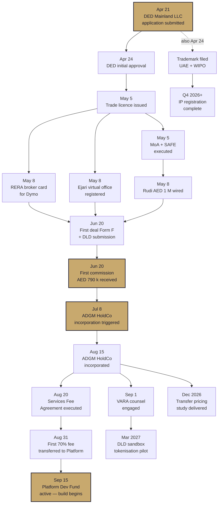
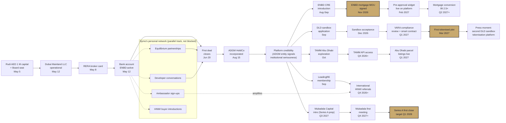
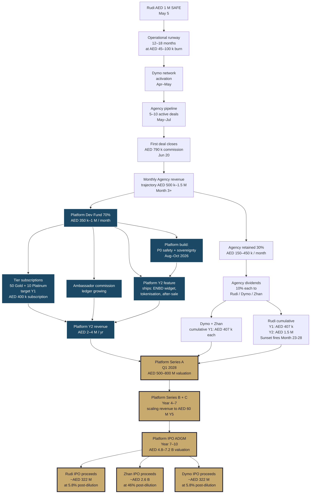
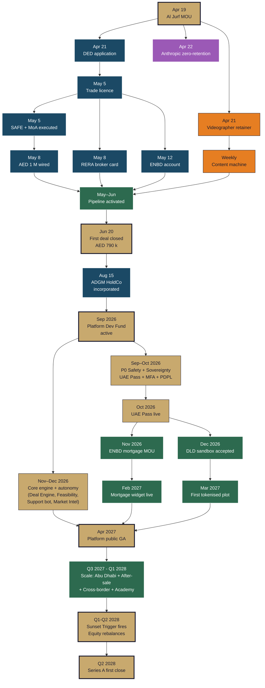

# DEPENDENCIES MAP

**Document:** Visual dependency trees (Mermaid) showing what blocks what across the 24-month plan.
**Prepared for:** Zhan, Dymo, Rudi, BSA, future hires.
**Prepared on:** 2026-04-20
**Branch:** `research/vision-and-competitors-2026-04-19`
**Parent:** `docs/roadmap/MASTER_IMPLEMENTATION_PLAN.md` §5
**Classification:** CONFIDENTIAL

---

## How to read these diagrams

Each diagram is a directed acyclic graph (DAG). An arrow `A → B` reads as **"A must complete before B can start."** Node labels include the month when the item is expected to land under the base case.

Four diagrams:

1. **Legal / regulatory dependency tree** — the critical path from Day 1 DED filing to full regulated operations.
2. **Product / engineering dependency tree** — what product milestones unblock what.
3. **Partnership dependency tree** — how relationship chains unlock revenue.
4. **Revenue dependency tree** — the cash conversion graph from Rudi's capital to Platform IPO.

All diagrams render natively in VS Code Markdown Preview and on GitHub / Gitea.

---

## §1 Legal / regulatory dependency tree

The hard critical path. If any node here slips 2 weeks, every downstream node slips with it. This is why Week 1 Day 1 is DED submission, not a deal call.

### 1.1 Critical-path insight

The shortest end-to-end chain is:

**DED submission (Apr 21) → trade licence (May 5) → RERA card (May 8) → first deal closes (Jun 20) → first commission (Jun 20) → ADGM triggered (Jul 8) → ADGM incorporated (Aug 15) → Services Fee executed (Aug 20) → Platform Dev Fund active (Sep 15).**

That's **~22 weeks from Day 1 to Platform build funded.** Any single node delayed by 2 weeks pushes the whole chain 2 weeks. Three nodes delayed = 6-week push into Phase 2 start.

### 1.2 Mitigations on the legal critical path

- **DED approval delay** → fast-track via formation agent (AED 5–8 k premium) compresses timeline 5 days.
- **Trade licence delay** → rare if formation agent is engaged; 99 % ship within stated window.
- **RERA card delay for Dymo** → Dymo's existing BRN transfers faster than a fresh issue; mitigation built in.
- **First deal delay** → 5-deal pipeline reduces probability of >1-month slip to < 10 %.
- **ADGM incorporation delay** → BSA starts filing in parallel with last 2 weeks of Phase 1; absorbs up to 2 weeks first-deal slip.

---

## §2 Product / engineering dependency tree

What product nodes unblock what. Nodes coloured by criticality to revenue.

```mermaid
flowchart TD
    subgraph Phase1["PHASE 1 — Already LIVE on zaahi.io"]
        P1A["114 parcels<br/>3D ZAAHI Signature"]
        P1B["Archibald AI<br/>(Cat agent)"]
        P1C["556 K PMTiles plots"]
        P1D["Ambassador tier system"]
        P1E["Owner / Buyer / Broker<br/>Phase 1 dashboards"]
    end

    subgraph Phase2["PHASE 2 — Month 4–9 shipping"]
        P2A["§31 Deal Engine<br/>state machine"]:::high
        P2B["§58 Feasibility<br/>Calc v2"]:::high
        P2C["UAE Pass + MFA"]:::critical
        P2D["Audit log<br/>§3.1"]:::critical
        P2E["PDPL Privacy Centre"]:::critical
        P2F["Rate limiting"]
        P2G["Security headers<br/>+ CSP"]
        P2H["CI/CD + Dependabot"]
        P2I["§66 Market Intel<br/>DLD nightly"]:::high
        P2J["Support chatbot"]:::high
        P2K["Tier gating<br/>(Gold / Platinum)"]:::high
        P2L["A5 Ambassador<br/>dashboard polish"]:::high
    end

    subgraph Phase3["PHASE 3 — Month 10–24"]
        P3A["Mistral fallback<br/>+ local LLM"]
        P3B["Fine-tune<br/>ZAAHI-RE-v1"]:::high
        P3C["Column encryption<br/>PII"]
        P3D["Network Intl<br/>payment gateway"]
        P3E["ENBD mortgage<br/>widget live"]:::critical
        P3F["DLD sandbox<br/>tokenised plot"]:::high
        P3G["Platform GA<br/>public launch"]:::critical
        P3H["ZAAHI Academy<br/>launched"]
        P3I["Cross-border<br/>mortgage + FX"]:::high
        P3J["After-sale PM<br/>module v1"]:::high
        P3K["Equinix DX1<br/>hardware migration"]
    end

    P1A --> P2A
    P1A --> P2B
    P1B --> P2J
    P1C --> P2I
    P1D --> P2K
    P1D --> P2L
    P1E --> P2A
    
    P2A --> P3E
    P2A --> P3F
    P2C --> P3G
    P2D --> P3G
    P2E --> P3G
    P2F --> P3G
    P2G --> P3G
    P2I --> P3I
    P2I --> P3J
    P2J --> P3G
    P2K --> P3G
    
    P3B --> P3G
    P3D --> P3E
    P3E --> P3I
    P3K --> P3G

    classDef critical fill:#E63946,stroke:#1A1A2E,stroke-width:2px,color:#FFFFFF
    classDef high fill:#C8A96E,stroke:#1A1A2E,stroke-width:2px,color:#1A1A2E
```

### 2.1 Key product insights

- **Platform GA depends on 7 P2 items shipping first.** If any slips, GA slips. Monitor all 7 at weekly product review.
- **ENBD mortgage widget needs Deal Engine + payment gateway.** 4-node prerequisite chain. If ENBD MOU signs Nov 2026 and all prerequisites shipped, widget launches by Jan–Feb 2027.
- **Tokenised plot needs Deal Engine + VARA counsel + smart contract.** Even with DLD sandbox acceptance, 3-node prerequisite. Plan accordingly.
- **Fine-tune ZAAHI-RE-v1 unblocks GA quality bar.** Without fine-tune, Archibald uses Claude-only path at higher cost. GA can launch without it; fine-tune deepens the moat post-launch.

---

## §3 Partnership dependency tree

How relationship unlocks cascade — from Rudi's capital to each major partnership outcome.

### 3.1 Partnership insights

- **Every bank / gov / ADGM / sovereign partnership depends on the ADGM HoldCo existing.** This is why Phase 1's "first deal → ADGM incorporation" is the single most important trigger in the first 6 months.
- **Dymo's network (dashed) runs in parallel — it doesn't need ADGM to produce Phase 1 revenue.** This is the key risk mitigation: even if ADGM / partnerships slip, Agency cash flow continues on Dymo's relationships.
- **Series A (Mubadala / BECO / Class 5 / 4DX) is the end of Phase 3.** Every earlier partnership is a compounding signal. No partnership = no VC interest. 5 partnerships = warm Series A pipeline.
- **IMKAN / Al Jurf is not in this diagram** — it's Rudi's venue, not a partner. Content moment, not revenue-dependency node.

---

## §4 Revenue dependency tree

From capital in to IPO out — the full cash conversion graph. Scaled to fit.

### 4.1 Revenue insights

- **Rudi's AED 1 M becomes AED 437 M on base case 437× MOIC.** That's the investor package thesis. Visible in this graph as A → J (dividends) + A → T (IPO proceeds).
- **Platform Dev Fund (blue) is the compounding engine.** Every Agency deal funds Platform investment. Year 2 Platform revenue is the first engine that can self-fund without Agency cash flow.
- **Sunset triggers (Rudi cumulative ≥ AED 2 M) fires around Month 23–28 on base case.** Before that, Rudi has 80 % Agency control; after, equal 33.34 %. Platform equity (80/10/10 Zhan / Dymo / Rudi) never rebalances.
- **IPO proceeds are the largest single cash event.** Prepare for it starting Phase 3 Q3 2027; 2-year runway to Series A means ~Year 4 Series B means ~Year 7 IPO earliest.

---

## §5 Integrated master dependency map

The full picture on one diagram. Simplified to top-20 nodes.

### 5.1 Pattern recognition

Moments (gold): the 5 irreversible milestones. Everything bends around these:
1. **Al Jurf MOU** — starting gun.
2. **First deal closed** — validates the revenue thesis.
3. **Platform Dev Fund active** — Platform build can begin.
4. **Platform public GA** — revenue model changes from agency-only to dual-engine.
5. **Sunset trigger fires → Series A** — investment thesis proven, Platform scaling begins.

Colour families:
- **Legal (blue)** — the critical path; any slippage cascades.
- **Tech (gold)** — the engineering build; on Zhan.
- **Biz (green)** — the partnerships + sales; on Dymo.
- **Brand (orange)** — the content machine; on videographer.
- **Sovereignty (purple)** — the independence work; background-threaded.

Zhan has hands on tech + sovereignty. Dymo has hands on biz + brand. Legal sits between them, counsel-driven. Each of the five can proceed with ~70 % parallelism if the single point of coordination (Monday stand-up + weekly Rudi update) is disciplined.

---

## Appendix — Rendering notes

- All Mermaid diagrams render in VS Code (with Mermaid extension), GitHub preview, Gitea preview.
- For high-resolution export: open this document in `docs/roadmap/DEPENDENCIES_MAP.md`, enable Mermaid rendering, screenshot or export via browser print.
- To publish in an investor deck: paste diagrams into mermaid.live → export PNG → drop into Keynote / Figma.

---

**End of DEPENDENCIES_MAP.md.** Parent: `MASTER_IMPLEMENTATION_PLAN.md`. Companion: `WEEKLY_CADENCE.md`, `AGENCY_PLAYBOOK.md`, `IMPLEMENTATION_CHECKLIST.md`.
