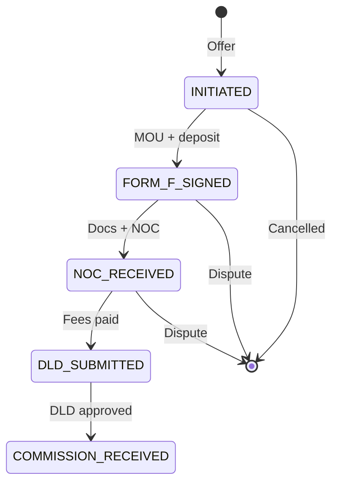

# SPEC 01 — Deal Engine MVP (Phase 1 Priority 1)

**Status:** DRAFT v1.0 · 2026-04-21
**Priority:** **1 of 13** (Q-11 owner-modified ranking)
**Target ship:** Month 3-4 (MVP v1), Month 5-6 (v2 polish)
**Effort:** 2-3 engineer-weeks (range 1.5 — 3.5) — existing code handles ~80 %
**Depends on:** Spec 02 Invoice/Commission (integration at DEAL_COMPLETED)
**Blocks:** Spec 03 Admin Panel (admin transition UI)
**Source commitments:**
- `docs/architecture/MASTER_TREE_ENHANCEMENT_PROPOSAL.md` §1.E E-4 (ratified)
- `docs/audit/OPEN_QUESTIONS_FOR_OWNERS.md` Q-22 B (MVP state machine, manual transitions, no auto-notifications v1) · Q-11 priority 1
- Master Tree v3 §31 Deal Engine · §03 Transactions
**Classification:** CONFIDENTIAL — internal engineering spec

---

## §1 Goal & Scope

**One-sentence goal:** Tighten the existing 11-step Deal Room so every Agency deal (starting with Plot 1 Mon 2026-06-22 Form F signing) flows through a guardrailed state machine with founder-visible 5-milestone owner-side pipeline, producing a fully audited COMPLETED transition that triggers Invoice auto-creation (Spec 02).

### Context — what already exists

Existing codebase has surprisingly complete Deal Room infrastructure:

- **Prisma `DealStatus`** enum — 12 values (INITIAL · DEAL_INITIATED · DEPOSIT_SUBMITTED · AGREEMENT_SIGNED · DOCUMENTS_COLLECTED · GOVERNMENT_VERIFIED · NOC_REQUESTED · TRANSFER_FEE_PAID · DLD_SUBMITTED · DEAL_COMPLETED · DISPUTE_INITIATED · DEAL_CANCELLED).
- **`src/lib/deal-flow.ts`** (140 lines) — 11-step user-facing `TIMELINE` + 15-action `ACTIONS` matrix + `validateAction()` state guard + role-based permissions (buyer/seller/broker) + `currentStepIndex()` helper.
- **`DealAuditEvent`** model — append-only ledger, txHash + documentHash fields, metadata Json.
- **`DealMessage`** model — deal-room chat.
- **API routes** — `GET /api/deals` (list) · `POST /api/deals` (create offer) · `GET /api/deals/[id]` (detail with participants + audit + documents + messages) · `PATCH /api/deals/[id]` (action dispatch) · `GET/POST /api/deals/[id]/messages` (chat).
- **`recordDealEvent()`** in `src/lib/blockchain.ts` — audit event + optional Polygon txHash.
- **`awardCommissions()`** + **`reverseCommissions()`** in `src/lib/ambassador.ts` — already wired into PATCH `/api/deals/[id]` on COMPLETE / CANCEL / DISPUTE.

**What's missing for MVP v1** is (1) the Enhancement Proposal E-4 "5 core states" owner-facing simplification, (2) admin transition UI (not today — transitions happen via Deal Room participants only), (3) owner-side pipeline board for Dymo, (4) document-upload gates at transitions, (5) integration hook into Spec 02 Invoice creation.

### In scope (MVP v1, ship Month 3-4)

- **5-milestone owner view** — maps existing 11-step timeline into 5 buckets: `Initiated · Form F Signed · NOC Received · DLD Submitted · Commission Received`. Used on Dymo's pipeline board + admin transition UI. Internal Prisma enum unchanged.
- **Admin transition UI** — `/admin/deals/[id]` with state-machine-aware action buttons, document-upload gate enforcement, founder-override capability (with reason + audit).
- **Owner-side pipeline board** — `/admin/deals` Kanban view by 5-milestone bucket. Dymo's primary daily-use screen.
- **Document-upload guards** — can't transition DEPOSIT_SUBMITTED → AGREEMENT_SIGNED without MOU document; can't NOC_REQUESTED → TRANSFER_FEE_PAID without NOC document. Enforced in `validateAction` extension.
- **Deal Engine + Spec 02 integration** — on DEAL_COMPLETED, fire `onDealCompleted()` from Spec 02 (atomic transaction).
- **State-transition audit trail** — every action writes `DealAuditEvent` with actor / from-status / to-status / document-refs / optional note (already exists; ensure every action path writes).
- **ZAAHI Service Fee freeze** — at DEAL_COMPLETED, freeze 2 % service fee onto `Deal.platformFeeFils` (already exists in `awardCommissions()` — verify + document).
- **Role correction** — existing ACTIONS define buyer / seller / broker roles. Admin override adds a 4th virtual "admin" role that can perform any action from any state with reason + elevated audit.

### v2 polish (Month 5-6, OUT of MVP)

- Auto-notifications (S-1 already queued for Month 5 per Enhancement Proposal §1.A S-2) — Email + WhatsApp + Telegram on each transition.
- Auto-transition suggestions — system detects NOC uploaded, prompts Dymo "Mark NOC received?" instead of requiring manual click.
- 11-state full visualisation (currently only 5 exposed at Dymo level; broker role sees 11 in v1 already).
- Deal-room attachments on chat (v1: one-document-upload-per-transition; v2: free-form attachments).
- Expiry warnings (deposit unpaid > 7 days, NOC pending > 14 days).
- Multi-party offers (seller vs buyer simultaneous submissions).

### Explicit non-goals v1

- NOT rebuilding `src/lib/deal-flow.ts` — existing is the foundation, additive changes only.
- NOT automated state transitions (Q-22 B: manual only v1).
- NOT automated email / SMS notifications (Q-22 B: none v1).
- NOT buyer / seller self-service external portal — Phase 2 scope.
- NOT integration with DLD / Trakheesi / RERA APIs (manual status update per regulatory outcome).
- NOT changing the Prisma `DealStatus` enum — 12 values preserved. Reconciliation is UI-only.

---

## §2 User Stories

### MUST

**U-1 (Dymo, broker).** As the Agency broker, I want a Kanban board at `/admin/deals` showing every active deal bucketed by 5 owner-facing milestones, so I see my pipeline status in < 5 seconds at my 10:00 stand-up.

**U-2 (Dymo, broker).** As the Agency broker, I want to click "Mark Form F Signed" on Plot 1 and the system enforces that an MOU document was uploaded before accepting the transition, so I never end up with a "signed" deal that has no paperwork to show.

**U-3 (Zhan, admin).** As the admin, I want a full 11-step transition history (audit trail) for every deal visible on `/admin/deals/[id]`, so any dispute reconstruction takes minutes, not days.

**U-4 (Zhan, admin).** As the admin, I want the moment I mark a deal DEAL_COMPLETED to atomically create the Agency Commission + Platform Service Fee invoices (Spec 02) and freeze `Deal.platformFeeFils` at 2 %, so the paperwork is ready the instant the commission settles in the bank.

**U-5 (Dymo, broker).** As the Agency broker, I want to filter the Kanban by time-since-last-transition and be warned on deals stale > 14 days, so I catch stalled negotiations early.

### SHOULD

**U-6 (Zhan, admin).** As the admin, I want a founder-override action that transitions a deal from any state to any state with a mandatory reason text, so I can correct mistakes or handle edge cases without writing SQL.

**U-7 (Zhan, admin).** As the admin, I want deal cancellation (CANCEL action) to automatically reverse any PENDING commissions (existing `reverseCommissions()` hook) AND mark related invoices REVERSED, so cleanup is one-click.

**U-8 (Zhan, admin).** As the admin, I want each state transition to include an optional "note to file" that persists to `DealAuditEvent.metadata`, so context that the action-type alone can't capture is still findable.

### COULD

**U-9 (Dymo, broker).** As the Agency broker, I want a weekly digest email Monday 08:00 listing every deal needing attention this week (stale · waiting on buyer · DLD appointment due), so Monday stand-up is prepped before I open the laptop. **Defer v2.**

**U-10 (Zhan, admin).** As the admin, I want the Deal Room chat (`DealMessage`) to support file attachments so negotiation artefacts live alongside the conversation. **Defer v2.**

---

## §3 Data Model

### 3.1 No Prisma enum changes

The 12-state `DealStatus` enum remains canonical. **MVP v1 is UI-only reconciliation**; internal state machine unchanged.

### 3.2 5-milestone UI bucket mapping

```typescript
// src/lib/deal-milestones.ts — NEW
import { DealStatus } from "@prisma/client";

export type OwnerMilestone =
  | "INITIATED"           // offer submitted through deposit pending (pre-MOU)
  | "FORM_F_SIGNED"       // MOU signed through document collection + gov checks
  | "NOC_RECEIVED"        // NOC obtained through transfer-fee-paid
  | "DLD_SUBMITTED"       // submitted to DLD (approved or not)
  | "COMMISSION_RECEIVED"; // DEAL_COMPLETED

export const MILESTONE_DEFS: Record<OwnerMilestone, {
  label: string;
  short: string;
  colorHex: string;                       // per CLAUDE.md palette
  coveredStatuses: DealStatus[];
  sortIndex: number;
}> = {
  INITIATED: {
    label: "Initiated",
    short: "Initiated",
    colorHex: "#6B7280",                  // SUBTLE grey
    coveredStatuses: ["INITIAL", "DEAL_INITIATED", "DEPOSIT_SUBMITTED"],
    sortIndex: 1,
  },
  FORM_F_SIGNED: {
    label: "Form F Signed",
    short: "Form F",
    colorHex: "#1B4965",                  // TEAL
    coveredStatuses: ["AGREEMENT_SIGNED", "DOCUMENTS_COLLECTED", "GOVERNMENT_VERIFIED"],
    sortIndex: 2,
  },
  NOC_RECEIVED: {
    label: "NOC Received",
    short: "NOC",
    colorHex: "#E67E22",                  // AMBER (per CLAUDE.md palette)
    coveredStatuses: ["NOC_REQUESTED", "TRANSFER_FEE_PAID"],
    sortIndex: 3,
  },
  DLD_SUBMITTED: {
    label: "DLD Submitted",
    short: "DLD",
    colorHex: "#C8A96E",                  // GOLD (active moment)
    coveredStatuses: ["DLD_SUBMITTED"],
    sortIndex: 4,
  },
  COMMISSION_RECEIVED: {
    label: "Commission Received",
    short: "Done",
    colorHex: "#2D6A4F",                  // GREEN
    coveredStatuses: ["DEAL_COMPLETED"],
    sortIndex: 5,
  },
};

// Terminal states shown outside the main Kanban
export const TERMINAL_STATUSES: DealStatus[] = ["DEAL_CANCELLED", "DISPUTE_INITIATED"];

export function milestoneForStatus(status: DealStatus): OwnerMilestone | null {
  for (const [m, def] of Object.entries(MILESTONE_DEFS)) {
    if (def.coveredStatuses.includes(status)) return m as OwnerMilestone;
  }
  return null;   // terminal or unknown
}
```

### 3.3 Document-upload guard augmentation

Extend `src/lib/deal-flow.ts` ACTIONS matrix with `requiresDocument`:

```typescript
interface ActionDef {
  fromStatuses: DealStatus[];
  toStatus: DealStatus;
  role: Role[];
  eventType: string;
  setFlags?: Partial<...>;
  requiresDocument?: DocumentType;     // NEW — if set, transition blocked unless Document of this type exists on the deal
}

// Examples:
SIGN_MOU:      { ..., requiresDocument: "SPA" },                 // Sale & Purchase Agreement uploaded
DOCS_COMPLETE: { ..., requiresDocument: "TITLE_DEED" },
NOC_RECEIVED:  { ..., requiresDocument: "NOC" },
DLD_SUBMIT:    { ..., requiresDocument: "POWER_OF_ATTORNEY" },   // if applicable
```

`validateAction` extension:

```typescript
// After existing checks in validateAction():
if (def.requiresDocument) {
  const hasDoc = await prisma.document.findFirst({
    where: { dealId: deal.id, type: def.requiresDocument },
  });
  if (!hasDoc) {
    return { ok: false, error: `Action ${action} requires ${def.requiresDocument} document uploaded first` };
  }
}
```

**Alternative (synchronous):** pass `deal.documents` array into `validateAction` so no DB round-trip. Implementation choice for Zhan.

### 3.4 Admin override action (new)

Add single meta-action `ADMIN_FORCE_TRANSITION` in ACTIONS:

```typescript
ADMIN_FORCE_TRANSITION: {
  fromStatuses: [...all 12 statuses...],       // admin can override from anywhere
  toStatus: "INITIAL",                          // placeholder — real target passed in body
  role: ["admin"],                              // new virtual role
  eventType: "ADMIN_OVERRIDE",
}
```

Admin role added to Role type: `export type Role = "buyer" | "seller" | "broker" | "admin";`

API route PATCH handler: if `action === "ADMIN_FORCE_TRANSITION"`, additionally require `body.targetStatus` + `body.reason` (mandatory; ≥ 20 chars) and `user.role === "ADMIN"`.

### 3.5 `DealAuditEvent` usage

Existing model already captures transitions. No model change needed. MVP v1 just ensures every code path writes an event, no silent transitions.

---

## §4 API Design

All routes extend existing endpoints; no new endpoints in MVP v1 except admin-facing.

### 4.1 Extensions to existing endpoints

| Method | Path | Change | Purpose |
|---|---|---|---|
| GET | `/api/deals` | Add filter `?milestone=FORM_F_SIGNED` + `?staleDays=14` | Dymo Kanban board |
| PATCH | `/api/deals/[id]` | Add handling for `action=ADMIN_FORCE_TRANSITION` with `targetStatus` + `reason` body | Admin override |
| PATCH | `/api/deals/[id]` | Enforce `requiresDocument` guard from `deal-flow.ts` | Doc gates |
| PATCH | `/api/deals/[id]` | On `action=COMPLETE`, fire `onDealCompleted()` from Spec 02 inside same `$transaction` | Invoice integration |

### 4.2 New admin endpoints

| Method | Path | Purpose | Auth |
|---|---|---|---|
| GET | `/api/admin/deals` | All deals filtered by milestone / stale days / terminal status — Dymo Kanban data source | Admin |
| GET | `/api/admin/deals/stale` | Deals whose last transition > 14 days ago | Admin |
| POST | `/api/admin/deals/[id]/override` | Admin force-transition (wraps ADMIN_FORCE_TRANSITION action for clarity) | Admin |

### 4.3 Zod schemas

```typescript
// src/lib/schemas/deal.ts — extends existing
export const DealActionSchema = z.object({
  action: z.enum([
    "ACCEPT", "COUNTER", "REJECT", "DEPOSIT", "SIGN_MOU",
    "DOCS_COMPLETE", "GOV_VERIFIED", "NOC_REQUEST", "NOC_RECEIVED",
    "FEES_PAID", "DLD_SUBMIT", "DLD_APPROVE", "COMPLETE",
    "CANCEL", "DISPUTE",
    "ADMIN_FORCE_TRANSITION",                         // NEW
  ]),
  counterPriceAed: z.number().positive().optional(),
  conditions: z.string().max(1000).optional(),
  documentHash: z.string().regex(/^[a-f0-9]{64}$/).optional(),
  dldReference: z.string().max(100).optional(),
  rating: z.number().int().min(1).max(5).optional(),
  note: z.string().max(1000).optional(),              // NEW — optional note attached to audit event

  // For ADMIN_FORCE_TRANSITION only
  targetStatus: z.enum([...12 DealStatus values]).optional(),
  reason: z.string().min(20).max(500).optional(),
}).refine(
  (v) => v.action !== "ADMIN_FORCE_TRANSITION" || (!!v.targetStatus && !!v.reason),
  { message: "ADMIN_FORCE_TRANSITION requires targetStatus and reason" },
);

export const DealFilterSchema = z.object({
  milestone: z.enum([...5 OwnerMilestone values]).optional(),
  status: z.enum([...12 DealStatus values]).optional(),
  staleDays: z.number().int().positive().max(365).optional(),
  brokerId: z.string().cuid().optional(),
  includeTerminal: z.boolean().default(false),
});
```

### 4.4 Response shapes

```typescript
type DealListItem = {
  id: string;
  parcel: { id: string; plotNumber: string; district: string; area: number };
  sellerName: string;
  buyerName: string;
  brokerName: string | null;
  status: DealStatus;
  milestone: OwnerMilestone | null;
  milestoneLabel: string;
  agreedPriceAed: number | null;        // serialised from BigInt fils
  platformFeeAed: number | null;
  daysSinceLastTransition: number;
  isStale: boolean;                     // > 14 days
  updatedAt: string;                    // ISO
};
```

### 4.5 Rate limits (per Enhancement Proposal S-7)

- PATCH `/api/deals/[id]`: 30 req/min/user (state transitions are high-value, not high-volume).
- GET `/api/admin/deals`: 600 req/min/admin (Kanban polls).
- POST `/api/admin/deals/[id]/override`: 10 req/min/admin (rare + audit-heavy).

---

## §5 UI Components

### 5.1 Page routes

- `/admin/deals` — Dymo Kanban board (owner-side pipeline primary view).
- `/admin/deals/[id]` — Single-deal admin detail (transitions + override + audit trail + documents).
- `/deals/[id]` — Existing Deal Room (buyer / seller / broker view, unchanged in v1).

### 5.2 Kanban board component hierarchy

```
/admin/deals/
  page.tsx                    — DealsKanbanPage
    PipelineFilters           — broker filter, stale-toggle, include-terminal toggle
    KanbanColumn x 5          — one per milestone
      ColumnHeader            — count + total AED in column
      DealCard                — plot # · district · agreed price · days since last transition · stale badge
        DealCardActions       — View · Quick-transition popover
    StaleDealsStrip (below)   — deals > 14 days stale in a horizontal strip
    TerminalDealsCollapsed    — cancelled / disputed, collapsed accordion
```

### 5.3 Admin detail page component hierarchy

```
/admin/deals/[id]/
  page.tsx                    — DealAdminDetailPage
    DealSummaryHeader         — parcel info · parties · prices · current status
    MilestoneTimeline         — 5 gold/grey circles · filled for completed milestones
    TransitionActionPanel     — legal actions from current state · document-upload slot · transition button
    DocumentsPanel            — upload · list · type tags · hash verification
    AuditEventTimeline        — chronological events · actor · timestamp · metadata
    DealMessagesPanel         — existing chat (iframe from /deals/[id] or reuse)
    AdminOverrideModal        — hidden · opens via "Override" button · target-status select + reason textarea (min 20 chars) + confirm
    InvoicesLinked            — after DEAL_COMPLETED · shows the 2 auto-created invoices from Spec 02
```

### 5.4 Design

Per CLAUDE.md UI Style Guide. Kanban columns have `rgba(10, 22, 40, 0.4)` translucent cards with gold-on-hover border. Milestone circles use the colors in `MILESTONE_DEFS` (subtle grey → teal → amber → gold → green).

### 5.5 Mermaid — 5-milestone state flow (user-facing)



### 5.6 Mermaid — internal 11-step → 5-milestone reconciliation

```mermaid
flowchart LR
    subgraph INITIATED [1 · Initiated]
        A[INITIAL Offer Submitted]
        B[DEAL_INITIATED Awaiting Deposit]
        C[DEPOSIT_SUBMITTED Deposit Confirmed]
    end
    subgraph FORM_F [2 · Form F Signed]
        D[AGREEMENT_SIGNED MOU Signed]
        E[DOCUMENTS_COLLECTED]
        F[GOVERNMENT_VERIFIED]
    end
    subgraph NOC [3 · NOC Received]
        G[NOC_REQUESTED - nocReceived=false]
        H[NOC_REQUESTED - nocReceived=true]
        I[TRANSFER_FEE_PAID]
    end
    subgraph DLD [4 · DLD Submitted]
        J[DLD_SUBMITTED - dldApproved=false]
        K[DLD_SUBMITTED - dldApproved=true]
    end
    subgraph DONE [5 · Commission Received]
        L[DEAL_COMPLETED]
    end
    A --> B --> C --> D --> E --> F --> G --> H --> I --> J --> K --> L
```



---

## §6 Business Logic

### 6.1 Action dispatcher (existing + extensions)

```typescript
// src/app/api/deals/[id]/route.ts — PATCH handler pseudocode (extends existing)

async function PATCH(req, { params }) {
  const userId = await getApprovedUserId(req);
  const body = DealActionSchema.parse(await req.json());

  await prisma.$transaction(async (tx) => {
    const deal = await tx.deal.findUniqueOrThrow({
      where: { id: params.id },
      include: { documents: true },
    });

    // Validate — NEW: pass documents for requiresDocument guard
    const v = await validateActionWithDocs(deal, userId, body.action, user.role);
    if (!v.ok) throw new HttpError(400, v.error);

    // Existing: compute newFlags + newStatus
    // NEW: for ADMIN_FORCE_TRANSITION, use body.targetStatus directly
    const newStatus = body.action === "ADMIN_FORCE_TRANSITION" ? body.targetStatus : v.def.toStatus;

    // Update
    await tx.deal.update({
      where: { id: deal.id },
      data: { status: newStatus, ...v.def.setFlags },
    });

    // Audit event — ENSURE every action writes one (existing, but double-check COMPLETE + DISPUTE + CANCEL paths)
    await tx.dealAuditEvent.create({
      data: {
        dealId: deal.id,
        eventType: v.def.eventType,
        metadata: { from: deal.status, to: newStatus, actor: userId, note: body.note, reason: body.reason },
        documentHash: body.documentHash,
      },
    });

    // Record on blockchain (existing)
    await recordDealEvent(deal.id, v.def.eventType);

    // NEW — Spec 02 integration on COMPLETE
    if (body.action === "COMPLETE") {
      await onDealCompleted(deal.id, userId, tx);  // from Spec 02
    }

    // Existing — commission lifecycle
    if (body.action === "COMPLETE") await awardCommissions(tx, deal);
    if (body.action === "CANCEL" || body.action === "DISPUTE") await reverseCommissions(tx, deal);

    // NEW — also reverse invoices on CANCEL / DISPUTE
    if (body.action === "CANCEL" || body.action === "DISPUTE") {
      const invs = await tx.invoice.findMany({ where: { dealId: deal.id, status: { in: ["ISSUED", "PAID"] } } });
      for (const inv of invs) await reverseInvoice(inv.id, `Deal ${body.action.toLowerCase()}`, userId, tx);
    }
  });

  return NextResponse.json({ ok: true });
}
```

### 6.2 Stale deal detection

```typescript
// src/lib/deal-milestones.ts
export const STALE_THRESHOLD_DAYS = 14;

export function isStale(updatedAt: Date): boolean {
  const ageMs = Date.now() - updatedAt.getTime();
  return ageMs > STALE_THRESHOLD_DAYS * 24 * 60 * 60 * 1000;
}

export function daysSinceLastTransition(deal: { updatedAt: Date }): number {
  return Math.floor((Date.now() - deal.updatedAt.getTime()) / (24 * 60 * 60 * 1000));
}
```

### 6.3 Milestone filter on admin list

```typescript
// src/app/api/admin/deals/route.ts
export async function GET(req: NextRequest) {
  // ... auth ...
  const filter = DealFilterSchema.parse(Object.fromEntries(req.nextUrl.searchParams));
  const where: Prisma.DealWhereInput = {};
  if (filter.milestone) {
    where.status = { in: MILESTONE_DEFS[filter.milestone].coveredStatuses };
  } else if (!filter.includeTerminal) {
    where.status = { notIn: TERMINAL_STATUSES };
  }
  if (filter.brokerId) where.brokerId = filter.brokerId;
  if (filter.staleDays) {
    where.updatedAt = { lt: new Date(Date.now() - filter.staleDays * 24 * 60 * 60 * 1000) };
  }
  const deals = await prisma.deal.findMany({ where, orderBy: { updatedAt: "desc" }, include: { ... } });
  return NextResponse.json(deals.map(toListItem));   // attaches milestone, milestoneLabel, daysSinceLastTransition, isStale
}
```

### 6.4 Edge cases

1. **Dual role user** — broker who is also buyer on a different deal gets the correct role per deal via existing `getRole()` function.
2. **Deal with null broker** — `brokerId?` nullable per schema. Commission / invoice flow handles gracefully (awardCommissions already null-safe).
3. **Admin override to terminal state (DEAL_CANCELLED)** — triggers reverse commission + reverse invoice flows as if user cancelled. Reason required.
4. **Admin override from COMPLETED back to DLD_SUBMITTED** — rare legal-reversal case; requires reason ≥ 20 chars. Triggers invoice reversal (existing + Spec 02) but DOES NOT un-create invoices — creates mirror reversal invoices. Commission rows flip to REVERSED.
5. **Simultaneous PATCH by two roles** — row-level lock inside `$transaction`; second call fails with 409 "deal status changed; refresh".
6. **Document upload race** — user uploads MOU, clicks SIGN_MOU same second. Document is in Prisma already; action succeeds. If click-first-upload-second, action 400s with "requires SPA document".
7. **Rating on COMPLETE** — existing code allows 1-5. Keep in MVP; both parties can rate.
8. **DEAL_CANCELLED from INITIAL** — buyer can cancel their own offer. Existing ACTION CANCEL supports this. No invoice reversal needed (none created yet).

---

## §7 Testing Criteria

### 7.1 Unit tests

- `milestoneForStatus()` — all 12 statuses mapped correctly (incl. null for DEAL_CANCELLED / DISPUTE_INITIATED).
- `isStale()` / `daysSinceLastTransition()` — boundary cases (13.9 days, 14.0 days, 14.1 days).
- `validateActionWithDocs()` — transition blocked without required doc; allowed with doc.
- Admin override — reason < 20 chars rejected; non-admin role rejected.
- DealFilterSchema — valid + invalid combinations.

### 7.2 Integration tests

- **E2E 1 — Plot 1 happy path through 11 states.** Seed: deal at INITIAL. Fire each action in order (buyer POSTs offer, seller ACCEPT, buyer DEPOSIT, ..., COMPLETE). After each, assert status + flags + audit event written. At COMPLETE: assert invoices created (Spec 02 integration), platformFeeFils frozen, commissions awarded.
- **E2E 2 — Document gate.** At DEPOSIT_SUBMITTED → SIGN_MOU without uploading SPA document: assert 400. Upload SPA, retry: assert 200.
- **E2E 3 — Admin override.** Admin transitions deal from NOC_REQUESTED back to DEPOSIT_SUBMITTED (legal-reversal). Assert audit event includes reason. No commission reversal (not at terminal).
- **E2E 4 — Cancel after commission paid.** Mark COMPLETE → commission PENDING → admin marks commission PAID → invoice issued + paid → admin CANCEL deal: assert commission REVERSED + invoice REVERSED (mirror created).
- **E2E 5 — Kanban filter.** Seed 5 deals in 5 different milestones + 1 stale. Fetch `/api/admin/deals?milestone=FORM_F_SIGNED&staleDays=14`: assert exactly the matching deal returned.
- **E2E 6 — Simultaneous PATCH.** Two requests hit PATCH same deal same millisecond: first succeeds, second returns 409 conflict.

### 7.3 Manual acceptance test checklist

- [ ] Dymo opens `/admin/deals` Monday 10:00 stand-up; sees 5 Kanban columns + current pipeline at a glance (5 seconds).
- [ ] Every transition click logs a `DealAuditEvent`; chronological timeline correctly displayed.
- [ ] Document-upload gate fires on SIGN_MOU / NOC_RECEIVED / DLD_SUBMIT; unblock requires correct DocumentType.
- [ ] Plot 1 test deal runs full 11-state cycle in staging (Tue-Thu Week 9 dress rehearsal before real Jun 19).
- [ ] On Plot 1 real COMPLETE: 2 Invoice rows auto-created (Agency + Platform), Deal.platformFeeFils = 2 % frozen, `awardCommissions` fires if ambassador referral.
- [ ] Admin override requires ≥ 20 char reason; silent overrides impossible.
- [ ] Stale badge fires on any deal last-updated > 14 days.
- [ ] `pnpm build` + `pnpm test` green; CLAUDE.md SMOKE TEST passes.

### 7.4 Pre-production dress rehearsal

- **Mon Jun 15 2026 (Islamic New Year holiday — internal only).** Staging Plot 1 test deal walks full cycle. Any 400 / 500 surfaces; fix before Tuesday.
- **Tue Jun 16 — real Plot 1 DLD submission day.** Real deal enters NOC_REQUESTED state by Tuesday afternoon; rest of week runs production.
- **Fri Jun 19 — first commission moment.** Production DEAL_COMPLETED fires invoices live. Admin downloads ZAAHI-INV-2026-0001. Signed attestation in `docs/decisions/`.

---

## §8 Non-Functional Requirements

### 8.1 Performance

- Kanban page initial paint < 1.5 s (p95) at Phase 1 scale (< 20 active deals).
- State transition PATCH < 300 ms (p95) excluding Spec 02 invoice-gen (which is + 500 ms).
- Audit-event insert < 50 ms (fire-and-forget on background thread if perf matters; synchronous v1).

### 8.2 Security

- PATCH endpoint already behind `getApprovedUserId` + `validateAction` role check. Admin override additionally requires `role = ADMIN` column on `User`.
- Audit events are **append-only** — no UPDATE or DELETE endpoints. Existing schema supports this; enforce at route-handler level (reject any attempts).
- `recordDealEvent` optional Polygon txHash gives tamper-evident trail even if Postgres compromised.
- Rate limit per Enhancement Proposal S-7.

### 8.3 Accessibility (WCAG AA)

- Kanban board: columns have heading `role="region"` + `aria-label`. Drag-drop (if added — v2) has keyboard fallback.
- Milestone timeline circles: each has `aria-current` on the active one + semantic text label for screen-reader.
- Transition-action dropdown is keyboard-navigable.

### 8.4 Internationalisation

- Dymo / Zhan operate in English; Arabic labels deferred to v2 (no external users Phase 1, no need).
- Deal Room chat already supports any language (free text).
- Milestone labels translatable via `src/lib/translate.ts` pattern when needed.

### 8.5 Audit trail

Every state transition writes to `DealAuditEvent` synchronously. Additionally, CLAUDE.md-mandated `logAudit()` (Enhancement Proposal S-1) for meta-actions (admin override, document-gate bypass attempts).

---

## §9 Effort Estimate

| Phase | Hours | Description |
|---|:-:|---|
| 5-milestone module | 3-4 | `src/lib/deal-milestones.ts` + colours + mapping + tests |
| deal-flow.ts extension | 4-6 | `requiresDocument` guard + admin role + ADMIN_FORCE_TRANSITION action |
| API routes | 6-8 | Filter query extensions + admin endpoints + Zod schemas + PATCH integration |
| Kanban board UI | 12-16 | `/admin/deals` page + drag-drop-free Kanban columns + stale strip |
| Admin detail page | 10-14 | `/admin/deals/[id]` + transition panel + document panel + override modal + audit timeline |
| Spec 02 integration | 2-3 | Wire `onDealCompleted()` + invoice reversal on cancel |
| Unit + integration tests | 8-10 | 5 E2E scenarios + unit cases |
| Dress rehearsal + polish | 4-6 | Staging walk + doc-gate edge cases + UI polish |
| **TOTAL** | **49-67 hours** | **= ~1.5-2 engineer-weeks at 40 hrs/week** |

Realistic at Phase 1 Zhan allocation (15 % engineering + 20 % deal support = ~14 hrs / week engineering): **3-4 calendar weeks**.

**Target start:** Week 7 (Mon Jun 1 2026) — AFTER Spec 02 ships Week 6.
**Target complete:** Week 10 end (Fri Jun 26 2026).

But **Plot 1 first deal runs through states starting Week 9 (Jun 15)**. Deal Engine MVP must support Plot 1's full cycle from Week 9 — either ship pre-Week-9 OR ship incrementally (validateAction + Kanban first by Week 8; admin detail page + override by Week 10). Staged rollout acceptable.

---

## §10 Success Criteria

### Zhan knows it's done when

- `pnpm build` + `pnpm test` green.
- 5 E2E scenarios pass against seeded fixtures.
- Plot 1 test deal (staging) runs Initial → Completed cycle end-to-end; audit events + invoices verify.
- Real Plot 1 COMPLETE Fri Jun 19 2026 fires invoices atomically.
- CLAUDE.md SMOKE TEST checklist passes.

### Dymo verifies it works for daily workflow when

- He opens `/admin/deals` and in 5 seconds knows which deals need attention this week.
- Clicking "Mark NOC Received" feels obvious — doesn't need Zhan to explain which action maps to which status.
- Stale-deal warnings surface the two Plot 2-like pipelines before Dymo has to think about them.

### Founder attestation Month 3 end

- Plot 1 completed, invoices issued automatically, commission paid on time, audit trail reconstructs deal without gaps. Signed attestation in `docs/decisions/`.

---

## §10.A Zhan Quick Start Hints

### First 5 minutes opening this spec

1. Read §1 Context (already exists) — 80 % of the codebase is done.
2. Open `src/lib/deal-flow.ts` — this is the state-machine source of truth. 140 lines.
3. Open `src/app/api/deals/[id]/route.ts` PATCH handler — that's where you extend.
4. Skim §6.1 dispatcher pseudocode — minimal diff from existing.
5. Check §7.3 manual acceptance + §7.4 pre-prod dress rehearsal.

### 30-minute smoke test to validate your understanding

- Open Prisma studio · query `SELECT DISTINCT status FROM "Deal"` · confirm you see real deal statuses (should be empty pre-Plot-1).
- Create a new file `src/lib/deal-milestones.ts` with just the `OwnerMilestone` type + `MILESTONE_DEFS` object. Commit as a stub. You've proved the mapping.
- Write a failing test `expect(milestoneForStatus("NOC_REQUESTED")).toBe("NOC_RECEIVED")`. Make it pass. You've validated §3.2.

### If stuck, check these files first

- `src/lib/deal-flow.ts` (140 lines — ALL existing state machine).
- `src/app/api/deals/[id]/route.ts` (existing PATCH — existing action dispatch).
- `src/lib/ambassador.ts` lines 85-260 (`awardCommissions` already called on COMPLETE).
- `src/lib/blockchain.ts` (`recordDealEvent` — how existing audit events are written).
- `prisma/schema.prisma` lines 167-245 (Deal + DealMessage + DealAuditEvent models).
- CLAUDE.md UI Style Guide (Kanban design must conform).

### Common pitfalls from research

- **Do NOT** change the Prisma `DealStatus` enum. The 12-state enum is canonical + mirrors `backend/services/deal_engine.ts`. Changing it would break downstream systems.
- **Do NOT** replace the 11-step timeline. Dymo sees 5 buckets; system internally tracks 11. Reconciliation is UI only.
- **Do NOT** add auto-transitions (Q-22 B explicit: manual only v1).
- **Do NOT** add email / SMS auto-notifications (v2 Month 5-6).
- **Do NOT** skip audit events on any transition path — silent transitions destroy the audit trail and fail Rudi's DD review in Phase 3.
- **Do NOT** fire invoice creation outside the `$transaction` that updates the Deal — atomicity is required for consistency.
- **Do NOT** delete DealAuditEvent rows ever. Reverse with a new event type like `REVERSAL_LOGGED` if needed.
- **Do NOT** ship Kanban UI with drag-drop in v1 — forces accessibility + complexity that aren't needed. Click-to-open + action-menu is enough.

---

**End of SPEC 01 — Deal Engine MVP.**

Next in writing sequence: `03-ADMIN_PANEL_SPEC.md`. Execution order per Q-11: Spec 02 → **this spec** → Spec 03 → Spec 04.
