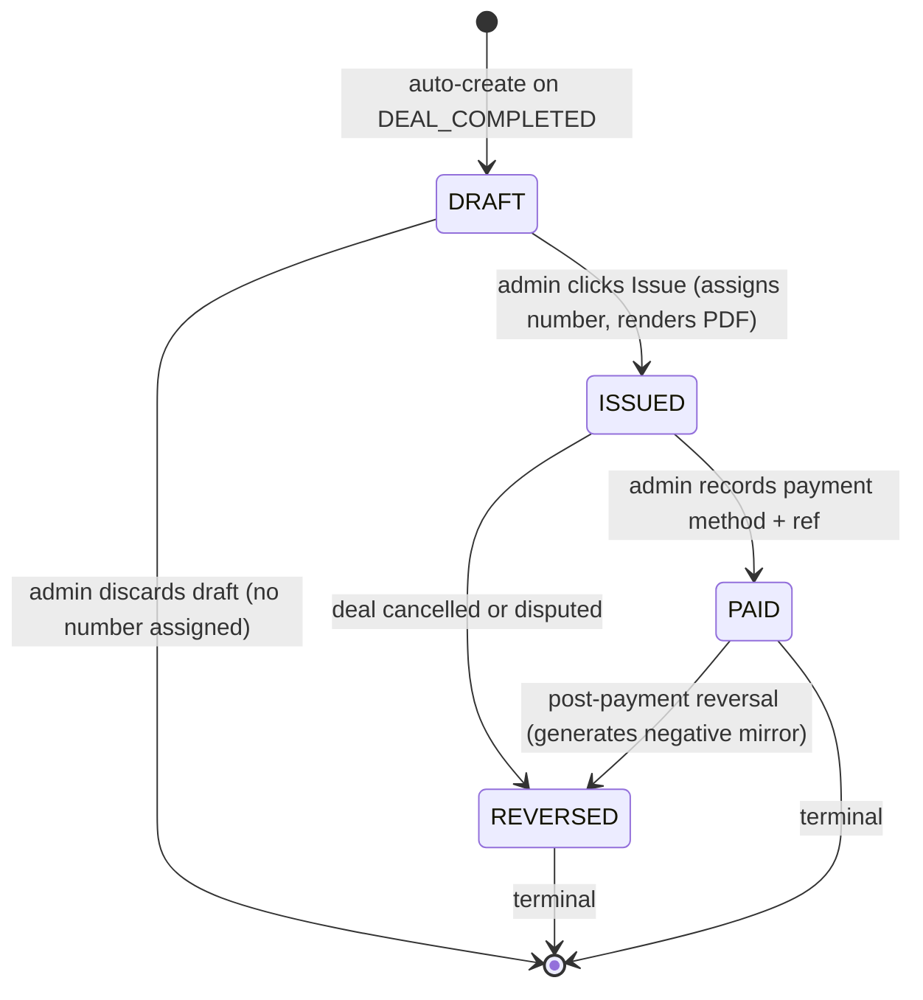

# SPEC 02 — Invoice + Commission Tracker (Phase 1 Priority 2)

**Status:** DRAFT v1.0 · 2026-04-21
**Priority:** **2 of 13** (Q-11 owner-modified ranking) — promoted from Priority 5 because must ship BEFORE first Agency commission Fri 2026-06-19
**Target ship:** Month 2-3 (end by Thu 2026-06-18 at the latest)
**Effort:** 2 engineer-weeks realistic (range 1.5–3 eng-weeks)
**Depends on:** None (new greenfield)
**Blocks:** Spec 01 Deal Engine (invoice trigger on DEAL_COMPLETED) · Spec 03 Admin Panel (commission payout UI)
**Source commitments:**
- `docs/architecture/MASTER_TREE_ENHANCEMENT_PROPOSAL.md` §1.C AU-3 (ratified)
- `docs/audit/OPEN_QUESTIONS_FOR_OWNERS.md` Q-11 priority 2
- Master Tree v3 §03 Transactions · §18 Ambassador · §32 Escrow · §62 Legal Engine
**Classification:** CONFIDENTIAL — internal engineering spec

---

## §1 Goal & Scope

**One-sentence goal:** Ship a UAE-FTA-compliant Tax Invoice + Commission payout tracker that auto-fires on every DEAL_COMPLETED, so the Agency's first commission (AED 790 k, Plot 1, Fri 2026-06-19) settles with a legally-issued paper-compliant Tax Invoice referencing the Agency TRN from Day 1 of commerce.

### In scope (MVP v1, ship Month 2-3)

- `Invoice` Prisma model + migration.
- Three invoice types: `AGENCY_COMMISSION` · `PLATFORM_SERVICE_FEE` · `AMBASSADOR_PAYOUT`.
- Sequential invoice numbering (ZAAHI-INV-2026-0001 pattern · resets by year).
- VAT 5 % line (hardcoded rate constant · ready for rate-change via admin panel when FTA updates).
- FTA Tax Invoice PDF generator (Puppeteer-driven Next.js route `/api/invoices/[id]/pdf`).
- Auto-create trigger on `DEAL_COMPLETED` status transition (Agency commission + Platform service fee invoices both fired in the same DB transaction that flips the Deal status).
- Reversal flow (invoice `status = REVERSED`, credit-note generated) on `DEAL_CANCELLED` or `DISPUTE_INITIATED`.
- Commission payout admin UI (list · filter by status · mark PAID / REVERSED · record payout method + ref).
- Prisma schema comment fix on `Deal.platformFeeFils` (0.25 % → 2 %) to match reality.
- TRN field on `User` (admin-editable, empty-string allowed pre-registration).

### v2 polish (Month 5-6, OUT of MVP)

- 2026 e-invoicing ASP integration (mandatory 1 Jul 2026 phased rollout; large biz threshold AED 50 M revenue triggers 1 Jan 2027 — ZAAHI below threshold Y1, phased July 2027 baseline).
- XML/UBL/PINT-AE structured invoice export.
- FTA e-Billing System direct submission.
- Bulk invoice operations (cancel N, re-issue, period consolidation).
- Multi-currency invoicing (USD, EUR display; AED stays settlement).
- Ambassador payout automation (Network International · TRC-20 USDT auto-send).

### Explicit non-goals v1

- NOT an accounting system — invoices reconcile to Xero / Zoho Books via CSV export, no GL entries internally.
- NOT a full AR / AP module — payable is one-way (Agency → Platform, Agency → Ambassador).
- NOT generating Tax Credit Notes for reversal — we generate a reversal Invoice with negative amounts (FTA-acceptable pattern; simpler code).
- NOT supporting VAT exemptions / zero-rated supplies (not applicable to real-estate brokerage commission).
- NOT client-self-service invoice request (external participants Phase 2).

### 2026 e-invoicing transition note

UAE mandates XML-structured e-invoicing via Accredited Service Provider from 1 Jul 2026 (phased). ZAAHI Y1 revenue < AED 50 M threshold → mandatory compliance only from Jul 2027 (per FTA phased roadmap). **MVP v1 generates paper-compliant PDF (legal under current rules + first 15-18 months). V2 Month 5-6 adds ASP integration before Y2 widens the requirement.** Spec aligns with this phasing; Zhan does not need to solve ASP in Phase 1.

---

## §2 User Stories

### MUST

**U-1 (Dymo, broker).** As the Agency broker, I want a Tax Invoice to auto-generate the moment a deal status flips to DEAL_COMPLETED, so I can email it to the seller within the same hour without opening a spreadsheet.

**U-2 (Zhan, admin).** As the admin, I want every commission invoice to carry our sequential ZAAHI-INV-2026-NNNN number, TRN, VAT 5 % line, and totals formatted per FTA Tax Invoice standard, so our first deal's paperwork is audit-defensible.

**U-3 (Zhan, admin).** As the admin, I want the Platform inter-company Service Fee invoice (Agency → ADGM HoldCo, 70 % of commission) to fire in the same DB transaction as the Agency commission invoice, so the two-sided transaction is atomic and transfer-pricing traceable.

**U-4 (Zhan, admin).** As the admin, I want a Commission payout list filtered by status (PENDING / PAID / REVERSED) with one-click "mark paid · enter bank ref" action, so Ambassador payouts run in < 10 minutes per month at Phase 1 scale.

**U-5 (Dymo, broker).** As the broker, I want a cancelled deal to reverse all 3 invoices (Agency · Platform · Ambassador) with credit-mirror invoices, so our books never show revenue on a cancelled deal.

### SHOULD

**U-6 (Zhan, admin).** As the admin, I want to download any invoice as PDF via a one-click action on the invoice list page, so I can attach to email without navigating away.

**U-7 (Zhan, admin).** As the admin, I want to override invoice line-item amounts in exceptional cases (e.g., partial commission split with external broker) before the invoice is finalised, so my hands aren't tied by rigid auto-calc.

**U-8 (Zhan, admin).** As the admin, I want Invoice line items to carry a human-readable description sourced from the Deal (e.g., "Brokerage commission — Plot 6457940 Jumeirah Bay Island · ZAAHI Agency"), so printed invoices read naturally to a non-technical reader.

### COULD

**U-9 (Dymo, broker).** As the broker, I want an "issue duplicate" action that regenerates the PDF without assigning a new invoice number, so I can re-send a client-lost copy without breaking the sequence.

**U-10 (Zhan, admin).** As the admin, I want a monthly CSV export of all invoices + commissions (AR aging · VAT summary · commission payout summary), so my bookkeeper (Month 2+) imports to Xero without manual re-entry.

---

## §3 Data Model

### 3.1 New Prisma model — `Invoice`

```prisma
enum InvoiceType {
  AGENCY_COMMISSION         // Agency → seller/buyer (brokerage fee)
  PLATFORM_SERVICE_FEE      // Agency → ADGM HoldCo (inter-company 70% service fee)
  AMBASSADOR_PAYOUT         // Agency → Ambassador (commission distribution)
}

enum InvoiceStatus {
  DRAFT          // admin-editable, not yet finalised
  ISSUED         // finalised, assigned number, PDF rendered, IMMUTABLE except status
  PAID           // payment recorded (for AGENCY_COMMISSION & PLATFORM_SERVICE_FEE) / payout recorded (for AMBASSADOR_PAYOUT)
  REVERSED       // deal cancelled; paired with a negative mirror Invoice
}

model Invoice {
  id               String         @id @default(cuid())
  // Sequential human-readable number — format: ZAAHI-INV-YYYY-NNNN
  // Assigned at ISSUED transition (NOT at DRAFT create). Unique per year.
  invoiceNumber    String?        @unique
  type             InvoiceType
  status           InvoiceStatus  @default(DRAFT)

  // Relations — at least one populated depending on type
  dealId           String?
  deal             Deal?          @relation(fields: [dealId], references: [id])
  commissionId    String?                         // for AMBASSADOR_PAYOUT
  commission      Commission?    @relation(fields: [commissionId], references: [id])
  parentInvoiceId String?                         // reversal mirror: parent is the original
  parentInvoice   Invoice?       @relation("ReversalChain", fields: [parentInvoiceId], references: [id])
  reversal        Invoice?       @relation("ReversalChain")

  // Supplier (issuing party) snapshot — denormalised so future User edits don't alter historic invoices
  supplierName     String                         // "ZAAHI Real Estate LLC"
  supplierTrn      String                         // 15-digit TRN (empty string pre-registration; MUST be filled before ISSUED)
  supplierAddress  String                         // full legal address

  // Customer (receiving party) snapshot
  customerName     String
  customerTrn      String?                        // nullable — individual buyers / sellers may not be registered
  customerAddress  String?

  // Money — BigInt fils; see CLAUDE.md rule "все суммы в fils"
  subtotalFils     BigInt                         // taxable amount (AED × 100)
  vatRatePct       Decimal  @db.Decimal(5, 2)    // 5.00 today; configurable for rate changes
  vatFils          BigInt                         // subtotal × vatRatePct / 100
  totalFils        BigInt                         // subtotal + vat
  currency         String   @default("AED")      // ISO 4217 — only AED supported v1

  // Content
  description      String                         // human-readable line description (e.g. "Brokerage commission — Plot 6457940 Jumeirah Bay Island")
  notesToCustomer  String?                        // optional payment terms, bank instructions, etc.

  // Temporal
  issueDate        DateTime?                      // stamped at ISSUED transition
  dueDate          DateTime?                      // default 30 days from issueDate for AGENCY_COMMISSION; same-day for PLATFORM_SERVICE_FEE
  paidAt           DateTime?                      // stamped at PAID transition
  paymentMethod    String?                        // "bank_transfer" | "certified_cheque" | "usdt_trc20" | "internal_transfer"
  paymentRef       String?                        // bank ref / tx hash

  // PDF asset — public Supabase storage URL
  pdfUrl           String?                        // generated at ISSUED; re-rendered on every edit (allowed while DRAFT)

  // Audit
  createdAt        DateTime @default(now())
  updatedAt        DateTime @updatedAt
  issuedBy         String?                        // admin user id (Supabase sub)
  reversedAt       DateTime?
  reversedBy       String?

  @@index([type, status])
  @@index([dealId])
  @@index([commissionId])
  @@index([issueDate])
}
```

**Relation additions on existing models:**

```prisma
// Deal
deal_invoices      Invoice[]
// Commission
commission_invoice Invoice?      // 0..1 (one payout invoice per PAID commission)
```

### 3.2 Additions to `User`

```prisma
// Supplier + customer TRN (nullable until registered; see Week 3 UBO + CT registration milestone)
trn              String?                   // 15-digit FTA-issued Tax Registration Number
taxpayerAddress  String?                   // legal-entity address for invoice output
```

Migration: `ALTER TABLE "User" ADD COLUMN trn VARCHAR(15), ADD COLUMN taxpayerAddress TEXT;` — additive, zero-downtime.

### 3.3 Additions to `Parcel` (for invoice descriptions)

None. Already has `plotNumber` + `district` + `emirate` — sufficient source for invoice line description.

### 3.4 Prisma schema comment fix

Edit `prisma/schema.prisma` line ~199 — the comment on `Deal.platformFeeFils`:

```diff
- // Platform fee (0.25% of agreedPriceInFils) — computed and frozen at DEAL_COMPLETED.
+ // ZAAHI Service Fee (2% of agreedPriceInFils per founder decision 2026-04-15; replaces old 0.25%) — computed and frozen at DEAL_COMPLETED.
```

Migration: none required — code in `src/lib/ambassador.ts` already uses `ZAAHI_SERVICE_FEE_RATE = 0.02`. This is documentation-only alignment.

### 3.5 Indexes + performance

- `@@index([type, status])` — driving filter on the admin list page ("all PENDING Ambassador payouts").
- `@@index([dealId])` — reverse lookup from Deal to all invoices for that deal (expect 2-3 per deal).
- `@@index([commissionId])` — 1-to-1 lookup.
- `@@index([issueDate])` — monthly / quarterly reporting.

Expected Phase 1 volume: ~15 Agency commissions + ~15 Platform fees + ~30 Ambassador payouts = ~60 invoices total by end Y1. No partitioning needed; a single `Invoice` table comfortably handles 10 000+ rows without tuning.

### 3.6 Migration strategy

Single Prisma migration `prisma/migrations/<timestamp>_invoice_tracker/migration.sql`:

```sql
-- CreateEnum InvoiceType, InvoiceStatus
CREATE TYPE "InvoiceType" AS ENUM ('AGENCY_COMMISSION','PLATFORM_SERVICE_FEE','AMBASSADOR_PAYOUT');
CREATE TYPE "InvoiceStatus" AS ENUM ('DRAFT','ISSUED','PAID','REVERSED');

-- AlterTable "User"
ALTER TABLE "User" ADD COLUMN "trn" VARCHAR(15), ADD COLUMN "taxpayerAddress" TEXT;

-- CreateTable "Invoice"
CREATE TABLE "Invoice" ( <all columns per spec> );
CREATE UNIQUE INDEX "Invoice_invoiceNumber_key" ON "Invoice"("invoiceNumber");
CREATE INDEX "Invoice_type_status_idx" ON "Invoice"("type","status");
-- ... etc
```

Run: `npx prisma migrate deploy` (production, per CLAUDE.md rule).

---

## §4 API Design

All routes require `getApprovedUserId(req)` per CLAUDE.md security rules. Admin routes additionally enforce `role = ADMIN`.

### 4.1 Endpoints

| Method | Path | Purpose | Auth |
|---|---|---|---|
| POST | `/api/invoices` | Create draft invoice (admin) — rare; most invoices auto-created | Admin |
| GET | `/api/invoices` | List invoices (filter by type / status / dateRange) | Admin |
| GET | `/api/invoices/[id]` | Invoice detail | Admin + owning counter-party |
| PATCH | `/api/invoices/[id]` | Edit DRAFT invoice (description, line amounts, notes) | Admin |
| POST | `/api/invoices/[id]/issue` | Finalise DRAFT → ISSUED (assigns invoiceNumber, renders PDF) | Admin |
| POST | `/api/invoices/[id]/pay` | Mark ISSUED → PAID (records method + ref) | Admin |
| POST | `/api/invoices/[id]/reverse` | Mark ISSUED/PAID → REVERSED (auto-creates mirror invoice) | Admin |
| GET | `/api/invoices/[id]/pdf` | Download PDF (Content-Disposition attachment) | Admin + owning counter-party |
| GET | `/api/invoices/export/csv` | Monthly CSV export for bookkeeping | Admin |
| GET | `/api/commissions` | List commissions (filter by status, ambassador) | Admin |
| POST | `/api/commissions/[id]/mark-paid` | Commission PENDING → PAID (fires Ambassador payout invoice) | Admin |
| POST | `/api/commissions/[id]/reverse` | Commission PAID/PENDING → REVERSED | Admin |

### 4.2 Zod schemas (illustrative for key routes)

```typescript
// src/lib/schemas/invoice.ts
import { z } from "zod";

export const CreateInvoiceSchema = z.object({
  type: z.enum(["AGENCY_COMMISSION", "PLATFORM_SERVICE_FEE", "AMBASSADOR_PAYOUT"]),
  dealId: z.string().cuid().optional(),
  commissionId: z.string().cuid().optional(),
  customerName: z.string().min(1).max(200),
  customerTrn: z.string().regex(/^\d{15}$/).optional(),    // 15 digits exactly
  customerAddress: z.string().max(500).optional(),
  subtotalFils: z.bigint().positive(),
  vatRatePct: z.number().min(0).max(100).default(5),
  description: z.string().min(5).max(500),
  notesToCustomer: z.string().max(1000).optional(),
  dueDate: z.coerce.date().optional(),
}).refine(
  (v) => !!v.dealId || !!v.commissionId,
  { message: "Invoice must reference either a Deal or a Commission" },
);

export const IssueInvoiceSchema = z.object({
  // No payload; action is idempotent based on current state
});

export const PayInvoiceSchema = z.object({
  paymentMethod: z.enum(["bank_transfer", "certified_cheque", "usdt_trc20", "internal_transfer"]),
  paymentRef: z.string().min(1).max(200),
  paidAt: z.coerce.date().default(() => new Date()),
});

export const ReverseInvoiceSchema = z.object({
  reason: z.string().min(10).max(500),
});
```

### 4.3 Rate limits (per Enhancement Proposal S-7)

- Admin invoice create / issue / pay / reverse: 60 req/min/admin (burst 10).
- Admin invoice list / detail: 600 req/min/admin (read-heavy).
- PDF download: 60 req/min/user (to prevent download-abuse).
- CSV export: 10 req/min/admin (heavy query).

### 4.4 Response shapes

All routes return JSON. PDF route returns `application/pdf` + `Content-Disposition: attachment; filename="ZAAHI-INV-2026-0001.pdf"`.

Standard envelope:

```typescript
{ data: Invoice | Invoice[]; error: null }
// or
{ data: null; error: { code: string; message: string } }
```

No PII in error messages (per CLAUDE.md rule).

---

## §5 UI Components

### 5.1 Page routes

- `/admin/invoices` — list + filter (type, status, date range, customer).
- `/admin/invoices/[id]` — detail + edit (if DRAFT) + actions (Issue / Pay / Reverse / Download PDF).
- `/admin/commissions` — list + filter (status, ambassador, level).
- `/admin/commissions/[id]` — commission detail + payout action.

### 5.2 Component hierarchy

```
/admin/invoices/
  page.tsx                    — InvoiceListPage
    InvoiceFilters            — type + status + dateRange pills
    InvoiceTable              — sortable columns; paginated 50/page
      InvoiceRow              — inline badges (type, status)
        InvoiceActions        — dropdown: View / Edit / Issue / Pay / Reverse / Download
    InvoiceBulkActions        — mark-paid bulk (Y2 polish; disabled v1)

/admin/invoices/[id]/
  page.tsx                    — InvoiceDetailPage
    InvoiceHeader             — number, type, status chip, issue/due dates
    InvoiceParties            — supplier + customer blocks side-by-side
    InvoiceLineItems          — line table (v1: single line; v2: multi-line)
    InvoiceTotals             — subtotal · VAT 5% · total
    InvoiceActions            — contextual buttons based on status
    InvoicePdfPreview         — <iframe> of PDF URL

/admin/commissions/
  page.tsx                    — CommissionListPage
    CommissionFilters
    CommissionTable
      CommissionRow
        CommissionActions     — Mark Paid / Reverse / View Invoice
```

### 5.3 Design

Per CLAUDE.md UI Style Guide — glassmorphism cards · `backdrop-blur-xl` · gold border on hover · Georgia serif headings · thousands-separator numbers with AED prefix span.

**Invoice detail page** follows Apple Wallet receipt aesthetic — centred PDF preview flanked by metadata cards.

### 5.4 State management

- Server-state: React Query (if not already in codebase) or Next.js server components with `revalidate` tags.
- Mutations: React Query `useMutation` + invalidate list-query on success.
- Optimistic updates: Yes for PAY action (instant PAID chip flip; rollback on failure).

### 5.5 Mermaid — invoice state flow



---

## §6 Business Logic

### 6.1 Invoice-number generation

```typescript
// src/lib/invoice-number.ts
/**
 * Generates the next sequential invoice number for the current year.
 * Format: ZAAHI-INV-YYYY-NNNN (NNNN = 4-digit, zero-padded, sequence resets on Jan 1 UAE time).
 * MUST be called inside the same Prisma transaction as the status flip to ISSUED
 * to guarantee no gap / no duplicate.
 */
export async function nextInvoiceNumber(tx: PrismaClient): Promise<string> {
  const year = new Date().getFullYear();
  const last = await tx.invoice.findFirst({
    where: { invoiceNumber: { startsWith: `ZAAHI-INV-${year}-` } },
    orderBy: { invoiceNumber: "desc" },
    select: { invoiceNumber: true },
  });
  const nextSeq = last
    ? parseInt(last.invoiceNumber!.split("-")[3], 10) + 1
    : 1;
  return `ZAAHI-INV-${year}-${String(nextSeq).padStart(4, "0")}`;
}
```

**Gap handling:** sequence MUST be gap-free per FTA. If a DRAFT is discarded, it never got a number (safe). If a transaction to ISSUE fails mid-flight, the number-assignment rollbacks with the transaction — no allocated-but-unused number exists. Race condition covered by Postgres row-level lock inside `$transaction`.

### 6.2 VAT calculation

```typescript
// src/lib/invoice-math.ts
import { BigIntMath } from "./bigint-math"; // helpers

export const VAT_RATE_PCT = 5.00; // Federal Decree-Law 8/2017 Art.3

export function calcVat(subtotalFils: bigint, ratePct = VAT_RATE_PCT): {
  subtotalFils: bigint;
  vatFils: bigint;
  totalFils: bigint;
} {
  // round half-to-even (banker's rounding) to match FTA approach
  const vatFils = BigIntMath.roundHalfEven(
    (subtotalFils * BigInt(Math.round(ratePct * 100))) / BigInt(10000),
  );
  return {
    subtotalFils,
    vatFils,
    totalFils: subtotalFils + vatFils,
  };
}
```

**Edge case:** AED 790 000 commission → 79 000 000 000 fils subtotal → 79 000 000 000 × 500 / 10000 = 3 950 000 000 fils VAT = AED 39 500. Total AED 829 500. ✓

### 6.3 Auto-create triggers

```typescript
// src/lib/deal-flow.ts — extension
export async function onDealCompleted(dealId: string, actorId: string) {
  await prisma.$transaction(async (tx) => {
    const deal = await tx.deal.findUniqueOrThrow({
      where: { id: dealId },
      include: { parcel: true, seller: true, buyer: true, broker: true },
    });

    // 1. Compute ZAAHI Service Fee
    const serviceFeeFils = BigIntMath.pct(deal.agreedPriceInFils!, ZAAHI_SERVICE_FEE_RATE);

    // 2. Freeze onto Deal
    await tx.deal.update({
      where: { id: dealId },
      data: { platformFeeFils: serviceFeeFils },
    });

    // 3. Create Agency Commission invoice (DRAFT)
    await tx.invoice.create({
      data: {
        type: "AGENCY_COMMISSION",
        status: "DRAFT",
        dealId: deal.id,
        supplierName: AGENCY_SUPPLIER.name,
        supplierTrn: AGENCY_SUPPLIER.trn,
        supplierAddress: AGENCY_SUPPLIER.address,
        customerName: deal.seller.name,     // typically seller pays commission in UAE brokerage
        customerTrn: deal.seller.trn ?? null,
        customerAddress: deal.seller.taxpayerAddress ?? null,
        subtotalFils: serviceFeeFils,
        vatRatePct: VAT_RATE_PCT,
        vatFils: calcVat(serviceFeeFils).vatFils,
        totalFils: calcVat(serviceFeeFils).totalFils,
        description: `Brokerage commission — Plot ${deal.parcel.plotNumber} ${deal.parcel.district} · ZAAHI Real Estate LLC`,
        dueDate: addDays(new Date(), 30),
      },
    });

    // 4. Create Platform Service Fee invoice (70% of service fee, Agency → ADGM HoldCo)
    const platformShareFils = (serviceFeeFils * 70n) / 100n;
    await tx.invoice.create({
      data: {
        type: "PLATFORM_SERVICE_FEE",
        status: "DRAFT",
        dealId: deal.id,
        supplierName: AGENCY_SUPPLIER.name,
        supplierTrn: AGENCY_SUPPLIER.trn,
        supplierAddress: AGENCY_SUPPLIER.address,
        customerName: PLATFORM_HOLDCO.name,
        customerTrn: PLATFORM_HOLDCO.trn,
        customerAddress: PLATFORM_HOLDCO.address,
        subtotalFils: platformShareFils,
        vatRatePct: VAT_RATE_PCT,
        vatFils: calcVat(platformShareFils).vatFils,
        totalFils: calcVat(platformShareFils).totalFils,
        description: `Inter-company Service Fee (70%) — Deal ${deal.id} · Plot ${deal.parcel.plotNumber}`,
        dueDate: addDays(new Date(), 0),  // same-day intercompany
      },
    });

    // 5. Fire existing awardCommissions() flow for Ambassador downline (creates Commission rows; invoices auto-fire when admin marks each PAID)
    await awardCommissions(tx, deal);

    // 6. Audit event
    await tx.dealAuditEvent.create({
      data: {
        dealId: deal.id,
        eventType: "COMPLETED",
        metadata: { serviceFeeFils: serviceFeeFils.toString(), platformShareFils: platformShareFils.toString() },
      },
    });
  });
}
```

**Ordering:** Deal status update + invoice creates + commission awards — all inside ONE `$transaction`. Atomic: either all three succeed, or none.

### 6.4 Reversal flow

```typescript
export async function reverseInvoice(invoiceId: string, reason: string, actorId: string) {
  return await prisma.$transaction(async (tx) => {
    const orig = await tx.invoice.findUniqueOrThrow({ where: { id: invoiceId } });
    if (orig.status !== "ISSUED" && orig.status !== "PAID") {
      throw new Error(`Cannot reverse invoice in status ${orig.status}`);
    }

    // 1. Flip original
    await tx.invoice.update({
      where: { id: invoiceId },
      data: { status: "REVERSED", reversedAt: new Date(), reversedBy: actorId },
    });

    // 2. Create mirror invoice (negative amounts)
    await tx.invoice.create({
      data: {
        type: orig.type,
        status: "ISSUED",
        invoiceNumber: await nextInvoiceNumber(tx),
        dealId: orig.dealId,
        commissionId: orig.commissionId,
        parentInvoiceId: orig.id,
        supplierName: orig.supplierName,
        supplierTrn: orig.supplierTrn,
        supplierAddress: orig.supplierAddress,
        customerName: orig.customerName,
        customerTrn: orig.customerTrn,
        customerAddress: orig.customerAddress,
        subtotalFils: -orig.subtotalFils,
        vatRatePct: orig.vatRatePct,
        vatFils: -orig.vatFils,
        totalFils: -orig.totalFils,
        description: `REVERSAL of ${orig.invoiceNumber} — ${reason}`,
        issueDate: new Date(),
        issuedBy: actorId,
      },
    });
  });
}
```

### 6.5 Edge cases

1. **AED 0 deal (free listing, friends & family).** Service Fee = 0. Skip Platform invoice (no fee). Create Agency Commission invoice at AED 0 (audit trail retained).
2. **Dual-side commission.** When Agency represents both seller and buyer (2 % total, split 1 %/1 %), create TWO `AGENCY_COMMISSION` invoices — one to each party at 1 %.
3. **Pre-TRN first deal (before Week 3 CT registration).** Block with 409: "Agency TRN not yet registered. Cannot issue ISSUED invoice. Update TRN in admin settings first." DRAFT still allowed.
4. **Reversal after partial payment.** PAID → REVERSED allowed. Mirror carries negative amount. Bookkeeper reconciles as adjustment in Xero.
5. **Timezone edge.** `issueDate` uses UAE time (GST, UTC+4). Server defaults to UTC; explicit `DateTime.toZoned("Asia/Dubai")` in display + PDF render.
6. **Fiscal-year reset at Dec 31 UAE-midnight.** `nextInvoiceNumber()` uses `new Date().getFullYear()` which is local server year — ensure server TZ is Asia/Dubai OR convert first. **Spec decision: use `Intl.DateTimeFormat` or `date-fns-tz` to extract year in UAE timezone.**
7. **Concurrency — two admins click Issue at same instant.** Row-level lock inside `$transaction` handles. Second click sees row already has `invoiceNumber`, returns 200 with existing number (idempotent).
8. **Customer refuses to pay.** Invoice stays ISSUED indefinitely. No auto-overdue; manual reversal if required.

### 6.6 Constants (centralised)

```typescript
// src/lib/constants.ts — additions
export const VAT_RATE_PCT = 5.00;
export const VAT_ENABLED_FROM = new Date("2018-01-01"); // Federal Decree-Law 8/2017

export const AGENCY_SUPPLIER = {
  name: "ZAAHI Real Estate LLC",
  trn: process.env.AGENCY_TRN ?? "",            // filled after Week 3 CT registration
  address: "Al Jurf, Abu Dhabi, UAE" as const,  // operational HQ per LAUNCH_PLAN
};

export const PLATFORM_HOLDCO = {
  name: "ZAAHI Platform Ltd",
  trn: process.env.PLATFORM_TRN ?? "",
  address: "ADGM Square, Al Maryah Island, Abu Dhabi",
};

export const ZAAHI_SERVICE_FEE_RATE = 0.02; // already exists in src/lib/ambassador.ts
```

---

## §7 Testing Criteria

### 7.1 Unit tests (Jest / Vitest)

- `nextInvoiceNumber()` — sequential allocation, year-reset, concurrency simulation (2 simultaneous calls with row-lock).
- `calcVat()` — known cases: AED 790 k, AED 1 M, AED 28 k, AED 0, negative (reversal).
- `onDealCompleted()` — fixture: 1 deal → 2 invoices created (AGENCY_COMMISSION + PLATFORM_SERVICE_FEE) + Deal.platformFeeFils frozen + audit event.
- `reverseInvoice()` — original flips to REVERSED + mirror created with negative amounts.
- Invoice state-machine guards — every illegal transition throws descriptive error.

### 7.2 Integration tests (Playwright / Prisma fixtures)

- **E2E 1 — First deal flows through to paid invoice.**
  - Seed: Parcel + Seller + Buyer + Broker + Deal in status DLD_SUBMITTED with `dldApproved=true`.
  - Action: admin POSTs `/api/deals/[id]` with `action=COMPLETE`.
  - Assert: Deal status DEAL_COMPLETED; platformFeeFils set; 2 new Invoice rows DRAFT; DealAuditEvent "COMPLETED" logged.
- **E2E 2 — Issue → Pay → PDF download cycle.**
  - Admin issues Agency Commission invoice → invoice has number + pdfUrl.
  - Admin marks PAID with method + ref → status PAID; paidAt set.
  - Admin GETs `/api/invoices/[id]/pdf` → 200 PDF + Content-Disposition.
- **E2E 3 — Reversal on DEAL_CANCELLED.**
  - Admin cancels deal after commission PAID → 3 new mirror invoices (negative); Commission rows flipped to REVERSED.
- **E2E 4 — Pre-TRN block.**
  - AGENCY_TRN env not set → clicking Issue returns 409 + "Agency TRN not registered" message.

### 7.3 Manual acceptance test checklist

- [ ] Dymo sees auto-created DRAFT invoice within 5 seconds of marking Plot 1 DEAL_COMPLETED.
- [ ] Zhan clicks Issue → PDF generates within 3 seconds and renders in iframe preview.
- [ ] PDF displays: "Tax Invoice" label · ZAAHI supplier name + TRN + address · customer name + TRN + address · sequential invoice # · issue date UAE format · description · subtotal AED · VAT 5 % AED · total AED · FTA footer.
- [ ] PDF opens cleanly in Adobe Reader, Preview, Chrome PDF viewer · prints A4 landscape · legal fonts embedded.
- [ ] CSV export of 3 invoices opens in Excel with correct columns and AED formatting.
- [ ] Reversal preserves original · mirror shown in list · totals reconcile to zero (original + mirror).
- [ ] First real commission Fri 2026-06-19 runs through system (live test) and produces ZAAHI-INV-2026-0001.

### 7.4 Definition of Done per CLAUDE.md

- `pnpm build` green.
- Smoke-test checklist (CLAUDE.md SMOKE TEST block) passes.
- `pnpm test:smoke` green if suite exists.
- Deployed to production via Vercel auto-deploy from `main`.
- First test invoice (ZAAHI-INV-2026-TEST-0001) successfully issued and downloaded in production env (not counted toward real sequence — prefixed).

---

## §8 Non-Functional Requirements

### 8.1 Performance

- Invoice list page initial render < 1.5 s (p95).
- PDF generation < 3 s end-to-end (Puppeteer spin-up + render + store).
- DB write transaction `onDealCompleted` < 500 ms (already 5 rows written).

### 8.2 Security (per Enhancement Proposal §1.A)

- All invoice routes require `getApprovedUserId(req)` + admin role check (per CLAUDE.md SECURITY RULES + Enhancement Proposal §1.A S-7).
- Invoice PDF URLs are signed-expiring Supabase URLs (max 7 days).
- TRN field is PII — mask in logs, never appear in error messages (S-10 PII encryption applies if Invoice contains customer TRN post-launch).
- Audit log every invoice mutation via `logAudit()` (Enhancement Proposal S-1).
- Rate-limit all routes (Enhancement Proposal S-7).
- Zod validation on every body (Enhancement Proposal S-8).
- Signed / verified documents (S-9 defence-in-depth).

### 8.3 Accessibility (WCAG AA per §85)

- Invoice list table: keyboard-navigable, screen-reader roles, column sort with ARIA.
- PDF preview iframe has `title`; "Download PDF" button accessible to screen-reader.
- Contrast ratios: white-on-navy glassmorphism meets 4.5:1 for text 14px+.

### 8.4 Internationalisation

- UI labels EN / AR / RU (minimum per §85); SQ / FR / UK Phase 2.
- PDF bilingual: Arabic + English side-by-side on same page (standard UAE commercial practice; Al Tamimi / BSA sample templates).
- Arabic numerals: standard Hindi-Arabic (١٢٣) for Arabic section, Western (123) for English section.
- Currency format: `AED 790,000` (EN), `د.إ ٧٩٠٬٠٠٠` (AR).

### 8.5 2026 e-invoicing readiness

- Invoice model already captures every field required for UBL / PINT-AE export (supplier TRN · customer TRN · date · amount · VAT · description).
- V2 adds `Invoice.xmlUbl` column + ASP submission flag. No v1 re-work needed; additive.
- Invoice number format ZAAHI-INV-YYYY-NNNN is compatible with PINT-AE requirement (sequential per-supplier).

### 8.6 Audit trail

- Every transition (DRAFT → ISSUED → PAID or REVERSED) writes to Enhancement-Proposal S-1 `AuditLog`.
- Fields logged: invoiceId · from-status · to-status · actorId · timestamp · metadata (payment method / ref / reversal reason).

---

## §9 Effort Estimate

| Phase | Hours | Description |
|---|:-:|---|
| DB migration + schema | 3-4 | Prisma model, migration, User additions, test fixtures |
| Core logic | 6-8 | `nextInvoiceNumber`, `calcVat`, `onDealCompleted`, `reverseInvoice`, constants |
| API routes (12) | 8-10 | CRUD + issue + pay + reverse + pdf + csv-export + Zod schemas |
| PDF generator | 6-8 | Puppeteer setup · HTML template · UAE bilingual layout · Supabase storage integration |
| Admin UI (invoices) | 10-12 | List + detail + edit + actions pages + Tailwind per Style Guide |
| Admin UI (commissions payout) | 4-6 | List + detail + mark-paid action · integrates with existing Commission table |
| Unit + integration tests | 6-8 | Jest / Vitest unit · Playwright E2E 1-4 |
| Manual acceptance + polish | 4-6 | Smoke test · accessibility · i18n polish · PDF layout tweaks |
| **TOTAL** | **47-62 hours** | **= 1.5–2.0 engineer-weeks at 40 hrs/week** |

Realistic: **2 engineer-weeks** at Zhan's Phase 1 15 %-engineering allocation + 20 % deal-support = ~14 hrs/week eng = 3-4 calendar weeks.

**Target start:** Week 5 (Mon May 18 2026).
**Target complete:** Week 7 end (Fri Jun 5 2026) — **2 weeks buffer before first commission Fri Jun 19.**

---

## §10 Success Criteria

### Zhan knows it's done when

- Unit + integration tests green.
- Manual acceptance checklist (§7.3) all boxes ticked.
- First test invoice (ZAAHI-INV-2026-TEST-0001) successfully produced in production.
- CLAUDE.md SMOKE TEST checklist passed.
- PR merged to `main`, Vercel deploy green.

### Dymo verifies it works for daily workflow when

- He can issue an invoice in ≤ 90 seconds from DEAL_COMPLETED click.
- PDF is email-attachable on his phone (< 500 KB, iPad-friendly render).
- He can re-send (via "Download PDF" button) if client says they lost it.
- He can walk the Al Tamimi / BSA partner through a sample invoice and they raise zero compliance objection.

### Founder attestation Month 3 end-of-Phase

- First real commission Plot 1 Jun 19 2026 flowed end-to-end · invoice ZAAHI-INV-2026-0001 issued · settlement recorded · no manual Excel work · signed attestation filed to `docs/decisions/`.

---

## §10.A Zhan Quick Start Hints

### First 5 minutes opening this spec

1. Read §1 Goal & Scope + the 2026 e-invoicing transition note.
2. Skim §6.3 `onDealCompleted()` — that's the critical path.
3. Scan §3.1 `Invoice` model + the three enum types.
4. Check §7.3 manual acceptance checklist — that's the Done bar.
5. Open `src/lib/ambassador.ts` line 40 — confirm `ZAAHI_SERVICE_FEE_RATE = 0.02` (the 2 %, not 0.25 %).

### 30-minute smoke test to validate your understanding

- Run `pnpm prisma migrate dev --name invoice_tracker` in a scratch branch; confirm schema compiles.
- Write a single failing test `expect(calcVat(79_000_000_000n).vatFils).toBe(3_950_000_000n)` — implement `calcVat` to make it pass. Ship nothing else; just prove the VAT math.
- Open `prisma/schema.prisma` line ~199 and apply the schema-comment fix (§3.4) in a 1-line edit. Single-line proof you read the spec.

### If stuck, check these files first

- `src/lib/deal-flow.ts` (11-step TIMELINE — already has the state reference you need).
- `src/lib/ambassador.ts` lines 85-260 (existing `awardCommissions()` — your new code calls it in `onDealCompleted`).
- `prisma/migrations/` latest (to match style / naming convention).
- `src/app/api/ambassador/commissions/route.ts` (existing commission listing — your admin UI extends this pattern).
- `src/lib/generate-site-plan-pdf.ts` (existing Puppeteer-style PDF generator — cribbed pattern for invoice PDFs).
- CLAUDE.md UI STYLE GUIDE section (§5.3 design conformance is mandatory).

### Common pitfalls from research

- **Do NOT** implement invoice numbering with `SELECT MAX + 1` without row-lock — gives gaps under concurrency. Use Prisma `$transaction` with `findFirst ORDER BY` + `INSERT` atomically.
- **Do NOT** let Invoice record AED/fils on mixed lines — CLAUDE.md rule: "Суммы хранить в fils (integer)". BigInt only; never Float for money.
- **Do NOT** ship Tax Invoice PDF without Arabic line — Al Tamimi reviews every first-month invoice; bilingual is expected.
- **Do NOT** auto-issue (DRAFT → ISSUED) without admin click — FTA requires sequential with no gaps; a mis-fire burns a number.
- **Do NOT** store PDFs in Git or `data/` — use Supabase Storage with signed URLs.
- **Do NOT** include supplier TRN placeholder `""` in PDF output — block Issue action until `AGENCY_TRN` env set post-Week-3 CT registration.
- **Do NOT** delete invoices — only REVERSE (per CLAUDE.md "NEVER delete" pattern applied to financial records).

---

## §11 Test Data (realistic scenarios)

### 11.1 Scenario A — Plot 1 base case (first commission)

**Input:** Parcel 6457940 Jumeirah Bay Island · sale price AED 39 500 000 · Agency sole broker (Dymo, seller-side) · ZAAHI Service Fee 2 %.

**Expected output:**

```
Invoice 1: AGENCY_COMMISSION
  Number:    ZAAHI-INV-2026-0001
  Type:      AGENCY_COMMISSION
  Supplier:  ZAAHI Real Estate LLC · TRN 1000XXXXXXXXXX3 · Al Jurf, Abu Dhabi
  Customer:  <Seller Name> · TRN <optional> · <Seller Address>
  Description: "Brokerage commission — Plot 6457940 Jumeirah Bay Island · ZAAHI Real Estate LLC"
  Subtotal:   AED 790,000         (39,500,000 × 2%)
  VAT 5%:     AED  39,500
  Total:      AED 829,500
  Issue date: Fri 2026-06-19
  Due date:   Sun 2026-07-19 (30 days)

Invoice 2: PLATFORM_SERVICE_FEE
  Number:    ZAAHI-INV-2026-0002
  Type:      PLATFORM_SERVICE_FEE
  Supplier:  ZAAHI Real Estate LLC
  Customer:  ZAAHI Platform Ltd (ADGM HoldCo) · TRN 1000YYYYYYYYYY7
  Description: "Inter-company Service Fee (70%) — Deal <id> · Plot 6457940"
  Subtotal:   AED 553,000         (790,000 × 70%)
  VAT 5%:     AED  27,650
  Total:      AED 580,650
  Issue date: Fri 2026-06-19
  Due date:   Fri 2026-06-19 (same-day intercompany)
```

### 11.2 Scenario B — Off-plan floor deal multi-party

**Input:** 7 floors of AED 35 M building · sale price AED 245 000 000 · Agency + external broker (50/50 split) · ZAAHI gets 1 %.

**Expected output:**

```
Invoice 1: AGENCY_COMMISSION
  Subtotal:   AED 2,450,000       (245,000,000 × 1%)
  VAT 5%:     AED   122,500
  Total:      AED 2,572,500

Invoice 2: PLATFORM_SERVICE_FEE
  Subtotal:   AED 1,715,000       (2,450,000 × 70%)
  VAT 5%:     AED    85,750
  Total:      AED 1,800,750
```

**Note:** external-broker counter-invoice is NOT auto-generated (external broker's firm issues their own). ZAAHI Agency invoice covers only ZAAHI's half.

### 11.3 Scenario C — Plot 2 with Ambassador referral (downline)

**Input:** Al Barari plot AED 28 000 000 · Ambassador (Gold tier) referred buyer · ZAAHI Service Fee 2 %.

**Expected output:**

```
Invoice 1: AGENCY_COMMISSION
  Subtotal:   AED 560,000         (28,000,000 × 2%)
  VAT 5%:     AED  28,000
  Total:      AED 588,000

Invoice 2: PLATFORM_SERVICE_FEE
  Subtotal:   AED 392,000         (560,000 × 70%)
  VAT 5%:     AED  19,600
  Total:      AED 411,600

Commission (PENDING):
  L1 Ambassador (Gold): 10% of 560,000 = AED 56,000
  L2 Ambassador (if any): 4% of 560,000 = AED 22,400
  L3 Ambassador (if any): 1% of 560,000 = AED 5,600

(Each commission auto-creates an AMBASSADOR_PAYOUT invoice
 when admin marks the Commission PAID.)

Invoice 3 (fires on commission mark-paid):
  Type:       AMBASSADOR_PAYOUT
  Supplier:   ZAAHI Real Estate LLC
  Customer:   <L1 Ambassador Name> (individual)
  Description: "Ambassador commission L1 — Deal <id> · Plot <num>"
  Subtotal:   AED 56,000
  VAT 5%:     AED  2,800
  Total:      AED 58,800
```

### 11.4 Edge case — zero-value deal (courtesy / internal)

**Input:** Internal friends-and-family plot transfer · sale price AED 0 · Agency broker.

**Expected:**

```
Invoice 1: AGENCY_COMMISSION
  Subtotal:   AED 0
  VAT 5%:     AED 0
  Total:      AED 0
```

Invoice still generates for audit trail. Platform Service Fee invoice NOT generated (zero amount skip).

### 11.5 Edge case — reversal after payment

**Input:** Plot 1 completed Jun 19 · ZAAHI-INV-2026-0001 issued + paid Jun 25 · seller disputes and deal cancelled Jul 10.

**Expected:**

```
Original:
  ZAAHI-INV-2026-0001 status PAID → flipped to REVERSED
  (reversedAt: 2026-07-10, reversedBy: <Zhan admin>)

Mirror:
  ZAAHI-INV-2026-000X (next available number)
  Type: AGENCY_COMMISSION
  parentInvoiceId: <original id>
  Subtotal:   AED -790,000
  VAT 5%:     AED  -39,500
  Total:      AED -829,500
  Description: "REVERSAL of ZAAHI-INV-2026-0001 — Deal cancelled per seller dispute Jul 10"
```

Bookkeeper reconciles via AED -829,500 credit to seller's AP account in Xero.

### 11.6 Edge case — pre-TRN first deal

**Input:** Week 2 test deal completes before Week 3 CT registration (TRN not yet issued). AGENCY_TRN env is empty string.

**Expected:**

```
Invoice 1: AGENCY_COMMISSION (DRAFT status only; ISSUE blocked)
Admin clicks Issue → 409 Conflict
  "Agency TRN not yet registered. Complete EmaraTax CT registration
   (IMPLEMENTATION_CHECKLIST Phase 1 Week 3) before issuing Tax Invoices.
   Set env AGENCY_TRN to the 15-digit TRN and retry."

No invoiceNumber assigned.
DRAFT preserved for post-registration re-issue.
```

### 11.7 Happy-path volume test

**Month 3 expected invoice count:** 2 (Agency + Platform) × 2 deals closed = 4 invoices.
**Month 6 expected:** 4 deals × 2 types + ~3 Ambassador payouts = 11 invoices cumulative.
**Month 9 expected:** 8 deals × 2 types + ~8 Ambassador payouts = 24 invoices cumulative.
**Month 12 expected (Phase 1 end):** ~14 deals × 2 types + ~12 Ambassador payouts = ~40 invoices.

System designed for 100x (4 000 invoices) without perf tuning.

---

**End of SPEC 02 — Invoice + Commission Tracker.**

Next spec in sequence: `01-DEAL_ENGINE_MVP_SPEC.md`. Execution order per Q-11: **build this spec first**, then Deal Engine MVP, then Admin Panel, then Feasibility Calc v2.

**Sources:**
- [UAE VAT Tax Invoice Format Requirements (FTA Rules)](https://kwsncompany.com/blog/uae-vat-tax-invoice-format-explained/)
- [Tax Invoice Format in UAE Explained for 2026 — Arnifi](https://arnifi.com/blog/tax-invoice-format-in-uae/)
- [VAT Invoice Requirements in UAE — Wafeq](https://www.wafeq.com/en-ae/tax-and-reporting/vat-invoice-requirements-in-uae)
- [UAE Electronic Invoice Mandatory Fields V 1.0 (23 Feb 2026) — UAE MoF](https://mof.gov.ae/wp-content/uploads/2026/02/UAE-Electronic-Invoice-mandatory-fields_V-1.0-23Feb2026.pdf)
- [UAE e-invoicing mandate 2026 — Avalara](https://www.avalara.com/blog/en/europe/2026/03/uae-e-invoicing-mandate-2026-readiness-asp-pint-ae.html)
