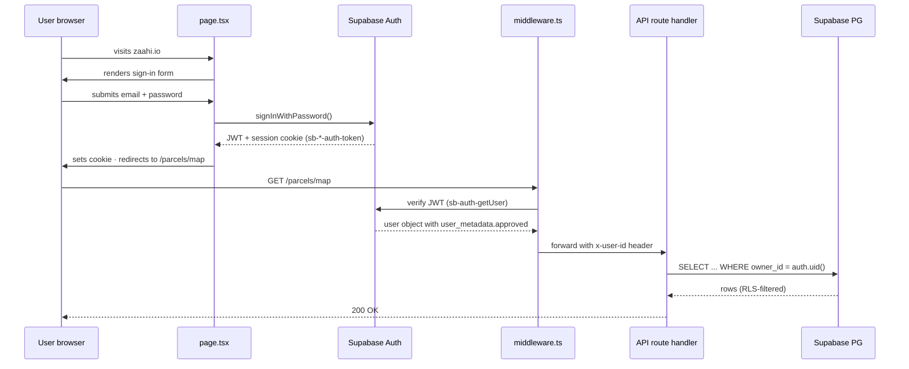
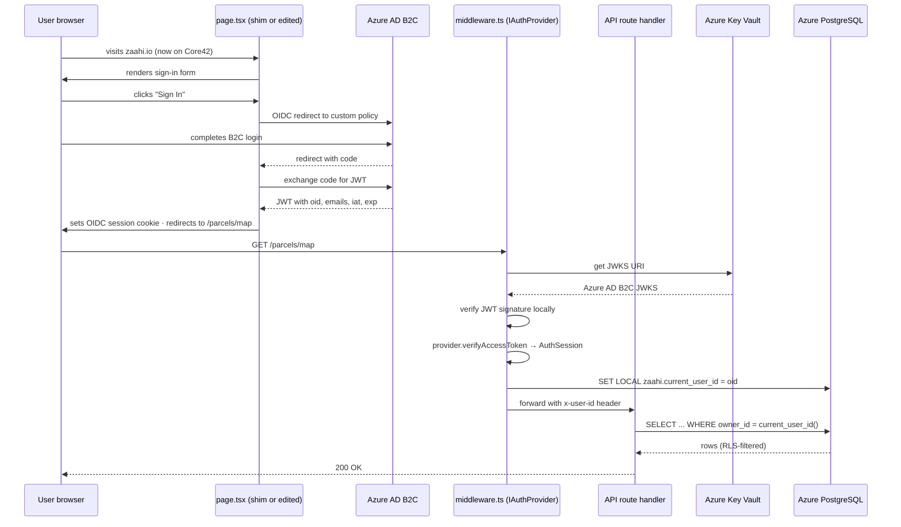

# Spec 05 — Auth Abstraction · Supabase → Azure AD B2C migration path

**Status:** DRAFT v1.0 · 2026-04-22
**Classification:** CONFIDENTIAL — implementation spec
**Parent:** `docs/architecture/78_G42_MIGRATION_ARCHITECTURE.md` v1.0 (this session · §3.3 ship-stopper #1 resolver)
**Depends on:** `docs/audits/WEB_PLATFORM_CURRENT_STATE_2026-04-22.md` (audit commit `51c926d` — `src/lib/auth.ts` 84 lines · `src/lib/supabase-browser.ts` · `src/lib/supabase.ts` baseline)
**Branch:** `research/vision-and-competitors-2026-04-19`
**Prepared by:** Agent · Opus 4.7 · 2026-04-22
**Prepared for:** Zhan (Founder/engineering) · Dymo (ops review) · Rudi (informational for migration budget authority)
**Preserves:** `prisma/schema.prisma` READ-ONLY this spec · `src/**` READ-ONLY this spec (all code changes deferred to implementation phase · Phase 1a/b/c per §3) · `docs/architecture/MASTER_TREE_final.md` UNCHANGED.

---

## §0 Purpose + scope

This document specifies:
1. The **`IAuthProvider` TypeScript interface** that decouples ZAAHI's authentication logic from Supabase-specific JWT + session cookie + `user_metadata` patterns.
2. The **adapter pattern**: `SupabaseAuthAdapter` ships today (no behaviour change) · `AzureAdB2CAdapter` ships at G42 cutover.
3. The **three-phase migration path** (Phase 1a adapter interface · Phase 1b `src/lib/auth.ts` refactor · Phase 1c middleware + AuthGuard refactor · Phase 2 cutover flip).
4. The **data migration strategy** (add `User.externalAuthId` column · map Supabase UUIDs to Azure OID at cutover · users re-authenticate post-cutover per acceptable pre-external-launch posture).
5. The **testing strategy** ensuring adapter contract tests run against both `SupabaseAuthAdapter` and `AzureAdB2CAdapter`, gating cutover on adapter parity.
6. The **risk register** with specific mitigations for `src/app/page.tsx` CLAUDE.md DO-NOT-MODIFY constraint + RLS policy `auth.uid()` reference + JWT signing key rotation.

**Target ship:**
- v1.0 spec this session (docs only · no code).
- Phase 1a implementation (adapter interface + `SupabaseAuthAdapter` wrapping current code · no behaviour change): Month 5 (post-Core42 MSA signed).
- Phase 1b (refactor `src/lib/auth.ts` to use `IAuthProvider`): Month 5-6 · YELLOW tier per AUTONOMY_PROTOCOL (src/** edit · requires Zhan review).
- Phase 1c (refactor middleware + AuthGuard): Month 6 · YELLOW tier.
- Phase 2 (implement `AzureAdB2CAdapter` · feature-flag flip · cutover): Month 7-9 · aligned with §78 G42 Migration Architecture §8.3-§8.4.

---

## §1 Problem statement

### §1.1 Current Supabase Auth coupling points

**File-level coupling (audit 2026-04-22 line references):**

| File | Size | Supabase-specific usage |
|---|---:|---|
| `src/lib/supabase-browser.ts` | ~15 lines | Exports Supabase client singleton · used by client components |
| `src/lib/supabase.ts` | ~30 lines | Exports server-side Supabase client · used by route handlers |
| `src/lib/auth.ts` | 84 lines | Contains `getSessionUserId` · `getApprovedUserId` · `getAdminUserId` · founder-email hardcode override · reads `user_metadata.approved` flag |
| `src/app/page.tsx` | (redacted · CLAUDE.md DO-NOT-MODIFY) | Sign-in / sign-up tabs · Google OAuth button · admin-approval pending screen |
| `src/components/AuthGuard.tsx` | ~50 lines | Client-side session check wrapper · redirects unauthenticated to `/` |
| `src/middleware.ts` | 65 lines | Bearer token validation · public route allowlist · passes session to downstream |
| `src/lib/api-fetch.ts` | ~30 lines | Attaches Bearer token to all API calls from browser |

**Conceptual coupling (Supabase-specific semantics):**

1. **JWT shape.** Supabase JWTs carry `sub` = Supabase user UUID · `email` · `user_metadata` (custom claims including critical `approved` boolean) · `app_metadata` (server-side claims · Google OAuth flags). Azure AD B2C uses `oid` for object ID · custom attributes via directory schema. Direct migration = JWT payload shape changes.

2. **Session cookie format.** Supabase sets `sb-<project-ref>-auth-token` cookie with access + refresh token · httpOnly · SameSite=Lax. Azure AD B2C uses OIDC session cookies with different naming and structure. Direct migration = cookie key renames · refresh flow differs.

3. **Admin-approval pattern.** Current `getApprovedUserId` reads `user_metadata.approved === true`. This is Supabase-console-edited custom metadata. Azure AD B2C stores custom attributes via directory schema · reading requires different API call (`/users/{id}?$select=customSecurityAttribute_approved`). Direct migration = reading approval flag changes completely.

4. **Founder-email hardcode.** `getAdminUserId` hardcodes Zhan + Dymo emails from `CLAUDE.md` FOUNDER CONTACTS · crosschecks JWT email claim against these. Migration-neutral if JWT still carries email claim · but abstraction cleaner.

5. **RLS policy dependency.** Supabase RLS policies use `auth.uid()` PostgreSQL function (installed by Supabase Auth extension · returns Supabase user UUID). Azure AD B2C has no PostgreSQL-native function · RLS policies must call a ZAAHI-defined `current_user_id()` stable function instead. **Critical technical dependency** · addressed §6.3.

6. **Google OAuth configuration.** Currently configured in Supabase console (URL · client ID · secret). Azure AD B2C uses identity provider federation (similar OIDC flow but different admin UI + claims mapping). Migration-neutral behaviour for users · re-config work for admin.

### §1.2 Migration blockers enumerated

**Hard blockers (ship-stoppers):**
1. **JWT claims shape divergence.** Supabase `sub` (UUID) vs Azure AD B2C `oid` (Object ID). ZAAHI code that reads `sub` breaks post-cutover.
2. **Session cookie format divergence.** ZAAHI middleware reads `sb-*-auth-token` cookie by name. Post-cutover cookie name differs.
3. **`user_metadata.approved` reads.** No `user_metadata` claim in Azure AD B2C default JWT. Admin-approval gate breaks post-cutover if not re-implemented.
4. **RLS `auth.uid()` references.** PostgreSQL functions break when source DB migrates if policies reference them literally. Must be wrapped in ZAAHI-owned stable function.

**Soft blockers (behaviour differences acceptable):**
5. **Sign-in UX flow.** OAuth flow differs slightly (different redirect URIs) · user-facing impact minimal.
6. **Refresh token TTL.** Supabase default 1-hour access + 7-day refresh. Azure AD B2C default 1-hour access + 14-day refresh. Negligible impact.
7. **MFA support.** Azure AD B2C supports MFA natively · Supabase Auth MFA currently not enabled on ZAAHI. Migration-time opportunity to enable (per SV-9 Passkeys deferred to Phase 2 Month 10-12).

### §1.3 Spec goal

**Vendor-agnostic interface** · **implement Supabase today** (zero behaviour change · zero production regression) · **swap at cutover** without production regression · **reversible** via feature flag during 48-hour post-cutover observation window.

**Non-goals (deferred):**
- MFA implementation (SV-9 Phase 2).
- UAE Pass integration (SV-6 Month 7-8 · separate OIDC provider · orthogonal to this spec).
- Passkeys / WebAuthn (SV-9 Phase 2).
- Self-sovereign identity (DID + VC · Phase 3 exploratory per SOVEREIGNTY_PROPOSALS §4.3.4).

---

## §2 Architecture

### §2.1 `IAuthProvider` TypeScript interface (ILLUSTRATIVE signatures)

The interface MUST be minimal · MUST reflect only operations ZAAHI actually performs · MUST NOT leak vendor-specific types.

```typescript
// src/lib/auth/IAuthProvider.ts (ILLUSTRATIVE · NOT applied · Phase 1a build target)

export interface AuthUser {
  /** Provider-native user identifier (Supabase UUID or Azure OID · opaque to ZAAHI logic) */
  providerUserId: string;
  /** User email (canonical · lowercase · required claim from all providers) */
  email: string;
  /** Email verified flag (from provider · null if unknown) */
  emailVerified: boolean | null;
  /** Issued-at timestamp (UNIX seconds · from JWT `iat`) */
  issuedAt: number;
  /** Expires-at timestamp (UNIX seconds · from JWT `exp`) */
  expiresAt: number;
}

export interface AuthSession {
  user: AuthUser;
  /** Access token (opaque · for Bearer auth downstream) */
  accessToken: string;
  /** Refresh token (opaque · for session renewal · null if provider doesn't issue) */
  refreshToken: string | null;
}

export interface IAuthProvider {
  /**
   * Verify incoming Bearer token · return session if valid · null if invalid/expired.
   * Called by `src/middleware.ts` on every protected request.
   */
  verifyAccessToken(token: string): Promise<AuthSession | null>;

  /**
   * Get current session from cookie store (SSR-friendly).
   * Called by `src/lib/auth.ts` helpers in server components.
   */
  getSession(cookieStore: ReadonlyCookieStore): Promise<AuthSession | null>;

  /**
   * Refresh an expired access token using refresh token.
   * Called by `src/lib/api-fetch.ts` on 401 responses.
   */
  refreshSession(refreshToken: string): Promise<AuthSession | null>;

  /**
   * Sign out current user · invalidate session.
   * Called by logout button handler.
   */
  signOut(session: AuthSession): Promise<void>;

  /**
   * Provider name for logging / telemetry.
   */
  readonly providerName: 'supabase' | 'azure-ad-b2c' | 'keycloak';
}

/** Read-only view of cookies · compatible with Next.js cookies() API */
export interface ReadonlyCookieStore {
  get(name: string): { value: string } | undefined;
  getAll(): Array<{ name: string; value: string }>;
}
```

**Design decisions:**
- Interface captures only what ZAAHI does today · no speculative methods.
- `providerUserId` opaque · ZAAHI never inspects its format · prevents coupling.
- Email is the stable identity across providers · used for admin-approval matching.
- `AuthSession` has no `user_metadata` field — approval gate moves to app-layer DB lookup (see §2.2).

### §2.2 `IUserStore` interface (Prisma-backed · provider-agnostic)

The `User` table already exists in `prisma/schema.prisma`. This spec proposes adding ONE column: `externalAuthId`. All other fields remain.

**Proposed `User` additions (ILLUSTRATIVE · NOT APPLIED · requires separate Prisma migration task per YELLOW tier):**

```prisma
model User {
  // ... existing fields (approved · email · role · ambassador fields · etc.) ...

  /** Provider-agnostic external auth identifier · populated on first login */
  externalAuthId  String?  @unique
  /** Auth provider name · for multi-provider future (UAE Pass federation etc.) */
  externalAuthProvider  String?  // 'supabase' | 'azure-ad-b2c' | 'uae-pass'

  @@index([externalAuthId])
}
```

**`IUserStore` interface:**

```typescript
// src/lib/auth/IUserStore.ts (ILLUSTRATIVE · Phase 1a build target)

export interface AppUser {
  id: string;           // ZAAHI internal UUID (Prisma primary key)
  externalAuthId: string | null;
  externalAuthProvider: string | null;
  email: string;
  approved: boolean;
  role: string;         // existing Role enum from schema
  // ... other existing User fields ZAAHI code reads ...
}

export interface IUserStore {
  /**
   * Lookup by provider-agnostic external auth id.
   * Populated on first login · returns null if user not yet mapped.
   */
  findByExternalAuthId(externalAuthId: string, provider: string): Promise<AppUser | null>;

  /**
   * Lookup by email (fallback · used during cutover mapping).
   */
  findByEmail(email: string): Promise<AppUser | null>;

  /**
   * Map a provider-agnostic identifier to an existing user record.
   * Used at cutover: on first post-cutover login, match by email,
   * then stamp externalAuthId+provider on the existing User row.
   */
  linkExternalAuthId(userId: string, externalAuthId: string, provider: string): Promise<void>;

  /**
   * Create a new app user from auth session (first sign-up flow · existing pattern).
   */
  createFromSession(session: AuthSession, initialFields: Partial<AppUser>): Promise<AppUser>;
}
```

**Design decisions:**
- `User.id` stays as ZAAHI's internal UUID · NEVER migrated (stable across auth provider changes).
- `User.externalAuthId` added as auth-provider identifier · nullable (existing users haven't logged in post-cutover yet) · populated on first post-cutover login.
- `findByEmail` is the cutover bridge: user signs in on new Azure AD B2C · email matches existing Supabase-era User row · `externalAuthId` stamped on first session.

### §2.3 Adapter pattern

**Three concrete adapters (v1.0 defines two; Keycloak optional for multi-provider hedging):**

```typescript
// src/lib/auth/adapters/SupabaseAuthAdapter.ts (ILLUSTRATIVE · Phase 1a)

import { IAuthProvider, AuthSession } from '../IAuthProvider';
import { createClient } from '@supabase/supabase-js';

export class SupabaseAuthAdapter implements IAuthProvider {
  readonly providerName = 'supabase' as const;
  private supabase = createClient(
    process.env.NEXT_PUBLIC_SUPABASE_URL!,
    process.env.SUPABASE_SERVICE_ROLE_KEY!
  );

  async verifyAccessToken(token: string): Promise<AuthSession | null> {
    // Wrap existing Supabase JWT verification logic
    const { data, error } = await this.supabase.auth.getUser(token);
    if (error || !data.user) return null;
    return {
      user: {
        providerUserId: data.user.id,  // Supabase UUID
        email: data.user.email ?? '',
        emailVerified: data.user.email_confirmed_at != null,
        issuedAt: 0, // derive from JWT if needed
        expiresAt: 0,
      },
      accessToken: token,
      refreshToken: null, // Supabase handles refresh via its own cookie
    };
  }

  async getSession(cookieStore): Promise<AuthSession | null> {
    // Read `sb-<project-ref>-auth-token` cookie · verify
    // ... existing logic ...
    return null;
  }

  async refreshSession(refreshToken): Promise<AuthSession | null> {
    // Supabase refresh flow
    return null;
  }

  async signOut(session: AuthSession): Promise<void> {
    await this.supabase.auth.admin.signOut(session.user.providerUserId);
  }
}
```

```typescript
// src/lib/auth/adapters/AzureAdB2CAdapter.ts (ILLUSTRATIVE · Phase 2)

import { IAuthProvider, AuthSession } from '../IAuthProvider';
import { ConfidentialClientApplication } from '@azure/msal-node';
import * as jose from 'jose';

export class AzureAdB2CAdapter implements IAuthProvider {
  readonly providerName = 'azure-ad-b2c' as const;

  private msal = new ConfidentialClientApplication({
    auth: {
      clientId: process.env.AZURE_AD_B2C_CLIENT_ID!,
      authority: `https://${process.env.AZURE_AD_B2C_TENANT}.b2clogin.com/...`,
      clientSecret: process.env.AZURE_AD_B2C_CLIENT_SECRET!,
    },
  });

  private jwksUri = `https://${process.env.AZURE_AD_B2C_TENANT}.b2clogin.com/.../discovery/v2.0/keys`;

  async verifyAccessToken(token: string): Promise<AuthSession | null> {
    try {
      const jwks = jose.createRemoteJWKSet(new URL(this.jwksUri));
      const { payload } = await jose.jwtVerify(token, jwks, {
        issuer: `https://${process.env.AZURE_AD_B2C_TENANT}.b2clogin.com/...`,
        audience: process.env.AZURE_AD_B2C_CLIENT_ID,
      });
      return {
        user: {
          providerUserId: payload.oid as string,
          email: (payload.emails as string[])?.[0] ?? '',
          emailVerified: true,
          issuedAt: payload.iat as number,
          expiresAt: payload.exp as number,
        },
        accessToken: token,
        refreshToken: null,
      };
    } catch {
      return null;
    }
  }

  async getSession(cookieStore): Promise<AuthSession | null> {
    // Read OIDC session cookie (MSAL-managed)
    return null;
  }

  async refreshSession(refreshToken): Promise<AuthSession | null> {
    // MSAL refresh flow
    return null;
  }

  async signOut(session: AuthSession): Promise<void> {
    // B2C revokeRefreshToken endpoint
  }
}
```

**Adapter selection (`src/lib/auth/provider.ts`):**

```typescript
// ILLUSTRATIVE · runtime selection via env flag

import { IAuthProvider } from './IAuthProvider';
import { SupabaseAuthAdapter } from './adapters/SupabaseAuthAdapter';
import { AzureAdB2CAdapter } from './adapters/AzureAdB2CAdapter';

let singleton: IAuthProvider | null = null;

export function getAuthProvider(): IAuthProvider {
  if (singleton) return singleton;
  const providerName = process.env.AUTH_PROVIDER ?? 'supabase';
  switch (providerName) {
    case 'azure-ad-b2c':
      singleton = new AzureAdB2CAdapter();
      break;
    case 'supabase':
    default:
      singleton = new SupabaseAuthAdapter();
      break;
  }
  return singleton;
}
```

**Feature flag:** `AUTH_PROVIDER` env var · defaults `supabase` · flip to `azure-ad-b2c` at cutover · revert for rollback.

### §2.4 Session cookie abstraction

**Problem:** ZAAHI code today reads specific Supabase cookie name `sb-<project-ref>-auth-token`. Post-cutover cookie name differs.

**Solution:** middleware + helpers stop reading cookie names directly. Use `provider.getSession(cookieStore)` which internally knows which cookies to read per provider.

**Cookie policy uniform across providers (enforced by adapter):**
- HttpOnly: true (always).
- SameSite: Lax (allow same-site navigation · block cross-site CSRF).
- Secure: true in production (HTTPS only).
- Path: / (all routes).
- MaxAge: per provider defaults (1h access · 7-14d refresh).

### §2.5 Middleware integration

**Current `src/middleware.ts` (65 lines per audit):**
- Reads Bearer token from Authorization header OR Supabase cookie.
- Validates against Supabase JWT.
- Passes user ID into downstream via custom header.

**Post-abstraction:**
```typescript
// src/middleware.ts (ILLUSTRATIVE · Phase 1c refactor)

import { NextRequest, NextResponse } from 'next/server';
import { getAuthProvider } from './lib/auth/provider';

export async function middleware(req: NextRequest) {
  // ... public route allowlist (unchanged) ...

  const provider = getAuthProvider();
  const token = extractBearer(req) ?? extractFromCookie(req);
  if (!token) return redirectToLogin(req);

  const session = await provider.verifyAccessToken(token);
  if (!session) return redirectToLogin(req);

  // Downstream reads session via header (existing pattern)
  const res = NextResponse.next();
  res.headers.set('x-zaahi-user-id', session.user.providerUserId);
  res.headers.set('x-zaahi-user-email', session.user.email);
  return res;
}
```

Critical invariant preserved per CLAUDE.md SECURITY RULES: middleware still terminates at `getApprovedUserId` equivalent downstream · approved-flag gate still enforced at application layer · provider-agnostic.

---

## §3 Migration path

### §3.1 Phase 1a — Write adapter interface · implement SupabaseAuthAdapter wrapping current code (NO behaviour change)

**Scope:**
- Author `src/lib/auth/IAuthProvider.ts` · `src/lib/auth/IUserStore.ts` · `src/lib/auth/adapters/SupabaseAuthAdapter.ts` · `src/lib/auth/provider.ts`.
- Wrap existing Supabase logic in `SupabaseAuthAdapter` · match current behaviour byte-for-byte.
- Add regression test suite · verify 100% behaviour parity with current code.
- NO changes to `src/middleware.ts` · `src/lib/auth.ts` · `src/components/AuthGuard.tsx` yet.

**Authority:** YELLOW tier per AUTONOMY_PROTOCOL — `src/**` edits require Zhan review. Scope limited to ADDITIVE files · no existing file mutation yet.

**Effort:** ~1 eng-week.

**Acceptance:**
- New adapter files exist · compile clean · no imports from existing files.
- Regression test suite covers: valid JWT verification · invalid JWT rejection · expired JWT rejection · email claim extraction.
- `pnpm build` passes · `pnpm test` passes.
- No behaviour change in production.

### §3.2 Phase 1b — Refactor `src/lib/auth.ts` to use `IAuthProvider`

**Scope:**
- Replace Supabase imports in `src/lib/auth.ts` with `getAuthProvider()`.
- `getSessionUserId` / `getApprovedUserId` / `getAdminUserId` still exist · now call `provider.getSession()` internally · app-layer approved-flag gate unchanged.
- All callers (`src/app/api/**`) continue calling same helper functions · internal implementation swapped.

**Authority:** YELLOW tier · Zhan review required.

**Effort:** ~3 days.

**Acceptance:**
- `src/lib/auth.ts` no longer imports Supabase client directly.
- All 101+ call sites (from audit) continue working.
- Regression test suite still green.
- Production traffic unchanged.

### §3.3 Phase 1c — Refactor middleware + AuthGuard to use `IAuthProvider`

**Scope:**
- `src/middleware.ts` replaces direct Supabase JWT check with `provider.verifyAccessToken()`.
- `src/components/AuthGuard.tsx` client-side reads session via `/api/me` endpoint (new endpoint · provider-agnostic) instead of reading Supabase client directly.
- `src/lib/api-fetch.ts` unchanged (still Bearer token pattern).
- **Explicitly not touched:** `src/app/page.tsx` (CLAUDE.md DO-NOT-MODIFY) — its internal Supabase usage stays · at Phase 2 we replace page.tsx contents via explicit founder approval only (see §6.2).

**Authority:** YELLOW tier · Zhan review required.

**Effort:** ~1 eng-week.

**Acceptance:**
- Middleware passes regression suite.
- AuthGuard redirects unauthenticated users correctly.
- `/api/me` endpoint returns current user · provider-agnostic response shape.

### §3.4 Phase 2 G42 cutover — Implement AzureAdB2CAdapter · feature flag flip · validate on staging first

**Scope (timing aligns with §78 G42 Migration Architecture §8.3-§8.4):**

**Month 7:**
- Author `src/lib/auth/adapters/AzureAdB2CAdapter.ts`.
- Configure Azure AD B2C tenant · custom policies for email+password + Google federation.
- Map claims: `oid` → `providerUserId` · `emails[0]` → `email` · `iat/exp` from JWT.
- Regression test suite runs against `AzureAdB2CAdapter` · same contract verified.

**Month 8:**
- On staging (`staging.zaahi.io` running from Core42 per §78 §8.3):
  - Set `AUTH_PROVIDER=azure-ad-b2c` env var.
  - Test users sign up via B2C · verify session works · verify approved-flag gate.
  - Test `findByEmail` cutover bridge: pre-seed User rows with Supabase-era email · Azure AD B2C-era user signs in · `externalAuthId` stamped on first session.
- Dual-run validation: production on Supabase · staging on B2C · behaviour parity confirmed.

**Month 9-10 (cutover · per §78 §5):**
- Maintenance mode on.
- `pg_dump` + `pg_restore` (Supabase → Azure PostgreSQL).
- Azure AD B2C tenant activated.
- `AUTH_PROVIDER` env var flipped to `azure-ad-b2c` in Azure Container App.
- DNS flip.
- Maintenance mode off.
- Post-cutover first-login triggers `findByEmail` + `linkExternalAuthId` stamp on existing User row.

### §3.5 Rollback

**Triggers:** per §78 G42 Migration Architecture §6.1.

**Auth-specific rollback:**
- Flip `AUTH_PROVIDER` env var back to `supabase`.
- Flip DNS back to Vercel.
- Supabase Auth tokens still valid (rollback window ≤30 min · token TTL ≥1h).
- Users with B2C sessions forced to re-authenticate on Supabase (post-rollback login · acceptable).
- Any `externalAuthId` stamped during post-cutover window remains in DB but unused (Supabase resumes as source of truth).

**Invariant:** Prisma `User` table ONLY has `externalAuthId` as additive column · never-destructive · rollback-safe.

---

## §4 Data migration strategy

### §4.1 `User.externalAuthId` column addition

**Prisma schema addition (nullable · unique · indexed):**
```prisma
model User {
  // ... existing fields ...
  externalAuthId        String?  @unique
  externalAuthProvider  String?
  @@index([externalAuthId])
}
```

**Migration timing:** Phase 1a (Month 5) — nullable column · zero migration risk · additive only.

**Migration command (run locally against production DB per CLAUDE.md Prisma rules):**
```bash
npx prisma migrate dev --name add_external_auth_id --create-only
# Review generated SQL · confirm additive column only · no indexes on existing columns
npx prisma migrate deploy  # ONLY in production
```

**Requires founder approval per CLAUDE.md AGENT RULES: "NEVER modify prisma/schema.prisma without explicit permission from the founder."** This spec documents the intent · actual schema.prisma edit is a separate RED tier action requiring current-turn written founder approval.

### §4.2 Cutover mapping — Supabase UUIDs → Azure AD B2C OIDs

**Pre-cutover state:**
- User rows have `externalAuthId = null` · `externalAuthProvider = null`.
- All Supabase-era user data preserved (email · approved · role · ambassador fields).

**Cutover event:**
- Azure AD B2C tenant activated fresh · no users yet.
- Existing Supabase users do NOT automatically migrate to B2C.

**Post-cutover first-login flow:**
1. User visits zaahi.io (now served from Core42).
2. Clicks "Sign In".
3. Redirected to Azure AD B2C custom policy.
4. Enters email + password (new B2C password · OR uses Google OAuth if configured).
5. B2C creates new user with `oid` GUID · issues JWT.
6. ZAAHI middleware verifies JWT via `AzureAdB2CAdapter`.
7. `provider.verifyAccessToken()` returns `AuthSession` with `providerUserId = oid` · `email = user@example.com`.
8. ZAAHI code calls `userStore.findByExternalAuthId(oid, 'azure-ad-b2c')` → returns null (first time).
9. Fallback: `userStore.findByEmail(email)` → matches existing pre-cutover User row.
10. `userStore.linkExternalAuthId(user.id, oid, 'azure-ad-b2c')` stamps the external ID.
11. User session proceeds with existing ZAAHI user record · approved flag preserved · role preserved · all ambassador data preserved.

**Result:** users experience one-time password re-entry (new B2C password) · all their ZAAHI data is preserved · no admin intervention needed per user.

### §4.3 Password strategy — users re-authenticate post-cutover

**Why re-authentication is acceptable pre-external-launch:**
- Phase 1 users = founders (Zhan + Dymo) + small soft-pilot cohort (≤10 brokers per Q-13).
- Small user count · communication is trivial · re-password is a 30-second friction.
- Cleaner than password-hash import (which would require Supabase hash format → Azure AD B2C hash format conversion · error-prone · security risk).

**User communication (pre-scripted per §78 §5.2 T-1 day checklist):**
- Email 48 hours before cutover: "ZAAHI is migrating to UAE sovereign infrastructure on Friday. You'll need to set a new password via the Forgot Password flow after cutover completes. Your account and all data are preserved."
- Email immediately post-cutover: "Cutover complete. Sign in at zaahi.io. If prompted, use 'Forgot Password' to set a new password."

**Google OAuth users:** zero friction — they click "Sign in with Google" again · Azure AD B2C federation accepts Google OAuth · session resumes.

### §4.4 Session strategy — all sessions invalidated at cutover

**Existing Supabase sessions** (browser cookies `sb-*-auth-token`) become invalid post-cutover because:
- Supabase tenant taken offline (access revoked at DNS cutover level).
- Middleware now verifies against Azure AD B2C.
- Cookie names differ · browser still sends old cookies but middleware ignores them.

**User experience:**
- First post-cutover visit → redirected to sign-in page.
- User signs in via Azure AD B2C → fresh session cookie set.
- Navigation continues.

**No forced logout UI needed** — session invalidation is automatic via DNS cutover + middleware change.

---

## §5 Testing strategy

### §5.1 Adapter contract tests

**Design:** single test suite runs against both adapters · same assertions · verifies behaviour parity before cutover.

```typescript
// tests/auth/provider.contract.test.ts (ILLUSTRATIVE)

describe.each([
  ['supabase', () => new SupabaseAuthAdapter()],
  ['azure-ad-b2c', () => new AzureAdB2CAdapter()],
])('IAuthProvider contract (%s)', (name, factory) => {
  let provider: IAuthProvider;

  beforeAll(() => { provider = factory(); });

  test('verifyAccessToken returns null for invalid token', async () => {
    expect(await provider.verifyAccessToken('invalid')).toBeNull();
  });

  test('verifyAccessToken returns session for valid token', async () => {
    const token = await issueTestToken(name);
    const session = await provider.verifyAccessToken(token);
    expect(session).not.toBeNull();
    expect(session!.user.email).toContain('@');
  });

  test('getSession returns null when no cookies', async () => {
    expect(await provider.getSession(emptyCookieStore())).toBeNull();
  });

  // ... 15+ more contract tests ...
});
```

**Pre-cutover requirement:** all tests green against `AzureAdB2CAdapter` → cutover proceeds. Any test red → cutover BLOCKED.

### §5.2 Integration tests on current Supabase (baseline)

**Phase 1a objective:** establish baseline green test suite against Supabase adapter · become the reference for adapter parity.

**Existing test scope (if any)** + additions:
- End-to-end sign-in flow (Cypress or Playwright).
- API route authentication gate verification.
- Admin-approval flow verification.
- Session expiration handling.
- Refresh token flow.

**Effort:** ~2 days (establishing test infra).

### §5.3 Staging environment with Azure AD B2C (Phase 1b-c · on G42 POC tenant)

**Month 5-8 staging setup:**
- `staging.zaahi.io` deployed on Core42 POC tenant (per §78 §8.2).
- `AUTH_PROVIDER=azure-ad-b2c` env var set.
- Test user accounts created in B2C tenant.
- Same end-to-end tests run against staging.

**Acceptance:** all baseline tests green on staging = adapter parity confirmed.

### §5.4 Cutover rehearsal (Month 8 · on staging)

**Rehearsal scope:**
- Sign in as test user on staging Supabase adapter.
- Flip `AUTH_PROVIDER` to Azure AD B2C.
- Verify redirect to sign-in.
- Sign in via B2C.
- Verify `findByEmail` → `linkExternalAuthId` stamping works.
- Verify user data preserved · role preserved · approved flag preserved.
- Revert `AUTH_PROVIDER` to supabase.
- Verify rollback works cleanly.

**Frequency:** 3 rehearsals minimum before real cutover (Month 8 Week 3 · Month 8 Week 4 · Month 9 Week 2 final).

---

## §6 Risks

### §6.1 Refactor breaks existing auth flow

**Probability:** Medium.
**Impact:** High (production auth broken = platform broken).

**Mitigations:**
1. Feature flag (`AUTH_PROVIDER`) from Phase 1a · SupabaseAuthAdapter always available as fallback.
2. Comprehensive regression test suite written in Phase 1a before any refactor.
3. Phase 1a ships adapter as ADDITIVE ONLY (no existing file mutated) · zero regression window.
4. Phase 1b-c refactor gated on regression suite green · Zhan code review mandatory.
5. Production deploy of refactor includes canary: 10% traffic on refactored path · 90% on Supabase direct · 24-hour observation · then 100% rollout.
6. Rollback via git revert + feature flag · ≤30 min MTTR.

### §6.2 `src/app/page.tsx` CLAUDE.md DO-NOT-MODIFY constraint

**Probability:** Medium (spec will need to touch page.tsx eventually).
**Impact:** High (violating CLAUDE.md invariant = auth flow security-critical file).

**Current state:** `src/app/page.tsx` is the auth entry page · contains sign-in/sign-up tabs · Supabase client calls embedded · CLAUDE.md SECURITY RULES: "The auth page at `src/app/page.tsx` MUST keep both tabs as `(['signin', 'signup'] as Mode[]).map(...)` — no extra brackets, no JSX-text glitches" · "NEVER modify `src/app/page.tsx` auth flow without explicit permission from the founder".

**Mitigation strategy:**
1. **Phase 1a-c: page.tsx UNTOUCHED.** All refactors work around it · middleware + AuthGuard + auth.ts handle the abstraction · page.tsx continues calling Supabase client directly for its internal sign-in/sign-up UI flow.
2. **Phase 2 cutover: explicit founder approval required** before any edit to page.tsx. Agent drafts proposed diff · founder reviews · explicit current-turn written approval obtained · then edit applied.
3. **Minimal surface area change:** replace `supabase.auth.signInWithPassword(...)` calls with provider-agnostic `authClient.signIn(...)` helper · preserve tab structure · preserve approval-pending screen · preserve CLAUDE.md invariants.
4. **Alternative if founder denies:** wrap page.tsx in a thin shim that intercepts Supabase client calls at runtime · translates to B2C equivalent · page.tsx source code untouched. More fragile but respects CLAUDE.md DO-NOT-MODIFY literally.
5. **Documentation:** this spec §6.2 becomes the reference for when page.tsx must be revisited.

**Authority tier for page.tsx edit:** RED per AUTONOMY_PROTOCOL §1.3 item 13 ("Auth flow changes — `src/app/page.tsx` auth page · `AuthGuard` removal · `getApprovedUserId` bypass") — requires explicit current-turn founder written instruction.

### §6.3 RLS policies reference `auth.uid()` Supabase-specific function

**Probability:** High (RLS policies use `auth.uid()` ubiquitously in Supabase projects).
**Impact:** High (RLS break = data isolation broken = security issue).

**Mitigation strategy:**
1. **Audit current RLS policies.** Dump all policies from Supabase: `SELECT * FROM pg_policies;`. Enumerate which policies call `auth.uid()`.
2. **Define ZAAHI-owned stable function** `current_user_id()` in a migration · returns user ID from session variable set by app layer:
   ```sql
   CREATE OR REPLACE FUNCTION current_user_id()
   RETURNS TEXT
   LANGUAGE SQL STABLE
   AS $$
     SELECT current_setting('zaahi.current_user_id', true);
   $$;
   ```
3. **Rewrite RLS policies** to use `current_user_id()` instead of `auth.uid()`:
   ```sql
   -- BEFORE
   CREATE POLICY user_own_parcels ON "Parcel"
     FOR SELECT USING (owner_id = auth.uid());
   -- AFTER
   CREATE POLICY user_own_parcels ON "Parcel"
     FOR SELECT USING (owner_id = current_user_id());
   ```
4. **Application layer sets session variable** at request start · middleware writes `SET LOCAL zaahi.current_user_id = '<uuid>'` before any query.
5. **Timing:** this RLS refactor happens during Phase 2 tenantization per §77 ARCHITECTURE §12.3 — but for §78 G42 cutover, the Supabase `auth.uid()` function simply won't exist on Azure PostgreSQL, so this refactor MUST complete during Phase 1b-c (Month 6) even if full tenantization waits until Month 10+.

**Priority:** HIGH · cannot cut over without this.

**Effort:** ~3-5 days depending on number of RLS policies. Current codebase: single-tenant · RLS policies minimal · manageable.

### §6.4 JWT signing key mismatch at cutover

**Probability:** Low (planned migration, keys rotated deliberately).
**Impact:** High (all in-flight sessions broken).

**Mitigation:**
1. **Pre-cutover: rotate all secrets per Spec 06 Secrets Rotation Policy** (Month 6 ritual).
2. **At cutover: Supabase tokens stop being issued after Supabase tenant taken offline · new tokens come from Azure AD B2C with different signing key.**
3. **Token invalidation is WANTED behaviour** — forces all users to re-authenticate · clean slate · no stale session confusion.
4. **Rollback-safe:** if rollback within 30 min window, Supabase signing key still valid · re-issued Supabase tokens work on Vercel + Supabase path.

---

## §7 Decision tracker

| ID | Decision | Rationale | Alternatives rejected |
|:-:|---|---|---|
| **D-1** | `IAuthProvider` interface shape — minimal · captures only ZAAHI's current ops | Avoid speculative methods · minimize migration surface | Broader interface (risk: over-engineering · unused methods) · class-based inheritance (less flexible) |
| **D-2** | Primary migration target = Azure AD B2C (OIDC · Google federation support) | Azure sovereign cloud native · mature (5+ yrs in market) · B2C = external users · OIDC standard | Keycloak self-hosted (ops burden) · Azure External ID (newer · less mature as of 2026-04) · Auth0 (US vendor · defeats sovereignty) |
| **D-3** | `User.externalAuthId` nullable UUID · unique constraint · indexed | Supports cutover mapping via email-first fallback · populates on first post-cutover login · unique prevents duplicate mapping | Non-nullable (breaks pre-cutover users · migration risk) · non-unique (allows collisions · breaks) |
| **D-4** | Session format: provider-agnostic JWT in httpOnly cookie · 1h access + 7-14d refresh | Industry standard · CSRF-resistant (httpOnly + SameSite=Lax) · refresh TTL matches provider default | Long-lived access token (security risk) · no refresh token (poor UX) |
| **D-5** | Password strategy post-cutover: users re-authenticate via Forgot Password flow | Cleaner than hash-format conversion · safe (no hash transcoding risk) · acceptable friction at Phase 1 scale | Hash-format conversion (risky · security audit needed) · auto-migrate passwords (impossible across providers) |
| **D-6** | RLS policies rewritten from `auth.uid()` to ZAAHI-owned `current_user_id()` stable function | Provider-agnostic · sets groundwork for §77 tenantization · same SQL works either side of cutover | Keep `auth.uid()` (breaks on Azure PostgreSQL · impossible) · inline subqueries everywhere (code bloat · perf hit) |
| **D-7** | Feature flag `AUTH_PROVIDER` env var · runtime adapter selection | Reversible in <1 min · supports staging/production divergence during Phase 1b-c · rollback-safe | Build-time selection (requires redeploy for switch) · per-request dynamic selection (over-engineering) |
| **D-8** | `src/app/page.tsx` NOT TOUCHED during Phase 1a-c · Phase 2 edit requires RED tier explicit founder approval | Respects CLAUDE.md DO-NOT-MODIFY · reduces risk of security-critical auth page regression · postpones decision until absolutely needed | Touch page.tsx early (violates CLAUDE.md · risks founder objection) |
| **D-9** | Google OAuth preserved via Azure AD B2C identity provider federation | Native B2C feature · zero friction for Google-OAuth users · unchanged UX | Drop Google OAuth (breaks existing flow) · re-implement OAuth via custom code (reinventing wheel) |
| **D-10** | Adapter contract tests run against both adapters · green-on-both required to cut over | Objective cutover gate · catches parity regressions · automatable | Manual testing only (human error · inconsistent) · contract tests against one adapter only (masks parity bugs) |
| **D-11** | Phase 1a ships ADDITIVE ONLY (no existing file mutation) | Zero-regression window · easy rollback · safe to ship mid-sprint without risk | Refactor existing files in Phase 1a (higher risk · harder rollback) |
| **D-12** | `findByEmail` cutover bridge uses email as stable identity | Email is canonical across providers · guaranteed claim · matches pre-cutover User row | Use email + phone combo (over-engineering) · no bridge (requires manual user mapping · impossible at scale) |
| **D-13** | Keycloak adapter deferred · implement only if multi-provider hedging becomes valuable | YAGNI — one provider enough at cutover · add Keycloak later if Azure AD B2C has issues | Implement Keycloak upfront (wasted effort) · no fallback adapter (lock-in to Azure B2C) |

Future decisions (pending):
- **D-14 (pending):** Passkeys / WebAuthn integration — deferred to SV-9 Phase 2 Month 10-12.
- **D-15 (pending):** UAE Pass integration — SV-6 Month 7-8 · separate OIDC IdP · chained with B2C federation.
- **D-16 (pending):** Multi-factor authentication policy — enable post-cutover Month 11+ per §77 ARCHITECTURE roadmap.

---

## §8 Appendices

### Appendix A — Current auth flow diagram (Supabase as-is)



### Appendix B — Target auth flow diagram (Azure AD B2C)



### Appendix C — Sample TypeScript interface definitions (illustrative)

See §2.1 for `IAuthProvider` definition. See §2.2 for `IUserStore` definition. See §2.3 for concrete adapter skeletons.

**Additional contract types (for reference):**
```typescript
export interface AuthProviderHealth {
  provider: string;
  reachable: boolean;
  latencyMs: number;
  lastCheckedAt: number;
}

export interface IAuthProviderHealthCheck {
  checkHealth(): Promise<AuthProviderHealth>;
}
```

Used by monitoring per §78 §7.2 (detect auth provider outage and route traffic accordingly).

### Appendix D — CLAUDE.md implications

**Affected CLAUDE.md rules:**

1. **"The auth page at `src/app/page.tsx` MUST keep both tabs as `(['signin', 'signup'] as Mode[]).map(...)`"** — RESPECTED by Phase 1a-c. Phase 2 page.tsx edit requires explicit founder approval (RED tier per AUTONOMY_PROTOCOL).

2. **"NEVER modify `src/app/page.tsx` auth flow without explicit permission from the founder"** — RESPECTED. Spec explicitly marks page.tsx edits as RED tier · blocks agent from acting without current-turn written founder approval.

3. **"All protected pages MUST be wrapped in `<AuthGuard>` from `src/components/AuthGuard.tsx`"** — UNCHANGED. AuthGuard internal implementation refactored (Phase 1c) · external contract preserved.

4. **"All sensitive API routes MUST call `getApprovedUserId(req)` from `src/lib/auth.ts`"** — UNCHANGED. `getApprovedUserId` continues to exist · internal implementation refactored to use `IAuthProvider` (Phase 1b).

5. **"Middleware `PUBLIC_API` allow-list is intentionally tiny"** — UNCHANGED. Allowlist stays `/api/auth` + `/api/notify-admin` · plus `/api/layers/*` public geodata exception.

6. **"Browser code MUST call protected APIs through `apiFetch` from `src/lib/api-fetch.ts`"** — UNCHANGED. `apiFetch` continues attaching Bearer token · provider-agnostic.

**No CLAUDE.md rules are proposed for auto-amendment.** All edits per this spec preserve existing CLAUDE.md invariants. Any Phase 2 CLAUDE.md amendment (e.g., add note "as of cutover, auth provider is Azure AD B2C") is YELLOW tier · separate task · founder signoff required.

---

**End of Spec 05 Auth Abstraction v1.0 DRAFT.**

Ship-stopper #1 (ship-stopper per §78 G42 Migration Architecture §3.3) resolved. Adapter interface + migration path + risk mitigations all documented. Phase 1a implementation (adapter interface · additive only · no behaviour change) can begin Month 5 post-Core42 MSA signing. Full Phase 2 cutover validated on staging before production Month 9-10 window.

**Cross-references:**
- `docs/architecture/78_G42_MIGRATION_ARCHITECTURE.md` v1.0 — parent migration blueprint.
- `docs/architecture/MASTER_TREE_ENHANCEMENT_PROPOSAL.md` v1.3 — SV-14 ratification vehicle.
- `docs/audits/WEB_PLATFORM_CURRENT_STATE_2026-04-22.md` (commit `51c926d`) — source-stack baseline.
- `CLAUDE.md` — auth flow security invariants preserved.
- `docs/governance/AUTONOMY_PROTOCOL_2026-04-22.md` — tier authority for `src/**` edits.
- `docs/specs/phase-1/06-SECRETS_ROTATION_POLICY.md` v1.0 — pre-cutover secret rotation ritual.
