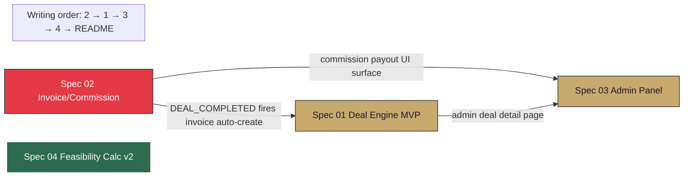

# Phase 1 Spec Package — Index + Execution Guide

**Package:** 4 technical specifications + this README, covering Priority 1-4 of the Q-11 owner-modified ranking in `MASTER_TREE_ENHANCEMENT_PROPOSAL` v1.0.1.
**Target window:** Month 2-5 (Apr 20 2026 → late-Aug 2026) · Phase 1 Owner-First execution.
**Total spec lines:** ~2 540 across 4 specs (range 575-928 per spec).
**Audience:** Zhan (primary engineer) · Dymo (business-side reviewer) · future Chief of Staff (Month 8-9).
**Parent document:** `docs/architecture/MASTER_TREE_ENHANCEMENT_PROPOSAL.md` v1.0.1 (commit 7ad1e40).
**Classification:** CONFIDENTIAL — internal engineering

---

## Index

| # | Spec | Priority | Target ship | Effort | Key deliverable |
|:-:|---|:-:|:-:|:-:|---|
| 1 | [`01-DEAL_ENGINE_MVP_SPEC.md`](./01-DEAL_ENGINE_MVP_SPEC.md) | **1** | Month 3-4 | 2-3 eng-weeks | 5-milestone owner-side Kanban + admin transition UI + state guards + Spec 02 integration hook |
| 2 | [`02-INVOICE_COMMISSION_SPEC.md`](./02-INVOICE_COMMISSION_SPEC.md) | **2** | Month 2-3 (before Jun 19) | 1.5-2 eng-weeks | Invoice Prisma model + FTA-compliant PDF pipeline + commission payout admin UI |
| 3 | [`03-ADMIN_PANEL_SPEC.md`](./03-ADMIN_PANEL_SPEC.md) | **3** | Month 4 | 1.5-2 eng-weeks | CRUD framework for 5 entities + feature flags + tier-price editor |
| 4 | [`04-FEASIBILITY_CALC_V2_SPEC.md`](./04-FEASIBILITY_CALC_V2_SPEC.md) | **4** | Month 4-5 | 1.5-2 eng-weeks | UI wrap of v5 formulas + IRR + ±20 % sensitivity + PDF export |

**Total Phase 1 engineering investment:** ~6.5-9 engineer-weeks across Months 2-5 at Zhan's Phase 1 capacity (15 % engineering + 20 % deal support = ~14 hrs/week) = **~10-14 calendar weeks of active shipping**.

---

## Execution order (DIFFERENT from writing order)

**Writing order** (how these specs were drafted, 2026-04-21): **2 → 1 → 3 → 4**. Priority 2 Invoice first because critical path for first commission Fri 2026-06-19.

**Zhan's execution order** (how to BUILD these systems):

```
Week 1 (Apr 20-26)     — Founder setup; read all 4 specs end-to-end in this order. No code.
                          Day 1 (Mon Apr 20): DED filing + Dymo outreach; no engineering yet.
                          Day 2-5: read specs, ask questions, amend if gaps found.
                          Weekend: pick a spec quick-start smoke test (§10.A in each spec).

Week 2-3 (Apr 27 - May 10)  — Spec 02 Invoice/Commission tracker  (~2 eng-weeks)
                          Target live: Fri May 8 (14 days before first commission Jun 19).
                          Dress rehearsal: staging invoice issued Fri May 15.

Week 4-6 (May 11 - May 31)  — Spec 01 Deal Engine MVP            (~2-3 eng-weeks)
                          Target live: Fri May 29 (Eid al-Adha week — internal work OK).
                          Dress rehearsal: staging Plot 1 full-cycle Mon Jun 15 (Islamic NY).

Week 7 (Jun 1-7)       — Buffer + integration testing
                          Plot 1 Form F signed Mon Jun 1 (Week 7) runs through real MVP.

Week 8-9 (Jun 8-21)    — Spec 03 Admin Panel MVP                  (~2 eng-weeks)
                          Target live: Fri Jun 19 (same day as first commission — okay, Admin
                          Panel isn't on the Plot 1 critical path).

Week 10-13 (Jun 22 - Jul 19) — Spec 04 Feasibility Calc v2       (~2 eng-weeks)
                          Earlier ship if Dymo signals developer-meeting Week 5 urgency.
                          Real pilot: 2+ client meetings with PDF export Weeks 9-12.

Week 14+ (Jul 20 onward) — v2 polish (auto-notifications S-2 · Feasibility i18n · etc.)
                          Preparing for Month 10 Phase 2 open Mon Jan 18 2027.
```

**Critical-path item:** Spec 02 live by **Fri May 15 2026** at latest. Every other spec can slip.

---

## Dependency graph



- **Red (S2)** — critical path. Must live before Fri 2026-06-19.
- **Gold (S1, S3)** — high priority. Integrate with S2.
- **Green (S4)** — independent. Can slip. Real value at Week 9+ client meetings.

---

## Cross-spec integration tests (Phase 1 E2E)

These tests validate that the 4 systems work **together**, not just individually. Each test flows through multiple specs.

### IT-1 — Complete deal → invoice → commission → PDF cycle

**Purpose:** Prove Spec 01 + Spec 02 integration works end-to-end for first commission.

**Setup:**
- Seed Plot 1 Parcel (plotNumber 6457940, Jumeirah Bay Island) in VERIFIED status.
- Seed Seller (TRN 1000XXXXXXXXXX3), Buyer (non-resident, no TRN).
- Seed Deal in DLD_SUBMITTED status, dldApproved=true, agreedPriceInFils=39_500_000_00_00 (AED 39.5M).
- Seed Ambassador user (Gold tier) as buyer's referrer.

**Execution:**
1. Admin clicks "Mark Completed" on `/admin/deals/[id]` → PATCH `/api/deals/[id]` with `action=COMPLETE`.
2. System atomically:
   - Updates Deal.status → DEAL_COMPLETED (Spec 01).
   - Freezes `Deal.platformFeeFils = 79_000_000_00_00` (2% of 39.5M; Spec 02 schema fix).
   - Creates Invoice #1 AGENCY_COMMISSION DRAFT (AED 790k + AED 39.5k VAT = AED 829.5k total; Spec 02).
   - Creates Invoice #2 PLATFORM_SERVICE_FEE DRAFT (AED 553k + AED 27.65k VAT = AED 580.65k; Spec 02).
   - Creates 3 Commission rows PENDING (L1/L2/L3 via existing awardCommissions).
   - Writes DealAuditEvent "COMPLETED" + audit log entry.
3. Admin issues both invoices: PATCH `/api/invoices/[id]/issue` → status ISSUED + invoiceNumber assigned (ZAAHI-INV-2026-0001, 0002).
4. Admin downloads PDF: GET `/api/invoices/[id]/pdf` → 200 + application/pdf + Content-Disposition attachment.
5. Admin marks L1 Commission PAID: POST `/api/commissions/[id]/mark-paid` → status PAID + Invoice #3 AMBASSADOR_PAYOUT DRAFT created (AED 56k + AED 2.8k VAT = AED 58.8k).

**Assertions:**
- Deal.status === "DEAL_COMPLETED".
- Deal.platformFeeFils === 79 000 000 000n.
- 3 Invoice rows exist; numbers ZAAHI-INV-2026-0001, 0002, 0003 (sequential, no gap).
- VAT arithmetic exact: 790k × 5% = 39.5k (no rounding errors from fils).
- PDF files exist at Supabase storage; signed URL works.
- Commission L1 status = PAID; Commission L2, L3 still PENDING.
- DealAuditEvent + AuditLog (S-1) rows exist.
- All operations atomic — no partial state if any step fails.

### IT-2 — Admin override transitions → audit log verification

**Purpose:** Prove Spec 03 feature-flag toggle + Spec 01 admin override + S-1 audit log compose correctly.

**Setup:**
- Seed a Deal in GOVERNMENT_VERIFIED status with required documents uploaded.
- Admin user (role=ADMIN) logged in.

**Execution:**
1. Admin flips `INVOICE_AUTO_ISSUE` feature flag `false → true` via `/admin/feature-flags` (Spec 03).
2. Wait 30s (cache TTL) OR force cache invalidation.
3. Admin uses ADMIN_FORCE_TRANSITION to move Deal from GOVERNMENT_VERIFIED → DLD_SUBMITTED (skipping NOC_REQUESTED + TRANSFER_FEE_PAID) with reason "DLD appointment secured via direct DLD contact; NOC processed async."
4. Admin marks deal COMPLETE.
5. Admin queries audit log.

**Assertions:**
- Feature flag `INVOICE_AUTO_ISSUE` is enabled in `/api/config/public`.
- Deal transitioned through 2 skipped states; 2 DealAuditEvent rows logged (ADMIN_OVERRIDE with reason + regular COMPLETED).
- AuditLog S-1 captures: flag toggle · override action · COMPLETE action — each with adminId + timestamp + metadata.
- Because INVOICE_AUTO_ISSUE=true, invoices auto-transitioned DRAFT → ISSUED without manual click (if §1.A S-10 implements the consumer; alternative v1: stays DRAFT, requires manual Issue — confirm spec decision).
- Reason string visible in admin audit view.

### IT-3 — Feasibility v2 → PDF export → client-shareable

**Purpose:** Prove Spec 04 standalone end-to-end.

**Setup:**
- Seed Plot 2 Parcel (Al Barari, AED 28M, FAR 1.8, area 25 000 sqft, affection plan present).
- Dymo user logged in.

**Execution:**
1. Dymo navigates to `/parcels/<plot2>` → clicks "Run Feasibility" CTA card.
2. `/admin/feasibility?parcelId=<plot2>` opens; inputs pre-filled from affection plan.
3. Dymo adjusts:
   - sellPricePerSqftAed slider → AED 3 500.
   - buildMonths slider → 36.
   - Language toggle → AR.
4. Results recompute within 300 ms per input change.
5. Dymo saves scenario: "Plot 2 · Base Case · Dymo Client Mtg May 20".
6. Dymo clicks "Export PDF" → PDF downloads within 5 seconds.
7. PDF opens in browser + Apple Files; RTL layout correct; IRR + ROI + sensitivity band all present.

**Assertions:**
- FeasibilityScenario row saved with correct inputs + cachedOutputs.
- PDF file uploaded to Supabase `feasibility/<scenarioId>-ar.pdf`.
- Signed URL valid 7 days.
- PDF contains Arabic verdict label "قوي" / "متوسط" / "ضعيف" (not English).
- IRR is computed (non-NaN for realistic inputs).
- Sensitivity band shows 3 bars with low/base/high ROI values.

### IT-4 — Cancel-after-paid full reversal cascade

**Purpose:** Prove Spec 01 CANCEL action + Spec 02 reversal + Spec 03 commission status cascade compose correctly.

**Setup:**
- Run IT-1 to completion (3 invoices ISSUED, L1 Commission PAID).
- Deal.status === DEAL_COMPLETED.

**Execution:**
1. Admin triggers ADMIN_FORCE_TRANSITION on Deal: target=DEAL_CANCELLED, reason="Seller dispute filed 2026-07-10; SPA null."
2. System atomically:
   - Deal.status → DEAL_CANCELLED (Spec 01).
   - Fires reverseCommissions() → all 3 Commission rows flip PENDING/PAID → REVERSED.
   - Invoice reversal cascade (Spec 02): all 3 invoices status → REVERSED + 3 mirror Invoice rows created with negative amounts.
   - DealAuditEvent "CANCELLED" + S-1 AuditLog.

**Assertions:**
- Deal.status === "DEAL_CANCELLED".
- All 3 original invoices status === "REVERSED".
- 3 mirror invoices exist with negative subtotal/vat/total.
- Sum of original + mirror = 0 (full reversal).
- Commission rows: 2 were PENDING → REVERSED; 1 was PAID → REVERSED with clawback note.
- Admin audit view shows full reversal chain navigable.

### IT-5 — Tier price change mid-pilot

**Purpose:** Prove Spec 03 tier-editor + Spec 02 invoice creation compose when pricing changes mid-cycle.

**Setup:**
- Ambassador soft-pilot active (Q-13 B).
- 5 Gold ambassadors already registered at AED 5 000.

**Execution:**
1. Admin edits Gold tier: priceAed 5 000 → 6 000 via `/admin/tiers`.
2. New (6th) user attempts Gold signup via `/join`.
3. System reads updated price from TierConfig; form shows AED 6 000.
4. User pays AED 6 000 USDT → application PENDING.
5. Admin approves → Ambassador activated.
6. Existing 5 ambassadors unaffected; their original price preserved.

**Assertions:**
- TierConfig.Gold.priceAed === 6000 after edit.
- 6th AmbassadorApplication.plan === "GOLD"; paid AED 6 000.
- No retroactive invoice re-issuance for prior 5 ambassadors.
- `/api/config/public` reflects new price within 30 s (feature-flag cache TTL).

---

## Per-spec prep checklist for Zhan

Before writing any code, complete the relevant §10.A Quick Start Hints in each spec. Additionally:

### Before Spec 02 Invoice/Commission

- [ ] Read §11 Test Data — 6 scenarios (Plot 1 base · off-plan · ambassador · zero · reversal · pre-TRN · volume).
- [ ] Verify `ZAAHI_SERVICE_FEE_RATE = 0.02` in `src/lib/ambassador.ts` line 40.
- [ ] Apply schema comment fix (§3.4) in isolation as first commit — 1-line change; validates PR workflow.
- [ ] Read FTA Tax Invoice official spec (linked in spec Sources section) — 30 min regulatory context.
- [ ] Confirm Supabase Storage bucket `zaahi-pdfs` exists; create if not (BSA PDF storage reused).

### Before Spec 01 Deal Engine MVP

- [ ] Read `src/lib/deal-flow.ts` in full (140 lines — 5 min).
- [ ] Open `src/app/api/deals/[id]/route.ts` PATCH handler · understand existing action dispatch.
- [ ] Confirm `awardCommissions` + `reverseCommissions` work on test data before extending.
- [ ] Check `recordDealEvent` in `src/lib/blockchain.ts` — audit + optional Polygon txHash.
- [ ] Pre-seed a test deal in staging for iteration use.

### Before Spec 03 Admin Panel

- [ ] Read `src/app/admin/ambassadors/page.tsx` + all `*Modal.tsx` — ~200 lines total. This is the pattern.
- [ ] Inspect `src/app/admin/layout.tsx` — sidebar foundation.
- [ ] Verify Supabase admin client available (`supabase.auth.admin` or similar) for `user_metadata.approved` writes.
- [ ] Decide on table library: `@tanstack/react-table` vs. rebuild from `ambassadors/page.tsx` pattern.

### Before Spec 04 Feasibility v2

- [ ] Read `src/lib/feasibility.ts` in full (500 lines — 20 min). **Do not rewrite.**
- [ ] Sketch IRR unit test with known-value before implementing (`[-1000, 0, 0, 0, 0, 2011] → 0.15`).
- [ ] Inspect `src/lib/generate-site-plan-pdf.ts` — reuse pattern.
- [ ] Test Puppeteer locally + verify `maxDuration: 30` in Vercel route config.
- [ ] Check `src/lib/translate.ts` — does it exist? If not, plan basic EN/AR/RU dict.

---

## Universal reminders (apply to every spec)

- **CLAUDE.md rules are active.** Re-read SECURITY RULES · UI Style Guide · "never delete parcels" · "never delete commissions" · "fils not AED." Violating is a build-time / PR-review rejection.
- **`pnpm build` green at every commit.** No red builds in `main`.
- **SMOKE TEST checklist in CLAUDE.md must pass pre-PR** (auth · map · layers · key API routes).
- **Every schema change is a migration.** `prisma db push` is explicitly forbidden in production per CLAUDE.md.
- **`docs/decisions/YYYY-MM-DD.md` log founder decisions** — spec deviations, architectural calls, rejected-options rationale.
- **Do not skip tests.** Even v1 ships with unit + at least 1 integration test per spec.
- **Commit often.** 1-2 hour sessions = 1 commit. PR per spec section completion.

---

## Amendment procedure

Per `MASTER_TREE_ENHANCEMENT_PROPOSAL.md` §9:

- **Minor** (single founder signs) — spec timing shifts within 30 days, new non-goal added, test case added, edge case clarified.
- **Medium** (2-of-3 founders sign) — spec scope changes within approved budget, new dependency identified, MVP/v2 boundary moved.
- **Major** (all 3 + Rudi) — spec cancelled, priority re-ordered against Q-11, budget expansion, new spec added to Phase 1 beyond these 4.

Log amendments in `docs/decisions/` dated file with cross-reference to this README + the affected spec.

---

## Companion documents

- `MASTER_TREE_ENHANCEMENT_PROPOSAL.md` v1.0.1 — binding owner-signed framework (commit 7ad1e40).
- `OPEN_QUESTIONS_FOR_OWNERS.md` — 46 questions across 5 parts; Parts I+II owner-answered; Parts III+IV+V defaults applied.
- `AUDIT_FINDINGS.md` + `VERIFICATION_LOG.md` + `QUALITY_CHECKLIST.md` + `CORRECTIONS_SUMMARY.md` — 2026-04-21 audit cycle deliverables.
- `MASTER_IMPLEMENTATION_PLAN.md` — 24-month execution plan.
- `WEEKLY_CADENCE.md` · `IMPLEMENTATION_CHECKLIST.md` — Phase 1 day-by-day.
- `CLAUDE.md` — engineering source-of-truth; binding on all code.

---

**End of Phase 1 Spec Package README.** Ready for Zhan's execution. Start with Spec 02 quick-start (§10.A) on or before Wed 2026-04-29 to leave 2-week buffer before first commission Fri 2026-06-19.
